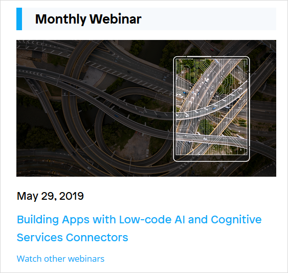
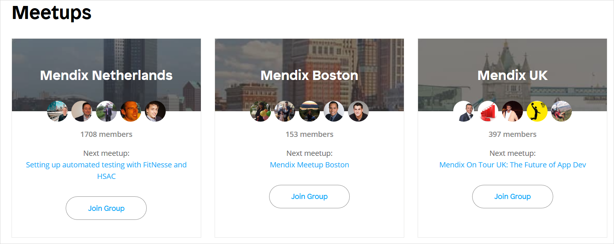
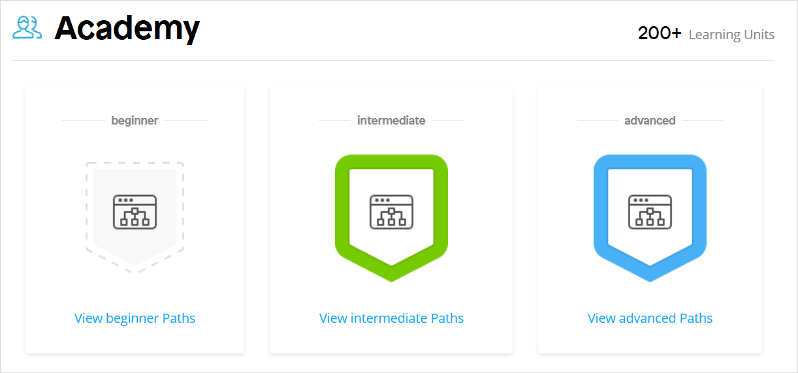
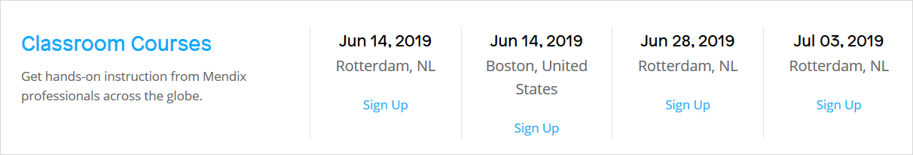

## 1 Introduction

You can go to the [Mendix Community site](https://developers.mendix.com/) for all the information you need as a member of the Mendix community. Each section of the site represents a community tool that is continuously updated with new content and exciting developments. In addition, the content on the site is not only created for Mendix community developers, it is created by Mendix community developers.

The Mendix Community site includes the community tools described below.

## 2 Mendix Forum

On the [Mendix Forum](https://forum.mendixcloud.com), you can ask questions and explore the knowledge offered by the entire Mendix community. There are questions and answers on various topics as well as a specific **Idea Forum** for the submission of unique ideas on changes and improvements to the Mendix app platform.

The **Forum** section at the top of the Mendix Community site presents the latest questions being asked on the Mendix Forum along with the author of the question and how long ago it was asked:

{}

{}

Click any question to go to that specific question page in the Mendix Forum. Click **Ask a question** to submit your own question to the Mendix Forum.

For more information, see [Mendix Forum](mendix-forum).

## 3 Monthly Webinar

There are many interactive and free webinars that Mendix produces available for the community to gain an in-depth understanding of the inner workings of the app platform.

The **Monthly Webinar** section of the Mendix Community site presents a link to the upcoming webinar:

{}

{}

Don't worry if you can't make it for the next webinar. You can easily watch all past webinars on our [Webinars](https://gettingstarted.mendixcloud.com/link/webinar) page!

## 4 Meetups {#meetups}

Mendix regularly organizes and hosts knowledge [meetups](https://www.meetup.com/nl-NL/Mendix-Netherlands/) and Q&A sessions where enthusiasts of the platform can share knowledge and best practices as well as discuss experiences of working with Mendix.

The **Meetups** section of the Mendix community site presents the upcoming scheduled meetups:

{}

{}

Click a meetup of your interest to find out details about the location and agenda.

## 5 Academy

The Mendix Academy offers both self-paced online training and classroom instruction from our team of experts. These training opportunities can be used in coordination with the [Mendix Developer Certification Program](https://gettingstarted.mendixcloud.com/link/certification) to develop and validate your Mendix expertise.

In the **Academy** section of the Mendix Community site, you can see links to our beginner, intermediate, and advanced learning paths in the [Mendix Academy](https://gettingstarted.mendixcloud.com/link/home):

{}

{}

Below that, you can see sign-up links for upcoming [classroom courses](https://gettingstarted.mendixcloud.com/link/classroom):

{}

{}

To figure out what you will learn next, check out the wealth of resources the Mendix Academy offers.

## 6 App Store

The [Mendix App Store](https://appstore.home.mendix.com/index3.html) is where you can find all the free sample apps, widgets, and modules made by Mendix community members. This is all reusable content that can help you speed up your Mendix app development process.

The **App Store** section of the Mendix community site presents the latest updates to App Store content (for example, an update of the Bootstrap Tooltip widget):

{}

{}

Click the item name to go to its page in the App Store, where you can read a detailed description of the content and check out some user reviews. Click **View all Apps** to go to the main Mendix App Store page, where you can see featured and new content, recent updates, reviews, and the top contributors to the Mendix App Store.

For more information, see the [App Store Overview](/appstore/general/app-store-overview) in the *App Store Guide*.

## 7 Documentation

The [Mendix Documentation](https://docs.mendix.com/) covers all aspects of the Mendix Platform. The [Studio Pro Guide](/refguide/index) includes in-depth information on Mendix Studio, Studio Pro, and Team Server. The [Studio Pro How-to's](/howto/index) present detailed instructions for building and customizing apps with Mendix. The API documentation contains several different sections, such as the Deploy API and Team Server API.

The **Documentation** section of the Developers site presents the latest updates on the documentation site:

{}

{}

Click a document title to go to that specific page in the documentation. Click **Documentation** to go to the main [Mendix Documentation page](https://docs.mendix.com/), where you can browse release notes, reference guides, how-to's, APIs and SDKs, add-on documentation, and much more.

## 8 Developer Spotlight

The **Developer Spotlight** section highlights [Mendix Developer Blog](https://www.mendix.com/tag/developers/) posts from Mendix insiders on various topics that are of interest to the community. This includes topics that are more technical in nature (for example, "Advanced Branching and Merging Strategies") as well as ones that deal with Community tools (for example, "the New Mendix Forum").

{}

{}

Click any blog post title to go to the full text of that post. There is a lot of great content on what Mendix developers are doing located here!

## 9 Main Documents in This Category

* [Mendix Forum](mendix-forum) – describes how to use the Mendix Forum and the Mendix Idea Forum to ask questions, search for answers, and post ideas
* [Contribute to the Documentation](contribute-to-the-mendix-documentation) – shows you how to edit and write new documentation to help the Mendix community
* [Mendix Jobs Board](mendix-job-board) – explains how to post and find Mendix-related jobs
* [Mendix MVP Program](mendix-mvp-program) – describes how Mendix MVPs are selected and what the benefits are to being an MVP
* [Set Up Your Partner Profile](how-to-set-up-your-partner-profile) – shows you how to set up the Mendix Partner Profile for your company
