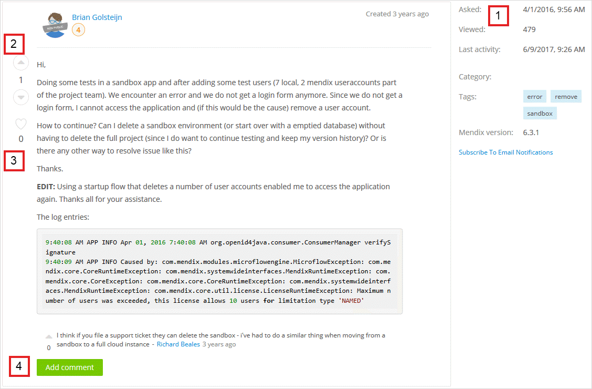
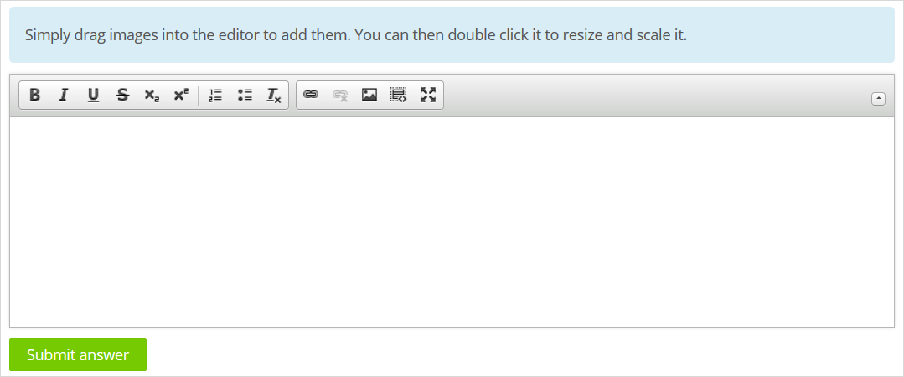

## 1 Introduction

The [Mendix Forum](https://forum.mendixcloud.com) is where the Mendix community comes together to help each other with questions and answers and to propose ideas for improving the Mendix Platform.

The Mendix Forum is closely integrated with the [Mendix Profile](/developerportal/community-tools/mendix-profile) so that Mendix community members can see all the interesting and useful information about who is participating in the Mendix Forum. If someone clicks your name anywhere on the Mendix Forum, your Mendix Profile will open, so make sure you [set your profile to public](/developerportal/community-tools/mendix-profile#public) so everyone can see your details and progress!

There are two tabs available in the Mendix Forum: **Questions** and **Ideas**. On each tab, you can see the **Top contributors**, which lists the five Mendix community developers who have the most Mendix Forum points in the last 30 days.

## 2 Questions Tab {#questions-tab}

### 2.1 Questions Overview

On the **Questions** tab, you can see an overview of the questions that have been asked. Here is an example question:

Each question has a descriptive title (**1**). Clicking the question title opens the specific [question and answers details page](#question-description-page) under the **Question** tab. After you click the question title, the dot ( • ) before the question title will disappear.

Each question specifies the following elements:

* The beginning of the question description (**2**), which is taken from the [question details and answers page](#question-description-page)
* The number of votes (**3**), answers (**4**), and views (**5**) the question has received
* The category (**6**)
  * This is set when asking a question (for details, see the [Asking Your Question](#asking-your-question) section)
  * When you click a category, the overview page will list questions in that category
* The tags applied to question (**7**) 
	* These are set when asking a question (for details, see the [Asking Your Question](#asking-your-question) section)
	* When you click a tag, the overview page will list questions with that same tag
* When the question was created (**8**)
* The name, avatar, and level of the Mendix community member who asked the question (**9**)
* The Mendix community members(s) who answered the question (**10**)

Hovering over the developer name brings up the profile card:

{}

{}

The profile card presents the Mendix points for the developer. Clicking the developer name on the card will bring you to their Mendix Profile.

#### 2.1.1 Sorting the Questions

The **Sort by** drop-down menu at the top of the screen has three options for sorting the questions on this page: **Last Updated**, **Newest**, and **Most Popular**.

{}

{}

#### 2.1.2 Searching {#searching}

In addition to sorting, you can search the entire Mendix Forum (both for questions and ideas) by clicking the search icon in the upper-right corner of the screen and entering keywords into **Search Mendix**.

Notice the following search details:

* The **Source** will be set to **Forum** by default; if you want to search other resources, set the source to **Documentation**
* You can set the **Type** of search results for the Mendix Forum to **Question**, **Idea**, or both (default)
* You can filter by **Category** to get more refined results

#### 2.1.3 Filtering the Questions

To filter the questions that appear on the overview page, select from the following criteria on the right side of the screen:

* **Filters** – filters related to your own activities
  * **My Bookmarks** – the questions you have bookmarked (for details on how to bookmark a question, see the [Question Details and Answers Page](#question-description-page) section)
  * **My Own Questions** – the questions you have asked (for more information, see the [Asking Your Question](#asking-your-question) section)
  * **That I answered** – the questions you have answered (for more information, see the [Answering a Question](#answering-question) section)
  * **That I commented on** – the questions that you have commented on (for details on how to comment on a question, see the [Question Details and Answers Page](#question-description-page) section)

* **Status** – the status of a question according to whether it remains **Unanswered**, has been **Answered**, or has been **Accepted answered** (meaning, it has been answered and the answer has been accepted)
* **Mendix version** – the Mendix version to which the question is related (for more information, see the [Asking Your Question](#asking-your-question) section)
* **Categories** – the category set when the question was asked (for more information, see the [Asking Your Question](#asking-your-question) section)
* **Tags** – the tags set when the question was asked (for more information, see the [Asking Your Question](#asking-your-question) section)

### 2.2 Question Details & Answers Page {#question-description-page}

#### 2.2.1 Question Details

Clicking the title of a question will bring you to the details page for that question:

On this page, you can read the full descriptive text of the question and do the following:

* View the following question details (**1**):
	* When the question was **Submitted**
	* The date and time of the **Last activity** on the question (meaning, when it was last updated)
	* How many times the question has been **Viewed**
	* The **Category** of the question
	* The **Tags** applied to the question (when you click a tag, the overview page will list questions with that same tag)
	* The **Mendix version** set when the question was asked (for more information, see the [Asking Your Question](#asking-your-question) section)
* Click the **▲** or **▼** button to upvote or downvote the question based on its usefulness (**2**)
* Click **Comment** to write and submit a comment on the question (**3**)
* Click **Bookmark** to bookmark the question (**4**)

If you want to follow the discussion on a question via email notifications, click **Subscribe to Email Notifications** below the question details. Please note that you are automatically subscribed for email notifications on questions that you have asked; if you want to unsubscribe from these notifications, click **Unsubscribe from Email Notifications** on a specific question that you have asked.

{}
The URL for each question is unique.
{}

#### 2.2.2 Answers {#answers}

Below the question details are the answer(s) to the question. Click the **▲** or **▼** button to upvote or downvote the answer based on how it addresses the question. You can also click **Comment** to comment on an answer.

#### 2.2.3 Answering a Question {#answering-question}

Below the answer(s), you can contribute to the Mendix Forum by writing your own answer in the editor and then clicking **Submit answer**:

{}

You can easily upload your images in the Mendix Forum by dragging them directly into the text editors. In order to resize and position an image, double-click it in the editor or click the image button in the toolbar:

{}

### 2.3 Asking a Question

#### 2.3.1 Asking Your Question {#asking-your-question}

It has never been easier to ask a question on the Mendix Forum. But before you submit a new question, be sure to search the Mendix Forum for similar questions that have already been asked. There may be someone else who has already posted the same question!

To ask your own question on the Mendix Forum, follow these steps:

1.  Click **Ask a question** on the main page of the [Questions tab](#questions-tab).
2.  On the **Ask your question** page, fill in the following details in the editor:

	{}
	{}

	* The **Title** of your question (which is how Mendix Forum users will first see your question, so make the title descriptive and interesting)
	* The text of your question (add all the details about your question to make it searchable and so other users can answer it; consider including steps to reproduce the issue)
	* The **Mendix version** on which version you encountered the issue you have a question about
	* The **Category** that reflects your question (for example, **Connectors**, **Databases**, **Security**)
	* The **Tag(s)** that reflect the topic of your question (which other users can use to filter the list of questions)

3. Click **Ask your question**.

#### 2.3.2 Accepting an Answer on a Question You Have Asked

Once a question you have asked receives several answers (for more details, see the [Asking a Question](#asking-your-question) and [Answering a Question](#answers) sections), you can accept an answer by clicking the check mark next to the answer.

You should accept the answer that properly and accurately responds to your question in the best way possible.

## 3 Ideas Tab {#ideas-tab}

### 3.1 Ideas Overview

On the **Ideas** tab, you can see an overview of the ideas and feature requests for improving the Mendix Platform that have been submitted by Mendix community members. Here is an example idea:

All the submitted ideas are publicly visible, and each idea has a descriptive title (**1**). Clicking the idea title opens the specific [idea details page](#IdeaDetails) under the **Ideas** tab.

Each idea specifies the following elements:

* The beginning of the idea description (**2**) (this is taken from the [idea details page](#IdeaDetails))
* The number of votes (**3**), comments (**4**), and views (**5**) for the idea
* The category (**6**)
	* This is set when submitting an idea (for details, see the [Submitting an Idea](#submitting-an-idea) section)
* Tags (**7**) (for example, **datagrid**, **listen-target**, **conditional-visibility**)
* The status of the idea (**8**) (for descriptions of the various statuses, see the [Idea Details Page](#IdeaDetails) section)
* When the idea was created (**9**)
* The name, avatar, and level of the Mendix community member who created the idea (**10**)

#### 3.1.1 Sorting the Ideas

The **Sort by** drop-down menu at the top of the screen has three options for sorting the ideas on this page: **Last Updated**, **Newest**, and **Most Votes**.

{}

{}

#### 3.1.2 Searching

In addition to sorting, you can search the entire forum for both questions and ideas. For more details, see the [Searching](#searching) section.

#### 3.1.3 Filtering the Ideas

To filter the ideas that appear on the overview page, select from the following criteria on the right side of the screen:

* **My favorites** – the ideas you have marked as favorites (for details on how to favorite an idea, see the [Idea Details Page](#IdeaDetails) section)
* **My own ideas** – the ideas you have submitted (for more information, see the [Submitting an Idea](#submitting-an-idea) section)
* **Status** – the status of the ideas (for descriptions of the various statuses, see the [Idea Details Page](#IdeaDetails) section)
* **Categories** – the category set when the idea  was submitted (for more information, see the [Submitting an Idea](#submitting-an-idea) section)
* **Tags** – the tags set when the idea was submitted (for more information, see the [Submitting an Idea](#submitting-an-idea) section)

### 3.2 Idea Details Page {#IdeaDetails}

Clicking the title of an idea will bring you to the details page for that idea:

On this page, you can read the full descriptive text of the idea and do the following:

* View the following idea details (**1**):
    * The **Status** of the idea – these are the possible statuses:
        * **Open** – the idea has not been reviewed yet
        * **Planned** – the idea has been accepted by the Mendix Product Managers and scheduled for implementation
        * **Implemented** – the idea has been implemented
        * **Closed** – the idea has been reviewed by the Product Managers but it has not been accepted
    * When the ideas was **Submitted**
    * The date and time of the **Last activity** on the idea (meaning, when it was last updated)
    * How many times the idea has been **Viewed**
    * The **Category** of the idea
    * The **Tags** applied to the idea (clicking a tag will list ideas with that same tag under the **Ideas** tab)
    
* Click **Vote** to upvote the idea (**2**)
    * By upvoting ideas, you can show the Mendix community and Product Managers what you would like to see added to the Mendix Platform

		{}The upvotes will be used as input for the Product Managers and Mendix community MVPs to decide which features will be nominated for implementation. Please note that the level of impact also needs to be considered.
		{}
	
* Click **Bookmark** to bookmark the idea (**3**)

* Submit a comment on the idea (**4**)

If you want to follow the discussion on an idea via email notifications, click **Subscribe to Email Notifications** below the idea details. Please note that you are automatically subscribed for email notifications on ideas that you have submitted; if you want to unsubscribe from these notifications, click **Unsubscribe from Email Notifications** on a specific idea that you have submitted.

{}
The URL for each idea is unique.
{}

### 3.3 Submitting an Idea {#submitting-an-idea}

If you have a great idea that you would like to see implemented on the Mendix Platform, we want to hear it! But please make sure you search the idea forum for similar ideas before submitting a new idea. There may be someone else who has already posted the same idea!

To submit your own idea to the idea forum, follow these steps:

1.  Click **Submit idea** on the main page of the [Ideas tab](#ideas-tab).
2.  On the **Submit your idea** page, fill in the following details in the editor:

	{}
	{}

	* The **Title** of your idea (which is how Mendix Forum users will first see your idea, so make the title descriptive and interesting)
	* The text of your idea (add all the details about your idea to make it searchable and so other users can vote and comment on it)
	* The **Category** that reflects your idea (for example, **Connectors** or **Microflows**)
	* The **Tag(s)** that reflect your idea (which other users can use to filter their searches)

3. Click **Submit your idea**.

Mendix looks forward to hearing all of your ideas!

## 4 Read More

* [How to Contribute to the Documentation](contribute-to-the-mendix-documentation)
