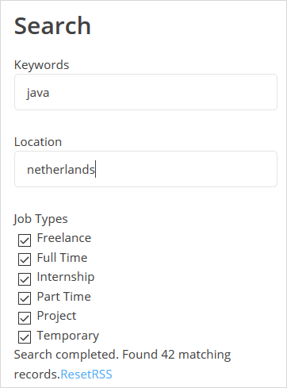
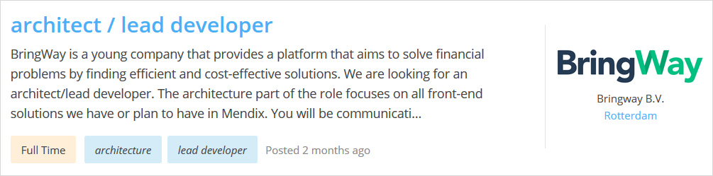
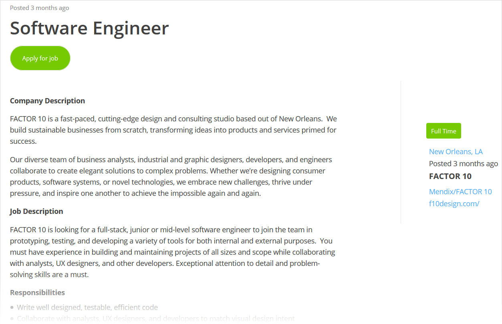
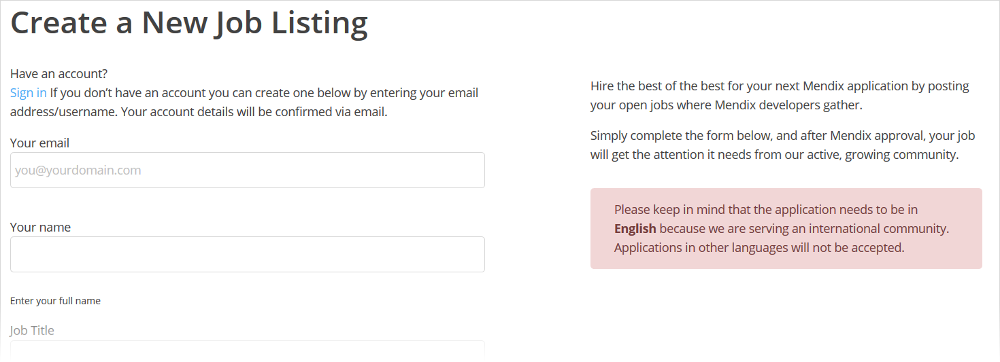

## 1 Introduction

On the [Mendix jobs board](https://developers.mendix.com/jobs/), anybody can post and find a Mendix-related job. The Mendix job board benefits employers, job seekers, and those looking to start with Mendix.

The job board brings the Mendix customers, partners, and developers together in one place. With tens of thousands of visitors each month, the job board is the perfect place for employers to post their jobs and find the right developers for their team. Mendix community developers can use the job board to find new challenges, jobs, and projects.

The job board also helps you discover the advantages of becoming a Mendix developer. Mendix has a customer list that is growing fast, which means that as the number of implementations increases, the need for Mendix developers increases as well. Developers looking to get into Mendix can easily see the high demand for Mendix developers, proving that their choice to switch to the platform is the right one.

## 2 Finding a Great Job

When browsing the list of jobs on the [Mendix jobs board](https://developers.mendix.com/jobs/), you can narrow your search with the following options:

* There are two search boxes above the list of jobs where you can filter according to **Keywords** describing the job and the **Location** of the job
* In the category drop-down menu, the default is **Any category**
    * You can refine your search by selecting the **Jobs** category (for permanent positions) or the **Projects** category (for specific projects) in this drop-down menu
* You can filter according to the job type by selecting or clearing the following check boxes: **Freelance**, **Full Time**, **Internship**, **Part Time**, **Project**, and **Temporary**

{}
{}

Each job listing on the job board presents the following information:

* Job title
* Summary of job
* Type of job

* Tags
* When the job was posted
* Company name
* Location

When you find a job you are interested in, click the job title to go to the job details page. The job details page presents the following details:

* Job title
* Description of job
* Type of job
* Location (click this to see the location on a map)
* When the job was posted
* Company name (as well as the company name for filtering, which you can click to view more jobs at that company)
* Link to the company's website

To apply, click **Apply for job** at the top of the job details page, which will open up details on applying for this specific job by sending an email or going to the company's website.

## 3 Posting a Job

To hire the best of the best for your next Mendix application, click **Post a Job** on the main page of the Mendix jobs board, which will open up the **Create a New Job Listing** page.

To post a job listing, you need a Mendix job dashboard account:

* If you have an account already, click **Sign in**
* If you are posting a job for the first time, fill out your details and an account will be automatically created for you
	* Your username will be created based on the email address you enter
	* With this account, you can manage all of your job listings

After you enter all the details for the job, press **Preview** at the bottom of the page. On the preview page, you can examine your job listing before submitting it. To edit the job listing further, click **Edit Listing**. To submit the listing to the job board, click **Submit Listing**.

Each submitted job listing is reviewed and proofread by Mendix. If there is any issue or question, you will be contacted to update the job listing and resubmit it.

## 4 Read More

* [Mendix Profile](/developerportal/community-tools/mendix-profile/)
