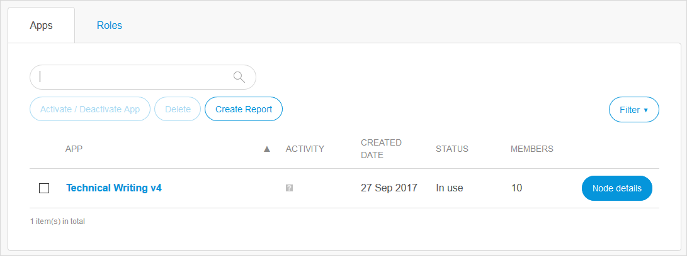
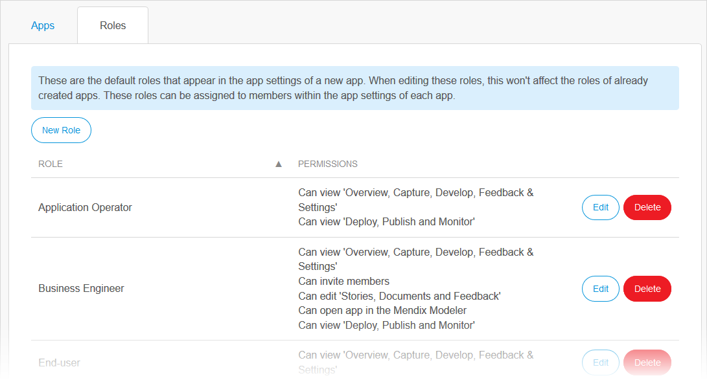

## 1 Introduction

{}
You must be a Company Admin to access this page and these settings.
{}

There are two tabs on the **Apps** page with settings to manage:

## 2 Apps Tab

On the **Apps** tab, you can perform the following actions:

* Deactivate and activate apps (for details, see [How to Deactivate & Activate an App](/developerportal/company-app-roles/deactivate-activate-app))
* Create a [report](#create-report)
* View the [node](nodes) details

### 2.1 Creating a Report {#create-report}

To create a report of the apps owned by your company, click **Create Report**. This will take you to a separate page with a list of apps. To export the report to a *csv* file, click **Export to Excel**. Note that the exported report will have more information than shown on the page.

## 3 Roles Tab {#roles-tab}

On the **Roles** tab, you can edit and add App Team member roles.

For more information, see the [App Team Member Roles](/developerportal/company-app-roles/index) section of *Company & App Roles*.

## 4 Related Content

* [Company Admin Settings](companyadmin-settings)
* [Company](company)
* [Users](users)
* [Nodes](nodes)
