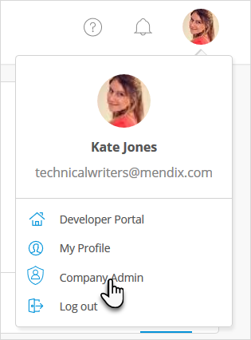
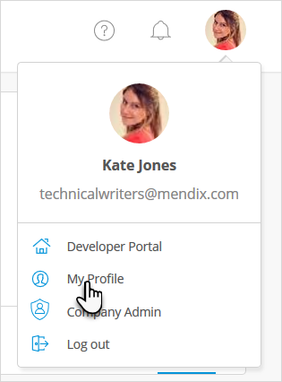
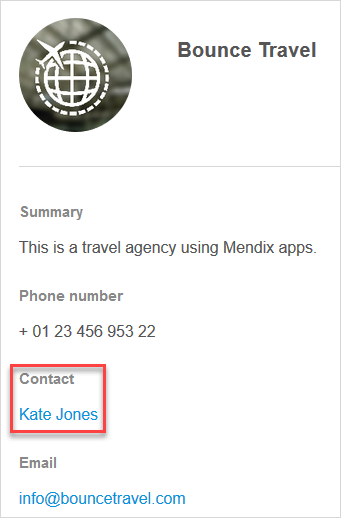
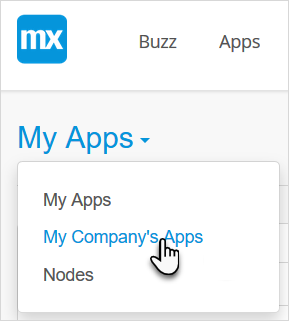
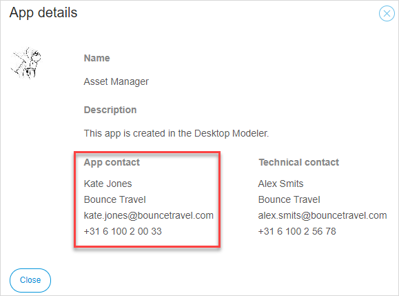
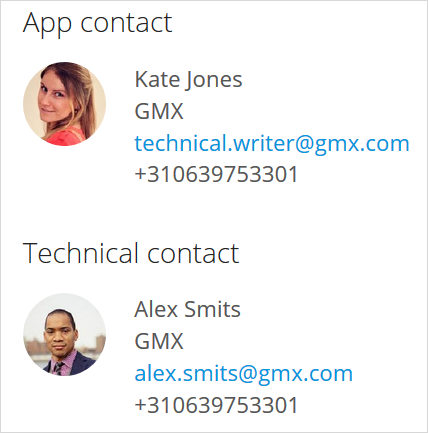

## 1 Introduction

When you sign up for Mendix and create an account, you are also creating an MxID. This ID is linked to a company. If the company already exists, you will join that company. If it is a new company, the company will be created in Mendix and you will automatically join it.

The roles defined within a company, app project, and App Team are described below.

## 2 Company Roles

Everyone with the same email domain will be automatically placed in the same company. For example, all users that sign up with an address with the `@bouncetravel.com` email domain will automatically join the company *Bounce Travel* company.

Within the company there are three roles, which are described below.

### 2.1 Company Admin {#company-admin}

The Company Admin is a "super role" allowed to manage all the settings of the company, including the settings of the company's apps, cloud nodes, and users. A company can have multiple Company Admins, but regular users cannot see who has the Company Admin role.

 

For details on this role, see [Company Admin Settings](companyadmin-settings).

### 2.2 Company Contact

Because a company can have multiple Company Admins and regular users cannot see who has the the Company Admin role, making one of the Company Admins the Company Contact is recommended. The Company Contact is visible to regular users. In addition, if the Company Contact also has the Company Admin role, the Company Contact can perform company operations on behalf of all Company Admins.

To view the Company Contact, follow these steps:

1. Go to the [Developer Portal](http://home.mendix.com) and in the top-right corner, click your avatar and select **My Profile**:

    
2. Below your name, click your company name.
3. Below **Contact**, the Company Contact is displayed:

    

A Company Admin can change the Company Contact on their Company Admin [Company](company) page. For more information, see the [Changing the Company Contact](manage-roles#change-company-contact) section of *How to Manage Company & App Roles*.

### 2.3 Regular Users

Regular users are all company members. Regular users can join the company, start building apps, and view other apps made within the company. 

By selecting **My Company's Apps** in the [Developer Portal](http://home.mendix.com), a regular user can view details about the apps made in their company.

As a regular user, you cannot join an App Team by yourself. If you want to join an App Team, you have to ask a current App Team member (with the **Invite** permission) to send an invitation. Because App Team members are not visible to users outside that App Team, you can ask the App Contact to send the invite:

{}
It is thus important that the App Contact has the correct permissions to manage the app (for example, the Scrum Master role).
{}

For more information on roles and permissions, see [App Team Roles](#app-team-roles) below. 

## 3 App Roles

When you view the details for a specific app, you will see the two roles responsible for the app: **App contact** and **Technical contact**. These are users you can contact with questions related to the app.

These app roles are described below.

### 3.1 App Contact {#app-contact}

The App Contact is visible to regular users and is the go-to person for questions related to the app. If you build your own app, you will automatically become the App Contact and you will have the Scrum Master role as an [App Team role](#app-team-roles). 

If you change the App Contact (for details on how to do this, see the [Changing the App Contact](manage-roles#change-app-contact) section of *How to Manage Company & App Roles*), you should provide the new App Contact with the App Team [Scrum Master](#app-team-roles) role. Because the App Contact will be the contact for regular users, they will thus be able to perform app operations on behalf of all Scrum Masters.

### 3.2 Technical Contact {#technical-contact}

The Technical Contact manages the technical deployment settings of the app. The Technical Contact can be responsible for different deployment platforms (for example, a Mendix Cloud node, on-premises, other platforms such as SAP). For details on cloud deployment, see [Deploy and Manage](../deploy).

With an app hosted in the Mendix Cloud, the Technical Contact is the first contact for App Team members regarding node permissions and operations. 

Only the Technical Contact is allowed to do the following:

* Manage users with node permissions
* Make adjustments to environments (for example, resize and add new environments) 
* Manage licenses (for example, manage renewals, activations, and upgrades) 
* Configure alert settings

For more information, see [Technical Contact](/developerportal/company-app-roles/technical-contact).

## 4 App Team Roles {#app-team-roles}

Within an App Team, there are six predefined roles that can be provisioned to App Team members. [Company Admins](apps) can also edit and create new team roles within the company.

Each App Team role has access to permission areas based on the following factors:

* Who can edit the backlog and current [Sprint](../collaborate/stories)
* Who has the correct [Node Permissions](../deploy/node-permissions) for access to the node information (please note that node permissions must be provisioned by the [Technical Contact](#technical-contact))
* Who can change the app's [general settings](../settings/general-settings)

These are the predefined App Team roles:

Role | Explanation
------------ | -------------
Application Operator | An App Team member who does not actively develop the app, but is responsible for operations on the app's cloud node. 
Business Engineer | An App Team member who contributes to the development of the app. 
Guest | A user of the app who should have insight into the backlog but does not actively participate in development (for example, a stakeholder). 
Product Owner | The product owner of the Scrum team who is responsible for managing the app's backlog.
Scrum Master | The Scrum Master of the Agile App Team. In addition to contributing to development, the Scrum Master manages all the settings within the app. If you create a new app, you will automatically become the Scrum Master.

For details on how to manage App Team roles, see the [Editing App Team Roles](manage-roles#edit-app-team-roles) section of *How to Manage Company & App Roles*.

## 5 Main Documents in This Category

* [Manage Company & App Roles](manage-roles) – describes how to add a Company Admin, change the various contacts for the app project, and edit the App Team roles
* [Company Admin Settings](companyadmin-settings) – explains how to access and configure Company Admin settings for the company, users, apps, and nodes
* [Technical Contact](technical-contact) – describes the role of the Technical Contact within the Mendix Cloud
