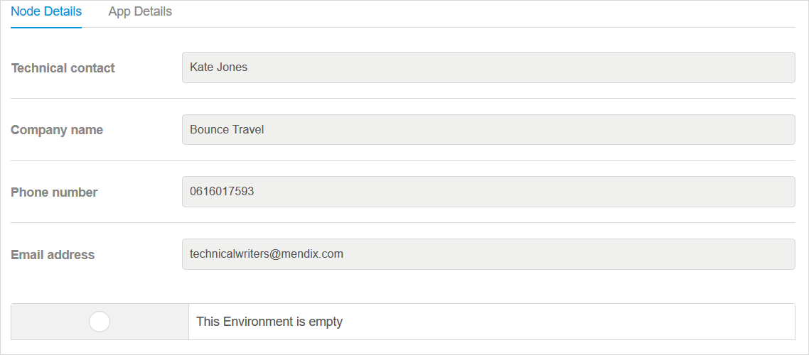

## 1 Introduction

{}
You must be a Company Admin to access this page and these settings.
{}

On the **Nodes** page, you can manage the cloud nodes for your company. Select the cloud node you want to manage by clicking **Details**:

## 2 Node Details Tab

On the **Node Details** tab for your selected node,  you can view specific details about the app node:

For details on the **Technical contact**, see [General Settings](../settings/general-settings).

For more information on the **Company name**, **Phone number**, and **Email address** details, see [Company](company).

And for details on deployment environments, see [Environments](../deploy/environments).

## 3 App Details Tab

This tab describes the following app details for that specific cloud node:

* **App name**
* **App contact**
* **Company name**
* **Phone number**
* **Email address**

## 4 Related Content

* [Company Admin Settings](companyadmin-settings)
* [Company](company)
* [Users](nodes)
* [Apps](apps)
* [Settings & Node Permissions](../settings/node-permissions)
