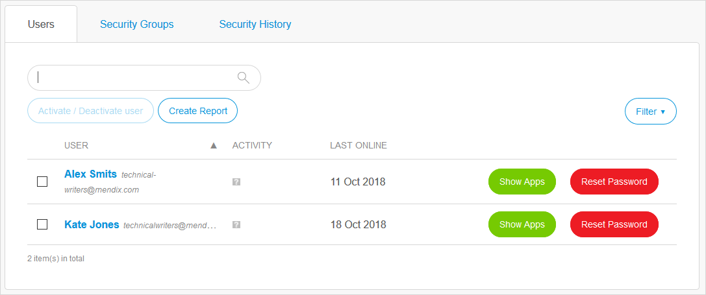
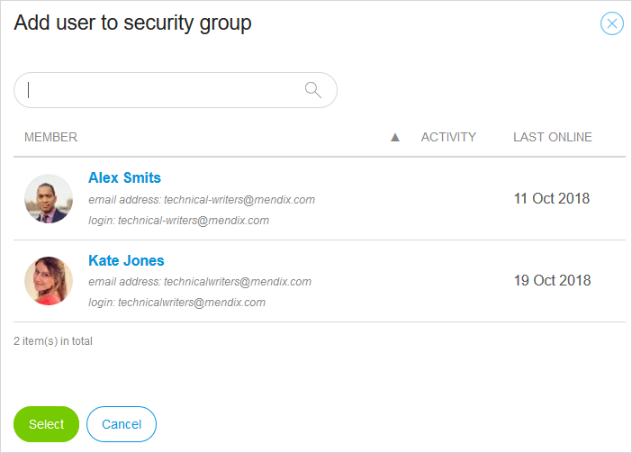

## 1 Introduction

{}
You must be a Company Admin to access this page and these settings.
{}

There are three tabs on the **Users** page with settings to manage:

## 2 Users Tab

On the **Users** tab, you can view, [deactivate](#deactivating), and [activate](#activating) users. 

You can also [create reports](#create-report) about your company's users by clicking **Create Report**, view the apps of a user by clicking **Show Apps**, and reset a user's password by clicking **Reset Password**.

### 2.1 Deactivating Users {#deactivating}

For security reasons, deactivating the Mendix profile of an employee that is leaving your company is recommended. If the employee returns to your company, the Mendix profile can be activated again. 

{}
If a Mendix user moves to another company or comes from another company that is also using Mendix, the user can merge their old Mendix account(s) into the new Mendix account. This action combines all the hard-earned points, certifications, and achievements in the user's efforts to climb the leaderboards. For more information, see the [Merging Your Accounts](../mendix-profile/index#merging) of *Mendix Profile*.
{}

Before deactivating a user, make sure the following points are true for that user:

* They do not have a **Company Contact**, **App Contact**, or **Technical Contact** role
* They are not the only **SCRUM Master** in an App Team
* They are not involved in unsolved support tickets with [Mendix Support](https://support.mendix.com)

For more information, see [How to Manage Company & App Roles](/developerportal/company-app-roles/manage-roles) and [Company & App Roles](/developerportal/company-app-roles/index).

To deactivate a user, follow these steps:

1.  Select the check box for the user(s) you want to deactivate, then click **Activate / Deactivate user**.:

	

2.  In the pop-up window that appears, confirm your decision by clicking **Deactivate member(s)**:

	

The deactivated user will become inactive and will immediately disappear from the list of users on this tab. If you click **Filter** and select **Inactive**, you will see the deactivated users.

{}

You can only deactivate a user. It is not possible to delete a user completely.

{}

### 2.2 Activating Users {#activating}

To activate an inactive user, follow these steps:

1.  Click **Filter** and select **Inactive** to see the list of company users extended with inactive (deactivated) users:

	

2. Select the inactive user and click **Activate / Deactivate user**.
3. In the pop-up window that appears, click **Activate accounts**.         

     

### 2.3 Creating a Report {#create-report}

Click **Create Report** to create a report about users active in your company. These are users who are either members of the company or members of an app owned by the company.

You have the following report options:

* **Export users** – this report will return a list of users who are active in your company
* **Export permissions** – this report will return a list of permissions for users active in your company's apps

You can export these reports by clicking **Export to Excel**. Note that the exports will contain further details in addition to those shown on the screen.

## 3 Security Groups Tab{#security-groups}

This tab lists the security groups defined for your company. Users who are assigned to security groups are automatically granted access to specified AppCloud apps.

You can perform the following actions on this tab:

* **Add** and **Remove** security groups
* Click **Details** to edit a security group and do the following:
    * Under **Users**, you can **Add** users to and **Remove** users from the group

      

    * Under **Access To**, you can up the security group's access to specific apps (via the **Add** and **Remove** buttons) 
        * Members of this security group will be granted access to these apps automatically
        * It is only possible to create access policies for licensed AppCloud-enabled apps
        * Under **Select Environment**, you can select a specific node environment for the app
        * Under **Select Role(s)**, you can select specific user roles for the app

## 4 Security History Tab

On this tab, you can view all the changes made in the company, such as **Password reset requested** and **Account activated**.

## 5 Related Content

* [Company Admin Settings](companyadmin-settings)
* [Company](company)
* [Apps](apps)
* [Nodes](nodes)
