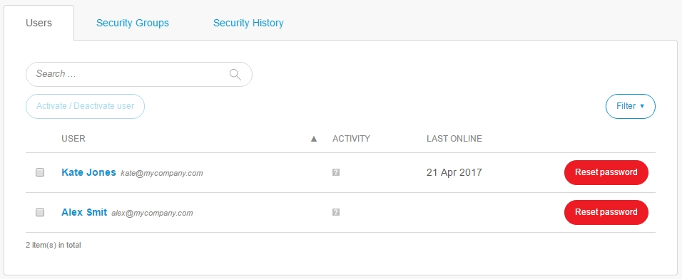

## 1 Introduction

A company admin can manage the following items in the **Users** category:

* **Users**
* **Security Groups**
* **Security History**

## 2 Users

A company admin can perform the following actions on the **Users** tab:

* View all company users
* Activate/deactivate users
* View active/inactive users

For more information, see [How to Deactivate and Activate Users](/developerportal/howto/deactivate-users).

## 3 Security Groups

This tab lists the security groups that are defined for your company. Users who are assigned to security groups will automatically be granted access to specified AppCloud apps. Company admins can set up security groups and specific app permissions for security groups.

A company admin can perform the following actions on the **Security Groups** tab:

*   Add/remove security groups
*   Set up a security group by clicking **Details** for a group, where you can do the following:
    * Add a member by clicking **Add**
    * Set up the access of a security group to apps by going to **Access To**
        * Members of this security group will be granted access to these apps automatically
        * Note that it is only possible to create policies for licensed, AppCloud-enabled apps
        * It is possible to select specific node evironments and user roles

## 4 Security History

A company admin can view all the changes made in the company on the **Security History** tab.

## 5 Related Content

* [Company Admin](index)
* [Company](company)
* [Apps](apps)
* [Nodes](nodes)
