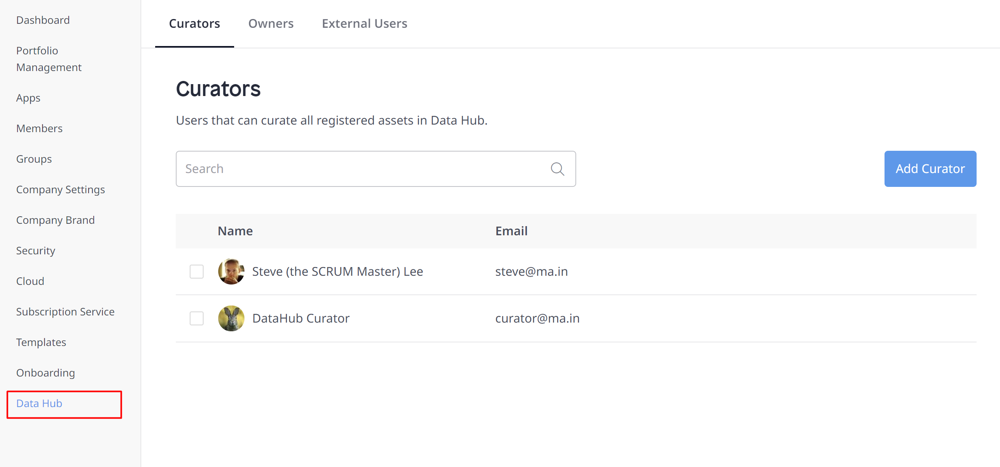
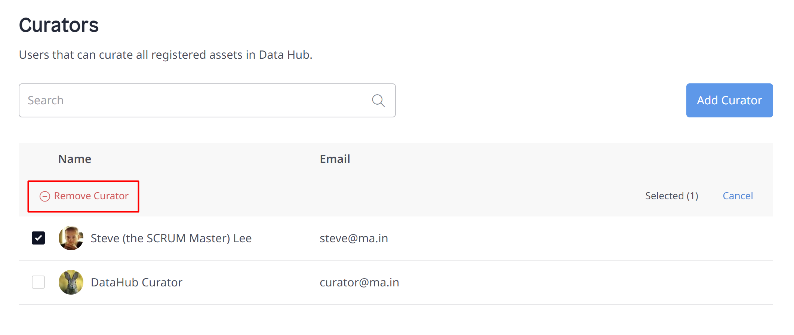
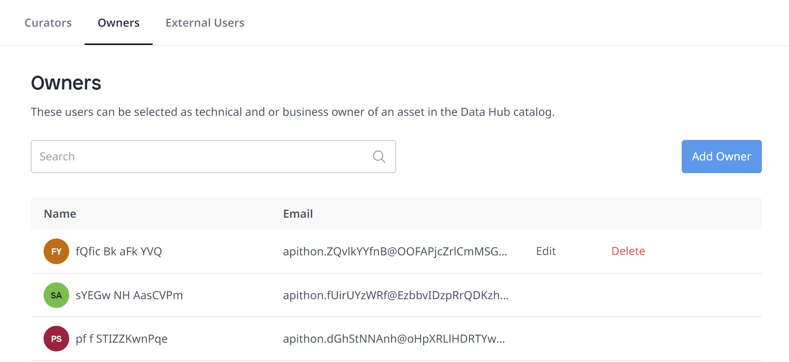
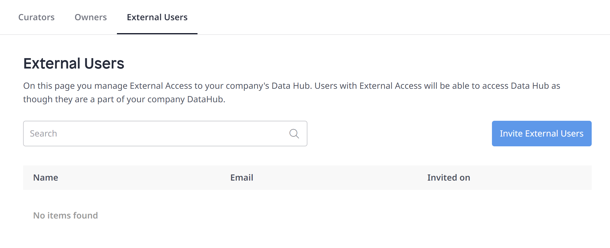
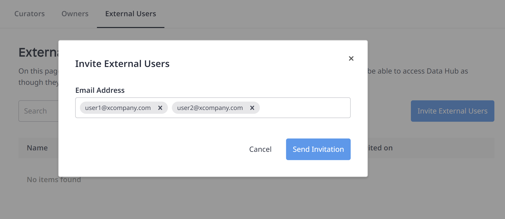

## 1 Introduction

In the **Data Hub** section of the **Control Center**, the operations that can be performed are:
  * [Assign curators](#curator)
  * [Manage the list of custom owners](#customowners) who have been added as **Business** or **Technical Owners**
  * [Invite external users](#external-users)

## 2 Managing Curators {#curator}

The Data Hub Curator can perform day-to-day management functions on all registered assets in the Data Hub Catalog and also enrich the Catalog information on registered assets that is displayed.

Curators can see and curate all registered assets in the Data Hub Catalog. Mendix users who own registered assets can curate their own items, but not those that they do not own.

The Mendix Admin can add or remove the Data Hub curator role by following these steps:

1. In the left pane menu, click the **Data Hub** tab:

	

2. The Mendix Admin will see the **Curators** option displaying  the list of Data Hub curators for the organization. To assign a curator role to a Mendix user, click **Add Curator**.

    {}A user with curator rights can access all assets registered in the Catalog. This also includes those that are set to **Non-discoverable** (for more information on discoverability, see the [Discoverability](/data-hub/data-hub-catalog/search#discoverability-metadata) section in *Search in the Data Hub Catalog*). Curators can also change the metadata for the assets that are owned by other users. {}
   
3. If you want to remove the curator rights for a user, check the box against the name and confirm this by clicking **Remove Curator**.

	
   
    {}This only removes the curator rights of the user, it does not remove the user as a Mendix platform user.{}

To search from the list of Mendix users in your organization, start typing in the search box and check the user(s) you want to assign the curator role to.

{}This list shows all Mendix users for your organizations. It does not include non-Mendix users that are added as *Custom Owners*. For more information, see [Managing Custom Owners](#customowners).{}

## 3 Managing Custom Owners {#customowners}

Custom owners are owners that have been added as the contact for a registered application. They may be added during the application [curation](/data-hub/data-hub-catalog/curate#custom-owner) or have been specified during app registration.

Custom owners are only the contact people for registered assets. Adding a custom owner does not give them access rights to the Catalog, they are not able to login to the Mendix Platform or curate registered assets in the Catalog. Custom owners will appear in the Catalog with their name and their initials, or with their personalized avatar if they are a Mendix user.

Curators and the Mendix Admin can manage the custom owner list under the **Owners** option.

{}
Curators will only see **Owners** tab.
{}

From the **Owners** tab, you can do the following:

* Add owners – the **Add Owner** button allows you to add new owners by filling in their name and email. New owners will be listed as the **Business** or **Technical Owners** for registered assets.

* Edit the details of the listed owners by clicking the **Edit** button (hover over the row to see the actions).
* Delete names from the list by clicking the **Delete** button and confirming your choice.

	{}If a custom owner is removed from the list, they will also be removed from any registered assets where they were set as the owner. This means that the asset will not have a contact.{}

New custom owners can also be added when assets are being curated as described in [Changing the Technical and Business Owners of an App](/data-hub/data-hub-catalog/curate#custom-owner).

## 4 Managing External Users {#external-users}

**External Users** allows Mendix Admins to invite members (external users) from outside the organization. External users can search for published data sources or use them in apps. External users cannot register or curate content unless they are an owner of the data source.

Mendix Admin can manage the external user list in the **External Users** screen. 

To invite new users, on the Data Hub screen, do the following:

1. Choose **External Users** tab.

2. Click the **Invite External Users** button.

3. In the opened dialog box, enter the email addresses of the users you would like to invite as external users and click **Send Invitation**.     

    {} You can invite only users with a Mendix account. Invitation email will not be sent to the emails which are not associated with any Mendix account. {}

4. Users receive the invitation, log into the Data Hub Catalog with their Mendix credentials, and accept the invitation.

    A user can access resources from one organization at a time, and, therefore, needs to select the company that sent the invitation in the **Company** drop-down list in the Catalog home page.

	

   
