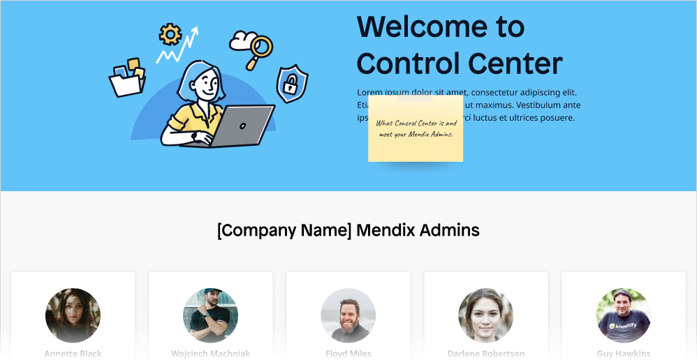
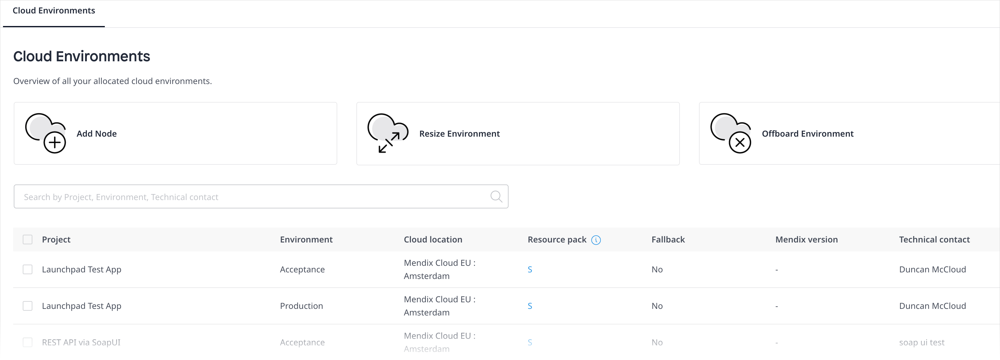

{}
Mendix Control Center is currently a Beta release. For details on what this means, see [Mendix Beta Features](
/releasenotes/beta-features/).
{}

## 1 Introduction

Users that sign up on the Mendix Platform will be able create new app projects, invite others to their app project teams, deploy their apps, and invite end-users to give feedback on apps, among many other activities. Insights into all these company activities are provided to you in the Control Center in one central overview. These insights will help you to be in control and remain aware of everything happening within the Mendix landscape of your company.

The [Mendix Control Center](https://controlcenter.mendix.com/) consists of the pages described below, which are for use by [Mendix Admins](#company).

If your company does not already have a Mendix Admin, you will see this landing page, which outlines the usage and goals of Control Center. You can also recommend a colleague for Mendix Admin status by clicking **Suggest a Mendix Admin**:

If your company does already have a Mendix Admin (but you yourself are not a Mendix Admin), you will see this landing page:

If you are a Mendix Admin, you will immediately see the **Members** page and can navigate to the pages described in the sections below.

You can access Control Center via the menu item on the navigation pane.

## 2 Members

Members are users who can view and/or edit an app project. On the **Active members** tab, you can see the active members of your company who can access certain app projects: 

When you click a company member's name, a pop-up window opens with their member profile. The profile displays the app **Projects** of which they are a member as well as their **Project role** for each project. Click a project name to go to its [project profile](#projects) page.

On the **Inactive members** tab, you can see former members of your company who have been deactivated.

On the **External members** tab, you can see the members outside of your company who have access to at least one of your company app projects. When you click an external member's name, a pop-up window will open with their member profile.

## 3 App Projects {#projects}

On the **Active App Projects** tab of this page, you can see a list of the active app projects that belong to your company. The **Inactive App Projects** tab lists your company's deactivated app projects. The following details apply to deactivated app projects:

* Only Free Apps can be deactivated
* A deactivated app still exists in the company, but it is invisible to regular users 
* Licensed apps with a node can only be offboarded by Mendix Support – to offboard an app, you must submit an [offboarding request](/developerportal/support/submit-support-request)

[**Please verify these points are still accurate/relevant.**]

When you click a **Project** name, a pop-up window opens with the project profile. The **Project Info** tab has the **Description** and **App ID** fields, which are also available on the [General](/developerportal/settings/general-settings) settings page for your app project in the Developer Portal. On the **Members** tab, you can see the active members and external members of the app project. The **Project Roles** tab presents the App Team roles defined via the **Default App Roles** tab and/or customized for a particular app project.

The **Default App Roles** tab shows the default  [App Team roles](/developerportal/company-app-roles/manage-roles#edit-app-team-roles) assigned for every new app project created in your company. These can be customized at the app project-level. Click **Add Role** to add a new default role, which includes permissions on accessing [Team Server](/developerportal/develop/team-server) and [Mendix Cloud](/developerportal/deploy/mendix-cloud-deploy) information.

## 4 Groups

A Mendix Admin can set up **App Access Groups**, which consist of end-users (who are active members of your company) who will have access to [Mendix SSO](/appstore/modules/mendix-sso)-enabled apps with specific environments and roles. Click **Add Access Group** to create a new group with a **Name** and **Description**.

Click a group to bring up the group details pop-up window, and click **Add Member** to add members to the group. When you add members to an app access group, they will automatically be granted access to the apps listed on **Accessible Apps** tab. After you select an app to be accessible for the group, you also need to select a specific app [environment](/developerportal/deploy/environments) node to be accessible, in addition to specific [user roles](/refguide/user-roles) that should be able to access the app.

{}
You can only add apps to groups that utilize [Mendix SSO](/appstore/modules/mendix-sso) to App Access Groups.
{}

[**How do you delete a group?**]

## 5 Company Settings {#company}

On the **Company Details** tab of this page, you can edit your **Company Name** and **Description** as well as the **Company Email Domains**.  When you click **Add Domain**, a request is sent to [Mendix Support](/developerportal/support/). Once a domain is added, every user who signs up to Mendix wth that email domain will be assigned to your company.

The **Mendix Admins** tab lists all the current Mendix Admins in your company. A Mendix Admin will normally be someone in the IT department of your company, and they will have have one main permission to edit the company's details as well as perform the other tasks in Control Center described here. To add a new admin, click **Add Mendix Admin**. To remove an admin, select their name in the list and click **Remove**.

## 6 Company Brand

{}
Features on this page are available to try out, but you will not see changes implemented yet.
{}

On this page, you can add and edit a **Logo** that will appear on your company page. (Please note your company page will be available in a future iteration of Control Center.)

You can set a **Cover image** to be the the background header of your company page. If you do not set an image by clicking **Upload**, the **Primary** color as set in the **Brand colors** section will be used.

## 7 Security

On the **Password Policy** tab of this page, you can set the password expiration policy for all company members. If you do not want the passwords to expire, toggle **Passwords of company members never expire** to **On**.

{}
If SSO is enabled for your company, you will not be able to change the password expiration date here. For more information, see [Mendix Single Sign-On](/developerportal/deploy/mendix-sso) in the *Developer Portal Guide*.
{}

On the **Security History** tab, you can click **Show Security History** to open a page that presents an audit trail of security-related changes in **Project History** and **Member History**. You can search through and view details on these changes as well as export the audit trail to a CSV file.

## 8 Cloud

The **Cloud Environments** tab on this page presents an overview of the licensed Mendix Cloud environments allocated to your company. This includes information on an environment's [Resource pack](/developerportal/deploy/mendix-cloud-deploy#plans) and **Fallback** (meaning, a standard or premium plan). 

[**Mark: Please verify definitions for resource pack and fallback above. Any cross-reference to implement for "fallback"? Do we need more documentation on fallbacks, especially as users will need to understand that when requesting via App Node below?**]

[**Get screenshot with sidebar menu**]

There are three other pages accessible from this tab where you can perform other Mendix Cloud operations:

* **Add Node** – click this to request a new app node for a specific app and environment
* **Resize Environment** – click this to request a container size change
* **Offboard Environment** – click this to offboard an app

[**Mark: Please expand definitions of operations above and add useful cross-references for app node, container, offboard**]

[**Mark: Please verify what will happen with this page and Support's involvement when Control Center comes out: https://docs.mendix.com/developerportal/support/new-app-node-request-template#1-requesting-a-new-license**]

