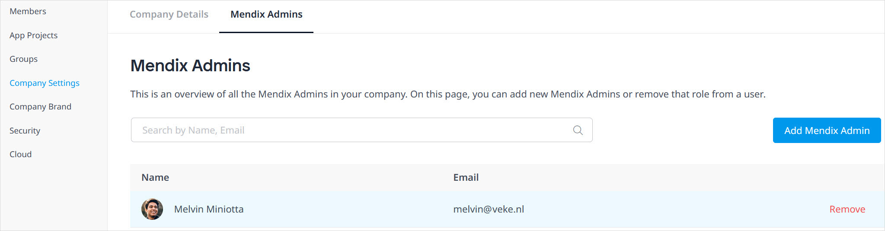

## 1 Introduction

Users that sign up on the Mendix Platform will be able create new app projects, invite others to their app project teams, deploy their apps, and invite end-users to give feedback on apps, among many other activities. Insights into all these company activities are provided to you in the Control Center in one central overview. These insights will help you to be in control and remain aware of everything happening within the Mendix landscape of your company.

The [Mendix Control Center](https://controlcenter.mendix.com/) consists of the pages described below, which are for use by [Mendix Admins](#company).

If your company does not already have a Mendix Admin, you will see a landing page that outlines the usage and goals of Control Center. You can also recommend a colleague for Mendix Admin status by clicking **Suggest a Mendix Admin**.

If your company does already have a Mendix Admin (but you yourself are not a Mendix Admin), you will see this landing page:

If you are a Mendix Admin, you will immediately see the **Members** page and can navigate to the pages described in the sections below.

You can access Control Center via the menu item on the navigation pane.

## 2 Members {#members}

Members are users who can view and/or edit an app project. On the **Active members** tab, you can see the active members of your company who can access certain app projects: 

When you click a company member's name, a pop-up window opens with their member profile. The profile displays the app **Projects** of which they are a member as well as their **Project role** for each project. Click a project name to go to its [project profile](#projects) pop-up window.

On the **Inactive members** tab, you can see former members of your company who have been deactivated.

On the **External members** tab, you can see the members outside of your company who have access to at least one of your company app projects.

When you select members in the lists on these tabs, a context menu appears with options for exporting member details to an *.xlsx* file and deactivating/activating members.

For security reasons, deactivating an employee that is leaving your company is recommended (if the employee returns to your company, they can be activated as a member again). Before deactivating a user, make sure the following points are true for that user:

* They do not have a [Technical Contact](/developerportal/collaborate/app-roles#technical-contact) role
* They are not the only [Scrum Master](/developerportal/collaborate/app-roles#app-team-roles) in an App Team

{}
You cannot deactivate yourself.
{}

## 3 App Projects {#projects}

On the **Active App Projects** tab of this page, you can see a list of the active app projects that belong to your company. The **Inactive App Projects** tab lists your company's deactivated app projects. The following details apply to deactivated app projects:

* A deactivated app project still exists in the company, but it is invisible to regular users
* You can only deactivate Free Apps that are not attached to [Mendix Cloud](/developerportal/deploy/mendix-cloud-deploy) nodes

When you click a **Project** name, a pop-up window opens with the project profile. The **Project Info** tab has the **Description** and **App ID** fields, which are also available on the [General](/developerportal/settings/general-settings) settings page for your app project in the Developer Portal. On the **Members** tab, you can see the active members and external members of the app project. The **Project Roles** tab presents the App Team roles defined via the **Default App Roles** tab and/or customized for a particular app project.

When you select app projects in the lists on these tabs, a context menu appears with options for exporting project details to an *.xlsx* file, deactivating/activating projects, and deleting projects.

The **Default App Project Roles** tab shows the default [App Team roles](/developerportal/collaborate/app-roles#edit-app-team-roles) assigned for every new app project created in your company. Hovering over a role brings up options to **Delete** or **Edit** the role. 

Click **Add Role** to add a new default role, which includes permissions on accessing [Team Server](/developerportal/develop/team-server) and [Mendix Cloud](/developerportal/deploy/mendix-cloud-deploy) information.

## 4 Groups {#groups}

A Mendix Admin can set up **App Access Groups**, which consist of end-users (who are active members of your company) who will have access to [Mendix SSO](/appstore/modules/mendix-sso)-enabled apps with specific environments and roles. Click **Add Access Group** to create a new group with a **Name** and **Description**.

Click a group name to bring up the group details pop-up window, and click **Add Member** to add members to the group. When you add members to an app access group, they will automatically be granted access to the apps listed on **Accessible Apps** tab. After you select an app to be accessible for the group, you also need to select a specific app [environment](/developerportal/deploy/environments) node to be accessible, in addition to specific [user roles](/refguide/user-roles) that should be able to access the app.

{}
You can only add apps that utilize [Mendix SSO](/appstore/modules/mendix-sso) to App Access Groups.
{}

When you select groups in the list or members or accessible apps in the group details page, a context menu will appear with options for exporting item details to an *.xlsx* file, deleting access groups, removing members from access groups, and removing accessible apps.

## 5 Company Settings {#company}

On the **Company Details** tab of this page, you can edit your **Company Name** and **Description**. You can also request new **Company Email Domains** by clicking **Add Domain**, upon which a request is sent to [Mendix Support](/developerportal/support/). Once a domain is added, every user who signs up to Mendix with that email domain will be assigned to your company.

The **Mendix Admins** tab lists all the current Mendix Admins in your company. A Mendix Admin will normally be someone in the IT department of your company, and they will have full access to Control Center to perform all available tasks. 

To add a new admin, click **Add Mendix Admin**. To remove an admin, hover over their name in the list and click **Remove**.

{}
It is not possible to remove yourself as a Mendix Admin.
{}

## 6 Company Brand

{}
Features on this page are available to try out, but you will not see changes implemented yet.
{}

On this page, you can add and edit a **Logo** that will appear on your company page. (Please note your company page will be available in a future iteration of Control Center.)

You can set a **Cover image** to be the the background header of your company page. If you do not set an image by clicking **Upload**, the **Primary** color as set in the **Brand colors** section will be used.

## 7 Security

On the **Password Policy** tab of this page, you can set the password expiration policy for all company members. If you do not want the passwords to expire, toggle **Passwords of company members never expire** to **On**.

On the **Security History** tab, you can click **Show Security History** to open a page (in a new browser tab) that presents an audit trail of security-related changes in **Project History** and **Member History**. You can search through and view details on these changes as well as export the audit trail to a CSV file.

## 8 Cloud {#cloud}

{}
This feature is not yet publicly available. Please talk to your CSM to enable this page.
{}

The **Cloud Environments** tab on this page presents an overview of the licensed Mendix Cloud environments allocated to your company. This includes information on an environment's [Resource pack](/developerportal/deploy/mendix-cloud-deploy#resource-pack) and whether the [Fallback](/developerportal/deploy/mendix-cloud-deploy#fallback) option has been purchased as part of a premium plan.   

There are links to three other pages from this tab to allow you to [make requests to Mendix Support](/developerportal/support/submit-support-request#3-submitting-a-new-request) to do the following:

* [Add Node](/developerportal/support/new-app-node-request-template#new-node) – requests a new app node for a specific app and environment
* [Resize Environment](/developerportal/support/new-app-node-request-template#resize) – requests a container size change
* [Offboard Environment](/developerportal/support/new-app-node-request-template#offboard) – requests that an app is offboarded

These links will open in a new browser tab.
