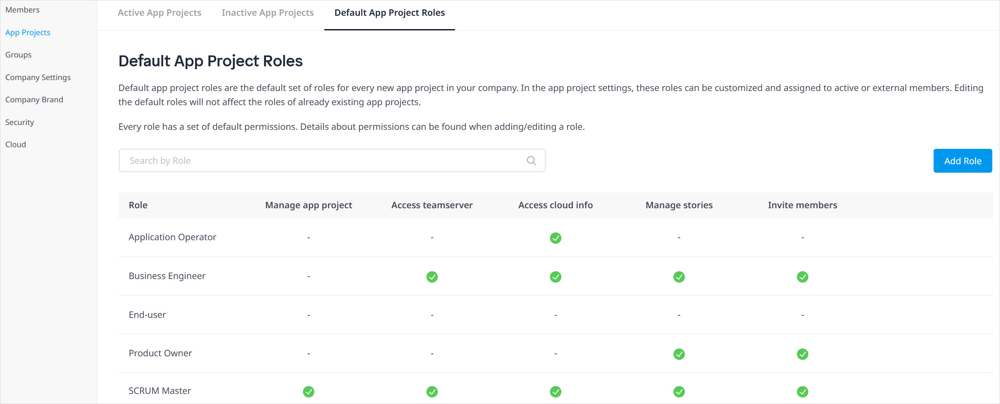
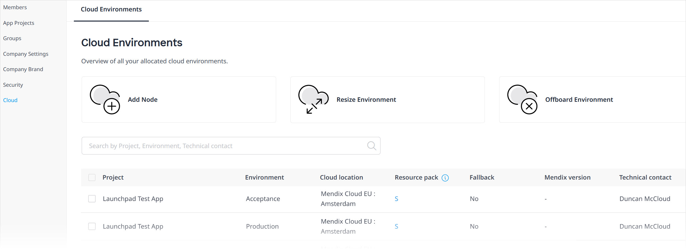

## 1 Introduction

When you sign up on the Mendix Platform, you are able to create new apps, invite other users to your app teams, deploy your apps, and invite app end-users to give feedback, among many other activities. Insights into these company activities are provided in the Control Center in one central overview. These insights will help you to be in control and remain aware of everything happening within the Mendix landscape of your company.

The [Mendix Control Center](https://controlcenter.mendix.com/) consists of the pages described below, which are for use by [Mendix Admins](#company).

If your company does not already have a Mendix Admin, you will see a page that outlines the usage and goals of Control Center. You can also recommend a colleague for Mendix Admin status by clicking **Suggest a Mendix Admin**.

If your company already has a Mendix Admin but you yourself are not a Mendix Admin, you will see this page:

If you are a Mendix Admin, you will immediately see the [Dashboard](#dashboard) page and can navigate to the pages described below.

## 2 Dashboard {#dashboard}

{}
This new feature is currently in Beta. Please provide feedback via the feedback button on the right of the page. For more information, see [Beta Versions](/releasenotes/beta-features/).
{}

The Control Center dashboard gives you an overview of various activities for your company on the Mendix Platform:

These are some examples of what you can find on the dashboard:

* **Apps Created** – you can filter these [apps](#apps) by date
* **Mendix Versions** – describes which Studio Pro/Mendix versions your internal and external [members](#members) are using for apps, which is especially important as the development of apps on outdated or [non-MTS/LTS versions](/releasenotes/studio-pro/lts-mts) can lead to security issues
* **Certification Level** – presents the number of members per [Mendix certification](https://academy.mendix.com/link/certification)
* **External Members** – click a part of this pie chart to see a list of external members from a specific company
* **Company Feed** – presents events in your company, such as members joining the company and the created app

## 3 Apps {#apps}

On the **Active Apps** tab of this page, you can see a list of the active apps that belong to your company. The **Deactivated Apps** tab lists your company's deactivated apps. The following details apply to deactivated apps:

* A deactivated app still exists in the company, but it is invisible to regular users
* You can only deactivate Free Apps that are not attached to [Mendix Cloud](/developerportal/deploy/mendix-cloud-deploy) nodes

When you click an app name, a pop-up window opens with the app profile. You have options to directly **Deactivate App** and **Delete App** in this window. The window has the following tabs:

* **App Info** – this tab has the **Description** and **App ID** fields, which are also available on the [General Settings](/developerportal/collaborate/general-settings) page for your app in the Developer Portal
* **Members** – this tab presents the active members and external members of the app
	* You can directly deactivate a member from the app by clicking their name and selecting **Deactivate Member**
	* For other member management options, click **Manage Members**, which will open the **Security** > [Team](/developerportal/collaborate/team#managing) page
	* As a Mendix Admin, you can also add yourself to a team via this page
* **App Roles** –  this tab presents the team roles defined via the **Default App Roles** tab and/or customized for a particular app

When you select one or more apps via the check boxes on the **Active Apps** or **Deactivated Apps** tab, a context menu appears at the bottom of the screen with options for exporting app details to an *.xlsx* file, deactivating/activating apps, and deleting apps.

The **Default App Roles** tab shows the default [team roles](/developerportal/collaborate/app-roles#team-roles) assigned for every new app created in your company. Hovering over a role brings up options to **Delete** or **Edit** the role. Click **Add Role** to add a new default role, which includes permissions on accessing [Team Server](/developerportal/collaborate/team-server) and [Mendix Cloud](/developerportal/deploy/mendix-cloud-deploy) information.

## 4 Members {#members}

Members are users who can view and/or edit an app. On the **Active Members** tab, you can see the active members of your company who can access certain apps: 

When you click a company member's name, a pop-up window opens with their member profile. The profile displays the **Apps** of which they are a member as well as their **App role** for each app. Click an app name to go to its [app profile](#apps) pop-up window.

On the **Deactivated Members** tab, you can see former members of your company who have been deactivated.

On the **External Members** tab, you can see the members outside of your company who have access to at least one of your company apps.

When you select members in the lists on these tabs, a context menu appears with options for exporting member details to an *.xlsx* file and deactivating/activating members.

For security reasons, deactivating an employee that is leaving your company is recommended (if the employee returns to your company, they can be activated as a member again).

{}
You cannot deactivate yourself.
{}

## 5 Groups {#groups}

A Mendix Admin can set up **App Access Groups**, which consist of end-users (who are active members of your company) who will have access to [Mendix SSO](/appstore/modules/mendix-sso)-enabled apps with specific environments and roles. Click **Add Access Group** to create a new group with a **Name** and **Description**.

Click a group name to bring up the group details pop-up window, and click **Add Member** to add members to the group. When you add members to an app access group, they will automatically be granted access to the apps listed on **Accessible Apps** tab. After you select an app to be accessible for the group, you also need to select a specific app [environment](/developerportal/deploy/environments) node to be accessible, in addition to specific [user roles](/refguide/user-roles) that should be able to access the app.

{}
You can only add apps that utilize [Mendix SSO](/appstore/modules/mendix-sso) to App Access Groups.
{}

When you select groups in the list or members or accessible apps in the group details page, a context menu will appear with options for exporting item details to an *.xlsx* file, deleting access groups, removing members from access groups, and removing accessible apps.

## 6 Company Settings {#company}

On the **Company Details** tab of this page, you can edit your **Company Name** and **Description**.

You can also request new **Company Email Domains** by clicking **Add Domain**, upon which a request is sent to [Mendix Support](/developerportal/support/). Once a domain is added, every user who signs up to Mendix with that email domain will be assigned to your company.

If you have [configured single sign on using BYOIDP](set-up-sso-byoidp), you will have to wait until the domain has been added, then deactivate and reactivate BYOIDP to pick up the new email domain. It is not possible to add email domains which do not use single sign-on if it is activated for your company.

The **Mendix Admins** tab lists all the current Mendix Admins in your company. A Mendix Admin will normally be someone in the IT department of your company, and they will have full access to Control Center to perform all available tasks. 

To add a new admin, click **Add Mendix Admin**. To remove an admin, hover over their name in the list and click **Remove**.

{}
It is not possible to remove yourself as a Mendix Admin.
{}

## 7 Company Brand

{}
Features on this page are available to try out, but you will not see changes implemented yet.
{}

On this page, you can add and edit a **Logo** that will appear on your company page. (Please note your company page will be available in a future iteration of Control Center.)

You can set a **Cover image** to be the background header of your company page. If you do not set an image by clicking **Upload**, the **Primary** color as set in the **Brand colors** section will be used.

## 8 Security {#security}

On the **Password Policy** tab of this page, you can set the password expiration policy for all company members. If you do not want the passwords to expire, toggle **Passwords of company members never expire** to **On**.

On the **Single Sign-On** tab, you can set up an identity federation between the Mendix platform and your corporate identity provider. We call this feature *Bring Your Own Identity Provider (BYOIDP)* and you can find more information in [How to Set Up an SSO (BYOIDP)](set-up-sso-byoidp).

On the **Security History** tab, you can click **Show Security History** to open a page (in a new browser tab) that presents an audit trail of security-related changes in **App History** and **Member History**. You can search through and view details on these changes as well as export the audit trail to a CSV file.

## 9 Cloud {#cloud}

{}
This feature is not yet publicly available. Please talk to your Customer Success Manager to enable this page.
{}

The **Paid Environments** tab on this page presents an overview of the licensed Mendix Cloud environments allocated to your company. This includes information on an environment's [Resource pack](/developerportal/deploy/mendix-cloud-deploy#resource-pack) and whether the [Fallback](/developerportal/deploy/mendix-cloud-deploy#fallback) option has been purchased as part of a Premium plan.   

There are links to three other pages from this tab to allow you to [make requests to Mendix Support](/developerportal/support/submit-support-request#submitting) to do the following:

* [Add Node](/developerportal/support/new-app-node-request-template#new-node) – requests a new app node for a specific app and environment
* [Resize Environment](/developerportal/support/new-app-node-request-template#resize) – requests a container size change
* [Offboard Environment](/developerportal/support/new-app-node-request-template#offboard) – requests that an app is offboarded

{}
These links will open in a new browser tab.
{}

The **Free Environments** tab presents details on your company's free environments.

## 10 Data Hub {#data-hub}

An organization's Data Hub requires governance of the data-sharing policy down to the practical details of curating registered assets. A Mendix Admin can oversee these functions and also assign curators that can perform governance tasks for their apps.

For details on these tasks, see [Data Hub Administration](data-hub-admin).

## 11 Read More

* [Data Hub Administration](data-hub-admin)
* [Control Center and Mendix 8.18: The Right Amount of Control](https://www.mendix.com/blog/control-center-and-mendix-8-18-the-right-amount-of-control/)
* [Govern and Scale your App Landscape with Mendix Control Center](https://academy.mendix.com/link/paths/116/Govern-and-Scale-your-App-Landscape-with-Mendix-Control-Center)
