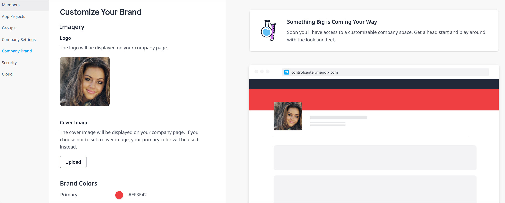

## 1 Introduction

[**Please add some intro content needed. What is the purpose of Control Center?**]

[**How do you access Control Center? Only via URL, or will there be a Menu item in the community header?**]

The [Mendix Control Center](https://controlcenter.mendix.com/) consists of the pages described below, which are for use by [Mendix Admins](#company). If you are not a Mendix Admin, you will see this landing page, which outlines the usage and goals of Control Center. You can also recommend a colleague for Mendix Admin status by clicking **Suggest a Mendix Admin**:

## 2 Members

Mendix Admins will see this as the landing page:

Members are users who can view and/or edit an app project. On the **Active members** tab, you can see the active members of your company who can access certain app projects: 

When you click a company member's name, a pop-up window opens with their member profile. The profile displays the app **Projects** of which they are a member as well as their **Project role** for each project. Click a project name to go to its [project profile](#projects) page.

On the **Inactive members** tab, you can see former members of your company who have been deactivated.

On the **External members** tab, you can see the members outside of your company who have access to at least one of your company app projects. When you click an external member's name, a pop-up window will open with their member profile.

[**Please verify "External members" description.**]

## 3 App Projects {#projects}

On the **Active App Projects** tab of this page, you can see a list of the active app projects that belong to your company. The **Inactive App Projects** tab lists your company's deactivated app projects.

When you click a **Project** name, a pop-up window opens with the project profile. The **Project Info** tab has the **Description** and **App ID** fields, which are also available on the [General](/developerportal/settings/general-settings) settings page for your app project in the Developer Portal. On the **Members** tab, you can see the active members and external members of the app project. The **Project Roles** tab presents the App Team roles defined via the **Default App Roles** tab and/or customized for a particular app project.

The **Default App Roles** tab shows the default  [App Team roles](/developerportal/company-app-roles/manage-roles#edit-app-team-roles) assigned for every new app project created in your company. These can be customized at the app project-level. Click **Add Role** to add a new default role, which includes permissions on accessing [Team Server](/developerportal/develop/team-server) and [Mendix Cloud](/developerportal/deploy/mendix-cloud-deploy) information.

[**Please verify these are App Team roles.**]

## 4 Groups

A Mendix Admins can set up **App Access Groups**, which consist of end-users who have access to certain apps with specific environments and roles. End-users are comprised of both active members of your company and external members. Click **Add Access Group** to create a new group with a **Name** and **Description**.

[**Please verify above description.**]

Click a group to bring up the group details pop-up window, and click **Add Member** to add members to the group. When you add members to an app access group, they will automatically be granted access to the apps listed on **Accessible Apps** tab. After you select an app to be accessible for the group, you also need to select a specific app [environment](/developerportal/deploy/environments) node to be accessible, in addition to specific user [roles](/refguide/project-security#user-roles) that should be able to access the app.

[**Please verify that these are user roles (as is the case for security groups) and not App Team roles.**]

{}
You can only add apps to groups that utilize [Mendix SSO](https://docs.mendix.com/appstore/modules/mendix-sso#1-introduction) to App Access Groups.
{}

[**How do you delete a group?**]

## 5 Company Settings {#company}

On the **Company Details** tab of this page, you can edit your **Company Name** and **Description** as well as the **Company Email Domains**.  When you click **Add Domain**, a request is sent to [Mendix Support](/developerportal/support/). Once a domain is added, every user who signs up to Mendix wth that email domain will be assigned to your company.

The **Mendix Admins** tab lists all the current Mendix Admins in your company. Mendix Admins have one main permission to edit the company's details as well as perform many other tasks. To add a new admin, click **Add Mendix Admin**. To remove an admin, select their name in the list and click **Remove**.

[**Need more details on defining a Mendix Admin and what tasks they can perform?**]

## 6 Company Brand

{}
Features on this page are available to try out, but you will not see changes implemented yet.
{}

On this page, you can add and edit a **Logo** that will appear on your company page.

[**Where is the "company page" located, how can the user access it?**]

You can set a **Cover image** to be the the background header of your company page. If you do not set an image by clicking **Upload**, the **Primary** color as set in the **Brand colors** section will be used.

## 7 Security

On the **Password Policy** tab of this page, you can set the password expiration policy for all company members. If you set **Days before passwords expire** to **0**, the password will never expire.

On the **Security History** tab, you can click **Show Security History** to open a page that presents an audit trail of security-related changes in **Project History** and **Member History**. You can search through and view details on these changes as well as export the audit trail to a CSV file.

## 8 Cloud

The **Cloud Environments** tab on this page presents an overview of the cloud environments allocated to your company. This includes information on the environment's **Resource pack** and **Fallback**.

[**How to define "Resource pack" and "Fallback" here, as these terms are not used in relation to Mendix Cloud in documentation?**]

[**Can you provide a different environment that has data for a better screenshot?**]

