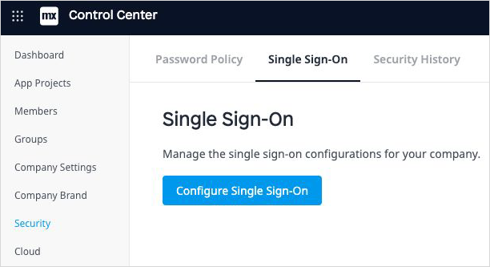
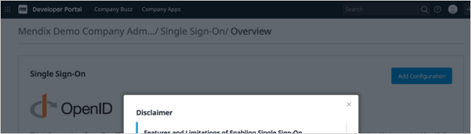
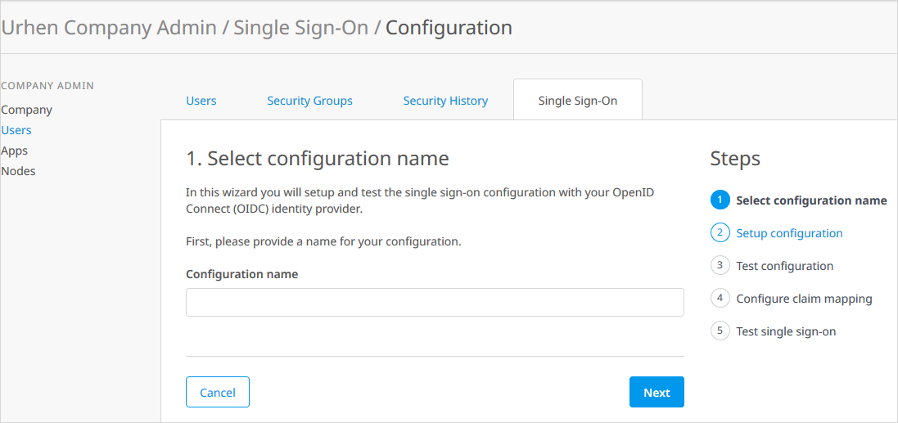
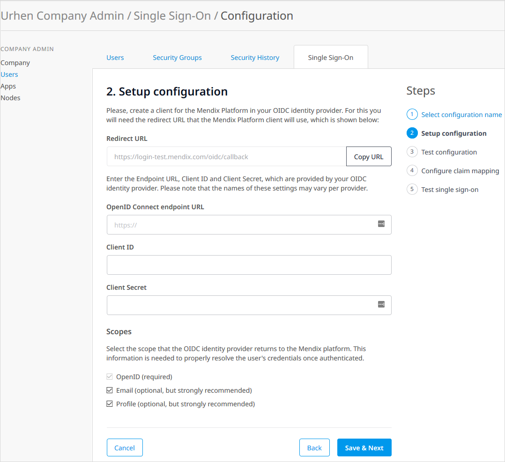
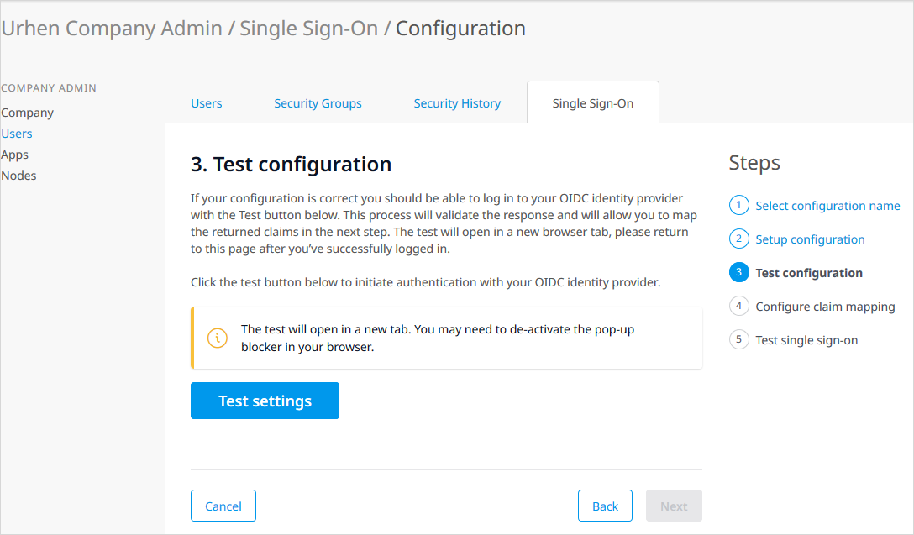
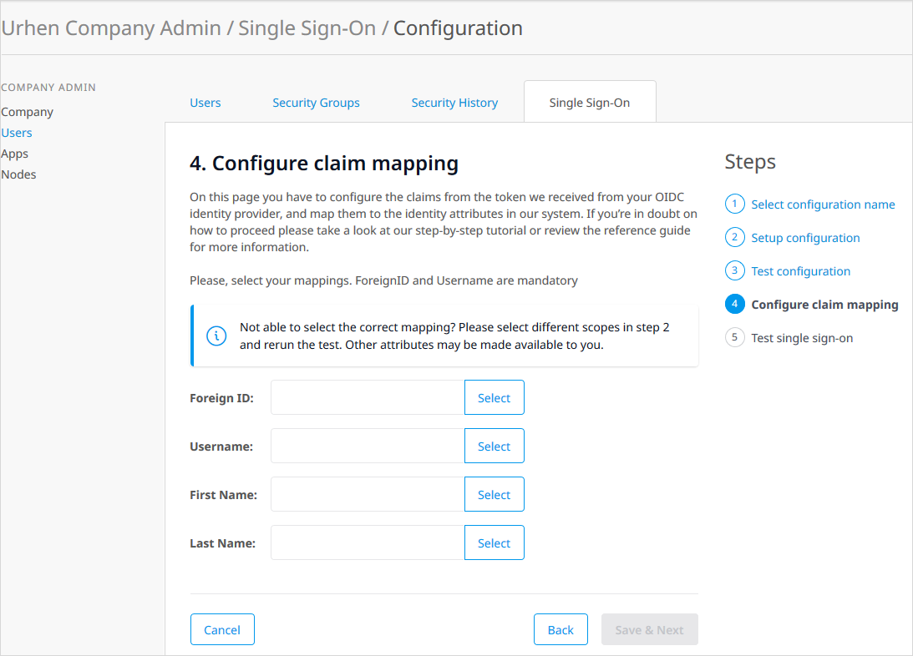
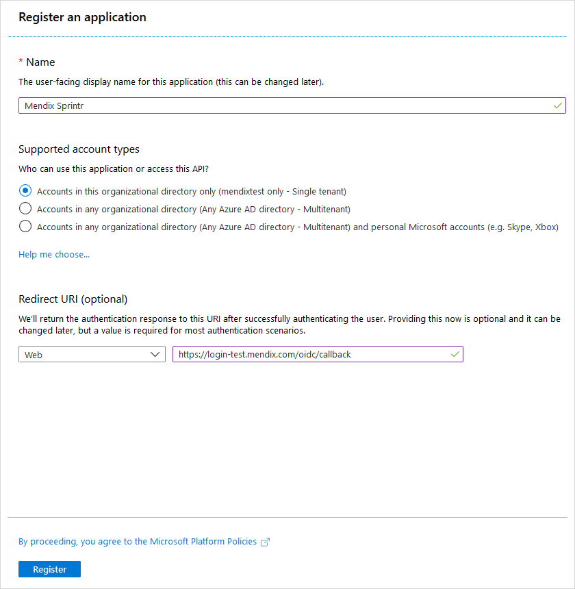

## 1 Introduction

The Mendix Cloud solution offers an Identity Provider (IdP) that allows users to sign in to:

* Mendix platform services
* Mendix applications that have been built with Mendix SSO

Rather than using Mendix credentials to login, it is also possible to set up an identity federation between the Mendix platform and your corporate identity provider. In other words, you can Bring Your Own Identity Provider (BYOIDP).

Benefits of using the BYOIDP SSO are:

* convenience for platform users
* governance: access to the Mendix platform is only possible for users that have an active account with your identity provider
* security: your identity provider can enforce your preferred authentication policy, which may include 2-factor authentication (2FA)

Mendix calls this feature BYOIDP, which is short for Bring-Your-Own-IDentity-Provider (also known as ‘customer IDP’)

The purpose of this document is to describe the steps to set up a ‘Single Sign-On’ configuration in Mendix.

## 2 Pre-requisites

To set up an IDP configuration for the Mendix platform and your Mendix app, you will need the following:

* A subscription to an OpenID compliant identity provider, such as Microsoft Azure AD, OKta or Auth0
* The endpoint URL to your identity provider
* The Mendix Developer Portal needs to be registered as a client in your IDP, and you need to know the corresponding client ID and secret

## 3 Configuring your BYOIDP setup

As a Mendix Administrator, you will find the IDP setup in your Control Center:

In this overview you will find your current IDP configurations, both draft versions and the active one. When you create a new configuration. The Control Center will display a pop-up screen to inform you of known limitations:

From here you can add a configuration, edit draft versions of a configuration, activate a draft version or de-activate the current IDP configuration.

### 3.1 Adding a Configuration

When adding a configuration, you will need to provide the information described below:

* **Configuration name** – a name for the IDP setup in the Single Sign-On configuration for your own reference.

* **Redirect URL** – the callback URL to the Developer Portal that your IDP needs to send the authenticated user to.
* **OpenID Connect endpoint URL** – the endpoint of the Developer Portal registration in your IDP. The default protocol is HTTPS. If your IDP supports multiple protocols, make sure you enter the OpenID endpoint.
* **Client ID** – the ID of the Developer Portal registration in your IDP.
* **Client secret** – the password or secret of the Developer Portal registration in your IDP. Enter this once. After saving your configuration it will no longer be shown to you.
* **Scopes** – selecting a scope to configure the data Mendix is allowed to read from your IDP. Mendix uses this data to map the user’s identity in your IDP environment with a corresponding identity in the Developer Portal. The OpenID scope is required. In some cases, depending on your IDP, other scopes are necessary to fully map the user’s identity.

### 3.2 Testing Your Configuration

Once you have configured the endpoint and the scope, you are ready to perform a first test of your configuration. This test will perform a round trip from the Mendix platform to your IDP and back to the platform. The test will be performed in a new tab page of your browser. In order to perform the test, your browser must allow popup windows.

### 3.3 Mapping Between IDP and Mendix

The data from your IdP may have different attribute names from the Mendix identity.

Configure which data from your identity provider is mapped to the attributes of the Mendix identity. Configure at least **ID**, **user name**,and a **first name** or **last name**.

{}
The user name must be in the correct form for an email address.{}

## 4 Testing

When you have completed your IDP setup, you can perform a test sign-in before activating the configuration.

You can test in one of two ways:

1. Click on the test endpoint of your configuration. It will redirect you to the login page of your IDP. Enter the credentials of a user known to your IDP. If the test succeeds the Developer Portal Buzz will open.
2. Go to https://login.mendix.com/ and, in the username field, enter the test email domain of your configuration exactly as printed on the overview page. The password field should disappear. Click the ‘Sign in with SSO' button. This will redirect you to a login page of your IDP. Enter credentials known to your IDP. If the test succeeds the Mendix platform home page will open.

## 5 Activating

When you are ready, you can activate the IDP configuration from the overview page. Your users will immediately benefit from logging into the Mendix Developer Portal with the same credentials as they use in the IDP. Any user passwords currently held in the Mendix platform will be scrambled to prevent the users from bypassing your IDP authentication.

As an option, you can inform your users of the change in the sign-in process via a preconfigured email message.

Please be aware that there can be only one active IDP configuration at a time. When you activate an IDP configuration while another one is already active, the current active configuration will be de-activated automatically.

## 6 De-activating

You can deactivate the IDP configuration at any time. The changes become into effect immediately. Users will be forced to reset their Mendix passwords on first sign-in.

Optionally you can inform your users of the change in the sign-in process via a preconfigured email message.

## 7 Microsoft Azure AD

Microsoft Azure AD is one of the most used IDP’s, which supports OpenID Connect. To help you setup with Azure, follow the steps in this small tutorial.

1. Sign in to your Azure Active Directory portal and follow **Azure Active Directory** > **App registrations**.

2. Create a new app registration by clicking **New registration** in the top left corner.

    

3. Enter a name for your configuration, and select the preferred account type. Under Redirect URI paste the callback URL you were shown when setting up the IDP  in the Developer Portal.

4. Click **Register** to save the registration.

    

5. In the app registration details that opens after you save your registration, hover over **Application (client) ID** and copy the ID to the clipboard with the button that appears.

    

    You will need this Client ID when setting up the Customer IDP in the Developer Portal.

6. Click on **Endpoints** in the top bar of the app registration details page. A sidebar with all available endpoints will open.

7. Copy the **OpenID Connect metadata document** URL.

    

8. Close the sidebar with the X in the top right corner and you will return to the App registration details page.

9. Click **Certificates & secrets** in the left-hand menu bar.

10. Click **New client secret** in the page that opens.

    

11. In the pop-up box that opens, enter a name for your certificate, select a expiration type, and click **Add**.

    

    If you wish to let the certificate to expire, please write down the date the certificate will expire.

12. Copy the client secret. You will need this to set up the Customer IDP setup in the Developer Portal.

    

That’s it! You are now ready to resume the Customer IDP setup in the Developer Portal.

For more information on setting up federation with a Microsoft Azure IdP, see  in the Microsoft documentation.

## 8 Limitations

{}[Should we be adding limitations here?]{}

