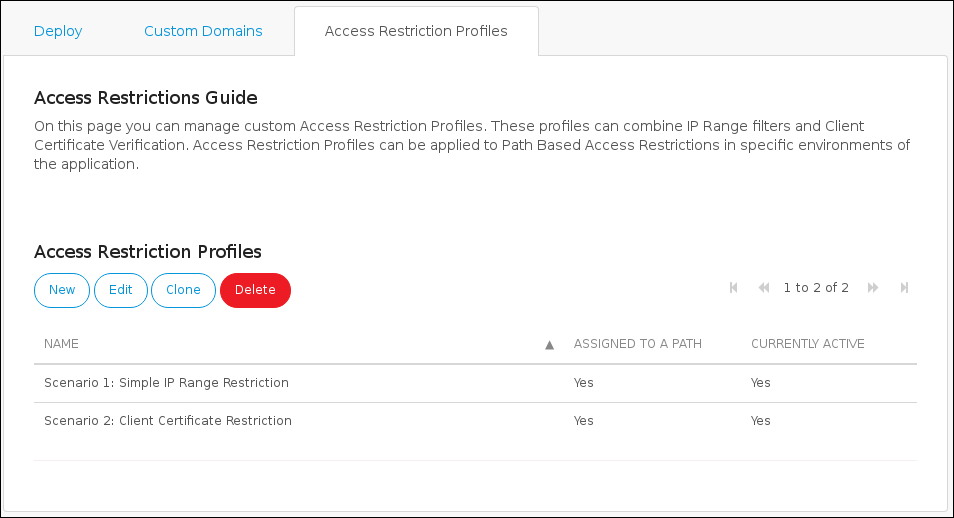
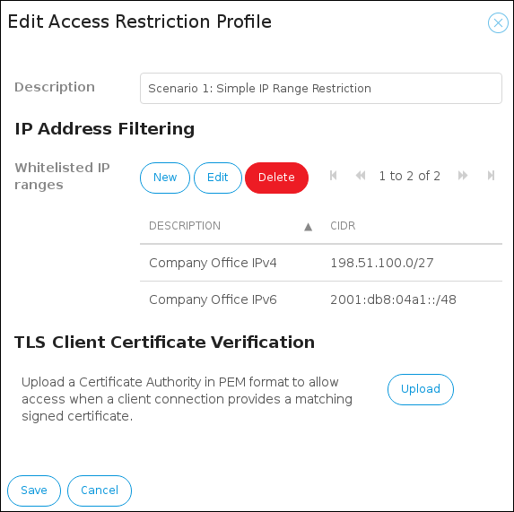
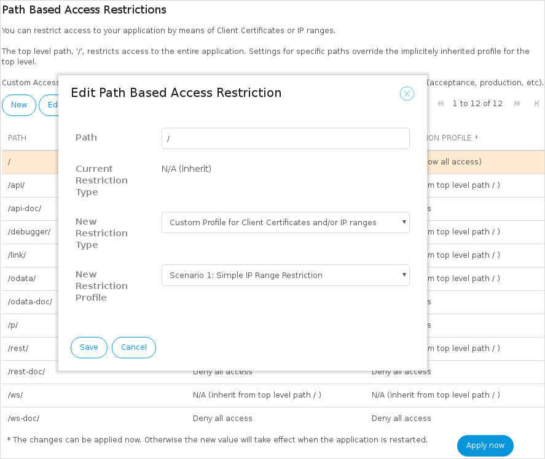
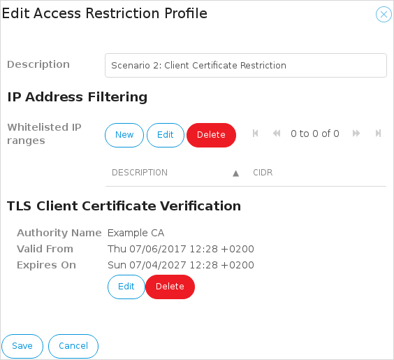

## 1 Introduction

Your app is accessible over the internet - but you may not want everyone to be able to access it. By configuring access restrictions, you have fine-grained control over external access to your application.

You can apply restrictions to the top level of the application URL (`/`), and also to more specific paths (for example, `/ws/` or `/odata/`). This allows you to, for example, open up web services without giving general users access to the app itself. Presets are available to simplify common requirements, such as allowing or denying all access. In addition, custom profiles can be created using IP range filters and a client certificate authority.

## 2 Access Restriction Profile Concepts

When configuring an access restriction profile, you need to bear the following things in mind:

* Access restriction profiles are configured at the *application* level and they can be reused in all the environments (test, acceptance, production) of an app

* Access restriction profiles can contain any number of IPv4 and IPv6 address ranges, a client certificate authority, or both

* If an access restriction profile contains *both IP address ranges and a client certificate authority*, then any match on *either* the IP range *or* the client certificate will grant access

**Known Limitations**

* The IP range filter option is not available in Mendix Cloud *v3* environments hosted outside the Netherlands

* When using client certificate restrictions, the client certificate Certificate Authority (CA) in all active profiles must be identical (in other words, it is only possible to use a single CA for the entire application environment)

* Only Root CA verification is supported. Any client certificate with a valid path to the Root CA will be allowed access. Certificate mapping is not supported.

## 3 Applying a Restriction to an Application Environment

To apply a restriction to a specific application environment, follow these steps:

1. Open the **Environment** page for your app in the *Developer Portal*.

2. Click the **Details** of the desired environment.

3. Go to the **Network** tab.

4. The section **Path Based Access Restrictions** allows for applying access restrictions to a single environment.

{}

* The top level path `/` restricts access to the entire application
* The settings for specific paths override the implicitly inherited profile for the top level
* Besides being able to apply a customized access restriction profile, there are also presets available for simply allowing or denying all access

{}

### 3.1 Default Settings

These are the default settings:

* When deploying a deployment package to an environment using the **Deploy** or **Transport** functionality, paths representing known functionality in the Mendix version that is used will automatically be added to the list of paths
* All paths ending in `-doc` will have a preset **Deny all access** profile set by default
* All the remaining paths will have no restriction applied by default

## 4 Use Cases for Access Restrictions

The two scenarios in which you can use access restrictions are described below.

### 4.1 Example Scenario 1 – Restricting Access Based on an IP Range

An example scenario in which a basic IP range restriction could be used is when an app running in the Mendix Cloud is only to be accessed from a single office. The interactive web browser interface of the app should only be accessible to employees in the office of the company running the app. From the rest of the internet, the login screen of the application should not even be visible.

To restrict access to the app to an IP range, follow these steps:

1. Go to the [Developer Portal](http://home.mendix.com) and select your app.

2. Go to the **Access Restriction Profiles** tab of the **Environments** page.

    

3. Create an access restriction profile.

4. Add one or more IP ranges to the access restriction profile.

    

5. Save the access restriction profile.

6. Go to the **Deploy** tab of the **Environments** page, and click the **Details** of the desired environment.

7. Select the **Network** tab of an application environment.

    

8. **Edit** the top level path `/`.

    {}Any path below this path which does not have an explicit restriction will inherit this access restriction profile.{}

9. Select *Custom Profile for Client Certificates and/or IP ranges* as the **New Restriction Type**.

10. Select your access restriction profile as the **New Restriction Profile**, and **Save** it.

### 4.2 Example Scenario 2 – Backend Administration with Third-Party Web Service Integrations

This second scenario is an extended version of the first scenario.

The app that was protected with the IP range restriction now starts to provide web service integrations that will be called by third-parties. Since an IP range restriction is in place, the web service endpoints are not reachable by external parties.

By adding an additional access restriction profile and applying it to the `/ws/` path only, you can specifically grant access to the web service endpoints.

Additionally, the company has decided to use TLS client certificates so they do not have to manage lists of IP ranges for each external third party.

To add this additional access restriction profile, follow these steps:

1. Go to the **Access Restriction Profiles** tab of the **Environments** page.

    

2. Create a **New** access restriction profile.

3. **Upload** the certificate of the internal certificate authority that is used to sign the client certificates.

    

4. **Save** the new access restriction profile.

6. Go to the **Deploy** tab of the **Environments** page, and click the **Details** of the desired environment.

7. Select the **Network** tab of an application environment.

    

8. **Edit** the `/ws/` path of the environment to apply the new access restriction profile. For the selected path (`/ws/`), the default profile (for the top level `/`) will now be overridden.

{}

If the `/ws/` path should still be reachable from the office location *without* using a client certificate, then add the IP ranges of the office location to the profile used for `/ws/`.

{}

## 5 Read More

* [Certificates](certificates)
* [Deploy and Manage](/developerportal/deploy)
* [Environments](environments)
* [Environment details](environments-details)
