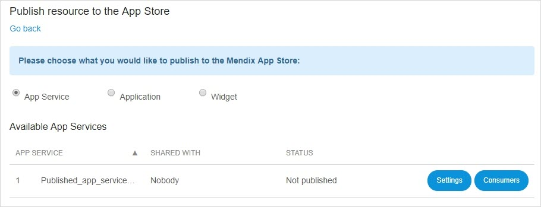

## 1 Introduction

The **App Services** page provides an overview of possible resources that can be published to the [Mendix App Store](https://appstore.home.mendix.com/):

* **App Service**
* **Application**
* **Widget**

## 2 App Service

App services are aimed at sharing functionality between your Mendix apps. You can create app services in the Mendix Modeler and publish the created app content and functionality within your company or to the entire Mendix Community. Users of your app service can directly drag actions that you designed into their microflows in the Modeler and use your entities and data in their apps. 

On the **App Service** page, you can see a list of the available app services, with whom the app service is shared, and what the current statuses are.

For more information, see [Published App Services](/refguide/published-app-services) in the Mendix Reference Guide as well as the [Mendix App Services: Putting Them to Work for Your Projects](https://www.mendix.com/videos/mendix-app-services-putting-work-projects-pieter-van-balen-mendix-developer/) blog post.

### 2.1 Settings

In **Settings** you can manage the following:

* App service info
* Documentation
* Screenshots

On the right side of the screen, you can choose with whom you want to **Share this App Service**:

* Nobody
* My company
* Mendix Community

Saving your settings will update your app service's listing in the Mendix App Store. Note that publishing to the Community App Store is subject to an approval process. However, your app service will be available for your colleagues while it is awaiting approval.

#### 2.1.1 App Service Info

In this tab, you can manage the following:

* **General**
    * Edit the **Name** of the app service that will be published
    * View the original **Modeler name** of the app service
    * Add or edit a **Description** of the app service
    * Add or edit tags
* **Avatar**
    * Add or edit the app service avatar – this small avatar will represent your app service in grids
    * Add or edit the App Store avatar – this big avatar will showcase your app service in the Mendix App Store

#### 2.1.2 Documentation

In this tab, you can perform the following actions:

* Write the **Release notes** that are aimed at describing the changes between the two versions
* View the **Documentation** that is defined in the Modeler during the creation of the app service
* View the **Service calls** that are used in the app service

#### 2.1.3 Screenshots

In this tab, you can add screenshots of the app service to illustrate its functionality.

### 2.2 Consumers

On this page, you can review the environments of which applications are currently consuming this app service. 

## 3 Application

By selecting **Application**, you can publish the application's model in the Mendix App Store.

Click **Go to App Store** to publish your app's model.

For more information, see [How to Share App Store Content](/community/app-store/share-app-store-content).

## 4 Widget

By selecting **Widget**, you can upload a widget to the Mendix App Store.

Click **Go to App Store** to upload your widget.

For more information, see [How to Share App Store Content](/community/app-store/share-app-store-content).

## 5 Related Content

* [Deploy](/developerportal/deploy)
* [Mendix App Services: Putting Them to Work for Your Projects](https://www.mendix.com/videos/mendix-app-services-putting-work-projects-pieter-van-balen-mendix-developer/)
* [Published App Service](/refguide/published-app-services)
* [How to Share App Store Content](/community/app-store/share-app-store-content)
