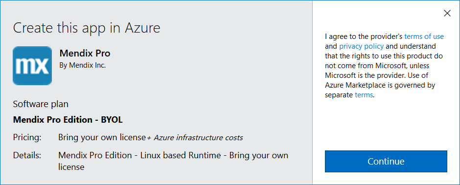
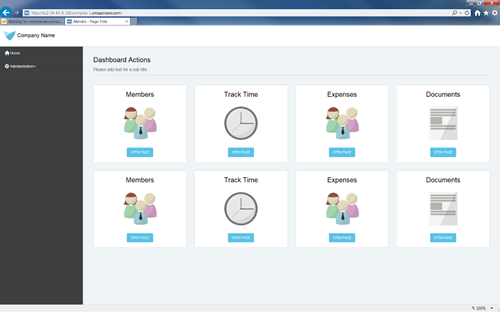

## 1 Introduction

{}
The Mendix Azure Marketplace solution is based on a standard server-based deployment. The pre-configured virtual server is no longer maintained by Mendix. This means it can be used for a quick setup, but the customer is responsible for applying latest patches. Mendix will treat the use of this image as a standard on-premises deployment, based on a Linux server. 

For production use, a license needs to be applied. For a production deployment, you are advised to select an external, production scaled database. The image comes with an embedded Postgres instance as standard, and this can be used for development purposes.
{}

This page guides you through the steps you need to follow to get your Mendix app up and running. It will teach you how to do the following:

*   Add a Mendix image to Microsoft Azure

*   Configure a Mendix Instances in Azure

*   Create a Mendix Package

*   Connect to a Mendix instance on Azure with SFTP (WinSCP) and SSH (Putty)

*   Unpack and start a Mendix app on an Azure server

*   Configure access to a Mendix instance on Azure

## 2 Prerequisites

To deploy your Mendix app to Microsoft Azure, you will need to complete the following prerequisites:

*   Install [WinSCP](https://winscp.net/eng/download.php)
*   Install [Putty](http://www.chiark.greenend.org.uk/~sgtatham/putty/download.html)
*   Register for an [Azure account](https://azure.microsoft.com/nl-nl/account/)
*   Install [Mendix Studio Pro](https://appstore.home.mendix.com/link/modelers/)

## 3 Adding Mendix from the Azure marketplace

The first thing to do when you want to run a Mendix app on Azure is to create a licensed Mendix environment on your Azure account.

1.  Go to [https://portal.azure.com](https://portal.azure.com/).

2.  **Sign in** with your Azure account.

3.  Search for **Mendix** in the search bar.

    

4.  Click **GET IT NOW** button.

    

5. Click **Continue** to agree to the terms and conditions.

    

6. Click **Create** to create a custom Mendix environment, or click **Start with a pre-set configuration** to have all the settings pre-configured.

    

7.  Give the instance a Name.

8.  Select **authentication type: Password**.

9.  **Create** a **Username** that is not MxAdmin.

10.  Select or Create a **Resource Group** for the instance.

11.  Select **OK.**

12. Select the **Size** of the instance, by default D1 is selected.

    

13.  Click **Select**.

14.  You can use the default settings.

15.  Click **Ok**.

16.  A summary is shown, click **Ok** to continue.

17. The offer detail is shown. Click **Purchase** to create the instance.

    

The instance is now provisioning.


{}
Congratulations, the Mendix environment is now created!
{}

## 4 Creating a Deployment Package

Now that you've got your Azure instance up and running, it's time to run an app on it. To do this you need to create a deployment package of your Mendix app and upload it to the Azure instance.

1.  Open **Studio Pro**.

2.  **Sign in** with your Mendix credentials.

3.  Open a **project** you want to run on the Mendix Azure instance.

4.  Create a deployment package of your project (**F7**).

    

5.  The deployment package will be stored in the **releases** folder of your project folder.

## 5 Uploading the Deployment Package to Azure

To upload the deployment package to the instance you need SFTP access.

1.  Open **WinSCP**.

2.  Select **New Site** on the left:

    

3.  Select **SFTP** as File protocol.

    To find the the hostname and IP address you'll have to go back to Azure.

4.  Open the Azure Console: [https://portal.azure.com/](https://portal.azure.com/).

5.  Go to **Virtual Machines**.

    

6.  Select the instance you launched in the previous section.

7.  From the pane below, copy the **Public IP address**:

    

8.  Go back to WinSCP and paste the Public IP address on the **Host name** field.

9.  Fill in the username and password you created for the instance.

10.  Click **Login**.

11.  Click **Yes** to add the server and host key to a cache.

12.  On your computer, browse to the **releases** folder of the app you want to deploy.

    

13.  **Upload the deployment package** to the user’s home folder on the server.

## 6 Running the image for the first time

To be sure the image is fully up to date with the latest patches, follow the below steps.

1.  Open **PuTTY**.

2.  In the **Host Name** field type **the public IP of the instance**.

3.  Click **Open** and click **Yes** when you receive the security message.

    You now have SSH access to the Azure instance.

4.  Execute below commands:

    ```bash
    sudo su

    echo "deb http://packages.mendix.com/platform/debian/ jessie main contrib non-free" > /etc/apt/sources.list.d/mendix.list

    apt-get update
    apt-get dist-upgrade
    ```

5.  To the question about whether to update `waagent` use the default (N).

## 7 Running the Mendix App on Azure

Now that the deployment package is in place you can deploy it on the instance. You'll use PuTTY to connect to the instance with SSH.

1.  Open **PuTTY**.

2.  In the **Host Name** field type the public IP of the instance which you discovered when uploading the deployment package to Azure.

3.  Click **Open** and click **Yes** when you receive the security message.

    You now have SSH access to the Azure instance.

4.  Before you start, switch to the MxAdmin user with the following command:

    ```bash
    sudo su MxAdmin
    ```

    You are now MxAdmin on the instance.

5.  Copy the deployment package to the model-upload folder

    ```bash
    cp [Deployment_Package] /srv/app/data/model-upload/
    ```

6.  In the console type **m2ee**. This will allow you to configure a Mendix app.

7.  Execute the following command:

    ```bash
    m2ee(admin): unpack [Deployment_Package]
    ```

8.  Enter **y** to confirm that all content will be overwritten.

9.  If this is the first time you are unpacking a deployment package, Mendix may give a warning that it cannot find the Mendix Runtime. To solve this execute the following command:

    ```bash
    m2ee(admin): download_runtime
    ```

    This will download the Mendix Runtime.

10. Execute the following command:

    ```bash
    m2ee(admin): start
    ```

11. You may receive a message that the database needs to be updated. Enter **e** to execute and save the changes.

    If successful, you will receive a message that the MXRuntime has started.

12. Finally, make the app accessible by configuring a password for the administrator with the following command:

    ```bash
    m2ee(admin): create_admin_user
    ```

13. Enter a new password for the user. It needs to fulfil the password requirements of your app.

**The app can now be accessed through the browser.**

## 8 Accessing the App

The Mendix app on Azure is now fully configured and ready for use. Let's try and see if the app works!

1.  Open a browser and enter the **Public DNS/IP address** in the address bar.

    The browser will load the page over HTTP by default. The app is also accessible over HTTPS. Simply add https:// before the Public DNS. Alternatively, you can also use the Public IP.

2.  Login with **MxAdmin** and your admin **password**.

{}
Congratulations! You have successfully deployed a Mendix app on Microsoft Azure.
{}


