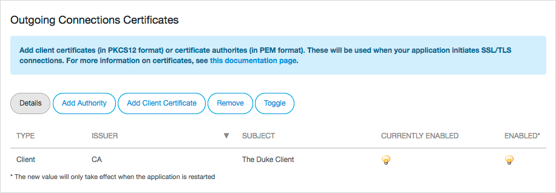
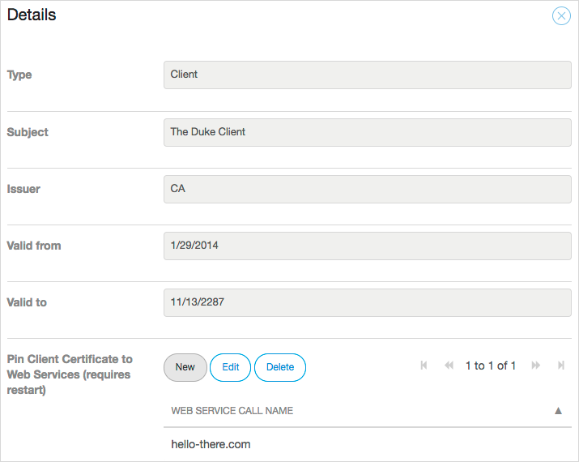

## 1 Introduction

Certificates are used to authenticate users to apps. They can be used on both incoming and outgoing connections.

### 1.1 Incoming Connections

To connect *to* your Mendix Cloud application *from* the internet, Mendix provides a *.mendixcloud.com* or *.mxapps.io* domain. The certificate for this is managed by Mendix. If you want to set up your own domain name for a licensed app, you can configure [custom domains](custom-domains). This is not available for Free Apps.

In addition, you can restrict incoming traffic by requiring client certificates signed by a certificate authority of your choice. For more details on how to set this up, see [How to Restrict Access for Incoming Requests](access-restrictions).

### 1.2 Outgoing Connections

You may need to use certificates to set up connections from your Mendix Cloud application to third-parties that require SSL/TLS. There are two possible scenarios for this:

* A third-party may require authentication via certificates (client certificates)
* A third-party may use a certificate that is signed by their own authority (certificate authorities)

## 2 Incoming – Certificates

Certificates for *.mendixcloud.com* and *.mxapps.io* are managed by Mendix and can be updated without notice.

{}
Do not pin these certificates in your solutions.
{}

For situations where pinning is required, you can set up a custom domain where you are in full control of updating the certificate.

## 3 Outgoing – Client Certificates

For client certificates, only the Public-Key Cryptography Standard #12 (PKCS12) format is supported. Certificates are uploaded as a PKCS container which includes:

* X.509 certificate
* a private key
* (optionally) a certificate chain

Virtually all certificate formats can be converted to the PKCS12 format. For more information, see the following:

*   [Create a pkcs12 (.pfx or .p12) from OpenSSL files (.pem , .cer, .crt, ...)](https://www.tbs-certificates.co.uk/FAQ/en/288.html)
*   [openssl](https://www.openssl.org/docs/manmaster/man1/openssl.html)

You can upload a PKCS12 file by following these steps:

1. In the [Developer Portal](http://home.mendix.com), go to the **Deploy** tab of the **Environments** page, and click the **Details** of the desired environment.

2. Select the **Network** tab of an application environment.

3.  Below **Outgoing Connections Certificates** click **Add Client Certificate**.

    

4. Upload the client certificate as a PKCS12 (pfx) container.

5. Enter the password to unlock the certificate container.

{}
Certificates require an app restart before they become active.
{}

## 4 Outgoing – Certificate Authorities

Loading certificate authorities works much the same way, although they do not require authentication, as these are public certificates.

To upload a certificate authority, follow these steps:

1. In the [Developer Portal](http://home.mendix.com), go to the **Deploy** tab of the **Environments** page, and click the **Details** of the desired environment.

2. Select the **Network** tab of an application environment.

3. Below **Outgoing Connections Certificates**, click **Add Authority**.

4. Upload a certificate authority in the PEM format.

If you run into any problems installing a client certificate or certificate authority, file a ticket at [https://support.mendix.com](https://support.mendix.com).

## 5 Read More

* [Transport_Layer_Security](http://en.wikipedia.org/wiki/Transport_Layer_Security)
* [How Encryption Works](http://computer.howstuffworks.com/encryption.htm)
