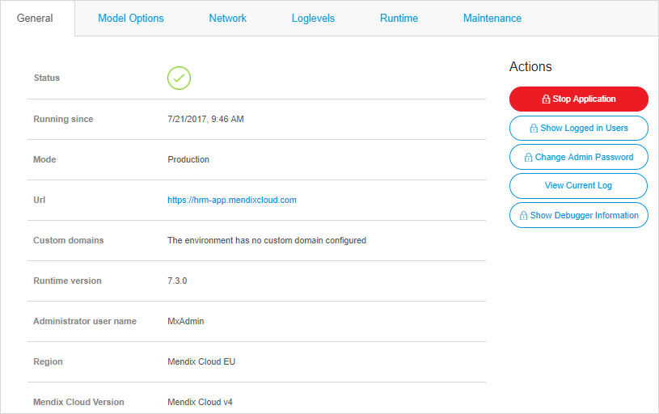

## 1 Introduction

You can manage your Mendix Cloud v3 and Mendix Cloud v4 environments via the [Developer Portal](http://home.mendix.com). There are small differences in the feature sets of Mendix Cloud v3 and v4. This document shows you how to find the Mendix Cloud version and region of your app.

**This how-to will teach you how to do the following:**

* View the Mendix Cloud version of your app
* View the Mendix Cloud region of your app

## 2 Prerequisites

Before starting this how-to, make sure you have completed the following prerequisites:

* Have a node (for details, see [How to Upgrade Your Free App to a Licensed App](how-to-upgrade-free-app))

## 3 Mendix Cloud Region and Version

To view the Mendix Cloud region and version in which your app is hosted, follow these steps:

1. Go to the [Developer Portal](http://home.mendix.com).
2. Click **Apps** in the top navigation panel.
3.  Click **My Apps** and select **Nodes**.

    

4. Open the node by clicking **Details**.
5. Click **Environments** under the **Deploy** category.
6.  Click **Details** of the desired environment.

    

7. Next to **Mendix Cloud Region**, you will see the region of the data center where your app is hosted.
8.  Next to **Mendix Cloud Version**, you will see Mendix Cloud v3 or Mendix Cloud v4.

    

## 4 Related Content

* [Application Trends in Mendix Cloud v3](/developerportal/operate/trends)
* [Application Trends in Mendix Cloud v4](/developerportal/operate/trends-v4)
* [Environment Details](environments-details)
* [How to Manage Company & App Roles](/developerportal/company-app-roles/manage-roles)
* [How to Migrate to Mendix Cloud v4](migrating-to-v4)
* [Mendix Cloud](mendix-cloud-deploy)
* [Mendix Cloud v4 - FAQ](mxcloudv4)
* [Company & App Roles](/developerportal/company-app-roles/index)
* [Technical Contact](/developerportal/company-app-roles/technical-contact)
