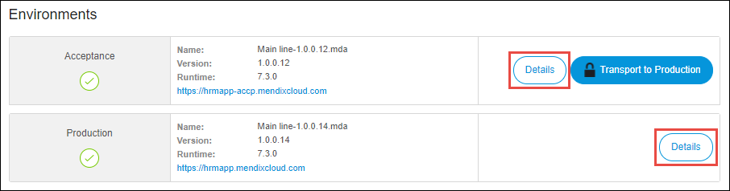

## 1 Introduction

Sometimes you need to know which Mendix Cloud version your environment is running on as there are differences in the feature sets of Mendix Cloud v3 and v4. This document shows you how to find the Mendix Cloud version and region of your app.

{}
This information is only available if you have a licensed app running in the Mendix Cloud. For more information, see [Licensing Apps](licensing-apps).
{}

## 2 Mendix Cloud Region and Version

To view the Mendix Cloud region and version in which your app is hosted, follow these steps:

1. Go to the [Developer Portal](http://home.mendix.com).

2. Click **Apps** in the top navigation panel.

3. Click **My Apps** and select **Nodes**.

    

4. Open the node by clicking **Details**.

5. Click **Environments** under the **Deploy** category.

6. Click **Details** for the desired environment.

    

7. Next to **Mendix Cloud Region**, you will see the region of the data center where your app is hosted.

8.  Next to **Mendix Cloud Version**, you will see which version of Mendix Cloud the app is deployed to: Mendix Cloud v3 or Mendix Cloud v4.

    

## 4 Related Content

* [Environment Details](environments-details)
* [How to Migrate to Mendix Cloud v4](migrating-to-v4)
* [Mendix Cloud](mendix-cloud-deploy)
* [Mendix Cloud v4 - FAQ](mxcloudv4)
