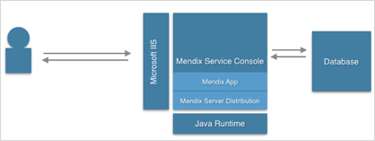

## 1 Introduction

This document describes the installation and configuration of the Mendix software on a system running Microsoft (MS) Windows. It covers:

* Installing the Mendix Service Console
* Deploying a Mendix app
* Configuring the MS Internet Information Services (IIS) server

## 2 Prerequisites {#Prerequisites}

To set up an environment to run Mendix applications, you will need to install the Mendix software. For each Mendix application that will be run, a separate user (service) account is required. This section presents an overview of the setup.



Before starting this how-to, make sure you have the following prerequisites:

* MS Windows 2008 SP2 or higher

* .NET 4.5 or higher

* IIS 7 or higher with the following service roles enabled:

    * IIS Management console

    * Static content

    * ASP.NET

* MS Application Request Routing (ARR) installed (for more information, see [Microsoft Application Request Routing](http://www.iis.net/downloads/microsoft/application-request-routing))

* Java Runtime 8, or other version depending on your Mendix Server Distribution. For example:

    * Mendix Server Distribution 4 requires Java 6

    * Mendix Server Distribution 5 requires Java 7

* The Mendix Deployment Archive (MDA) of your Mendix project

* The Mendix server distribution corresponding with your Mendix Studio Pro version (see the [Mendix App Store](https://appstore.home.mendix.com/link/modelers))

* A database with sufficient security rights

    * Suitable database servers are IBM DB2, MariaDB, MS SQL Server, MySQL, Oracle Database and PostgreSQL. See [System Requirements](/refguide/system-requirements) for more information

* A local or domain user with the *“log on as a service”* local security policy set

## 3 Installing the Mendix Service Console

To download and install the Mendix Service Console, follow these steps:

1. Download the latest version of the Mendix Service Console by following the **Related downloads** link from the [Studio Pro Download Page](https://appstore.home.mendix.com/link/modelers) of the App Store.

    

2. Install the Mendix Service Console by following the installation wizard.

3. Start the Mendix Service Console after the installation; the first time you launch the application, the **Preferences** dialog box will be shown (it will always be shown if no valid location is configured for the apps and server files).

    

4. In the **Preferences** dialog box, enter a **Location of apps and server files**. This location is used for storing your app files and Mendix server files. Mendix recommends using a directory that is:

    *   NOT on the system partition

    *   where you can easily control the security rights

    The app directory consists of four sub-directories:

    * Backup – this directory stores any database changes due to model upgrades

    * Log – this directory stores all of the application log files

    * Project – this directory contains all of your application files; within this directory you will find the directory data/files that contain all of your uploaded files

    * Service – this directory contains files for configuring the Windows Services

    In addition, there will be a file called `Settings.yaml` that contains your application configuration.

## 4 Deploying a Mendix App

To deploy a Mendix app using the Mendix Service Console, follow these steps:

1. Start the Mendix Service Console.

2. Click **Add app** to add a new app. A wizard will appear for configuring the new app.

3. Configure the **Service Settings** as follows:

    * **Service name** – this name must be unique within all existing Windows services

    * **Display name** – this is the description of the app, which is visible as a tooltip for the app in the left bar of the Mendix Service Console or as a column in the list of Windows services

    * **Description** – enter a description for the application that will be visible in the Mendix Service Console

    * **Startup type** – select whether you want the app to be started automatically when the server starts, started with a delay, started manually, or disabled altogether

    * **User name** and **Password** – the app will always run under the user account given here, and the service will be installed with this user account configured (for more information, see [Prerequisites](#Prerequisites))

4. Click **Next**.

    

5. On the **Project Files** screen, click **Select app...**.

    

6. Now select the **MDA** file that was created in Studio Pro and contains your application logic. After the installation of your MDA file, you will see which Mendix server (Mendix Runtime) version is needed.

7. Configure the **Database Settings**:

    * **Type** – the database server type

    * **Host** – the IP address or host name of the database server

    * **Name** – the database name

    * **User name** and **Password** – the database user name and password
    
8. Click **Next**.

    

9. On the **Common Configuration** screen, keep the default settings. These settings should only be changed if this is needed for your application setup.

10. Click **Finish** and start the application.

## 5 Configuring the Microsoft Internet Information Services Server

To configure the MS IIS server, follow the steps in the sections below.

### 5.1 Activating a Proxy in ARR

In order to use the proxy functionality within ARR, you need to enable this feature within IIS. To activate a proxy in ARR, follow these steps:

1. Start the IIS Manager.
2. Select the **Server** in the **Connections** pane.
3. Open the **Application Request Routing** feature.
4. Click **Server Proxy Settings** in the **Actions** pane on the right side of the screen.
5. Select **Enable proxy** and click **Apply** in the **Actions** pane.

### 5.2 Creating a Website

To create a website, follow these steps:

1. Open the IIS Manager.

2. In the **Connections** pane, right-click the **Sites** node in the tree and select **Add Web Site**.

3. In the **Add Web Site** dialog box, enter a friendly name for your web site in the **Web site name** field.

4. In the **Physical path** field, enter the physical path of your application-project-web folder (for example, *D:\Mendix\Apps\Application\Project\Web*).

5. Select the **Protocol** for the website from the **Type** list.

6. The default value in the IP address box field is **All Unassigned**. If you must specify a static IP address for the website, enter the address in the **IP address** box.

7. Enter a port number in the **Port** field.

8. Click **OK**.

### 5.3 Configuring the MIME Types

To configure the MIME types, follow these steps:

1. Open the IIS Manager and navigate to the website you want to manage.

2. In the **Features View**, double-click **MIME Types**.

3. In the **Actions** pane, click **Add**.

4. In the **Add MIME Type** dialog box, add this file type:

	* **File name extension**: *.mxf*
	* **MIME type**: *text/xml*

6. Add another MIME type:

   * **File name extension**: *.json*
   * **MIME type**: *application/json*

7. Click **OK**.

### 5.4 Configuring the URL Rewrite

{}
These instructions use port 8080, which is the default port. Please use the port your Mendix App is configured for.
{}

#### 5.4.1 Reverse Proxy Inbound Rules

You need to add a number of rules to configure the following request handlers.

Rule | Name | Pattern | Rewrite URL
:--- | :--- | :--- | :---
1 | xas | `^(xas/)(.*)` | `http://localhost:8080/{R:1}{R:2}`
2 | ws | `^(ws/)(.*)` | `http://localhost:8080/{R:1}{R:2}`
3 | ws-doc | `^(ws-doc/)(.*)` | `http://localhost:8080/{R:1}{R:2}`
4 | ws-file | `^(file)(.*)` | `http://localhost:8080/{R:1}{R:2}`
5 | link | `^(link/)(.*)` | `http://localhost:8080/{R:1}{R:2}`
6 | rest | `^(rest/)(.*)` | `http://localhost:8080/{R:1}{R:2}`
7 | rest-doc | `^(rest-doc/)(.*)` | `http://localhost:8080/{R:1}{R:2}`

Follow the instructions below and replace *[Name]* with the name of the rule in the table above, *[Pattern]* with the regular expression pattern, and *[Rewrite URL]* with the Rewrite URL. Note that some patterns contain a trailing slash, `/`, when they need to point to an exact path (for example, `/ws-doc/mydoc/1234`).

1. Open the IIS Manager and navigate to the website you want to manage.

2. In the **Features View**, double-click **URL Rewrite**.

3. In the **Actions** pane on the right side of the screen, click **Add rule(s)…** to add a new rewrite rule.

4. In the **Inbound Rules** field, enter *localhost:8080*, then click **OK**.

5. Select **ReverseProxyInboundRule1** in **Features View**.

6. In the **Actions** pane on the right side of the screen, click **Rename**.

7. Rename **ReverseProxyInboundRule1** to *[Name]*.

8. Double-click **[Name]** in **Features View** to change the properties of your rule.

9. In the **Pattern field** enter `[Pattern]`.

10. In the **Rewrite URL** field, enter `[Rewrite URL]` (in the rules above this is always `http://localhost:8080/{R:1}{R:2}`).

11. Click **Apply**.

12. Click **Back to Rules**.

13. Repeat from step 3 to add all the required rules.

You can also add additional request handlers in the same way. However you must ensure that they come *after* the rule *add x-forwarded-proto header*, described below.


#### 5.4.2 Rule *add x-forwarded-proto header*

This is required to ensure that you can access the Swagger documentation of your published REST services. It has to be the first rule; it is described last to ensure that it is moved to the top and that additional rules are not placed above it accidentally.

1. Click **View Server Variables**

2. Check if server variable **HTTP_X_FORWARDED_PROTO** is listed. If it is, skip to step 7.

3. In the **Action** page, click **Add** to add the server variable.

4. Enter the **Server variable name** *HTTP_X_FORWARDED_PROTO*.

5. Click **OK**.

6. Click **Back to Rules**

7. Click **Add rule(s)…**.

8. Click **Blank Rule**.

9. Set the **Name** to *add x-forwarded-proto header*.

10.	In the **Match URL** section, set **Requested URL** to *Matches the Pattern*.

11. Set **Using** to *Regular Expressions*.

12. Set the **pattern** to `.*`.

13. Set **Ignore Case** to *true* (checked).

14.	In the **Server Variables** section, click **Add**.

15.	Select Server variable name **HTTP_X_FORWARDED_PROTO**

16. Set **Value** to *https*.

17. Click **OK**.

18.	In the **Action** section, select **None**.

19. Set **Stop processing of subsequent rules** to *false* (unchecked).

20.	Click **Apply** in the **Action** pane to save the rule.

21. Click **Back to Rules**.

22. Select the newly created *add x-forwarded-proto header* rule and use the **Move Up** button in the Action pane to move the rule to the top of the list.

### 5.5 Disabling the Client Cache

In the application directory under **Project/Web**, you will find the `web.config` file that contains the MS IIS configuration for the application. You should add the following code to this file, between the `<system.webServer></system.webServer>` tags.
:

```xml
<staticContent>
    <clientCache cacheControlMode="DisableCache" />
</staticContent>
```

Afterwards, the contents of this file will be similar to the following example:

**web.config**

```xml
<?xml version="1.0" encoding="UTF-8"?>
<configuration>
    <system.webServer>
        <rewrite>
            <rules>
                <rule name="add x-forwarded-proto header">
                    <match url=".*" />
                    <conditions logicalGrouping="MatchAll" trackAllCaptures="false" />  <serverVariables>
                        <set name="HTTP_X_FORWARDED_PROTO" value="https" />
                    </serverVariables>
                    <action type="None" />
                </rule>
                <rule name="xas" stopProcessing="true">
                    <match url="^(xas/)(.*)" />
                    <action type="Rewrite" url="http://localhost:8080/{R:1}{R:2}" />
                </rule>
                <rule name="ws" stopProcessing="true">
                    <match url="^(ws/)(.*)" />
                    <action type="Rewrite" url="http://localhost:8080/{R:1}{R:2}" />
                </rule>
                <rule name="ws-doc" stopProcessing="true">
                    <match url="^(ws-doc/)(.*)" />
                    <action type="Rewrite" url="http://localhost:8080/{R:1}{R:2}" />
                </rule>
                <rule name="ws-file" stopProcessing="true">
                    <match url="^(file)(.*)" />
                    <action type="Rewrite" url="http://localhost:8080/{R:1}{R:2}" />
                </rule>
                <rule name="link" stopProcessing="true">
                    <match url="^(link/)(.*)" />
                    <action type="Rewrite" url="http://localhost:8080/{R:1}{R:2}" />
                </rule>
            </rules>
        </rewrite>
        <staticContent>
            <mimeMap fileExtension=".mxf" mimeType="text/xml" />
            <clientCache cacheControlMode="DisableCache" />
        </staticContent>
    </system.webServer>
</configuration>
```

## 6 Preserving the Host Header{#preserve-header}

To make sure the correct application root URL is used within your web services, you must make sure the host header contains the original host header from the client request. To make sure the host header is preserved, follow these steps.

1. Click **Start**, and then click **All Programs**.

2. Click **Accessories**, and then click **Command Prompt**.

3. Execute the following command from the command prompt:

    ```batchfile
    cd %windir%\system32\inetsrv
    ```

4. Enter:

    ```batchfile
    appcmd.exe set config -section:system.webServer/proxy /preserveHostHeader:"True" /commit:apphost
    ```

## 7 Troubleshooting

When configuring IIS it can seem like you have done everything right but it just doesn't seem to work. A guide to troubleshooting IIS is available here: [Troubleshooting IIS](troubleshooting-iis).

## 8 Read More

* [On-Premises](on-premises-design)
