## 1 Introduction

{}
This information is for deploying apps to the MindSphere platform. It does not apply to MindSphere IIoT for Makers.
{}

MindSphere is the cloud-based, open IoT operating system from Siemens that lets you connect your machines and physical infrastructure to the digital world. It lets you harness big data from billions of intelligent devices, enabling you to uncover transformational insights across your entire business.

This documentation is meant for Mendix developers who want to deploy, register and run a Mendix app on MindSphere.

{}
There are some limitations to what you can do in your Mendix app if it is deployed to MindSphere. See the [Limitations](/partners/siemens/mindsphere-development-considerations#limitations) section of *MindSphere Development Considerations* for more information.
{}

{}
You can easily copy code examples shown within grey blocks into the clipboard. Hover the cursor over the code block and click the copy button which appears.


{}

To help you with your first MindSphere apps, there is also an example app which contains modules which call the MindSphere APIs. See [How to Use the Siemens MindSphere Pump Asset Example App](/partners/siemens/mindsphere-example-app) for more information.

## 2 Prerequisites{#prerequisites}

To deploy and register your app within MindSphere you need the following prerequisites.

* A MindSphere user account on a **Developer** or a **Start for Free** tenant
* A MindSphere developer role: either `mdsp:core:Developer` or `mdsp:core:DeveloperAdmin` — these are already granted on Start for Free tenants.
* [Mendix Studio Pro](https://marketplace.mendix.com/)

The following are also required if you want to deploy and run the Mendix app on MindSphere Cloud Foundry:

* [Cloud Foundry Command Line Interface (CF CLI)](https://github.com/cloudfoundry/cli)
* A Cloud Foundry role which allows you to push apps, such as `SpaceDeveloper`

The following are also required if you want to deploy and run as a self-host app, for example an app running on Mendix Cloud:

* [Outbound Traffic Upgrade](https://www.dex.siemens.com/mindsphere/mindaccess/outbound-traffic-upgrade) — this is already included on Start for Free tenants.

## 3 Including Required MindSphere Modules

You must customize your app to allow it to be deployed, registered, and shown in the launchpad. This is done through MindSphere customization modules. There are two ways to include the customization you need in your app.

### 3.1 Option A: Using the MindSphere App Template

The **MindSphere Starter Application** in the Mendix Marketplace contains all the modules and styling which you need to create an app you want to deploy to MindSphere.

{}
This is the recommended approach if you are building a new application, as it will provide all the necessary building blocks to get started.
{}

Open Studio Pro (version 7.22.2 or above) and follow these steps:

1. Click the icon in the top-right of the menu bar to open the Mendix Marketplace.

	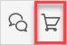

2. Enter *MindSphere* in the search box, and press <kbd>Enter</kbd>.

3. Select **MindSphere Starter Application** in the search results.

	

4. Click **Download** to create a new app using this app as the template.

	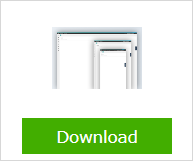

5. To start the new app, confirm where to store the app, the app name, and the app directory, then click **OK**.

	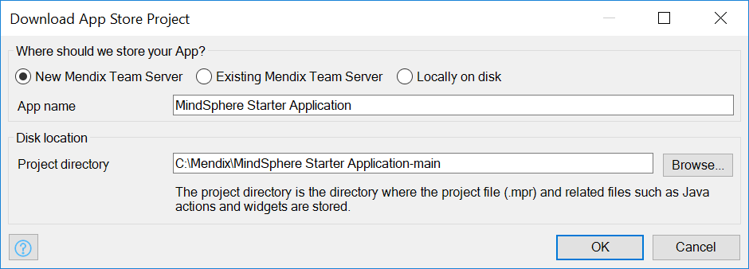

### 3.2 Option B: Customizing an Existing App{#existingapp}

If you have an existing app which was not based on the MindSphere app template, you must import the required customization. The three modules which must be imported are:

* MindSphere SSO from the Mendix Marketplace here: [Siemens MindSphere SSO](https://marketplace.mendix.com/link/component/108805/)

  This module enables users who are logged in to MindSphere to use your app without having to sign in again. It also enables you to test your app locally. For more information, see the [Single Sign-On](/partners/siemens/mindsphere-module-details#mssso) section of *MindSphere Module Details*.

* MindSphere OS Bar Connector from the Mendix Marketplace here: [Siemens MindSphere OS Bar Connector](https://marketplace.mendix.com/link/component/108804/)

  This integrates the mandatory MindSphere OS Bar with your app. For more information, see the [MindSphere OS Bar](/partners/siemens/mindsphere-module-details#msosbar) section of *MindSphere Module Details*.

* MindSphere Theme Pack (MindSphere_UI_Resources) from the Mendix Marketplace here: [Siemens MindSphere Theme Pack](https://marketplace.mendix.com/link/component/108803/)

  This applies MindSphere styling to your app and includes some additional custom files which are required for the correct operation of your app. For more information, see the [MindSphere Theme Pack](/partners/siemens/mindsphere-module-details#msthemepack) section of *MindSphere Module Details*.

## 4 Configuring the Modules{#configure-modules}

Now that you have your new app, or have imported the MindSphere modules into an existing app, you need to configure the modules to allow your app to work with MindSphere.

### 4.1 Configuring Single Sign-On (MindSphereSingleSignOn)

The following items in the MindSphereSingleSignOn module need to be configured.

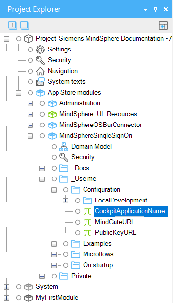

#### 4.1.1 CockpitApplicationName

Enter the name of your app as registered in the MindSphere developer portal as the value of *CockpitApplicationName*.

These two values must be identical and must, therefore, fit the constraints listed in the [App Name](/partners/siemens/mindsphere-development-considerations#appname) section of *MindSphere Development Considerations*.

#### 4.1.2 MindSphereGatewayURL

This is the URL of the MindSphere gateway and is of the following format:

```http
https://gateway.{Region}.mindsphere.io
```

This needs to be changed depending on the `{Region}` your app is running. The default value is for MindSphere running on **AWS**:

```http
https://gateway.eu1.mindsphere.io
```

If your app is running on MindSphere on **Azure** change this constant to:

```http
https://gateway.eu2.mindsphere.io
```

#### 4.1.3 PublicKeyURL

The value of this constant is shown below:

```http
https://core.piam.{Region}.eu1.mindsphere.io/token_keys
```

This needs to be changed depending on the `{Region}` your app is running. The default value is for MindSphere running on **AWS**:

```http
https://core.piam.eu1.mindsphere.io/token_keys
```

If your app is running on MindSphere on **Azure** change this constant to:

```http
https://core.piam.eu2.mindsphere.io/token_keys
```

#### 4.1.4 RegisterSingleSignOn

Add the *RegisterSingleSignOn* microflow as the **After startup** microflow or added as a sub-microflow of an existing *after startup* microflow.

{}
If you are using the MindSphere Starter Application, this will already be set up as the *After startup* microflow.
{}

If you are are modifying an existing app, you can do this on the *Runtime* tab of the **App** > **Settings* dialog box accessed through the **App Explorer**.

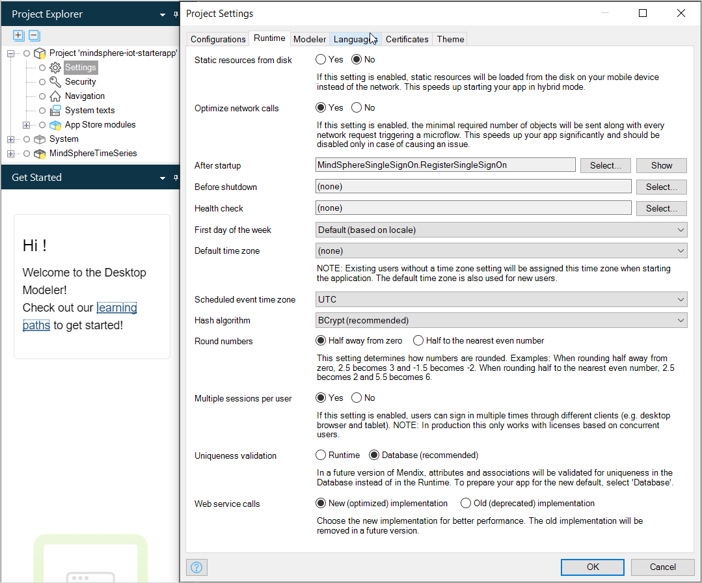

### 4.2 Configuring the MindSphere OS Bar (MindSphereOSBarConfig)

Change the OS Bar to show information about the app you are running.


This is configured as a JSON object held as the default value of the string constant **Config** in the *MindSphereOSBarConfig* module. The imported module has a correctly formatted set of example values.


Change the JSON to contain appropriate values for the following information:

* displayName – the display name of your app
* appVersion – the version number of your app
* appCopyright – app owner’s name and year of publication
* links – links to additional information about the app

More information on the structure and content of this JSON object, together with sample JSON, can be found in [App Information](https://design.mindsphere.io/osbar/get-started.html#app-information), on the MindSphere developer site.

## 5 Deploying Your App

A Mendix based application for MindSphere can be deployed to Mendix or to MindSphere. Deploying to Mendix is quite easy and is the preferred option as you than also can use the **Auto Registration** process.

{}
**Auto Registration** process is only available on region Europe 1.
{}

### 5.1 Option A: Deploy with Mendix Studio to the Mendix Cloud

Just click the Publish Button in Mendix Studio Pro.

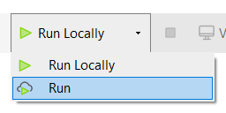

Once your app is deployed you can automatically register the app in your MindSphere tenant.

### 5.2 Option B: Creating a Mendix Deployment Package and deploy it to MindSphere Cloud Foundry

{}
There is a limit of 1.5GB on the size of the Mendix deployment package (MDA file) which can be deployed to MindSphere.
{}

#### 5.2.1 Pushing to Cloud Foundry

Before you continue, ensure you have fulfilled the prerequisites described in the section [Prerequisites](#prerequisites) and configured the MindSphere modules as described in the section [Configuring the Modules](#configure-modules), above.

##### 5.2.1.1 Creating a Mendix Deployment Package

To create a Mendix deployment package from your app, do the following:

1.  Open your app in Studio Pro.
2.  Select **App** > **Create Deployment Package**.

    {}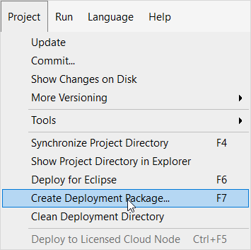{}

3.  Select the correct **Development line** and **Revision**.
4.  Set the **New version** number and add a **Description** if required.
5.  Change the path and **File name** if necessary.

Your deployment package will be created, and its location displayed in an information message.

{}
By default, the deployment package will be created in the *releases* folder of your app.
{}

##### 5.2.1.2 Deploying the Application to Cloud Foundry using CF CLI

To deploy your deployment package, do the following:

1. Sign in to MindSphere CF CLI using a one-time code:

    * Enter `cf login -a https://api.cf.{Region}.{mindsphere-domain} --sso`
    * Open the URL printed by the CLI and sign in using your WebKey credentials to get a One Time Code
    * Enter the One Time Code in the CLI

      {}If you need to configure proxies for Cloud Foundry, use the Windows `set` command. For example, `set http_proxy=http://my.proxy.ip:1234`.{}

2.  Select your org and space using the command:

    ```bash
    cf target –o {org_name} -s {space_name}
    ```

    {}If you cannot target your org or space, you probably need to be added to your org. See [Cloud Foundry How Tos](https://developer.mindsphere.io/paas/paas-cloudfoundry-howtos.html) in the MindSphere documentation.{}

3.  Create a PostgreSQL instance using the command:

    ```bash
    cf create-service postgresql10 {plan} {service_instance} [-c {parameters_as_JSON}] [-t {tags}]
    ```

    For example: `cf create-service postgresql10 postgresql-xs myapp-db`

    For more information see [Using the a9s PostgreSQL](https://developer.mindsphere.io/paas/a9s-postgresql/using.html) on the MindSphere developers site.

    {}Each Mendix app needs its own database. Do not bind more than one app to a database as both apps will not work properly. Create a new database instance instead.{}

4.  Depending on your infrastructure and service broker usage, it may take several minutes to create the service instance. Check if your PostgreSQL service has been created successfully using the following command:
    `cf services`
    Your service should be listed, and the last operation should be ‘create succeeded’.

5.  Ensure you are in the same folder as the package you wish to deploy.

6.  Create a `manifest.yml` file with at least the following content:

    ```yml
        applications:
        - name: {app_name}
          disk_quota: {disk_quota_size}
          memory: {memory_size}
        services:
          - {service_instance}
    ```

    {}`disk_quota_size` and `memory_size` must be at least **512M** to enable a Mendix app to run.<br />See the *Cloud Foundry* [App Manifest Attribute Reference](https://docs.cloudfoundry.org/devguide/deploy-apps/manifest-attributes.html) for more information on valid specifications for memory and disk quota sizes.{}

    {}Each Mendix app needs its own database. Do not bind more than one app to a database as both apps will not work properly. Create a new database instance instead.{}

    For more information on the configuration of manifest files, see [Configuring the manifest file](https://developer.mindsphere.io/howto/howto-cf-single-manifest.html#configuring-the-manifest-file) on the MindSphere developers site.

7.  Push your app to MindSphere using the command:

    ```bash
    cf push -p "{deployment_package_name}"
    ```

    For example: `cf push -p "myapp.mda"`

##### 5.2.1.3 Cloud Foundry Stack

You should always use the latest available Cloud Foundry stack. The latest stack in MindSphere is `cflinuxfs3`. Apps pushed to MindSphere will use this stack.

You can specify that your app uses a specific stack using the following command line option when you push your app:

```bash
cf push -p "{deployment_package_name}" -s {stack_name}
```

For example: `cf push -p "myapp.mda" -s cflinuxfs3`

{}
Apps pushed to MindSphere before the end of April 2019 may have used `cflinuxfs2` as the default.

If this is the case, the stack must be updated to `cflinuxfs3` as support for Cloud Foundry stack `cflinuxfs2` was removed from MindSphere in April 2019. See [Migrating applications from the cflinuxfs2 stack to the cflinuxfs3 (Bionic Beaver) stack](https://community.plm.automation.siemens.com/t5/Developer-Space/Migrating-applications-from-the-cflinuxfs2-stack-to-the/m-p/582029#M1621) in the *Siemens Developer Space* for more information.

You can find out which stack your application is using with the following command:

```bash
cf app {app_name}
```
{}

For more information about Cloud Foundry stacks on MindSphere, see [How Can I Find the Stack my App is using?](https://developer.mindsphere.io/paas/paas-cloudfoundry-howtos.html#how-can-i-find-the-stack-my-app-is-using) in *Cloud Foundry How Tos* on the *MindSphere Developer* site.

#### 5.2.1.4 Troubleshooting

If you have issues with deploying your app to Cloud Foundry, you can find additional information in [Running a Cloud Foundry-Hosted Application – for Java Developers](https://developer.mindsphere.io/howto/howto-cf-running-app.html). Note that this is not written from the point of view of a Mendix developer, so some information may not be relevant.

Ensure that you have configured your proxy settings if these are required.

### 5.3 Setting up MindSphere Launchpad{#launchpad}

You have to register your application for it to work and appear on the MindSphere Launchpad. If you have deployed your application to Mendix you can use either of the following two options (where Option A is preferred). Deployed to MindSphere, you have to register manually via the Developer Cockpit (Option B).

#### 5.3.1 Option A: Using the Auto Registration Process

{}
This method is recommended if your app is deployed to the Mendix Cloud.

However, the Auto Registration process is only available on region Europe 1.
{}

To start the **Auto Registration** process click the **View** Button in Mendix Studio Pro once your app is deployed to the Mendix Cloud. Your default browser will open and your app will start the process.


Click **Start Auto Registration**. The process now tries to figure out on which tenant your app should be registered. Therefore you have to login:

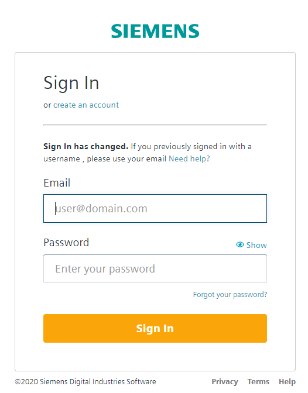

{}
If you have more then one tenant on MindSphere you will get a list of tenants. Choose the tenant where you want to register your app.

If you have only one tenant on MindSphere, the process will automatically select this tenant for you.
{}

Give a name, internal name, and, optionally, a description in order to register your app.


If you are on a **Developer** tenant you also have to select at least one application role which will be assigned to your account automatically.

On a **Start for Free** tenant the **admin** role will be assigned automatically to your account.

Click **Register** to start the registration process on your tenant. After a few seconds, a summary page is shown and you are able to navigate directly to your app.

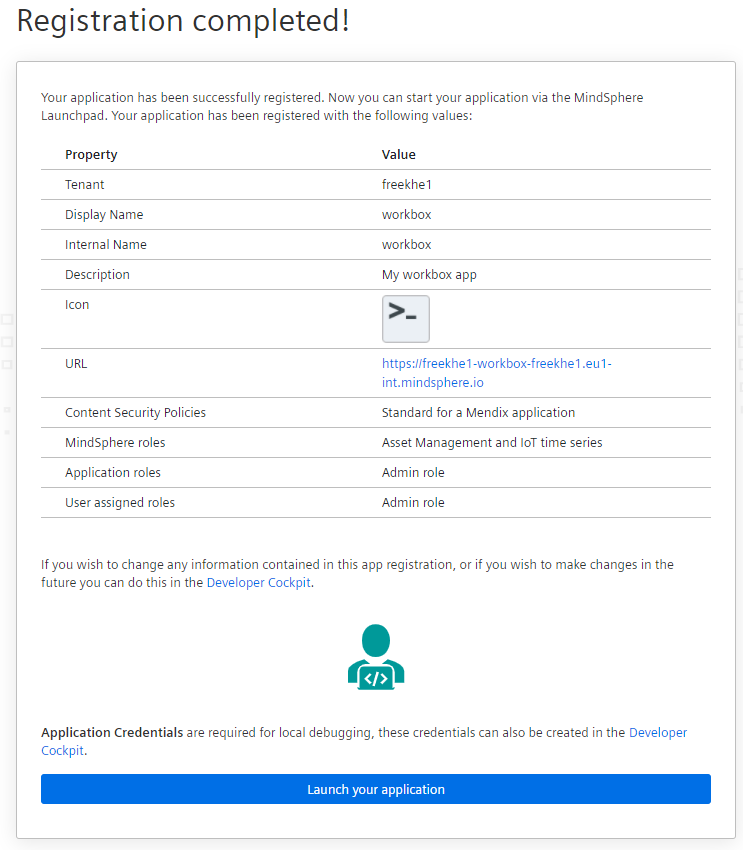

{}
The **Auto Registration** process creates application roles and scopes for your app automatically.

If you are on a **Start for Free** tenant, additional MindSphere API roles are assigned and your user is granted **admin** access to your app.

If you are on a **Developer** tenant, no additional MindSphere API roles are assigned. The granted access to your app is shown in the registration summary page.
{}

Please note, for further configuration of your registration, for example, CSPs or additional roles, please use the Developer Cockpit.

{}
You can have multiple versions of your app within the Developer Cockpit, for example, versions with different configurations or roles and scopes. 

The deployment registered via the **Auto Registration** process is *always mapped to the version created during the process*. If you want to create additional versions of your app, you can do this by manually creating a new version within the Developer Cockpit.
{}

#### 5.3.2 Option B: Configuring the Mendix App in the Developer Cockpit

##### 5.3.2.1 Creating a New Application

To create a new app manually in the MindSphere launchpad, do the following:

1.  Go to the **Developer Cockpit > Dashboard**.

2.  Click **Create new application**.

3.  Set the **Type** to *Standard*.

4.  Set the **Infrastructure** to *MindSphere Cloud Foundry*.

5. Fill in the **Display Name** of your app, as you want it shown in the Launchpad.

6.  Fill in the **Internal Name** of your app. This must be identical to the value of *CockpitApplicationName* which you set in the SSO module of your app.

7. Fill in a **Version** for your app.

8. Fill in a **Description** of your app, if required.

9. Click **Edit icon** to upload an **App Icon** for your app.

10. Fill in the **Component > Name**. This must be identical to the {app_name} you set in the *manifest.yml* file.

11.  Click the **+** next to the component to add **Endpoints**.

12.  Specify `/**` as the endpoint to allow you to access all endpoints relevant to your application, and click **Save**.

13. Fill in the **Cloud Foundry Direct URL**. This can be found using the cloud foundry command `cf app {app_name}`.

14.  Set the **Configurations > content-security-policy** *Value* to the following (hover your mouse over the text and you will be able to copy the contents to your clipboard):

      If your app is running on MindSphere on **AWS** use Region `eu1`:

      ```code
      default-src 'self' 'unsafe-inline' 'unsafe-eval' static.eu1.mindsphere.io feedback-static.mendix.com home.mendix.com;
      font-src 'self' static.eu1.mindsphere.io fonts.gstatic.com;
      script-src 'self' 'unsafe-inline' 'unsafe-eval' static.eu1.mindsphere.io feedback-static.mendix.com home.mendix.com;
      style-src 'self' 'unsafe-inline' static.eu1.mindsphere.io feedback-static.mendix.com home.mendix.com fonts.googleapis.com;
      img-src * data:;
      connect-src 'self' 'unsafe-inline'  *;
      ```
      If your app is running on MindSphere on **Azure** use Region `eu2`:

      ```code
      default-src 'self' 'unsafe-inline' 'unsafe-eval' static.eu1.mindsphere.io feedback-static.mendix.com home.mendix.com;
      font-src 'self' data: *.eu2.mindsphere.io uistorageaccountprod.blob.core.windows.net static.eu1.mindsphere.io fonts.gstatic.com;
      script-src 'self' 'unsafe-inline' 'unsafe-eval' *.eu2.mindsphere.io uistorageaccountprod.blob.core.windows.net static.eu1.mindsphere.io feedback-static.mendix.com home.mendix.com;
      style-src 'self' 'unsafe-inline' *.eu2.mindsphere.io uistorageaccountprod.blob.core.windows.net static.eu1.mindsphere.io feedback-static.mendix.com home.mendix.com fonts.googleapis.com;
      img-src 'self' static.eu1.mindsphere.io feedback-static.mendix.com home.mendix.com sprintr.home.mendix.com data: uistorageaccountprod.blob.core.windows.net;
      connect-src 'self' 'unsafe-inline' *;
      ```

      {}These content security policy (CSP) settings are needed to ensure that the MindSphere OS Bar and the [Mendix Feedback](/appstore/widgets/mendix-feedback) widget are loaded correctly. You may need to set additional CSP settings if you make additional calls to other domains (for example, if you use Google maps from maps.googleapi.com).{}

      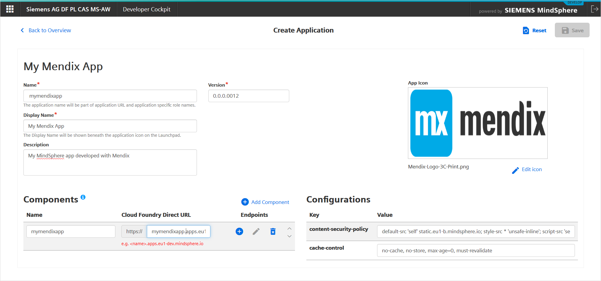

15.  Click **Save** to save these details.

16.  Click **Register** to register your app with the MindSphere launchpad.

    {}If the app has not been pushed yet, there will be no route set up for the app and you will get an error message. This will be resolved once you have pushed your app to Cloud Foundry.{}

##### 5.3.2.2 Setting Application Scopes in Developer Cockpit{#scopes}

To set up the appropriate scopes in MindSphere, do the following:

1.  Go to **Developer Cockpit > Authorization Management > App Roles** from the MindSphere launchpad.
2.  Enter the **Scope Name**.
3.  Associate it with the MindSphere default roles **USER** and/or **ADMIN**. Or associate it with one of your self created MindSphere roles. MindSphere supports up to five application roles.
4.  Click **Save**.

    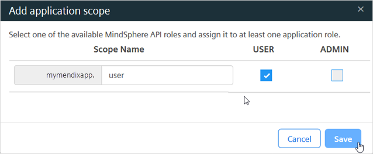

{}
If you are using the app template, you should create two scopes, *user* and *admin*.
{}

For an explanation of the relationship between Mendix roles and MindSphere roles, see section [Roles & Scopes](/partners/siemens/mindsphere-module-details#rolesscopes) in *MindSphere Module Details*.


{}
You will also need to use the **Add Core Role** option to add *Core Roles* to your app if it makes calls to MindSphere. The ones you need to add will depend on which features of MindSphere you are using.
{}

##### 5.3.2.3 Assigning User Roles

Once you have created the scopes for your app, you will need to assign them to the users who you want to have access to the app.

1.  Go to **Settings > Roles** from the MindSphere launchpad.

    {{% image_container width="50%" %}}{}

2.  Choose the app role (scope) you want to assign from the list of **Roles**.
3.  Click **Edit user assignment**.
4.  Assign **Available users** to **Assigned users** using the assignment symbols (for example `>` to assign a user).
5.  Click **Close**.

    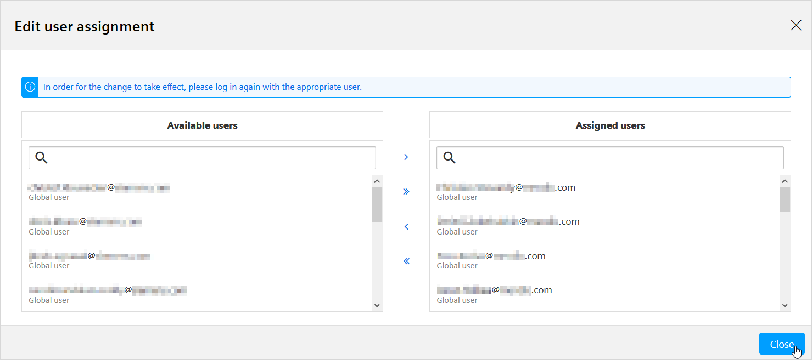

{}
The user will have to sign out and sign in again for this assignment to take effect.
{}

{}
Your app is now set up and users can run it from within the MindSphere Developer Cockpit.
{}

## 6 Development Considerations

See [MindSphere Development Considerations](/partners/siemens/mindsphere-development-considerations) for additional help on such things as:

* local testing
* multi-tenancy
* limitations
