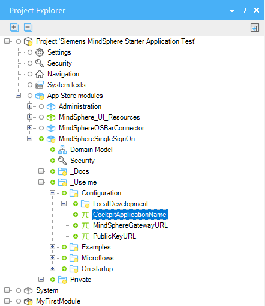

## 1 Introduction

MindSphere is the open, cloud-based IoT operating system from Siemens that lets you connect your machines and physical infrastructure to the digital world. It lets you harness big data from billions of intelligent devices, enabling you to uncover transformational insights across your entire business.

This documentation is meant for Mendix developers who want to deploy a Mendix app to the MindSphere Platform.

{}
You can create Mendix apps which make MindSphere API calls, but which are deployed to a cloud outside MindSphere. However, you will then need to handle user credentials yourself.
{}

{}
There are some limitations to what you can do in your Mendix app if it is deployed to MindSphere. See section 4, [Limitations](#limitations), for more information.
{}

To help you with your first MindSphere apps, there is also an example app which contains modules which call the MindSphere APIs. Please see [MindSphere Assets Example App](/howto/mindsphere/mindsphere-example-app) for more information.

## 2 Starter App and Theme Pack

You will need to customize your app to allow it to be deployed to MindSphere and to allow it to be registered via the MindSphere Developer Cockpit and be shown in the launchpad.

### 2.1 Obtaining MindSphere Customization

There are two ways to include the customization your need in your app.

#### 2.1.1 Use the MindSphere Starter App

The MindSphere Starter App contains all the modules and styling which you need to create an app you want to deploy to MindSphere. Choose the MindSphere starter app when creating your Mendix app.


{}
This is the recommended approach if you are building a new application, as it will provide all the necessary building blocks to get started.
{}

#### 2.1.2 Add the MindSphere Theme Pack{#themepack}

If you have an existing app which was not based on the MindSphere starter app, you can import the MindSphere Theme Pack (MindSphere_UI_Resources) from the Mendix App Store here: [MindSphere Theme Pack](https://appstore.home.mendix.com/link/app/108531/).

MindSphere_UI_Resources includes the following:

* Atlas UI theme for MindSphere apps
* updated index.html file
* new MindSphereLogin.html file
* New permission denied page (error_page/403.html)

{}
The Theme does not contain modules for SSO or the OS Bar. These modules will need to be downloaded separately.
{}

### 2.2 Single Sign-On (MindSphereSingleSignOn)

When running on MindSphere, the MindSphere user can use their MindSphere credentials to log in to your app. This is referred to as Single sign-on (SSO). To do this, you need to use the microflows and resources in the **MindSphereSingleSignOn** module. You will also need the SSO module to get a valid user context during a local test session.

The MindSphere SSO module is included in the MindSphere starter and example apps. It can also be downloaded separately here: [MindSphere SSO](https://appstore.home.mendix.com/link/app/108532/).

{}
The SSO module also requires changes to the app theme see section 2.1.2, [Add the MindSphere Theme Pack](#themepack).
{}

#### 2.2.1 Constants

The following constants in the MindSphereSingleSignOn module need to be configured.



**LocalDevelopment**

These constants are only needed for local development and testing. For details of what needs to be put into the constants in the *LocalDevelopment* folder, please see section 5.1, [Local Testing](#localtesting).

**CockpitApplicationName**

This is the name of your app as registered in the MindSphere developer portal. See [Running a Cloud Foundry-Hosted Application](https://developer.mindsphere.io/howto/howto-cf-running-app.html#configure-the-application-via-the-developer-cockpit) for more information.

**MindGateURL**

This is the base URL for all requests to MindSphere APIs. For example, the URL for MindSphere on AWS PROD is https://gateway.eu1.mindsphere.io.

**PublicKeyURL**

This is the URL where the public key can be found to enable token validation during the login process. For example, the URL for MindSphere on AWS PROD is https://core.piam.eu1.mindsphere.io/token_keys.

#### 2.2.2 Microflows

The MindSphereSingleSignOn module also provides three microflows which are used to support SSO within MindSphere and allow the user’s **tenant** and **email** to be obtained for use within the app.


**RegisterSingleSignOn**

This microflow must be added to the *Runtime* tab of the *Project > Settings* dialog, accessed through the *Project Explorer*. It needs to be selected as the *After startup* microflow or added as a sub-microflow to an existing after startup microflow.


**DS_MindSphereAccessToken**

This microflow populates the *MindSphereToken* entity.


If the access token can be retrieved from the environment, this is used. If a valid token cannot be retrieved, *and the app is running locally*, then the user is asked to sign on by providing their credentials manually. This enables the app to be tested locally, without having to be deployed to the MindSphere environment after every change.

{}
If the app cannot retrieve a valid token and is *not* running locally, then an error is returned.
{}

The Access_token attribute needs to be passed as the *Authorization* header in REST calls to MindSphere APIs.

{}
The MindSphereToken has a short time before it expires, and therefore it needs to be refreshed before each call to any MindSphere API. This is done using the *Access token* action which returns the latest MindSphereToken.
{}


**DS_MindSphereAccount**

This microflow populates the *Name* attribute of the *Tenant* entity and the *Email* attribute of the *MindSphereAccount entity from the MindSphere account details of the user.* These are extensions to the Mendix User Object which assist the creation of multi-tenant apps.


{}
If the same user logs in using a different tenant, Mendix will treat this as a different user and a User ID will be used within Mendix instead of a user name. 
{}

For advice on how to make your apps multi-tenant, see section 5.2, [Multi-tenant](#multitenant).

#### 2.2.3 Local User Passwords

Local users should not be created for your MindSphere app.

When a new user is identified during SSO, the SSO process generates a random password for the user. The password policy for your app needs to accept these randomly generated passwords. The password generation algorithm generates passwords of a fixed length, so the password policy should not be set to require more characters.

{}
This policy is set up as the default in the MindSphere starter and example apps and should not be changed.
{}

#### 2.2.4 Roles and Scopes

Using SSO, the Mendix app needs to know which roles to allocate to the user. This enables the app to know whether the user should have, for example, administrator access.

MindSphere apps have two roles: user and admin. Each MindSphere user is given one or both of these roles. As well as defining access to MindSphere core roles, these roles are also mapped to application scopes. For information on how to set up scopes in MindSphere, see section 3.2.2, [Scopes in Developer Cockpit](#scopes).

During the login process, MindSphere application scopes are mapped to Mendix roles automatically. The comparison ignores upper- and lower-case differences. If the roles match, then that Mendix role is assigned to the user.


The mapping in the starter app is:

| **MindSphere application scope** | **is mapped to Mendix User role** |
| -------------------------------- | --------------------------------- |
| {app_name}.admin                | Admin                             |
| {app_name}.user                 | User                              |

In MindSphere, these roles will look like this:


And in the Mendix example app they will be mapped to these roles:


### 2.3 MindSphere OS Bar

All MindSphere apps must have a MindSphere OS Bar. This unifies the UI of all MindSphere apps. It is used for showing the app name, routing back to the Launchpad, and logging out from MindSphere easily. Apps without the MindSphere OS Bar will not be validated for deployment to a MindSphere production environment.

You can see how the MindSphere OS Bar Integration works in [MindSphere OS Bar Integration](https://developer.mindsphere.io/resources/osbar/resources-osbar-getting-started.html#mindsphere-os-bar-integration), on the MindSphere developers website.

The MindSphereOSBarConfig module creates an endpoint which is used by the MindSphere OS Bar to provide tenant context and information about the application. The MindSphereOSBarConfig module is included in the MindSphere starter app, or can be downloaded from the Mendix App Store here: [MindSphere OS Bar Connector](https://appstore.home.mendix.com/link/app/108526/).

{}
The MindSphere OS Bar Connector also needs the MindSphere Theme Pack, or manual configuration to the index.html file in order to work. See sections 2.1.2, [Add the MindSphere Theme Pack](#themepack) and 2.4, [index.html Changes](#indexhtmlchanges).
{}

#### 2.3.1 Configuring the OS Bar

Within the OS Bar you can see information about the app you are running.


This is configured as a JSON object held in the string constant **Config** in the *MindSphereOSBarConfig* module.


The JSON should contain the following information:

* displayName – the display name of your app
* appVersion – the version number of your app
* appCopyright – app owner’s name and year of publication
* links – links to additional information about the app

More information on the structure and content of this JSON object, together with sample JSON, can be found in [App Information](https://developer.mindsphere.io/resources/osbar/resources-osbar-getting-started.html#app-information), on the MindSphere developer site.

### 2.4 index.html Changes{#indexhtmlchanges}

Three changes are required to the standard Mendix index.html file to allow integration with MindSphere. In the starter app, example app, and MindSphere UI theme pack, these have already been implemented. If you are making the app from a different starter app you can make these changes manually. See section 6.1, [index.html](#indexhtml), for details of the changes you need to make.

The changes required are to support:

* OS Bar – the MindSphere bar needs to be supported by your app
* XSRF – MindSphere needs to receive an XSRF token to work with your app
* SSO login – the login process needs to be adjusted to support Single Sign-on

The index.html file can be found in the /theme folder of your project app.

### 2.5 MindSphereLogin.html

As well as changes to the index.html file, SSO for MindSphere also requires a different login HTML file. This is called MindSphereLogin.html and can also be found in the /theme folder of your project app.

If this file is not in your /theme folder, you can create it following the instructions in section 6.2, MindSphereLogin.html, or by importing the MindSphere_UI_Resources theme pack.

### 2.6 Permission denied page

The permission denied page will be shown if your app will be called with an invalid token or a token which does not include the value you have specified within the SSO constant ‘CockpitApplicationName’. The SSO module expects to find this file as error_page/403.html within your ‘Theme’ folder.


## 3 Deploying your app to MindSphere

### 3.1 Push to Cloud Foundry

#### 3.1.1 Prerequisites

To deploy your app to MindSphere you need the following prerequisites.

* MindSphere user account on a developer tenant
* Cloud Foundry Command Line Interface (CF CLI) – this should be downloaded from [https://github.com/cloudfoundry/cli](https://github.com/cloudfoundry/cli)
* A Cloud Foundry role which allows you to push applications, such as **SpaceDeveloper**; help in setting up Cloud Foundry users can be found in the MindSphere [Cloud Foundry How Tos](https://developer.mindsphere.io/paas/paas-cloudfoundry-howtos.html)
* A MindSphere developer role: either **mdsp:core:Developer** or **mdsp:core:DeveloperAdmin**

#### 3.1.2 Create a Mendix Deployment Package

To create a Mendix deployment package from your app, do the following.

1.  Open your app in the desktop modeler.
2.  Select **Project** > **Create Deployment Package...**.

    

3.  Select the correct **Development line** and **Revision**.
4.  Set the **New version** number and add a **Description** if required.
5.  Change the path and **File name** if necessary.

Your deployment package will be created, and its location displayed in an information message.

{}
By default, the deployment package will be created in the *releases* folder of your project.
{}

#### 3.1.3 Deploying the Application to Cloud Foundry using CF CLI

1.  Log in into MindSphere CF CLI using a one-time code as described in [Running a Cloud Foundry-Hosted Application - for Java Developers](https://developer.mindsphere.io/howto/howto-cf-running-app.html).
2.  Select your org and space using the command:  
    `cf target –o {org_name} -s {space_name}`
3.  Ensure you are in the same folder as the package you wish to deploy.
4.  Push your app to MindSphere using the command:  
    `cf push {app_name} -p "{deployment_package_name}" -m 512MB`

{}
Your application will not be pushed successfully yet. You still need to bind your app to a PostgreSQL instance as described in the next steps.
{}

5.  Create a PostgreSQL instance using the command:

    `cf create-service postgresql10 {plan} {service_instance} [-c {parameters_as_JSON}] [-t {tags}]`

    For example: `cf create-service postgresql10 postgresql-xs myapp-db`  

    For more information see [Using the a9s PostgreSQL](https://developer.mindsphere.io/paas/a9s-postgresql/using.html) on the MindSphere developers site.
6.  Depending on your infrastructure and service broker usage, it may take several minutes to create the service instance. Check if your PostgreSQL service has been created successfully using the following command:  
    `cf services`  
    Your service should be listed, and the last operation should be ‘create succeeded’.
7.  Bind your app to your PostgreSQL service using the command  
    `cf bind-service {app_name} {service_name}`
8.  Restage your app using the command:  
    `cf restage {app_name}`

#### 3.1.4 Creating an App Manifest

If you want to forward this application to an operator later, you will need a proper manifest.yml file.

1.  Log in to your CF CLI with the correct organization and space.
2.  Use the command  
    `cf create-app-manifest {app_name}`

#### 3.1.5 Troubleshooting

If you have issues with deploying your app to Cloud Foundry, you may find additional information in [Running a Cloud Foundry-Hosted Application - for Java Developers](https://developer.mindsphere.io/howto/howto-cf-running-app.html). Note that this is not written from the point of view of a Mendix developer, so some information may not be relevant.

Ensure that you have configured your proxy settings if these are required.

### 3.2 MindSphere Launchpad Setup{#launchpad}

#### 3.2.1 Create New Application

To create a new app in the MindSphere launchpad, do the following:

1.  Go to the **Developer Cockpit > Dashboard**.
2.  Click **Create new application**.
3.  Fill in the details of your app. 
4.  Click the **+** next to the component to add **Endpoints**.
5.  Specify `/**` as the endpoint to allow you to access all endpoints relevant to your application.
6.  Set the **content-security-policy** settings to the following  
    `default-src 'self' 'unsafe-inline' 'unsafe-eval' static.eu1.mindsphere.io sprintr.home.mendix.com; font-src 'self' static.eu1.mindsphere.io fonts.gstatic.com; style-src * 'unsafe-inline'; script-src 'self' 'unsafe-inline' 'unsafe-eval' static.eu1.mindsphere.io sprintr.home.mendix.com; img-src * data:;`

    {}These content security policy settings are needed to ensure that the MindSphere OS Bar and the Mendix *Feedback* widget are loaded correctly. You may need to set additional CSP settings if you make additional calls to other domains (for example, if you use Google maps from maps.googleapi.com).{}

7.  Click **Save** to save these details.
8.  Click **Register** to register your app with the MindSphere launchpad.

    {}If the app has not been pushed yet, there will be no route set up for the app and you will get an error message. This will be resolved once you have pushed your app to Cloud Foundry{}

#### 3.2.2 Scopes in Developer Cockpit{#scopes}

To set up the appropriate scopes in MindSphere, do the following:

1.  Go to **Developer Cockpit > Authorization Management > App Roles** from the MindSphere launchpad.
2.  Enter the **Scope Name**.
3.  Associate it with the MindSphere roles **USER** and/or **ADMIN**.
4.  Click **Save**.

    

If you are using the starter app, you should create two roles, *user* and *admin*.


### 3.2 User Roles

Once you have created the scopes for your app, you will need to assign them to the users who you want to have access to the app.

1.  Go to **Settings > Roles** from the MindSphere launchpad.

    

2.  Choose the app role (scope) you want to assign from the list of **Roles**.
3.  Click **Edit user assignment**.
4.  Assign **Available users** to **Assigned users** using the assignment symbols (for example **>** to assign a user).
5.  Click **Close**.

    

{}
The user will have to log out and log in again for this assignment to take effect.
{}

## 4 Limitations{#limitations}

The following limitations apply to Mendix apps which are deployed to MindSphere.

If these limitations affect the design of your app, you can still create a Mendix app to use MindSphere APIs from outside MindSphere.

### 4.1 Binary File Storage

MindSphere does not currently have a compatible file service available to its Cloud Foundry stack. Therefore, you cannot use any Mendix features which rely on having a file service.

In particular, this means that you cannot use entities which are specializations of the *System.FileDocument* entity. This also includes all entities which are specializations of the *System.Image* entity, as this is also a specialized type of FileDocument.

You can store small amounts of binary information in persistable entities. However, the database management system (DBMS) will have strict limits on the size of binary attributes and using them as a replacement for FileDocument entities can lead to performance issues.

### 4.2 App Name

There are no limitations on what you call your app within Mendix. However, when you deploy the app to MindSphere, the app name registered in the Developer Cockpit must have the following characteristics:

* lowercase letters and numbers only
* starting with a letter
* maximum length, 20 characters
* must be a unique name within your tenant

If you want to keep your names consistent, you should bear these constraints in mind when naming your Mendix app.

### 4.3 Roles and Scopes

At present, MindSphere only supports two roles. This should be taken into account when designing security within your Mendix app.

It is recommended that you create two scopes for your MindSphere app, **user** and **admin** which will map to identically-named user roles in your Mendix app.

### 4.4 Logout from MindSphere

If the user logs out from MindSphere, the Mendix app will not delete the session cookie.


{}
In some circumstances, this could lead to another user *using the same app on the same browser on the same computer*, picking up the session from the previous user if the cookie has not yet expired.
{}

### 4.5 Cloud Services Platform 

Mendix apps can currently only be deployed to MindSphere running on AWS (Amazon Web Services). They cannot currently be deployed to MindSphere running on Microsoft Azure.

## 5 Development Considerations

### 5.1 Local Testing{#localtesting}

#### 5.1.1 Credentials 

When you run your app locally, you will not be able to use SSO to get your credentials. You will be logged on as MxAdmin and will be presented with a login screen the first time that your app attempts to retrieve your access token.


This will use the credentials you have set up under **App Credentials** in the *Authorization Management* tab of the MindSphere Developer Cockpit for this application.

To create the app credentials:

1.  Register this application using the identical application name as that set in the constant **CockpitApplicationName**. See section 3.2, [MindSphere Launchpad Setup](#launchpad).
2.  Go to the **App Credentials** page in the *Authorization Management* tab of the MindSphere Developer Cockpit.
3.  Click **Issue access** to obtain a token.

    

4.  Select the access level and click **Submit**

    

5.  Make a note of the **Client ID** and **Client Secret**

    

For more information about creating app credentials, see the documentation on the MindSphere website here: [Self-Hosted Application – Access MindSphere APIs](https://developer.mindsphere.io/howto/howto-selfhosted-api-access.html).

To ensure that the correct application credentials are requested, you have to set the following constants in the **LocalDevelopment** folder of the **MindSphereSingleSignOn** module in addition to the other configuration constants.


**CockpitApplicationVersion**

This is a valid version of the MindSphere app as registered in the Developer Cockpit under the name *CockpitApplicationName*.

**HostTenant**

This should be the tenant where your credentials are stored. It is needed when retrieving your Service Credentials. The **Tenant name** is available from the menu bar in the MindSphere launchpad.


The definition of a tenant on MindSphere is available in the MindSphere document [Definition of Tenant](https://documentation.mindsphere.io/resources/html/settings/en-US/118273564939.html).

**UserTenant**

This should be the tenant that the user has access to in a multi-tenant environment. For a developer tenant, this must be the same as the HostTenant. In an operator or iot plan tenant, you can Change this to allow you to test multi-tenant apps.

#### 5.1.2 User Roles

If you are testing different roles in your app, do not use the demo users. If you switch between demo users, this will not correctly populate the tenant and role information from MindSphere. To test different roles, allocate the role to MxAdmin, redeploy, and log in again.

### 5.2 Multi-tenant{#multitenant}

In MindSphere, apps are usually designed to be multi-tenant, meaning that a single instance of the app serves multiple tenants. A tenant is a representation of a real-world organization. It groups users, data, assets, entities, and many kinds of other properties. Access to these resources for users of the same tenant is controlled via the authorization management system.

For a MindSphere app to be multi-tenant, each user can only see the data from a single tenant, defined by their login credentials, and cannot access resources of other tenants.

#### 5.2.1 Control through MindSphere APIs

The Authorization HTTP Header (see DS_MindSphereAccessToken in section 2.2.2, Microflows) which is passed for every MindSphere API call ensures that the user can only obtain data which is authorized to them via their tenant.

#### 5.2.2 Control within a Mendix app

If no security is placed on persistent Mendix entity objects, these are accessible to all users of the app (subject to access granted by their user role). This means that any app which stores data in persistent Mendix entities cannot be made multi-tenant without additional security.

MindSphere SSO provides the user’s tenant as the **Name** attribute in the **Tenant** entity.


By utilizing this value when an entity is accessed, the Mendix app can be made multi-tenant.

{}
It is not possible, currently, to generate these access restrictions automatically.

The developer will have to add a rule every time the entity is accessed. See the instructions below.
{}

{}
It is not necessary to put an access rule on every entity within the domain model. It is only required for: **persistent** entities which have a **TenantId** attribute.
{}

To make your Mendix app multi-tenant, do the following:

1.  Make all *permanent* entities which have a **TenantId** attribute a specialization of the MindSphereSingleSignOn.TenantObject entity.  
    This ensures that every object is associated with the Tenant object of the user who creates it.
2.  Every action on this object must have the following XPath constraint:  
    [MindSphereSingleSignOn.TenantObject_Tenant/MindSphereSingleSignOn.Tenant/MindSphereSingleSignOn.MindSphereAccount_Tenant='[%CurrentUser%]']  
    This ensures that the user can only retrieve entities which belong to their tenant, in other words, where their Tenant matches the TenantId of the entity. You can copy and paste this constraint from here. You can also copy it from XPath constraint on the *TenantObject* entity in the *MindSphereSingleSignOn* module. For more information on XPath, see [XPath](/refguide/xpath).

{}
For consistency, it is recommended that all access to these entities is done through a sub-microflow which contains the XPath constraint. This enforces multi-tenant security.
{}

**Example**

You have some limits which are set for the user's tenant to be applied to a time series. You then want to get a list of all these so that you can display the values to the user.

1.  Create the domain model with the **Limit** entity being a specialization of **MindSphereSingleSignOn.TenantObject**.

    

2.  Write a sub-microflow which returns a list of all limits.
3.  Apply the XPath constraint to the **Retrieve Objects** action.

    

4.  When you want to retrieve the list of limits, call this microflow instead of using the retrieve objects action. This will ensure that tenant-based security is applied.

### 5.3 Cloud Foundry Environment variables

If you need to set or change the value of any Cloud Foundry Environment Variables, you will have to do this using the CF CLI.

1.  Use `cf set-env {app_name} {environment_variable_name} {value}`
2.  You will need to restart the app to use the new value.  
    Use `cf restart {app_name}`

{}
Restarting your app will cause your app to be temporarily unavailable.
{}

### 5.4 Validation

Your app should, as a minimum, meet the requirements of the checklist on the MindSphere developer site here: [Get your Application Ready for Productive Use](https://developer.mindsphere.io/howto/howto-app-publication.html).

## 6 Appendices

### 6.1 index.html{#indexhtml}

Various changes need to be made to the standard Mendix index.html file to ensure compatibility with MindSphere.

The index.html file is located in the /theme folder of your app project.

If you use the MindSphere starter or example apps, or the Mendix MindSphere theme, then these changes will already have been made.

#### 6.1.1 OS Bar

For the OS Bar to work correctly in your Mendix app, the following script has to be added within the `<head> tags of index.html.
```javascript
<script>
// MindSphere specific part-1: OS Bar related code
(function(d1, script1) {
  script1 = d1.createElement('script');
  script1.type = 'text/javascript';
  script1.async = true;
  script1.onload = function() {
    _mdsp.init({
      appId : 'content',
      appInfoPath : "/rest/os-bar/v1/config",
      initialize : true
    });

// make sure that the mxui.js is loaded after osbar/v4/js/main.min.js to prevent problems with the height calculation of some elements

    (function(d2, script2) {
      script2 = d2.createElement('script');
      script2.src = 'mxclientsystem/mxui/mxui.js?{{cachebust}}';
      script2.async = true;
      d2.getElementsByTagName('body')[0].appendChild(script2);
    }(document));
  };
  script1.src = 'https://static.eu1.mindsphere.io/osbar/v4/js/main.min.js';
  d1.getElementsByTagName('head')[0].appendChild(script1);
}(document));
// MindSphere specific part-1: ends
</script>
```

#### 6.1.2 SSO

To allow SSO, the usual login.html needs to be replaced with a different file (MindSphereLogin.html).

Replace the following lines:
```javascript
if (\!document.cookie || \!document.cookie.match(/(^|;)originURI=/gi))
document.cookie = "originURI=/login.html";
```
with these lines:
```javascript
if (\!document.cookie || \!document.cookie.match(/(^|;)originURI=/gi))
document.cookie = "originURI=/MindSphereLogin.html";
```

{}
If MindSphereLogin.html does not exist in your /theme folder, you will have to create it. See section 6.2, [MindSphereLogin.html](#mindspherelogin).
{}

#### 6.1.3 XSRF

In index.html, before the before the line `<script src="mxclientsystem/mxui/mxui.js?{{cachebust}}"></script>`, the following script needs to be included in the file.
```javascript
<script>
// MindSphere specific part-2: We have to use the XSRF-TOKEN on fetch requests.
// This script should placed before "mxui.js" as this script makes the fetch requests
(function() {
// Read cookie below
function getCookie(name) {
  match = document.cookie.match(new RegExp('(^| )' + name + '=([^;]+)'));
  if (match) return match[2]; else return "";
  }
  var xrsfToken = getCookie("XSRF-TOKEN");
  if (window.fetch) {
    var originalFetch = window.fetch;
    window.fetch = function(url, init) {
      if (\!init) {
        init = {};
      }
      if (\!init.headers) {
        init.headers = new Headers();
      }
      init.headers.set("x-xsrf-token", xrsfToken);
      return originalFetch(url, init);
    }
  }
  var originalXMLHttpRequest = window.XMLHttpRequest;
  window.XMLHttpRequest = function() {
    var result = new originalXMLHttpRequest(arguments);
    result.open = function() {
      originalXMLHttpRequest.prototype.open.apply(this, arguments);
      this.setRequestHeader("x-xsrf-token", xrsfToken);
    }
   return result;
  };
})();
// MindSphere specific part-2: ends
</script>
```
### 6.2 MindSphereLogin.html{#mindspherelogin}

The MindSphereLogin.html file should have the following content.
```html
<\!doctype html>
<html>
<head>
<title>MindSphereLogin</title>
<script>
window.location.assign("/sso/")
</script>
</head>
</html>
```