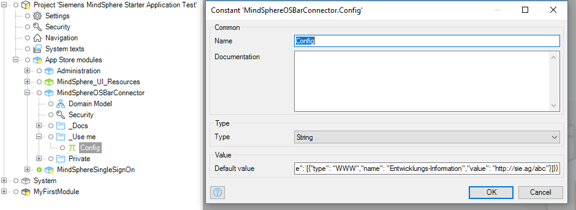
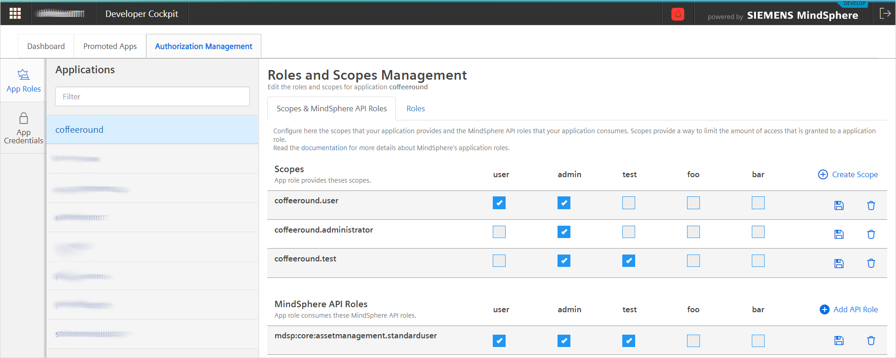

## 1 Introduction

MindSphere is the cloud-based, open IoT operating system from Siemens that lets you connect your machines and physical infrastructure to the digital world. It lets you harness big data from billions of intelligent devices, enabling you to uncover transformational insights across your entire business.

This documentation is meant for Mendix developers who want to deploy a Mendix app to the MindSphere Platform.

{}
You can create Mendix apps which make MindSphere API calls, but which are deployed to a cloud outside MindSphere. However, you will then need to handle user credentials yourself.
{}

{}
There are some limitations to what you can do in your Mendix app if it is deployed to MindSphere. See the [Limitations](/refguide/mindsphere/mindsphere-development-considerations#limitations) section of *MindSphere Development Considerations* for more information.
{}

{}
You can easily copy code examples shown within grey blocks into the clipboard. Hover the cursor over the code block and click the copy icon at its top right.


{}

To help you with your first MindSphere apps, there is also an example app which contains modules which call the MindSphere APIs. Please see [How to Use the Siemens MindSphere Pump Asset Example App](/howto/mindsphere/mindsphere-example-app) for more information.

## 2 Prerequisites{#prerequisites}

To deploy your app to MindSphere you need the following prerequisites.

* A MindSphere user account on a developer tenant
* The Cloud Foundry Command Line Interface (CF CLI) – this can be downloaded from [https://github.com/cloudfoundry/cli](https://github.com/cloudfoundry/cli)
* A Cloud Foundry role which allows you to push applications, such as `SpaceDeveloper` (help in setting up Cloud Foundry users can be found in the MindSphere [Cloud Foundry How Tos](https://developer.mindsphere.io/paas/paas-cloudfoundry-howtos.html))
* A MindSphere developer role: either `mdsp:core:Developer` or `mdsp:core:DeveloperAdmin`

## 3 Including Required MindSphere Modules

You must customize your app to allow it to be deployed to MindSphere, allow it to be registered via the MindSphere Developer Cockpit, and be shown in the launchpad. This is done through MindSphere customization modules. There are two ways to include the customization you need in your app.

### 3.1 Using the MindSphere Starter App

The **MindSphere Starter Application** in the Mendix App Store contains all the modules and styling which you need to create an app you want to deploy to MindSphere.

{}
This is the recommended approach if you are building a new application, as it will provide all the necessary building blocks to get started.
{}

Open the Desktop Modeler (version 7.22.2 or above) and follow these steps:

1. Click the icon in the top-right of the menu bar to open the Mendix App Store:

	

2. Enter *MindSphere* in the search box, and press <kbd>Enter</kbd>.

3. Select **MindSphere Starter Application** in the search results:

	
  
4. Click **Download** to create a new app project using this app:

	
  
5. To start the new app project, confirm where to store the app, the app name, and the project directory, then click **OK**:

	

### 3.2 Customizing an Existing App{#existingapp}

If you have an existing app which was not based on the MindSphere starter app, you must import the required customization. The three modules which must be imported are:

* MindSphere SSO from the Mendix App Store here: [Siemens MindSphere SSO](https://appstore.home.mendix.com/link/app/108805/).

  This module enables users who are logged in to MindSphere to use your app without having to log in again. It also enables you to test your app locally. For more information, see the [Single Sign-On](#mssso) section, below.

* MindSphere OS Bar Connector from the Mendix App Store here: [Siemens MindSphere OS Bar Connector](https://appstore.home.mendix.com/link/app/108804/).

  This integrates the mandatory MindSphere OS Bar with your app. For more information, see the [MindSphere OS Bar](#msosbar) section, below.

* MindSphere Theme Pack (MindSphere_UI_Resources) from the Mendix App Store here: [Siemens MindSphere Theme Pack](https://appstore.home.mendix.com/link/app/108803/).

  This applies MindSphere styling to your app and includes some additional custom files which are required for the correct operation of your app. For more information, see the [MindSphere Theme Pack](#msthemepack) section, below.

## 4 Configuring the Modules

Now that you have your new app, or have imported the MindSphere modules into an existing app, you need to configure the modules to allow your app to work with MindSphere.

### 4.1 Configuring Single Sign-On (MindSphereSingleSignOn)

The following items in the MindSphereSingleSignOn module need to be configured.


#### 4.1.1 CockpitApplicationName

This must be identical to the name of your app as registered in the MindSphere developer portal. It must, therefore, fit the constraints listed in [App Name](#appname), below.

[//]: # (MindGateURL and PublicKeyURL do not need to be changed until there are more MindSphere environments)

#### 4.1.2 RegisterSingleSignOn

This microflow must be added as the *After startup* microflow or added as a sub-microflow to an existing after startup microflow.

{}
If you are using the MindSphere Starter Application, this will already be set up as the *After startup* microflow.
{}

If you are are modifying an existing app, you can do this on the *Runtime* tab of the *Project > Settings* dialog, accessed through the *Project Explorer*.


### 4.2 Configuring the MindSphere OS Bar (MindSphereOSBarConfig)

The OS Bar shows information about the app you are running.


This is configured as a JSON object held as the default value of the string constant **Config** in the *MindSphereOSBarConfig* module. The imported module has a correctly formatted set of example values.



Change the JSON to contain appropriate values for the following information:

* displayName – the display name of your app
* appVersion – the version number of your app
* appCopyright – app owner’s name and year of publication
* links – links to additional information about the app

More information on the structure and content of this JSON object, together with sample JSON, can be found in [App Information](https://developer.mindsphere.io/resources/osbar/resources-osbar-getting-started.html#app-information), on the MindSphere developer site.

## 5 Deploying Your App to MindSphere

### 5.1 Pushing to Cloud Foundry

Before you continue, ensure you have fulfilled the prerequisites described in the section [prerequisites](#prerequisites), above.

#### 5.1.1 Creating a Mendix Deployment Package

To create a Mendix deployment package from your app, do the following.

1.  Open your app in the desktop modeler.
2.  Select **Project** > **Create Deployment Package...**.

    {}{}

3.  Select the correct **Development line** and **Revision**.
4.  Set the **New version** number and add a **Description** if required.
5.  Change the path and **File name** if necessary.

Your deployment package will be created, and its location displayed in an information message.

{}
By default, the deployment package will be created in the *releases* folder of your project.
{}

#### 5.1.2 Deploying the Application to Cloud Foundry using CF CLI

1. Log in into MindSphere CF CLI using a one-time code as described in [Running a Cloud Foundry-Hosted Application – for Java Developers](https://developer.mindsphere.io/howto/howto-cf-running-app.html) in the MindSphere documentation.

    {}If you need to configure proxies for Cloud Foundry, use the Windows `set` command. For example, `set http_proxy=http://my.proxy.ip:1234`.{}

2.  Select your org and space using the command:

    ```bash
    cf target –o {org_name} -s {space_name}
    ```

    {}If you cannot target your org or space, you need to be added to your org. See [Cloud Foundry How Tos](https://developer.mindsphere.io/paas/paas-cloudfoundry-howtos.html) in the MindSphere documentation.{}

3.  Create a PostgreSQL instance using the command:

    ```bash
    cf create-service postgresql10 {plan} {service_instance} [-c {parameters_as_JSON}] [-t {tags}]
    ```

    For example: `cf create-service postgresql10 postgresql-xs myapp-db`  

    For more information see [Using the a9s PostgreSQL](https://developer.mindsphere.io/paas/a9s-postgresql/using.html) on the MindSphere developers site.

4.  Ensure you are in the same folder as the package you wish to deploy.

5.  Depending on your infrastructure and service broker usage, it may take several minutes to create the service instance. Check if your PostgreSQL service has been created successfully using the following command:  
    `cf services`  
    Your service should be listed, and the last operation should be ‘create succeeded’.

6. Create a `manifest.yml` file with at least the following content:

    ```yml
    applications:
    - name: {app_name}
      disk_quota: 512M
      memory: 512M
    services:
      - {service_instance}
    ```

    For more information on the configuration of manifest files, see [Configuring the manifest file](https://developer.mindsphere.io/howto/howto-cf-single-manifest.html#configuring-the-manifest-file) on the MindSphere developers site.

7.  Push your app to MindSphere using the command:

    ```bash
    cf push {app_name} -p "{deployment_package_name}" -m {required_memory}
    ```

    For example: `cf push myapp -p "myapp.mda" -m 512MB`

#### 5.1.3 Troubleshooting

If you have issues with deploying your app to Cloud Foundry, you can find additional information in [Running a Cloud Foundry-Hosted Application – for Java Developers](https://developer.mindsphere.io/howto/howto-cf-running-app.html). Note that this is not written from the point of view of a Mendix developer, so some information may not be relevant.

Ensure that you have configured your proxy settings if these are required.

### 5.2 Setting up MindSphere Launchpad{#launchpad}

#### 5.2.1 Creating a New Application

To create a new app in the MindSphere launchpad, do the following:

1.  Go to the **Developer Cockpit > Dashboard**.
2.  Click **Create new application**.
3.  Fill in the **Name** of your app. This must be identical to the value of *CockpitApplicationName* which you set in the SSO module of your app.
4. Fill in the **Display Name** of your app, as you want it shown in the Launchpad.
5. Fill in a **Description** of your app, if required.
6. Fill in a **Version** for your app.
7. Upload an **App Icon** for your app.
8. Fill in the **Component > Name**. This must be identical to the {app_name} you set in the *manifest.yml* file.
9.  Click the **+** next to the component to add **Endpoints**.
10.  Specify `/**` as the endpoint to allow you to access all endpoints relevant to your application, and click **Save**.

11. Fill in the **Cloud Foundry Direct URL**. This can be found using the cloud foundry command `cf app {app_name}`.

12.  Set the **Configurations > content-security-policy** *Value* to the following:

      ```http
      default-src 'self' 'unsafe-inline' 'unsafe-eval' static.eu1.mindsphere.io sprintr.home.mendix.com; font-src 'self' static.eu1.mindsphere.io fonts.gstatic.com; style-src * 'unsafe-inline'; script-src 'self' 'unsafe-inline' 'unsafe-eval' static.eu1.mindsphere.io sprintr.home.mendix.com; img-src * data:;
      ```

      {}These content security policy settings are needed to ensure that the MindSphere OS Bar and the [Mendix Feedback Widget](https://appstore.home.mendix.com/link/app/199/) are loaded correctly. You may need to set additional CSP settings if you make additional calls to other domains (for example, if you use Google maps from maps.googleapi.com).{}

      

13.  Click **Save** to save these details.
14.  Click **Register** to register your app with the MindSphere launchpad.

    {}If the app has not been pushed yet, there will be no route set up for the app and you will get an error message. This will be resolved once you have pushed your app to Cloud Foundry{}
    
#### 5.2.2 Setting Application Scopes in Developer Cockpit{#scopes}

To set up the appropriate scopes in MindSphere, do the following:

1.  Go to **Developer Cockpit > Authorization Management > App Roles** from the MindSphere launchpad.
2.  Enter the **Scope Name**.
3.  Associate it with the MindSphere roles **USER** and/or **ADMIN**.
4.  Click **Save**.

    

If you are using the starter app, you should create two roles, *user* and *admin*.



#### 5.2.3 Assigning User Roles

Once you have created the scopes for your app, you will need to assign them to the users who you want to have access to the app.

1.  Go to **Settings > Roles** from the MindSphere launchpad.

    {{% image_container width="50%" %}}{}

2.  Choose the app role (scope) you want to assign from the list of **Roles**.
3.  Click **Edit user assignment**.
4.  Assign **Available users** to **Assigned users** using the assignment symbols (for example `>` to assign a user).
5.  Click **Close**.

    

{}
The user will have to log out and log in again for this assignment to take effect.
{}

## 6 The Modules

This section contains more information about the MindSphere modules and what they are used for.

### 6.1 Single Sign-On (MindSphereSingleSignOn){#mssso}

When running on MindSphere, the MindSphere user can use their MindSphere credentials to log in to your app. This is referred to as Single sign-on (SSO). To do this, you need to use the microflows and resources in the **MindSphereSingleSignOn** module. You will also need the SSO module to get a valid user context during a local test session.

The MindSphere SSO module is included in the MindSphere starter and example apps. It can also be downloaded separately here: [MindSphere SSO](https://appstore.home.mendix.com/link/app/108805/).

{}
The SSO module also requires changes to the app theme see section 2.1.2, [Customizing an Existing App](#existingapp) section.

Please ensure that you download the latest version of the [Theme Pack](#msthemepack) module when you download the SSO module.
{}

#### 6.1.1 Constants


**CockpitApplicationName**

This is the name of your app as registered in the MindSphere developer portal. See [Running a Cloud Foundry-Hosted Application](https://developer.mindsphere.io/howto/howto-cf-running-app.html#configure-the-application-via-the-developer-cockpit) for more information.

**MindGateURL**

This is the base URL for all requests to MindSphere APIs. For example, the URL for MindSphere on AWS PROD is `https://gateway.eu1.mindsphere.io`.

**PublicKeyURL**

This is the URL where the public key can be found to enable token validation during the login process. For example, the URL for MindSphere on AWS PROD is `https://core.piam.eu1.mindsphere.io/token_keys`.

**LocalDevelopment**

These constants are only needed for local development and testing. For details of what needs to be put into the constants in the *LocalDevelopment* folder, please see [Local Testing](/refguide/mindsphere/mindsphere-development-considerations#localtesting) in *MindSphere Development Considerations*.

#### 6.1.2 Microflows{#microflows}

The MindSphereSingleSignOn module also provides three microflows which are used to support SSO within MindSphere and allow the user’s **tenant** and **email** to be obtained for use within the app.


**RegisterSingleSignOn**

This microflow must be added as the *After startup* microflow or added as a sub-microflow to an existing after startup microflow. You can do this on the *Runtime* tab of the *Project > Settings* dialog, accessed through the *Project Explorer*.


**DS_MindSphereAccessToken**

This microflow populates the *MindSphereToken* entity.


If the access token can be retrieved from the environment, this is used. If a valid token cannot be retrieved, *and the app is running locally*, then the user is asked to sign on by providing their credentials manually. This enables the app to be tested locally, without having to be deployed to the MindSphere environment after every change. You should check whether the access token has been successfully retrieved using the query `${MindSphereTokenName} != empty`. For example, `$MindSphereToken != empty` in the scenario shown in the image below.

{}
If the app cannot retrieve a valid token and is *not* running locally, then an error is returned.
{}

The Access_token attribute needs to be passed as the *Authorization* header in REST calls to MindSphere APIs.

{}
The MindSphereToken has a short time before it expires, and therefore needs to be refreshed before each call to any MindSphere API. This is done using the *Access token* action which returns the latest MindSphereToken.

To improve security of your app, it is recommended that you delete *MindSphereToken* before showing a page or reaching the end of the microflow.
{}


**DS_MindSphereAccount**

This microflow populates the *Name* attribute of the *Tenant* entity and the *Email* attribute of the *MindSphereAccount* entity from the MindSphere account details of the user. These are extensions to the Mendix User Object which assist the creation of multi-tenant apps.


{}
If the same user logs in using a different tenant, Mendix will treat this as a different user and a User ID will be used within Mendix instead of a user name. 
{}

For advice on how to make your apps multi-tenant, see [Multi-Tenancy](/refguide/mindsphere/mindsphere-development-considerations#multitenancy) in *MindSphere Development Considerations*.

#### 6.1.3 Local User Passwords

Local users should not be created for your MindSphere app.

When a new user is identified during SSO, the SSO process generates a random password for the user. The password policy for your app needs to accept these randomly generated passwords. The password generation algorithm generates passwords of a fixed length, so the password policy should not be set to require more characters.

{}
This policy is set up as the default in the MindSphere starter and example apps and should not be changed.
{}

#### 6.1.4 Roles & Scopes

Using SSO, the Mendix app needs to know which roles to allocate to the user. This enables the app to know whether the user should have, for example, administrator access.

MindSphere apps have two roles: user and admin. Each MindSphere user is given one or both of these roles. As well as defining access to MindSphere core roles, these roles are also mapped to application scopes. For information on how to set up scopes in MindSphere, see section 3.2.2, [Scopes in Developer Cockpit](#scopes).

During the login process, MindSphere application scopes are mapped to Mendix roles automatically. The comparison ignores upper- and lower-case differences. If the roles match, then that Mendix role is assigned to the user.


The mapping in the starter app is:

| **MindSphere application scope** | **is mapped to Mendix User role** |
| -------------------------------- | --------------------------------- |
| {app_name}.admin                | Admin                             |
| {app_name}.user                 | User                              |

In MindSphere, these roles will look like this:


And in the Mendix example app they will be mapped to these roles:


### 6.2 MindSphere OS Bar{#msosbar}

All MindSphere apps must have a MindSphere OS Bar. This unifies the UI of all MindSphere apps. It is used for showing the app name, routing back to the Launchpad, and logging out from MindSphere easily. Apps without the MindSphere OS Bar will not be validated for deployment to a MindSphere production environment.

You can see how the MindSphere OS Bar Integration works in [MindSphere OS Bar Integration](https://developer.mindsphere.io/resources/osbar/resources-osbar-getting-started.html#mindsphere-os-bar-integration), on the MindSphere developer website.

The MindSphereOSBarConfig module creates an endpoint which is used by the MindSphere OS Bar to provide tenant context and information about the application. The MindSphereOSBarConfig module is included in the MindSphere starter app, or can be downloaded from the Mendix App Store here: [MindSphere OS Bar Connector](https://appstore.home.mendix.com/link/app/108804/).

{}
The MindSphere OS Bar Connector also needs the MindSphere Theme Pack, or manual configuration of the index.html file in order to work. See sections 2.1.2, [Customizing an Existing App](#existingapp) and 2.4.1, [index.html Changes](#indexhtmlchanges).
{}

#### 6.2.1 Configuring the OS Bar

Within the OS Bar you can see information about the app you are running.


This is configured as a JSON object held in the string constant **Config** in the *MindSphereOSBarConfig* module.


The JSON should contain the following information:

* displayName – the display name of your app
* appVersion – the version number of your app
* appCopyright – app owner’s name and year of publication
* links – links to additional information about the app

More information on the structure and content of this JSON object, together with sample JSON, can be found in [App Information](https://developer.mindsphere.io/resources/osbar/resources-osbar-getting-started.html#app-information), on the MindSphere developer site.

### 6.3 MindSphere Theme Pack{#msthemepack}

**MindSphere_UI_Resources** includes the following:

* An Atlas UI theme for MindSphere apps
* An updated *index.html* file
* A new *mindspherelogin.html* file
* New error pages:
  * permission-denied (*error_page/403.html*)
  * no authorization header found (*error_page/NoJWT.html*)
  * CockpitApplicationName does not match MindSphere token (*error_page/CockpitApplicationName.html*)

#### 6.3.1 Atlas UI Theme

See [MindSphere Development Considerations](/refguide/mindsphere-development-considerations) for a discussion about using the MindSphere Atlas UI Theme.

#### 6.3.1 index.html Changes{#indexhtmlchanges}

Three changes are required to the standard Mendix index.html file to allow integration with MindSphere. In the starter app, example app, and MindSphere UI theme pack, these have already been implemented. If you are making the app from a different starter app you can make these changes manually. See the [index.html](#indexhtml) section, below, for details of the changes you need to make.

The changes are required to support:

* OS Bar – the MindSphere bar needs to be supported by your app
* XSRF – MindSphere needs to receive an XSRF token to work with your app
* SSO login – the login process needs to be adjusted to support Single Sign-on

The index.html file can be found in the /theme folder of your project app.

#### 6.3.2 mindspherelogin.html

As well as changes to the index.html file, SSO for MindSphere also requires a different login *.html* file. This is called mindspherelogin.html and can also be found in the /theme folder of your project app.

If this file is not in your /theme folder, you can create it following the instructions in the [mindspherelogin.html](#mindspherelogin) section, below, or by importing the MindSphere_UI_Resources theme pack.

#### 6.3.3  Permission Denied Page

This is the general permission denied page, and will be shown if your app is called with an invalid token. The SSO module expects to find this MindSphere-compliant file as error_page/403.html within your ‘Theme’ folder.

#### 6.3.4  No Authorization Information Found Page

The No Authorization Information Found page (NoJWT.html) will be shown if your app is called without a valid token. This happens when the app URL is called directly and not via MindGate (Launchpad). For example, if you have a self-hosted, or Mendix Cloud, deployment. The SSO module expects to find this MindSphere-compliant file as error_page/NoJWT.html within your ‘Theme’ folder.

#### 6.3.5  CockpitApplicationName Not Found in the Provided Authorization Information Page

The CockpitApplicationName does not match MindSphere token page will be shown if your app is called with a token which does not include the value (as the *audience* claim of the JWT) you have specified within the SSO constant ‘CockpitApplicationName’. The SSO module expects to find this MindSphere-compliant file as error_page/CockpitApplicationName.html within your ‘Theme’ folder.

## 7 Development Considerations

See [MindSphere Development Considerations](/refguide/mindsphere/mindsphere-development-considerations) for additional help on:

* local testing
* multi-tenancy
* limitations
* other MindSphere development considerations

## 8 Appendices

### 8.1 index.html{#indexhtml}

Various changes need to be made to the standard Mendix index.html file to ensure compatibility with MindSphere.

The index.html file is located in the /theme folder of your app project.

If you use the MindSphere starter or example apps, or the Mendix MindSphere theme, then these changes will already have been made.

#### 8.1.1 OS Bar

For the OS Bar to work correctly in your Mendix app, the following script has to be added within the `<head> tags of index.html. Please note the comments in the code regarding the order in which things need to be done if you are inserting this manually.

```javascript
<script>
	// MindSphere specific part-1: OS Bar related code
	(function(d1, script1) {
		script1 = d1.createElement('script');
		script1.type = 'text/javascript';
		script1.async = true;
		script1.onload = function() {
			_mdsp.init({
				appId : 'content',
				appInfoPath : "/rest/os-bar/v1/config",
				initialize : true
			});

			// dojoConfig needs to be defined before loading mxui.js
			dojoConfig = {
				isDebug: false,
				baseUrl: "mxclientsystem/dojo/",
				cacheBust : "{{cachebust}}",
				rtlRedirect: "index-rtl.html"
			};
			
			// make sure that the mxui.js is loaded after osbar/v4/js/main.min.js to prevent problems with the height calculation of some elements
			(function(d2, script2) {
				script2 = d2.createElement('script');
				script2.src = 'mxclientsystem/mxui/mxui.js?{{cachebust}}';
				script2.async = true;
				d2.getElementsByTagName('body')[0].appendChild(script2);
			}(document));
		};
		script1.src = 'https://static.eu1.mindsphere.io/osbar/v4/js/main.min.js';
		d1.getElementsByTagName('head')[0].appendChild(script1);
	}(document));
	// MindSphere specific part-1: ends
</script>
```

#### 8.1.2 XSRF

In index.html, after the line `<div id="content"></div>`, the following script needs to be included in the file.

```javascript
<script>
	// MindSphere specific part-2: We have to use the XSRF-TOKEN on fetch requests.
	// This script should placed before "mxui.js" as this script makes the fetch requests
	(function() {
		// Read cookie below
		function getCookie(name) {
			match = document.cookie.match(new RegExp('(^| )' + name	+ '=([^;]+)'));
			if (match)
				return match[2];
			else
				return "";
		}

		var xrsfToken = getCookie("XSRF-TOKEN");
		if (window.fetch) {
			var originalFetch = window.fetch;
			window.fetch = function(url, init) {
				if (!init) {
					init = {};
				}
				if (!init.headers) {
					init.headers = new Headers();
				}
				init.headers.set("x-xsrf-token", xrsfToken);
				return originalFetch(url, init);
			}
		}
		var originalXMLHttpRequest = window.XMLHttpRequest;
		window.XMLHttpRequest = function() {
			var result = new originalXMLHttpRequest(arguments);
			result.open = function() {
				originalXMLHttpRequest.prototype.open
						.apply(this, arguments);
				this.setRequestHeader("x-xsrf-token", xrsfToken);
			}
			return result;
		};
	})();
	// MindSphere specific part-2: ends
</script>
```

#### 8.1.3 SSO

To allow SSO, the usual login.html needs to be replaced with a different file (mindspherelogin.html).

Replace the following lines:
```javascript
if (\!document.cookie || \!document.cookie.match(/(^|;)originURI=/gi))
document.cookie = "originURI=/login.html";
```
with these lines:
```javascript
if (!document.cookie || !document.cookie.match(/(^|;)originURI=/gi))
		document.cookie = "originURI=/mindspherelogin.html?{{cachebust}}";
```

{}
If mindspherelogin.html does not exist in your /theme folder, you will have to create it. See the [mindspherelogin.html](#mindspherelogin) section, below.
{}

### 8.2 mindspherelogin.html{#mindspherelogin}

The mindspherelogin.html file should have the following content.

```html
<!doctype html>
<html>
<head>
  <title>MindSphere Login SSO redirection</title>
  <script>
    window.location.assign("/sso/?{{cachebust}}")
  </script>
</head>
</html>
```
