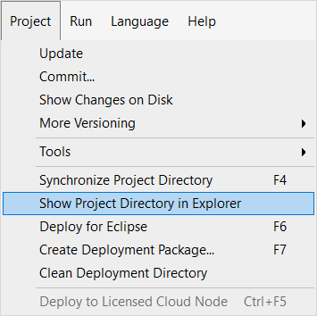
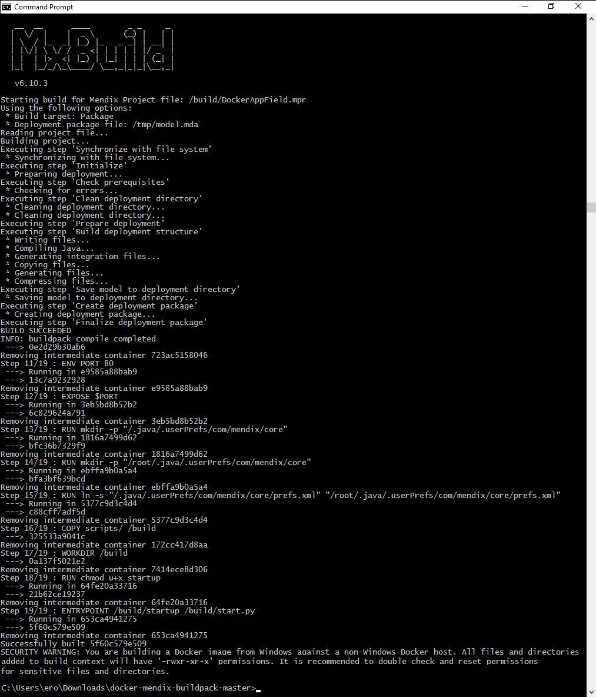

## 1 Introduction

This page explains how to build a Docker image from your Mendix Project. Each release of a project will result in a unique Docker image that can be pushed through the different stages of your application pipeline.

**You will learn how to do the following:**

* Build the image
* Push the image

## 2 Prerequisites

Before starting these instructions, make sure you have completed the following prerequisites:

* Download the latest version of [Mendix Studio Pro](https://marketplace.mendix.com/link/studiopro/) from the *Mendix Marketplace*
* Install Docker from the [Docker site](https://docs.docker.com/engine/installation/)
* Download the [Mendix Docker Buildpack](https://github.com/mendix/docker-mendix-buildpack)

## 3 Building the Image

To build the Docker image, follow these steps:

1. Install Docker on your computer.
2. Restart the computer to ensure that you have been granted access to Docker.
3. Unzip the buildpack into a location of your choice.
4. Open the **Command Prompt** and navigate to the folder where you unzipped the buildpack. 
5. Open your app in Studio Pro and select the menu option **App** > **Show App Directory in Explorer**:

    

6. Copy the project folder and all its subfolders to the unzipped docker build folder. The project folder needs to be in the same folder as the Docker file, otherwise Docker cannot access it.
7.  Execute the following command:

    ```bash
    docker build --build-arg BUILD_PATH="{relative-mendix-project-location}" -t {image name} .
    ```

    **{relative-mendix-project-location}** is the BUILD_PATH which indicates where the application model is located. It is the directory where your .MPR file is located after you copied the project into the docker build folder. If you do not specify it, it defaults to `./project`.

    A successful build will resemble the output shown below:

    

{}
You can find much more information and links to relevant Docker documentation in the [Mendix Docker Buildpack](https://github.com/mendix/docker-mendix-buildpack) GitHub repository.
{}

## 4 Pushing the Image

A new Docker image has been created with the name (`{image name}`) you gave it. You can see the image by using the command `docker images`.

Next, you need to push the image to a registry. This can be a public registry or your own. To push it to your own registry, use the command `docker push {image name}`.

## 5 Read More

* [How to Run a Mendix Docker Image](run-mendix-docker-image)
