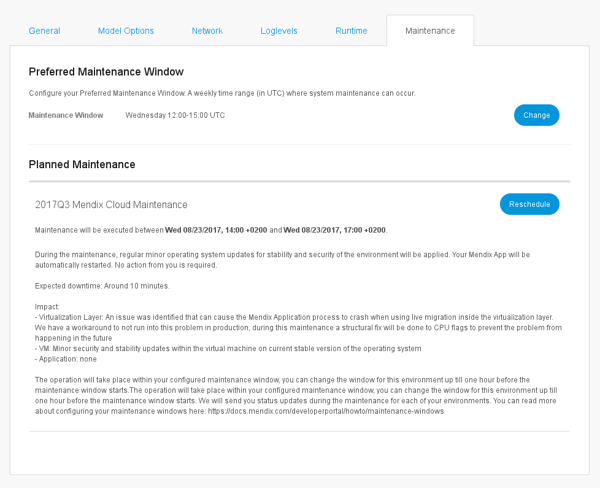

## 1 Introduction

To enter the **Environment details** page, go to the [Mendix Portal](http://home.mendix.com), select your licensed app, click **Environments**, and then click **Details** on the specific environment. 

   

## 2 General Tab

   

The view of the **General** tab depends on the Mendix Cloud version on which the app is hosted. In this tab, you can find the following information about your environment:

*  **Status**
   * White – the environment is stopped or was never deployed
   * Green – the environment is working correctly
   * Orange – the environment has warnings
   * Red – the environment is not working correctly

           

* **Running since** date – the date on which the app was started
* **Mode** – the type of environment (Production, Acceptance, Test)
* **URL** – the URL of the app
* **Custom domains** – the custom domains of the app
* **Java Version**
   * Up to Mendix version 5.17, the version of Java is 1.7
   * In Mendix version 5.18, you can choose between Java version 1.7 and 1.8
   * From Mendix version 6, you cannot choose the Java version, and it is always version 1.8
* **Runtime version** – Mendix version
* **Administrator user name**
* The **Database Status** is **Running** by default
* **Database Version** – the PostgreSQL version that is supporting the database
* **Region** - the region where the app is hosted
* **Mendix Cloud Version** – Mendix Cloud v3/Mendix Cloud v4

### 2.1 Actions

On the right side of the screen, you can find the following action buttons:

* **Start/Stop Application**
* **Show Logged in Users**
* **Change Admin Password**
* **View Current Log**

#### 2.1.1 Debugger in Mendix Cloud v3

In Mendix Cloud v3 environments, you can click **Enable/Disable Debugging** to enable or disable the debugger option. For more information about enabling the debugger, see [How to Debug Microflows Remotely](/howto7/monitoring-troubleshooting/debug-microflows-remotely)

#### 2.1.2 Debugger in Mendix Cloud v4

In Mendix Cloud v4 environments, the debugger is always enabled. You can click **Show debugger information** to show the settings to connect the debugger in your Mendix Desktop Modeler to your app.

## 2.2 Scaling – Mendix Cloud v4

If your app is hosted in Mendix Cloud v4, you will see a section named **Scaling** in the **General** tab.

In **Scaling**, there are two sliders that you can control:

* Use the **Instances** slider to increase or decrease the amount from one to four instances by sliding the slider
   * The instances are meant for improved resiliency and increased processing power
   * The minimum amount of RAM memory per instances is 1GB; you can spread the RAM memory among four instances if you have more than 1GB of RAM memory
* Use the **Memory per instance** slider to increase or decrease the memory amount per instance by sliding the slider

The **Total Allocated Memory** is a process circle that shows how much memory is currently used for scaling.

If you have 1GB RAM of the **Total Allocated Memory**, you have one instance available to store your memory.

To scale your memory over multiple instances, you need more memory.

### 2.3 Overviews

At the bottom of the page, there are two overview grids with information about the information below.

#### 2.3.1 License

The license overview contains the following information:

* **Company** owning the license
* **License type**
* **Expiration date**
* **Runtime mode** (Production, Acceptance, Test)
* **Limitations**
    * **Limitation type** (see below for details)
    * **Amount type**
    * **Number of allowed users**

The limitation types are the following:

* **Concurrent** – the amount of named users that are logged in simultaneously
* **Concurrent anonymous** – the amount of anonymous users that are logged in simultaneously
* **Named** – the amount of named users registered in the database that are allowed to use the application

#### 2.3.2 Loaded Deployment Package

In this section, you can find information about the deployment package that is currently loaded into the environment:

* **Size (MB)** of the deployment package
* **Upload date** of the deployment package
* **Version** of the deployment package
* **Name** of the deployment package

## 3 Model Options Tab

On this tab, you can edit the model options described below.

### 3.1 Scheduled Events

In this section, you can view your configured scheduled events.

If you select a scheduled event and click **Toggle**, you can switch the scheduled event off and on.

{}

You have to restart your application before the changes will be made.

{}

With scheduled events, you can let the Runtime execute a microflow at a specific moment in time. The event can also be repeated with a given interval (for example, every day).

For more information, see [Scheduled Events](/refguide/scheduled-events).

### 3.2 Constants

In this section, you can view the configured constants. Constants are used to define configuration values that can differ per environment.

To fill in a new value, select the constant and click **Edit**.

{}

You have to restart your application before the changes will be made.

{}

For more information, see [Constants](/refguide/constants).

## 4 Network Tab

On this tab, you can manage the elements described below.

### 4.1 Custom Domains

* **Domain name**
* **Certificate**
* **Expire** date

You can perform the following actions:

* **Create** (in which you have to provide the **domainname** and select the **certificate** from a drop-down menu)
* **Edit**
* **Delete**

For more information, see [Certificates](/deployment/mendixcloud/certificates) and [How to Configure Custom Domains](/developerportal/howto/custom-domains).

### 4.2 Prevent Embedding Your App in an IFrame

Your application can be embedded in another site using an IFrame. To prevent this, you can deny embedding using the setting below. This will set an X-Frame-Options header for each HTTP response from your app. Please note that Chrome will ignore the **Allow from specific domain** option.

The embedding options are:

* **Allow**
* **Never allow**
* **Allow on the same domain**
* **Allow from specific domain**

### 4.3 Path-Based Access Restrictions

You can restrict access to your application by means of Client Certificates or IP ranges.

The top level path (`/`) restricts access to the entire application. Settings for specific paths override the implicitly inherited profile for the top level.

Custom access restriction profiles are managed at the application level. They can be reused for all environments (acceptance, production, etc).

The **Path based access restrictions** overview contains the following information:

* **Path**
* **Current Restriction Profile**
* **New Restriction Profile**

You can **Delete** a path or you can **Add** and **Edit** a path with the following restriction types:

* Allow all access
* Deny all access
* Custom Profile for Client Certificates and/or IP ranges
* N/A (inherit)

For more information, see [How to Restrict Access for Incoming Requests](/deployment/mendixcloud/access-restrictions).

### 4.4 Outgoing Connections Certificates

Add client certificates (in the PKCS12 format) or certificate authorites (in the PEM format). These will be used when your application initiates SSL/TLS connections.

## 5 Log Levels Tab

   

Log levels are used to distinguish the log messages and to highlight the highest priority ones so that they can receive the immediate intervention they require.

On this tab, you can perform the following actions:

* Retreive the current log levels by clicking **Refresh**
* Change the log level type by clicking the specific level
* Click **Set all to INFO** to revert all the changes

The log level types are the following:

| Level | Color | Description
| --- | --- | --- |
| **Trace** | | More detailed information. These are only written to logs. |
| **Debug** | | Detailed information, typically of interest only when diagnosing problems. |
| **Info**  | | Confirmation that things are working as expected. |
| **Warning** | Orange | Indicates that something unexpected happened or that there is some problem in the near future (for example, "disk space low"). The application is still working as expected. |
| **Error** | Red | Due to a more serious problem, the application has not been able to perform some function. |
| **Critical** | White (text), red (background) | A serious error has occurred, indicating that the application itself may be unable to continue running. |

For more information about log levels, see [How to Set Log Levels](/howto/monitoring-troubleshooting/log-levels).

## 6 Runtime Tab

   

On this tab, you can perform the following actions:

* **Add** a new runtime **setting** with a new **value**
* **Edit** the runtime setting
* **Delete** the runtime settings

For more information about runtime settings, read the [Custom Settings](/refguide/custom-settings) and [Tricky Custom Settings in Mendix Runtime](/howtogeneral/support/mendix-customsettings-tricky) documentation.

The Mendix Cloud uses runtime settings to configure the included systems for logs, backups, and database. Therefore, the following settings are not configurable by users:

* com.mendix.core.localfilesystem.cleaning.isEnabled
* com.mendix.core.localfilesystem.cleaning.time
* CACertificates
* ClientCertificatePasswords
* ClientCertificates
* DatabaseHost
* DatabaseJdbcUrl
* DatabaseName
* DatabasePassword
* DatabaseType
* DatabaseUserName
* DatabaseUseSsl
* DTAPMode
* EnableSessionFingerprinting
* JavaKeyStorePassword
* LogFileName
* MaxLogFileCount
* MaxLogFileSize
* MicroflowConstants
* MyScheduledEvents
* OracleServiceName
* ScheduledEventExecution
* TempPath
* WebServiceClientCertificates

## 7 Maintenance Tab

   

There are two types of maintenance:

* Regular weekly maintenance (which does not affect your app), during which you can change the preferred maintenance window
* Planned maintenance (which will affect your app in some ways), during which you will automatically receive an email about this and you can override the maintenance window

For more information about maintenance, see [How to Configure Maintenance Windows](/developerportal/howto/maintenance-windows).

### 7.1 Preferred Maintenance Window

You can view and change the preferred maintenance.

### 7.2 Planned Maintenance

When a maintenance operation is planned, it will show up under **Planned Maintenance**. By default, this will be planned in your preferred maintenance window. You can override the maintenance window of a specific maintenance operation by clicking **Override**.

You will automatically receive **email notifications** about planned maintenance.
