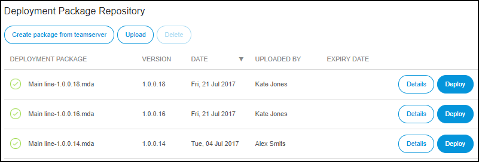
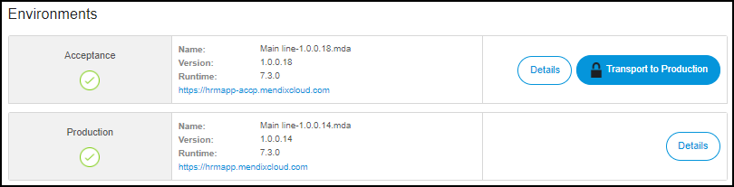

## 1 Introduction

In the **Environments** section of the **Deploy** category, there is an overview of three tabs:

* **Deploy**
    * Deployment Package Repository
    * Environments 
    * Activities
* **Custom Domain**
    * Certificates
    * Linked Custom Domains
* **Access Restriction Profiles**
    * IP Address Filtering
    * TLS Client Certificate Verification
    
          

## 2 Deploy

In the **Deploy** tab you can find the following information about your environment:

### 2.1 Deployment Package Repository

   

In the **Deployment Package Repository** section, there is an overview of the following:

*   Deployment Package
*   Version of the deployment package
*   Creation date of the deployment package
*   Uploaded by
*   Expire date of the deployment package

There are also four actions you can perform:

#### Create a Package from Team Server

In this section, you can click **Create a Package from Team Server** and select a branch containing the revision you would like to build.

Only branches where the latest revision is Mendix 5 and higher will be displayed here. If you need to build other revisions, please do so manually from the Mendix Modeler.

#### Uploading

When you click **Upload**, you can upload an *.mda* file from your local device.

#### Viewing the Details of the Deployment Package

Next to the already mentioned deployment package info, if you click **Details** the following items will be displayed:

* Size of the package
* Description of the package
* A build output
* An overview of the environments that are currently running on this deployment package

There are also two action you can perform:

* Download the package
* Delete the package

#### Deploying a Deployment Package

If you click **Deploy**, the package from the team server will be transported to the environment that you select to upload.

### 2.2 Environments

   

In this section you have the an overview of all the available environments with the following details:

* Name of the deployment package
* The version of the deployment package
* Runtime (the Modeler version)
* The URL of the app
* The alert status of the environment

There are three types of environment statuses:

*   Green – there are no alerts
*   Orange – there is a warning alert
*   Red – there is a critical alert

To see the details of the alerts, click **Alerts** under the **Operate** category.

There are two actions you can take :

* Transport the environment to the acceptance/production environment
* View the details of the environment

After clicking [Details](/developerportal/deploy/environments-details) of the selected environment, you can see the following tabs:

* General
* Model Options
* Network
* Loglevels
* Runtime
* Maintenance

### 2.3 Activity

   

This section shows the following activity types:

Activity type | Explanation
------------ | -------------
Backup Created | a backup has been manually created
Backup Expired | a backup has been expired after its expiration period
Backup Restore Started | a backup restore has been manually started
Backup Restored | the backup restore has been restored
Clean | the environment has been cleaned
Custom Domain | changes were made to the custom domain
Database Backup Downloaded | the database backup has been downloaded
Migration | the app has been migrated from one node to another node
Error | error has occured while uploading an '.mda' file
Files Backup Downloaded | backup files have been downloaded
Maintenance | the admin password has been changed
MDA Uploaded | an '.mda' file has been uploaded
Started Manually | the application has been started manually
Stopped Manually | the application has been stopped manually
Technical Contact Changed | the Technical Contact has been changed
Transportation | a new deployment package has been transported to an enviornment

## 3 Custom Domain

In this tab you can manage your custom domain certificates on a application level.

When your Mendix App needs to be accessible via your own URL (for example, `https://myapp.mycompany.com/`), you have to provide a custom domain certificate (an SSL/TLS certificate) so that we can keep serving your Mendix app via a secure connection.

There is also a section with an overview of linked custom domains.

For more information, see [How to Configure Custom Domains](/developerportal/howto/custom-domains).

## 4 Access Restriction Profiles

In this tab you can manage custom Access Restriction Profiles. These profiles can combine IP Range filters and Client Certificate Verification. Access Restriction Profiles can be applied to Path Based Access Restrictions in specific environments of the application.

## 5 Related Content 

*  [Deploy](/developerportal/deploy)
*  [Environment Details](/developerportal/deploy/environments-details)
