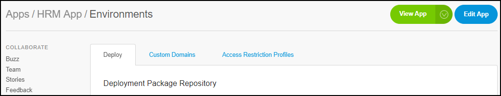
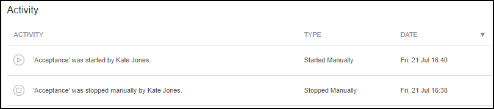

## 1 Introduction

In the **Environments** section of the **Deploy** category, there is an overview of three tabs:

* **Deploy**
    * Deployment Package Repository
    * Environments 
    * Activities
* **Custom Domain**
    * Certificates
    * Linked Custom Domains
* **Access Restriction Profiles**
    * IP Address Filtering
    * TLS Client Certificate Verification
    
          

## 2 Deploy

In the **Deploy** tab, you can find the information below about your environment.

### 2.1 Deployment Package Repository

In the **Deployment Package Repository** section, there is an overview of the following:

*   Deployment package
*   Version of the deployment package
*   Creation date of the deployment package
*   Uploaded by
*   Expire date of the deployment package

**Actions**

There are also four actions you can perform, which are described below.

#### 2.1.1 Creating a Package from Team Server

In this section, you can click **Create a Package from Team Server** and select a branch containing the revision you would like to build.

Only branches where the latest revision is Mendix 5 and above will be displayed here. If you need to build other revisions, please do so manually from the Mendix Modeler.

#### 2.1.2 Uploading

When you click **Upload**, you can upload an *.mda* file from your local device.

#### 2.1.3 Viewing the Details of the Deployment Package

Next to the deployment package info, if you click **Details**, the following items will be displayed:

* Size of the package
* Description of the package
* A build output
* An overview of the environments that are currently running on this deployment package

**Actions**

There are also two action you can perform:

* Download the package
* Delete the package

#### 2.1.4 Deploying a Deployment Package

If you click **Deploy**, the package from the team server will be transported to the environment that you select to upload.

### 2.2 Environments

In this section, you have the an overview of all the available environments with the following details:

* Name of the deployment package
* The version of the deployment package
* Runtime (the Modeler version)
* The URL of the app
* The alert status of the environment

There are three types of environment statuses:

*   Green – there are no alerts
*   Orange – there is at least one warning alert, but no critical alerts
*   Red – there is at least one critical alert

{}
The environment status is cached; there can be a delay of up to five minutes before the status icon displays a change of status.
{}

To see the details of the alerts, click **Alerts** under the **Operate** category. This is documented here: [Alerts](/developerportal/operate/monitoring-application-health).

**Actions**

There are two actions you can take :

* **Details** of the selected environment – information about the details available are documented here: [Details](environments-details)

* **Transport to ...** – initiates the staging of an environment to the next stage: acceptance or production

### 2.3 Activity

This section shows the following activity types:

Activity Type | Explanation
------------ | -------------
Backup Created | A backup has been manually created.
Backup Restore Started | A backup restore has been manually started.
Backup Restored | The backup restore has been restored.
Clean | The environment has been cleaned.
Custom Domain | Changes were made to the custom domain.
Database Backup Downloaded | The database backup has been downloaded.
Migration | The app has been migrated from one node to another node.
Error | An error has occurred while uploading an *.mda* file.
Files Backup Downloaded | Backup files have been downloaded.
Maintenance | The admin password has been changed.
MDA Uploaded | An *.mda* file has been uploaded.
Started Manually | The application has been started manually.
Stopped Manually | The application has been stopped manually.
Technical Contact Changed | The Technical Contact has been changed.
Transportation | A new deployment package has been transported to an environment.

## 3 Custom Domain

In this tab you can manage your custom domain certificates on an application level.

When your Mendix app needs to be accessible via your own URL (for example, `https://myapp.mycompany.com/`), you have to provide a custom domain certificate (an SSL/TLS certificate) so that we can keep serving your Mendix app via a secure connection.

There is also a section with an overview of linked custom domains.

For more information, see [How to Configure Custom Domains](custom-domains).

## 4 Access Restriction Profiles

In this tab you can manage custom access restriction profiles. These profiles can combine IP range filters and client certificate verification. Access restriction profiles can be applied to path-based access restrictions in specific environments of the application.

## 5 Related Content 

* [Deploy and Manage](/developerportal/deploy)
* [Environment Details](environments-details)
* [How to Receive Environment Status Alerts](/developerportal/operate/receive-alerts)
* [How to Restrict Access for Incoming Requests](access-restrictions)
