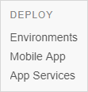

## 1 Introduction

Mendix apps can be deployed to many different platforms. Much of the deployment and management of a Mendix app depends on which platform it is deployed to. You can find information about each platform in the sections of documentation which relate specifically to deployment to that platform.

There are, however, a number of issues which are related to all, or multiple platforms. Rather than duplicate this information, these are covered in this section of the documentation.

The subjects covered in the *General* section of deployment are:

* [Secure Outgoing Connections from your Application](securing-outgoing-connections-from-your-application)
* [Two-Factor Authentication](two-factor-authentication)
* [Version Downgrade Prevented](version-downgrade-prevention)

## 2 Managing Your Deployed Apps

For many of the platforms to which Mendix can be deployed, the **Deploy** category in the Developer Portal allows you to deploy and manage your app.

The Deploy category consists of three sections:

* Environments
* Mobile App
* App Services

   

### 2.1 Environments

For supported platforms, the **Environments** page allows you to review and configure different aspects of your app. It also allows you to deploy to your chosen platform, configure individual environments, and transport your app between staging environments.

For details of the Environments page for **Mendix Cloud** deployments, see [Environments](environments).

For details of the Environments page for **IBM** deployments, see [IBM Cloud](ibm-cloud).

For details of the Environments page for **SAP** deployments, see [SAP Business Technology Platform](sap-cloud-platform).

Other platforms are not currently supported on the Mendix *Environments* page and you will have to go to the relevant platform portal to monitor and configure your environments.
​    
### 2.2 Mobile App

On this page, you can manage and publish your app in mobile app stores.

Mendix supports Android and iOS.

For more details, see [Mobile App](mobileapp).  

## 2.3 App Services

The **App Services** page lets you publish your app service, application, or widget to the Mendix Marketplace.

For more details, see [App Services](app-services).  
