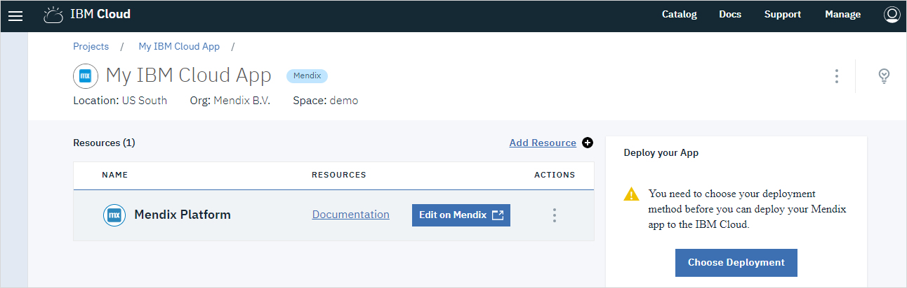
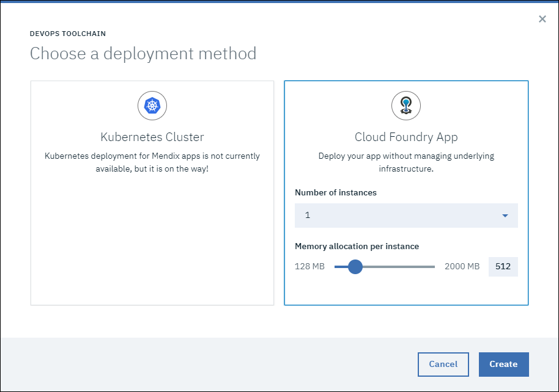
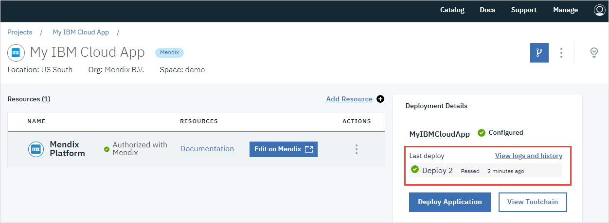

## 1    Introduction

As a Mendix user with an IBM Cloud account you have access to many IBM resources which you want to use in a Mendix app. This how-to shows you how to create a Mendix app on the Mendix platform and then deploy it to IBM Cloud.  

**This how-to will teach you how to do the following:**

* Select an IBM app template and ask Mendix to create the app
* Create a deployment package on the IBM Cloud
* Deploy and test your app on the IBM Cloud 

## 2 Prerequisites

Before starting this how-to, make sure you have completed the following prerequisites:

* Have an [IBM Cloud account](https://console.bluemix.net/registration/)
* Download the [Mendix Desktop Modeler](https://appstore.home.mendix.com/link/modelers/) — you will need 7.11.0 or higher
* Be familiar with the basic concepts of editing and deploying a Mendix app ([here](/howto/tutorials/) are a number of Mendix tutorials which cover these)

## 3 Creating the New App and Setting Up IBM Cloud

You have decided to create a new Mendix app using an IBM template which you will ask Mendix to deploy to your IBM Cloud.

### 3.1 Create a New App

To start creating a new app, follow these steps:

1. Log in to your Mendix Account.
2.  Click **Create App** to create a new app.

    

3.  Click on an IBM app to choose it as the starting point for your app.

    

4. Click **Use this app**.

5. Choose a name for your app and click **Create App**.

6. Wait while Mendix creates a copy of the starter app you have chosen and takes you to IBM Cloud.

### 3.2 Setup project on IBM Cloud

You are now on IBM Cloud and need to tell it more about your project, so that IBM Cloud can add the resources you need.

1.  Click **Setup Cloud**.

    

2. Log in to IBM Cloud if you are not already logged in.

    The name of your project is already entered in **Enter a project name**

    

    {}
    Currently you can only deploy your project in the **US South** region, so make sure that this is selected in **Select region to deploy in**.
    {}

3. Click **Create Project**

    You will now need to choose the deployment method for this app. For example the database you will be using.

4. Click **Choose Deployment**

    

5. Click **Link Account**

    

    This is only required for new projects. It links this project to the project on Mendix.

    If you have not linked an IBM Cloud project to Mendix before, you will be asked to confirm that IBM Cloud can have access to some of your Mendix data. Please **Authorize** this.

    You will now be returned to the project page.
    
6.  Click **Choose Deployment** again.

    Currently only Cloud Foundry is supported.

7.  Check that **Number of instances** is _1_.

8.  Set **Memory allocation per instance** to _512_.

    

9. Click **Create**.

    Wait until the **Deployment Details** indicate that the toolchain is configured.

    

    Your IBM environment is now configured.

### 3.2 Create package on IBM Cloud

1.  Click **Edit on Mendix** to return to Mendix.

2.  Open the **Environments** page.

    You are now ready to create a deployment package which you will then push to IBM Cloud. It is only after the deployment package has been created and pushed to IBM Cloud that you can deploy your app.
 
3. Click on **Create package from teamserver**.

    

4. Select the branch on which to base the build and click **Next**.

    

    {}Initially, you will only have the Main line. However, when you create deployment packages in the future, there may be other branches available.
    {}

5. Select the revision of this branch and click **Next**.

    

    {}You will see a number if revisions. Note that a package cannot be created from the first revision as this contains no application template.

    Please do not choose to create a package from revision number 1.
    {}

6. Optionally, type a **Tag description** for this build and, if required, set the version number.

    

7. Click on **Build this revision**.

8. Click **OK** to confirm the information message.

    

9. Click **Details** next to the deployment package to see details of the deployment package

    

    You can now see and manipulate the package details.

10. Click **Environments** to return to the previous page.

    

### 3.3 Deploy package on IBM Cloud

When the project is built it will appear in the list of deployment packages. While it is being built, there will be a 'spinner' showing that the package is not yet complete. Once the package is ready for deployment this will be replaced by a tick.

1. Click on **Push** next to the package you want to deploy. This will push this deployment package to IBM Cloud.

    A request to deploy is sent to IBM Cloud. Currently you have to do this deployment manually.

2.  Click on the **here** link or the **Open IBM Cloud** button to go to your IBM Cloud project page.

    

    You will now be back on your IBM Cloud project page.

3.  Click on **Deploy Application**

    

4.  Wait until the app is deployed. You will see that the **Last deploy** is a new deployment and has been deployed very recently.

    

5.  Click **Edit on Mendix** to return to Mendix

6.  Click **Environments** to see the Mendix environments page.

    When the deployment is complete you will see your deployed app under **Managed by IBM Cloud**. You will also see activities related to the deployment under **Activity**.

    

7.  Click **View App** to run and view your app.

    {}
    Under some circumstances this button is not active. You may have to refresh the page, or go to another page and return to make it active.
    {}

    You can also view your app directly using the url which is given to you:
    
    

## 4 Related Content

* [IBM Cloud account](https://console.bluemix.net/registration/)
* [Mendix Desktop Modeler](https://appstore.home.mendix.com/link/modelers/)
* [Mendix Tutorials](https://docs.mendix.com/howto/tutorials/)
