## 1    Introduction

As a Mendix user with an IBM Cloud account you have access to many IBM resources which you want to use in a Mendix app. This how-to shows you how to create a Mendix app on the Mendix platform and then deploy it to IBM Cloud.

**This how-to will teach you how to do the following:**

* Select an IBM app template and ask Mendix to create the app
* Create a deployment package for IBM Cloud
* Deploy to, and test your app on, IBM Cloud

## 2 Prerequisites

Before starting this how-to, make sure you have completed the following prerequisites:

* Have an [IBM Cloud account](https://console.bluemix.net/registration/)
* Download the [Mendix Desktop Modeler](https://appstore.home.mendix.com/link/modelers/) – you will need 7.11.0 or higher
* Be familiar with the basic concepts of editing and deploying a Mendix app; if you are new to Mendix, the [Starter App Tutorial](/howto/tutorials/starter-apps) will introduce you to these concepts
* Be familiar with the basic concepts of IBM Starter Kits and Toolchain

## 3 Creating the New App and Setting Up IBM Cloud

You have decided to create a new Mendix app using an IBM template which you will ask Mendix to deploy to your account on IBM Cloud.

### 3.1 Creating a New App

Firstly, you create your Mendix app which you wish to deploy.

To start creating a new app, follow these steps:

1.  Log in to your Mendix Account.

2.  Click **Create App** to create a new app.

    

3.  Click an IBM app to choose it as the starting point for your app.

    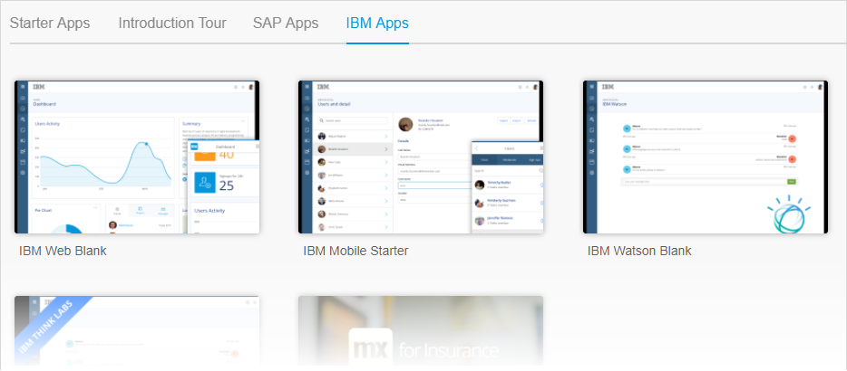

4.  Click **Use this app**.

5.  Choose a name for your app and click **Create App**.

6.  Wait while Mendix creates a copy of the starter app you have chosen and takes you to a page from which you can set up IBM Cloud.

### 3.2 Setting Up the Project on IBM Cloud

Mendix knows you want to deploy to  IBM Cloud, but you need tell it more about your project so that IBM Cloud can add the resources you need.

To set up IBM Cloud, follow these steps:

1.  Click **Setup Cloud**.

    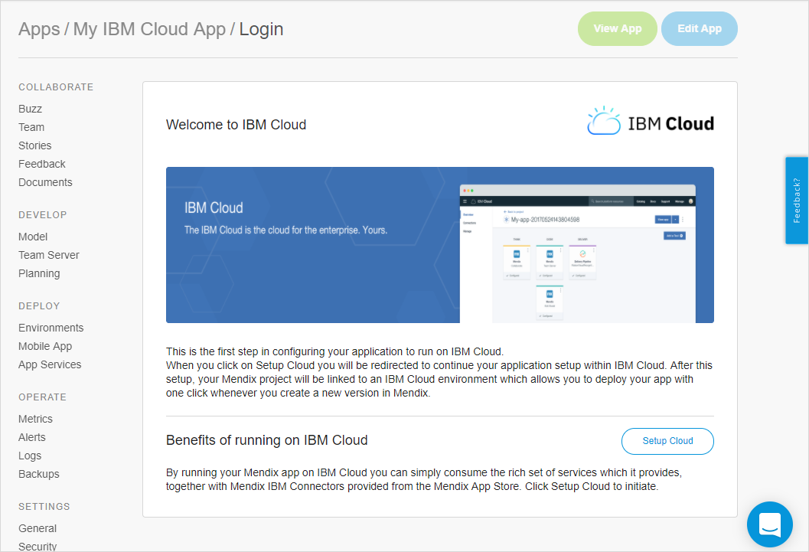

2.  Log in to IBM Cloud if you are not already logged in.

    The **App name** name of your project is already filled in.

3. Ensure that the correct account is shown at the top right of the screen (next to your avatar) if you have access to more than one account on IBM Cloud.

4. Choose the appropriate **Resource Group**.

5.  Click **Create**.

    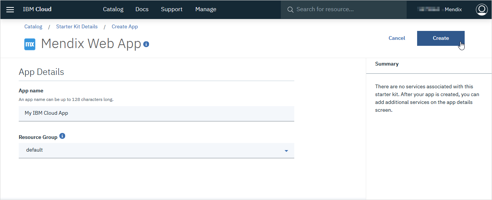

6.  Click **Link Account**.

    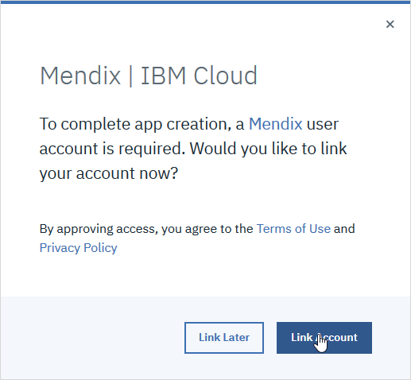

    This is only required for new projects. It links this project to the project on Mendix.

    If you have not linked an IBM Cloud project to Mendix before, you will be asked to confirm that IBM Cloud can have access to some of your Mendix data. Please **Authorize** this.

    You will now be returned to the project page.

7.  Click **Choose Deployment**.

    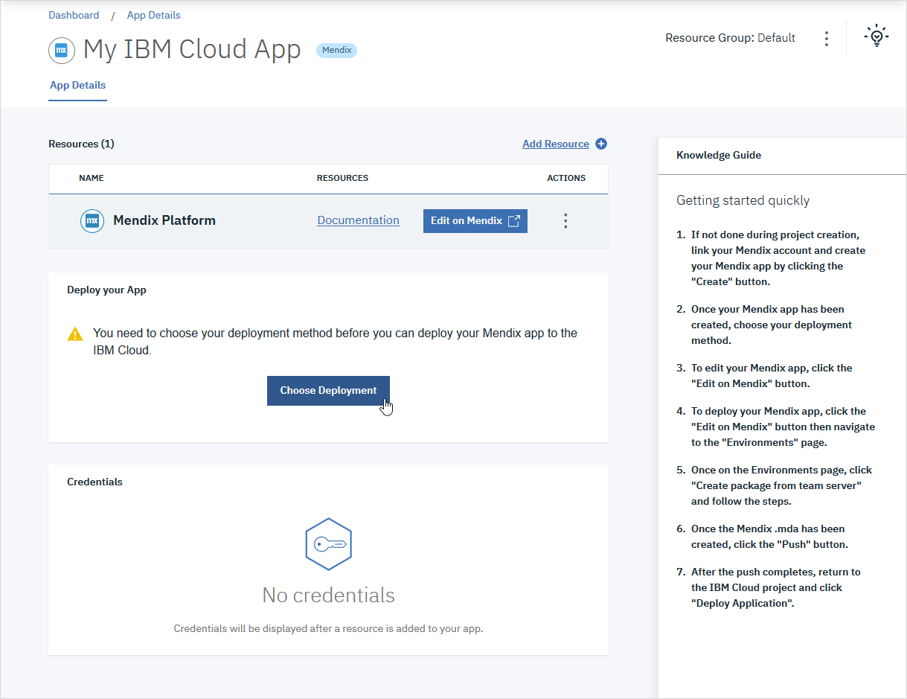

    You can choose to deploy to Cloud Foundry or Kubernetes.

#### 3.2.1 Deploying to Cloud Foundry

1.  Set the **Number of instances**; the default is _1_.

2.  Set the **Memory allocation per instance**; the default is _512_.

3. Choose the **Region**, **Organization**, **Space**, and **Domain** to deploy to.

4. Change the **Host** if required; the default is the name of your app.

    {}It is possible that your deployment will fail if your **Host** is not unique within your region. If this occurs, use a different host name.{}

5.  Click **Create**.

    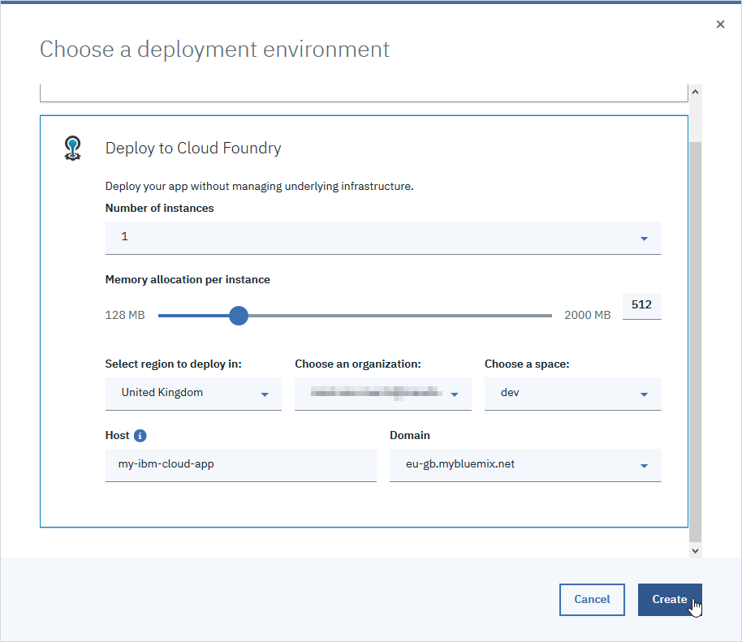

6. Wait until the **Deployment Details** indicate that the toolchain is configured.

    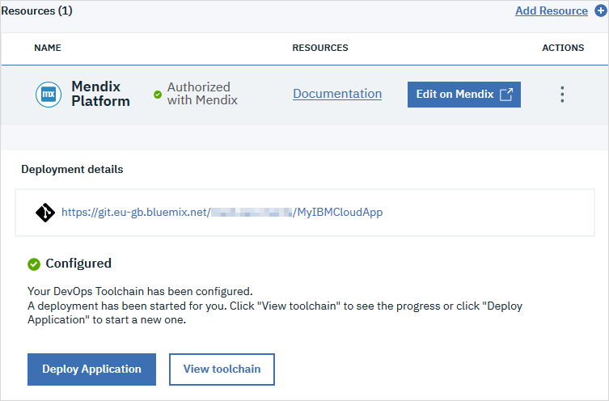

    Your IBM Cloud Foundry environment is now configured. Go to section 3.3 [Creating a Package for IBM Cloud](#create-package) to learn how to create a package which will deploy to IBM Cloud.

#### 3.2.2 Deploying to Kubernetes

{}Please note that the default setup for deploying to Kubernetes to IBM Cloud is not currently suitable for production environments. Please refer to IBM documentation or contact [Mendix support](https://support.mendix.com) if you want to use Kubernetes for a production environment on IBM Cloud.
{}

1. Choose the **Region**, **Organization**, **Space**, and **Cluster name** to deploy to.

2.  Click **Create**.

    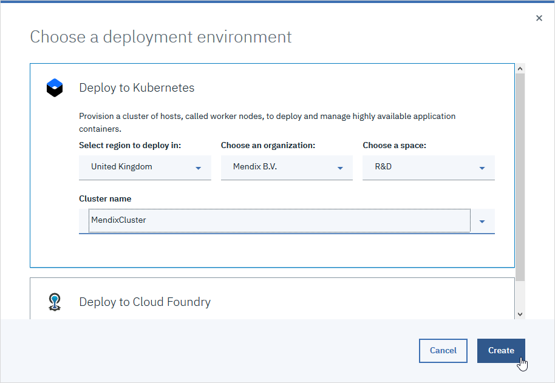

3. Wait until the **Deployment Details** indicate that the toolchain is configured.

    

Your IBM Kubernetes environment is now configured. Go to section 3.3 [Creating a Package for IBM Cloud](#create-package) to learn how to create a package which will deploy to IBM Cloud.

### 3.3 Creating a Package for IBM Cloud {#create-package}

Before you can deploy a package to IBM Cloud you have to create it. At any time, you can create a new deployment package from a committed version of the project. If you are working with the Desktop Modeler you will have to commit the project first.

#### 3.3.1 Deploying from Within the Desktop Modeler

You can deploy your app automatically from the Desktop Modeler. However, you will have less control over the deployment than deploying from the Developer Portal.

Click **Run** in the Desktop Modeler. This will automatically:

* commit the project
* generate a deployment package from the latest commit in the current branch
* push the deployment package to IBM Cloud

You will still need to go to IBM Cloud and manually deploy the package; a message within the Desktop Modeler will let you know when the package is ready and will give you the link to IBM Cloud. See section 3.4 [Deploying a Package to IBM Cloud](#deploy-package) for instructions on how to do the deployment.

#### 3.3.2 Deploying from the Developer Portal

To create a package for IBM Cloud within Developer Portal, follow these steps:

1.  Return to the Mendix Developer Portal. If you are looking at your app on IBM Cloud you can click **Edit on Mendix** to return to Mendix.

2.  Open the **Environments** page.

    You are now ready to create a deployment package which you will then push to IBM Cloud.
 
3.  Click **Create package from teamserver**.

    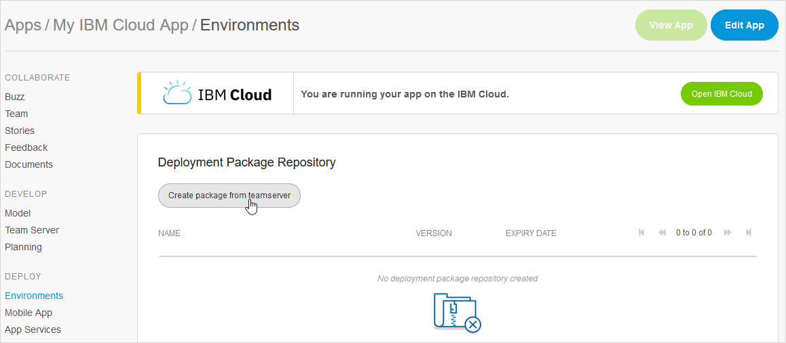

4.  Select the branch on which to base the build and click **Next**.

    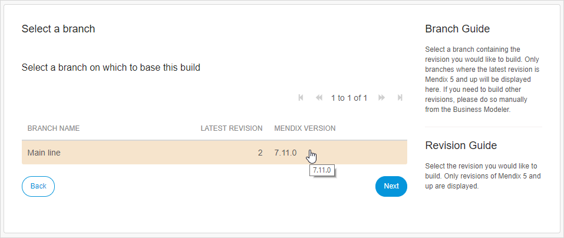

    {}Initially, you will only have the Main line. However, when you create deployment packages in the future, there may be other branches available.
    {}

5.  Select the revision of this branch and click **Next**.

    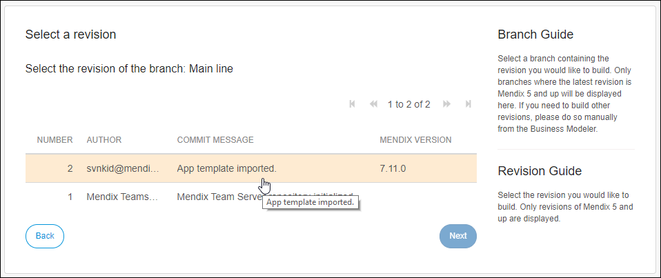

    {}You will see a number if revisions. Note that a package cannot be created from the first revision as this contains no application template.
    {}

    {}Please do not choose to create a package from revision number 1.
    {}

6.  Type a **Tag description** (optional) and set the version number for this build.

7.  Click **Build this revision**.

    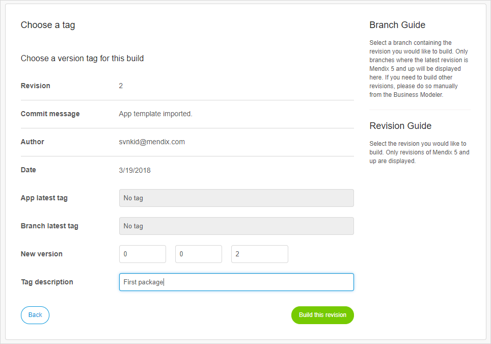

8.  Click **OK** to confirm the information message.

    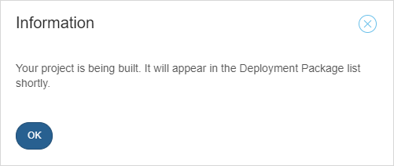

9.  Click **Details** next to the deployment package to see details of the deployment package.

    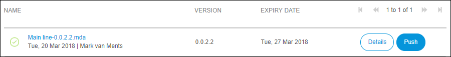

    You can now see and manipulate the package details.

10. Click **Environments** to return to the previous page.

    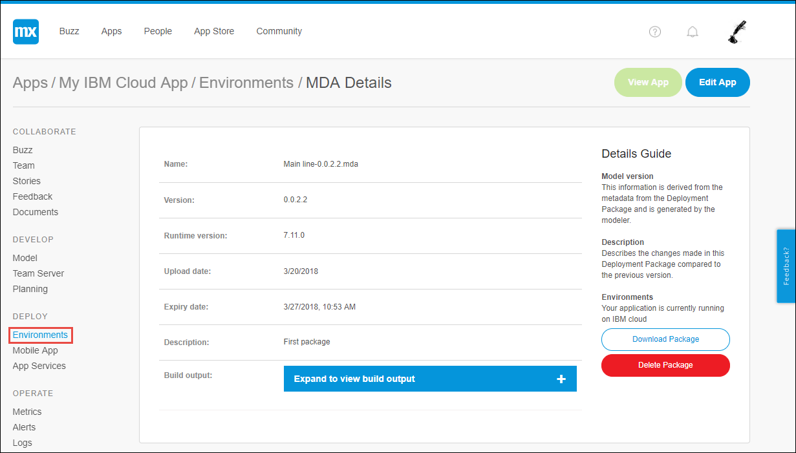

    When the project is built it will appear in the list of deployment packages. While it is being built, there will be a 'spinner' showing that the package is not yet complete. Once the package is ready for deployment this will be replaced by a tick.

    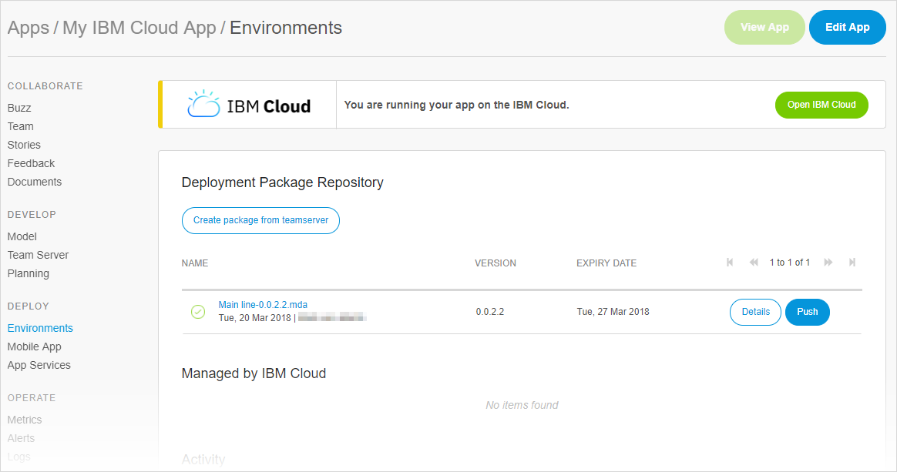

    The package is still within the Mendix environment and needs to be pushed to IBM Cloud. From there it can be deployed.

11. Click **Push** next to the package you want to deploy. This will push this deployment package to IBM Cloud.

### 3.4 Deploying a Package to IBM Cloud{#deploy-package}

{}A package is sent to IBM Cloud to be deployed. Currently you have to do this deployment manually.
{}

1.  Click the **here** link or the **Open IBM Cloud** button to go to your IBM Cloud project page.

    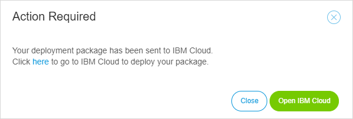

    Alternatively, follow the link you are given in the Desktop Modeler.

    You may need to configure your browser to allow the IBM Cloud page to open.

    You will now be back on your IBM Cloud project page.

2.  Click **Deploy Application**.

    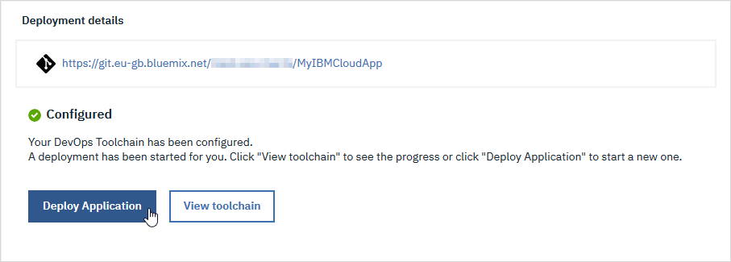

    You will see a confirmation message in the top right of the screen.

    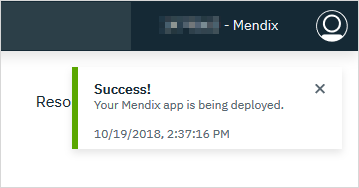

3.  Wait until the app is deployed. This can take several minutes.

    If you want to see the progress then do the following:

    * Click **View toolchain**
    * Click the **DELIVER > Delivery Pipeline** tool in the toolchain
    * The **Deploy Stage** will indicate *STAGE PASSED* when your app has been deployed (if you are encountering issues, you can click the link on this page to see the build log)

    {}Although there is a button here marked **View app**, it is not currently possible to see your app this way. You will need to view it from the Mendix site.
    {}

    
    {}Under some circumstances, the toolchain for Kubernetes cannot be built.

    Go to the toolchain and look at the log from the **Build Stage**. If the log includes the message `You have exceeded your storage quota. Delete one or more images, or review your storage quota and pricing plan.`, then you will need to remove any images by going to **Containers > Registry > Images** and deleting them.
    
    {}

    You can also see when your deployment is complete from the Mendix app's *Environments* page.

5.  Click **Edit on Mendix** to return to Mendix.

6.  Click **Environments** to see the Mendix environments page.

    When the deployment is complete you will see your deployed app under **Managed by IBM Cloud**. You will also see activities related to the deployment under **Activity**.

7.  Click **View App** to run and view your app.

    

    You can also view your app directly using the url which is given to you:

    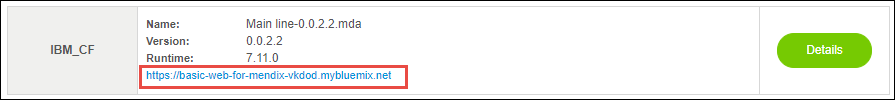

## 4 Runtime Configuration

Once your app is deployed, you can make changes to the runtime on IBM Cloud.

To change your runtime configuration, perform the following steps:

1. Go to IBM Cloud by clicking the **Details** button next to your environment, or using the **Open IBM Cloud** button.

2. Click **Dashboard** above the name of your app.

    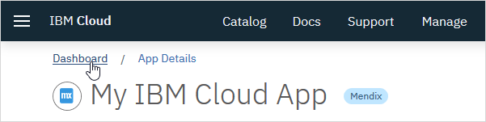

3. Find your app in the Dashboard - use the search box if required.

4. Click the name of your app. Note that due to naming restrictions some characters in your app name may have been changed or removed (such as the spaces in this example).

    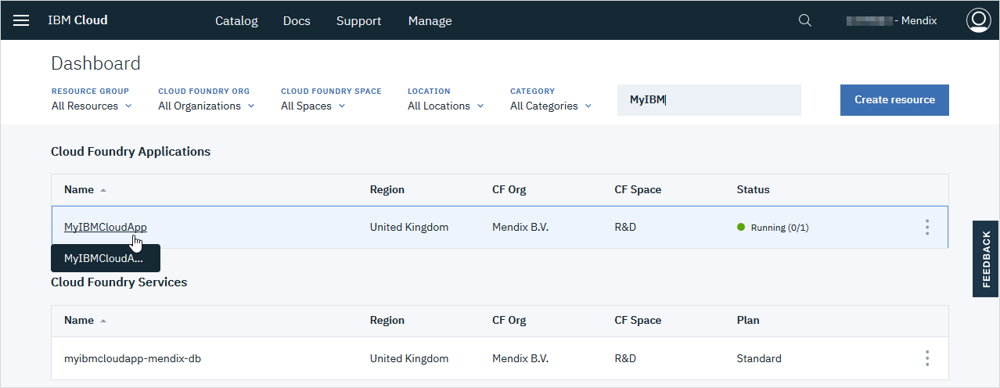

5. Click **Runtime** in the menu.

    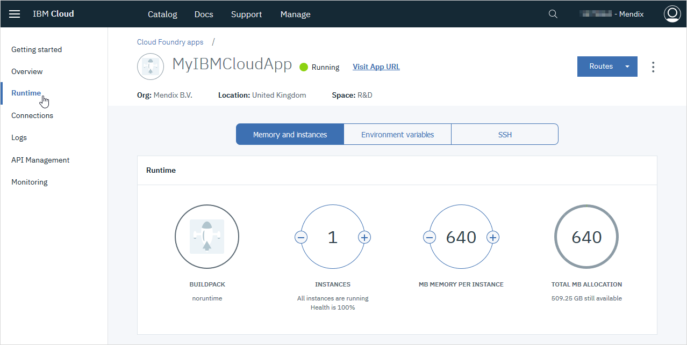

    You can now change the number of instances, and the memory for each instance. You can also change the values of application constants, development mode, and scheduled events. 

### 4.1 Memory and Instances

{}
Any changes you make to the memory and instances configuration for the IBM Cloud runtime will be overwritten next time you deploy your app.

You can only make these changes permanent by creating a new environment from Mendix, or by changing the **manifest.yml** file in the IBM Repository for your app.

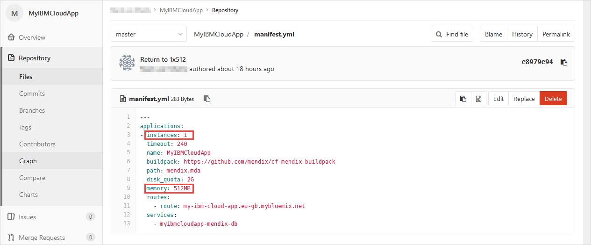

{}

To change the memory and instances configuration temporarily, do the following:

1. Increase or decrease the number of instances, or the memory per instance, using the +/- buttons.

2. Click **Save**; the environment will be restarted to apply the new setting.

    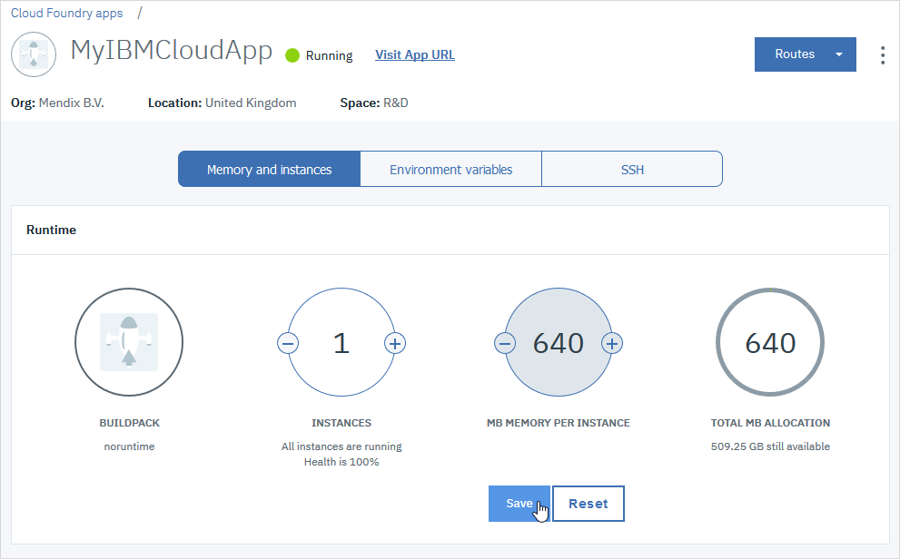

    You will get a warning that this change is not permanent - see the note above.

### 4.2 Environment Variables and App Constants

1. Click **Environment variables** to change the environment variables.

    

    The environment variables contain three pieces of information which can be useful in managing your app. These are:

    * DEVELOPMENT_MODE – this is *true* if you want the application to run with the Mendix security level of Prototype/demo, or Off (no security); it is recommended that this is changed to *false* for acceptance or production environments
    * Constants within the app – these have the format *MX_{module name}_{constant name}
    * SCHEDULED_EVENTS – by default, this is a comma separated list of all the scheduled events enabled in the app

2. Change the values of these variables by typing the new values. Clicking **Save** will apply the new values and restart the environment.

    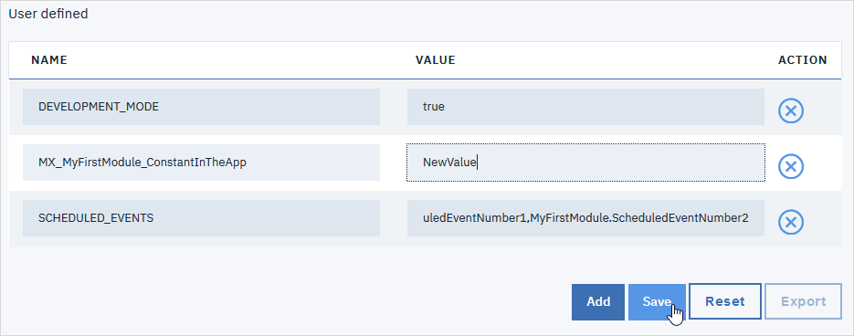

    For a full discussion of Mendix and environment variables in Cloud Foundry, see [Run Mendix in Cloud Foundry](https://github.com/mendix/cf-mendix-buildpack) in the cf-mendix-buildpack GitHub project.

    {}Unlike the memory and instance configuration, values that you change here are changed permanently and will not be overwritten the next time you deploy the app.{}

## 5 Related Content

* [IBM Cloud account](https://console.bluemix.net/registration/)
* [Mendix Desktop Modeler](https://appstore.home.mendix.com/link/modelers/)
* [Starter App Tutorial](/howto/tutorials/starter-apps)
