## 1 Introduction

As a Mendix user [with an IBM Cloud account](https://cloud.ibm.com/registration) you have access to many IBM resources which you want to use in a Mendix app deployed to IBM Cloud. This document explains how you can create environments, deploy to IBM Cloud, and manage these deployments using the Mendix Developer Portal.

This document describes two ways of managing IBM Cloud:

* Initial setup of the environment when creating a new app: see the section [Set Up IBM Cloud environment for the First Time](#FirstTime)
* Create a new environment for an existing app: see the section [Create a New Environment](#NewEnvironment)

## 2 Set Up IBM Cloud Environment for the First Time {#FirstTime}

Before you can manage your IBM Cloud environment using the Developer Portal, you will need to set it up. There are two circumstances in which you will have to set up IBM Cloud for the first time.

1. You have an existing app which has never been deployed on IBM Cloud and you want to change the cloud settings. See [Change Cloud Settings](#ChangeCloudSettings).

2. You are creating a new app from an IBM app template. See [New IBM App](#NewIBMApp).

### 2.1 Change Cloud Settings {#ChangeCloudSettings}

In this scenario, you have an existing app which is running in another environment: for instance, on the Mendix Cloud. To change this, go to the Cloud Settings tab of the General Settings in the Development Portal.

{}
If you have an app running on SAP Business Technology Platform, deploying it to IBM Cloud will not be successful because of the customization done within SAP Mendix apps.
{}


Click **Set up IBM Cloud** and you will be taken to IBM Cloud welcome page.


Click **Getting Started** and then continue with [Set Up Region](#SetUpRegion).

### 2.2 New IBM App {#NewIBMApp}

In this scenario, you choose a Mendix app template for IBM and give it a name.

Once the app has been created you can continue with [Set Up Region](#SetUpRegion).

### 2.3 Set Up Region {#SetUpRegion}

You are now prompted with an IBM Cloud login screen. Select the region where your IBM Cloud is located.

Make sure that you have enough quota in this region for your organization to run a Mendix app. You will need enough quota to create the following:

* Database
* Route


If you have already logged on to IBM and your IBM session has not expired, you will only have to choose the region. If you do not have a current IBM session you will be asked for your IBM credentials as well. Providing your credentials will grant the Deployment Portal access to manage your IBM Cloud account.

You will be taken to the IBM authentication page to enter your IBM credentials

You will now be asked to provide the final details for IBM Cloud development environment.


You will be able to choose a Domain, Organization, and Space which is configured for you in this region.

If you do not choose a Custom database, you will still be able to choose from a range of different databases. Please ensure that the database you choose is supported by your quota plan for this region and organization.

If you select **Yes** for **Custom database?**, you will be asked for the Name and the Plan.

Your development environment is now configured and you can now develop your app.

## 3 Create a New Environment {#NewEnvironment}

You can create several environments for your app. For example, you may have created a development environment, but you may want environments for test, acceptance, production, and so forth. Additionally, when you switch from another cloud you need to create at least one environment for your Mendix application.

This is done from the **Environments** page of the Developer Portal:


1. Click **Add Environment** to start the wizard.

    

2.  Select the region where you want your app to be deployed.

    

    If no session is active for that region, or the current session does not have access to that region, you will be asked for your IBM credentials for that region.

3.  Select the **Domain**, **Organization**, and **Space** of your app. The URL of the domain will form part of the application's URL. The URL of the application will be this:  `{appname}-{environment name}.{domain}`

	This is an example URL:

	```http
	https://myApp-Development.eu-gb.mybluemix.net
	```

    

4.  Click **Next**.

5.  Enter the name of the environment. This can be anything you choose: for example Test, Acceptance, or Production.

    

6.  Set the size of the memory that the app needs in order to run. This can also be changed later.

7.  Set **Development Mode** to Yes if you want the application to run with the Mendix security level of Prototype/demo, or Off (no security). This is not recommended for acceptance or production environments.

8.  Select the database you would like to use. Be aware that even if a specific database is part of the Marketplace it could still be unavailable because of limitations imposed by the quota of your Organization.

    If you choose **Custom database** you will need to enter a name for the database and the plan.

    

9. Set a **Subscription Secret** (required). This secret is associated with your Mendix production license. By entering the subscription secret, your application will run in this environment as production. If the subscription secret is invalid, your app will still run, but will restart every 1-2 hours and have a limitation of six named users.

    {}If you do not have a subscription secret, create a support ticket with Mendix Support and they will send you one.{}

10. Click **Next** to create the environment and finish the setup.

    

An environment is created; with more than one environment it is possible to transport your application between environments (see [Transport App Between Environments](#TransportApp), below).


## 4 Create Package from Team Server

At any time, you can create a new deployment package from a committed version of the project. If you are working with Mendix Studio Pro, you will first have to commit the project.

{}
You can also deploy your app (the steps in sections 4 and 5.1 of this How-To) automatically from Studio Pro. However, you will then have less control over the deployment.

If you click **Run** or **Publish** in Studio Pro, this will automatically do the following:

1. Commit the project.
2. Generate a deployment package.
3. Deploy the deployment package to the first available environment (this will replace any app which is currently running in this environment).
{}

{}
You will still have to deploy your app in the Developer Portal the very first time to ensure that all the services are bound correctly.
{}

1. Go to the **Environments** page of the Developer Portal.

    

2. Click **Create package from Team Server** to start the wizard.

3.  Select the branch on the Team server which you want to use.

    

4.  Select the revision of the branch you want to build.

    

5.  Add a version number and Tag description as required. The revision number will be added to the version number automatically.

    

6.  Click **Build this revision** to build the package.

    

When the package is ready to be deployed, a green tick will be shown next to the deployment package. To deploy your package, follow the instructions in the [Deploy Package](#DeployPackage) section, below.

## 5 Deploy Package {#DeployPackage}

### 5.1 Deploy to an Environment

1.  A green tick indicates that the build has finished. Click **Deploy** to deploy the package to IBM Cloud.

    

2.  Change the deployment environment if required.

    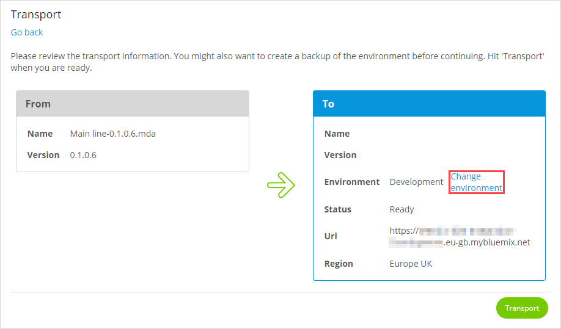

3.  Click **Transport** to deploy the package to the IBM Cloud environment. This will replace any current app deployed to this environment. If the app is already running, you will be asked to stop it so that your new app can be deployed.

### 5.2 Configure the Application {#ConfigureTheApplication}

1. You will see confirmation of the package which has been transported.

    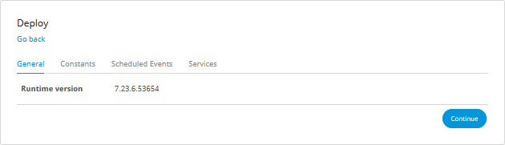

2. Change any constants in the Constants tab: select the constant you want to edit and then click **Edit**.

    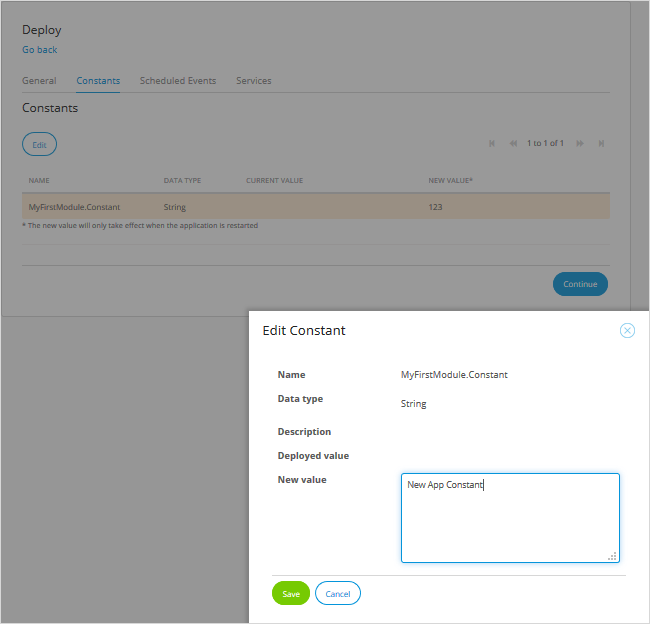

3. Toggle any scheduled events in the Scheduled Events tab: select the scheduled event you want to enable or disable and click **Toggle**.

    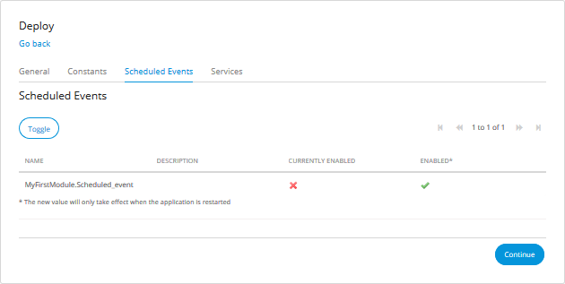

4. Select any additional services you need for your app. For more information see [Binding Services](#binding-services), below.

    {{% image_container width="75%" %}}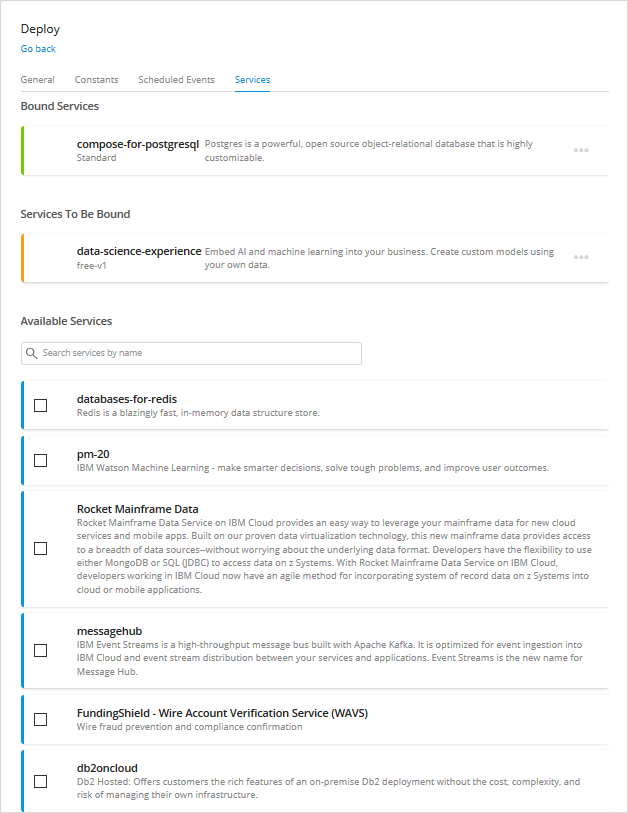{}

    {}In your initial deployment, do not remove any of the services with the status **Services To Be Bound**. For a new app, these services are all required for the correct deployment of the app.{}

5. Click **Continue** to continue to the Start Application confirmation page.

6. Click **Start Application** to start the application on IBM Cloud.

    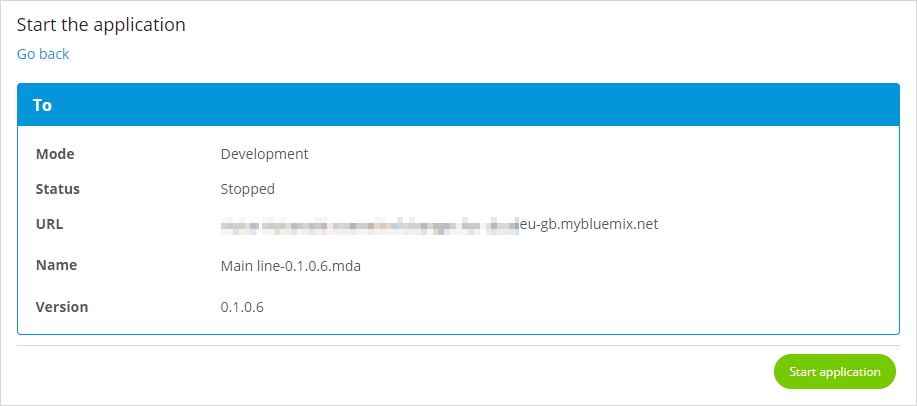

    {}This will bind any services which are in the status **Services To Be Bound**.{}

7. When the application has been started you will receive a confirmation message. Click **OK** and you will be taken to the Environment Details page for the selected environment. See [Environment Details](#EnvironmentDetails), below.

    

## 6 Transport App Between Environments {#TransportApp}

1. Click **Transport** on the source environment you want to transport to another environment. Environments without deployed apps will have the transport button grayed out and cannot be transported.

    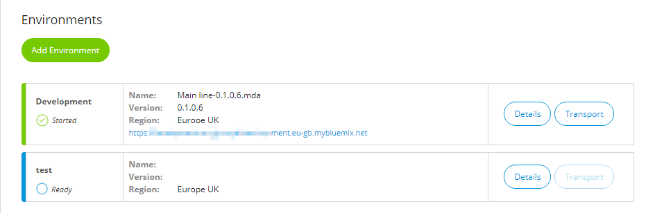

2.  Change the deployment environment if required by clicking **Change environment**.

    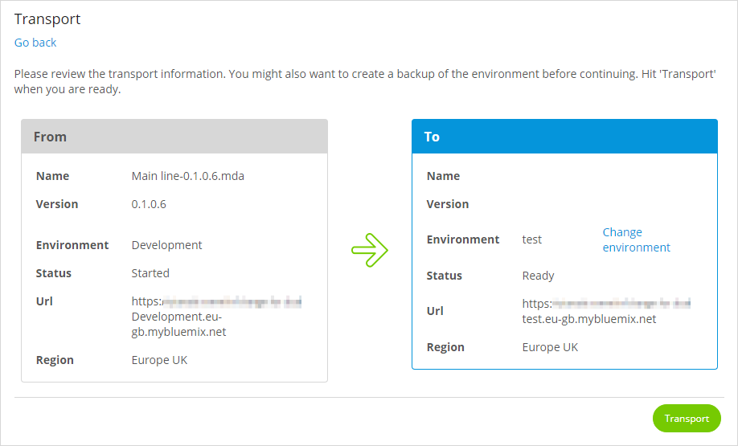

3.  Click **Transport** to deploy the package to the IBM Cloud environment. This will replace any current app deployed to this environment. If the app is already running, you will be asked to stop it so that your new app can be deployed.

When the app has been transported you will be on the page **Configure the Application**. This has the same options as the **Deploy** pages which are described above in the [Configure the Application](#ConfigureTheApplication) section.

## 7 Environment Details {#EnvironmentDetails}

The environment details page contains three tabs: General, Model Options and Services. Open the environment details by clicking **Details** on an environment on the Environments page of the Development Portal. You will also be taken to this page when you successfully deploy or transport your app.

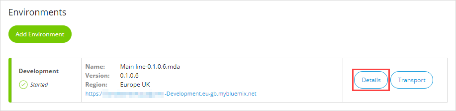

{}If you make changes to your app which you want be applied next time the app is deployed you must make them here.

Changes made to the app in IBM Cloud Portal are only temporary and can be overwritten by the values in the Mendix Developer Portal next time the app is deployed.{}

### 7.1 General Tab

This tab contains information on how the application is deployed on IBM Cloud.


Most of this page shows information about the app, but there are several options which allow you to change the app.

#### 7.1.1 Start/Stop Application

If the application is running, click **Stop Application** and confirm when asked to stop the application.

The button will change to **Start Application** which you can click to (re)start the application.

{}
You may need to use this option to stop and start your app after changing one of the settings on this page.
{}

If you receive an error trying to start the app, please refer to the [App Will Not Start](#willnotstart) section under *Issues*, below.

#### 7.1.2 Change Admin Password

Click **Change Admin Password** to change the password for the administrator account (by default, MxAdmin) in your Mendix app.

#### 7.1.3 View Recent Log

Click **View Recent Log** to see recent events written to the log.

#### 7.1.4 Delete Environment

**Delete Environment** enables you to delete the environment and, optionally, all its resources: including the app.

You will be asked to confirm that this environment should be removed. You will also be asked to confirm that the resources associated with the environment should also be removed. Note that the default is NOT to remove the resources.


{}
If you do not select **Remove resources** in this dialog, the resources will be left in IBM Cloud. This could be useful if you want to remove the environment but, for some reason, a resource cannot be removed. In this case, the resources can only be removed individually from within IBM Cloud Portal.
{}

#### 7.1.5 Change Development Mode

Click **Change** to change the Development Mode toggle. Set it to Yes if you want the application to run with only prototype security, or completely without security. This is not recommended for acceptance or production environments.

#### 7.1.6 Scaling

If the app is started or stopped (that is, the environment has been created successfully and the app has been deployed without errors) then options to scale the app are available.

Use the **Instances** slider to change the number of instances of the app which can run. This allows you to scale the app horizontally to support a large numbers of users, or to improve the app's resilience by allowing it to continue to run if there are any issues with one of the instances.

Use the **Memory per instance** slider to change the amount of memory allocated to each instance of the app ("user's current memory").

Click **Scale Now** to apply the new settings. If the application is running, it will be stopped and restarted to apply the settings. If it is stopped it will not be started automatically; the new settings will be used the next time the application is started.

Click **Reset** to return the values to what they were before the sliders were moved.

#### 7.1.7 Change License Subscription ID

Click **Change** to change the subscription secret which is the code which registers your production Mendix license to this environment.

### 7.2 Model Options Tab

This tab displays the application constants and allows you to edit them. It also lets you enable or disable scheduled events.


{}
You need to restart your app if you change any of these options.
{}

#### 7.2.1 Scheduled Events

You can see the status of each scheduled event. CURRENTLY ENABLED shows the status in the running app. ENABLED shows that status that will be applied the next time the app is restarted.

To change the state of a scheduled event, select it, then click **Toggle** to change the ENABLED flag.

#### 7.2.2 Constants

You can see the value of all the constants used by the app. CURRENT VALUE is the value in the running app. NEW VALUE is the value which will be used the next time the app is restarted.

To change a value, select the constant you want to change and click **Edit**.

### 7.3 Services Tab{#binding-services}

This tab displays Cloud Foundry services which are bound to the app, waiting to be bound to the app, or available to be bound to the app. These are the services which are available to you in IBM Cloud Platform and are the same services that you can see in the IBM Cloud Platform marketplace.

{{% image_container width="50%" %}}

{}

{}
**If you unbind the database (compose-for-postgreSQL) service, your app will probably stop working**

Other services should be selected, bound, and unbound through this **Services** page. Changes made in the IBM Cloud Portal will *not* be reflected in the Mendix Developer Portal.
{}

{}
Changes to bound services will not take place immediately. You will have to stop and start your application to activate the changes.

Services which will be bound when the application is stopped and restarted are listed in the category **Services To Be Bound**. You will also see an information message in this case: the button **Review Services** will list the services which are not currently bound.
{}

#### 7.3.1 Connecting Services

To connect a service in the section **Available Services**

1. Select one or more services (you can search for them by name).
2. Select a **Plan** for each service. This must be a plan which is part of your quota for this space.
3. Select a JSON **File** to upload if you need to add extra configuration.
4. Click **Connect Services**.

    

    The services you have selected will be added as **Services To Be Bound**. Now, you can upload JSON **File** with a configuration that will be applied to the service binding. 

**Uploading Configuration File**

To upload the JSON **File** to configure the service being bound, follow these steps:

1. Select the service in the **Service To Be Bound** section.
2. Click the ellipsis (**…**) next to the service for which you want to upload the file.
3. Select **Add Binding Configuration**.
4. Select the JSON **File** to upload.
5. Click **Save**.

The service bindings will be created with the provided configurations when you restart the application. 

{}
If you receive an error, and the service fails to bind please check all aspects of your IBM account. The error message may not provide full information about, for example, which plans you are allowed to choose for a particular service.
{}

If you receive an error trying to restart the app, please refer to the [App Will Not Start](#willnotstart) section under *Issues*, below.

#### 7.3.2 Unbinding and Removing Services

If you no longer require a service you can unbind it or remove it from your app.

**Unbinding a Service**

1. Click the ellipsis (**…**) next to the service you want to unbind in the **Bound Services** section.
2. Select **Unbind Service**.

    

3. Confirm by clicking **Unbind & Restart App** – if you want to unbind more services or do not want the change to happen immediately, then you can choose *Unbind*. However, this may leave the app in an unstable state.

    

    Once the service is unbound, it is deleted from the app environment and returned to the list of **Available Services**.

**Removing an Unbound Service**

1. Click the ellipsis next to the service you want to remove in the **Services To Be Bound** section.

2. Select **Remove Service**.

3. Confirm by clicking **Remove**

    The service is deleted from the app environment and returned to the list of **Available Services**.

## 8 Databases in IBM Cloud{#databases}

Mendix needs access to a relational database backend and can run using different types of database. For example: PostgreSQL database

### 8.1 Running Mendix on PostgreSQL

When you create your environment on IBM Cloud, you can select a PostgreSQL database. During the creation of the environment, a PostgreSQL service will be added to your space and, when you deploy your app, it will be bound to the PostgreSQL service.


## 9 Issues

### 9.1 Environment is not Created

If you add an environment and it fails to be created it will be shown with a red symbol next to it on the Environments page:

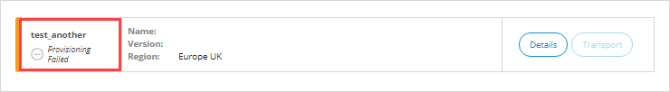

This could be caused by exceeding your organization quota limit for a service which you are trying to create, or for some other reason. To find the exact cause, do the following:

1. Click **Details** next to the failed environment.

    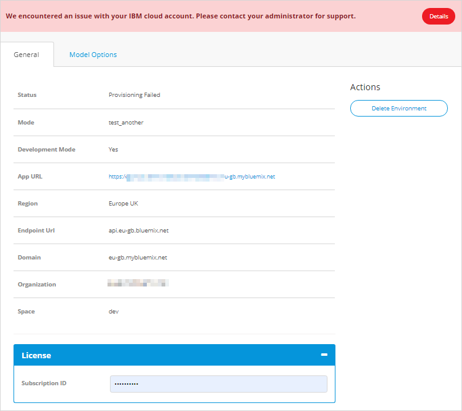

2. Click **Details** on the error message at the top of the page.

    

A more detailed description of the reason why the environment creation failed will be displayed.


### 9.2 Deleting an App

Note that if you are the last person to leave a Mendix app you can delete the app. However, this will not delete the app or resources on IBM Cloud. You can leave the app by going to the **General Settings** page of the Developer Portal and clicking **Leave app**.

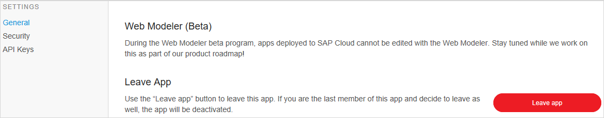

If you are the last member of the app development team, you will be asked if you want to delete the app.


{}
This will not stop the app and delete the deployment of the app in IBM Cloud.

If you want to delete your app and all its resources, delete the environment and resources first before you leave the app via the Mendix Developer Portal.
{}

You can still delete the app and its resources from IBM Cloud Portal, but you will then have to remove all the resources individually.

### 9.3 App Will Not Start{#willnotstart}

Under some circumstances an app with a service in the **Services To Be Bound** status will not restart. You will get an error with *Could not bind service...* in the details.


This indicates that IBM Cloud Portal is not able to bind the service, even though it has been instantiated correctly. If you remove the service from the app, then the app should restart successfully.

If you are trying to bind more than one new service, it is not possible to identify within the Developer Portal which service is causing the issue. If the culprit is not obvious, you will have to remove all the services or go to IBM Cloud Portal where you can use the service name in the error message to find which service is causing the error.

### 9.4 An Error Occurs While Deploying App From Studio Pro

If an app is deployed to IBM using the Studio Pro **Run** or **Publish** button before it has been started from the Developer Portal, the deployment will fail. This is because the marketplace services have not been bound.

{{% image_container width="50%" %}}

{}

If you use the Developer Portal to look at the details of the environment to which you are deploying, you will see that the services are still waiting to be bound.


Start the app from the Developer Portal to bind the services. Once they are bound, you can deploy your app from Studio Pro, as usual.

## 10 Status of IBM Cloud Deployment

The Mendix status page ([https://status.mendix.com/](https://status.mendix.com/)) shows the current status of Mendix services. If you have issues with deploying to IBM Cloud via the Developer Portal, you can check the Mendix status page to see if IBM Cloud deployment is operational (under **Mendix Services**) or if there are other Mendix issues which may be affecting your deployment.
