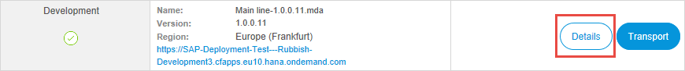

## 1    Introduction

As a Mendix user with an IBM Cloud account you have access to many IBM resources which you want to use in a Mendix app. This how-to shows you how to create a Mendix app on the Mendix platform and then deploy it to IBM Cloud.

**This how-to will teach you how to do the following:**

* Select an IBM app template and ask Mendix to create the app
* Create a deployment package for IBM Cloud
* Deploy to, and test your app on, IBM Cloud

## 2 Prerequisites

Before starting this how-to, make sure you have completed the following prerequisites:

* Have an [IBM Cloud account](https://console.bluemix.net/registration/)
* Download the [Mendix Desktop Modeler](https://appstore.home.mendix.com/link/modelers/) – you will need 7.11.0 or higher
* Be familiar with the basic concepts of editing and deploying a Mendix app. If you are new to Mendix, the [Starter App Tutorial](/howto/tutorials/starter-apps) will introduce you to these concepts
* Be familiar with the basic concepts of IBM Starter Kits and Toolchain

## 3 Creating the New App and Setting Up IBM Cloud

You have decided to create a new Mendix app using an IBM template which you will ask Mendix to deploy to your account on IBM Cloud.

### 3.1 Creating a New App

Firstly, you will create your Mendix app which you wish to deploy.

To start creating a new app, follow these steps:

1.  Log in to your Mendix Account.

2.  Click **Create App** to create a new app.

    

3.  Click an IBM app to choose it as the starting point for your app.

    

4.  Click **Use this app**.

5.  Choose a name for your app and click **Create App**.

6.  Wait while Mendix creates a copy of the starter app you have chosen and takes you to IBM Cloud.

### 3.2 Setting Up the Project on IBM Cloud

You are now on IBM Cloud and need to tell it more about your project, so that IBM Cloud can add the resources you need.

To set up IBM Cloud, follow these steps:

1.  Click **Setup Cloud**.

    

2.  Log in to IBM Cloud if you are not already logged in.

    The **App name** name of your project is already filled in.

3. Ensure that the correct account is shown at the top right of the screen (next to your avatar) if you have access to more than one account on IBM Cloud.

4. Choose the appropriate **Resource Group**

5.  Click **Create**.

    

6.  Click **Link Account**.

    

    This is only required for new projects. It links this project to the project on Mendix.

    If you have not linked an IBM Cloud project to Mendix before, you will be asked to confirm that IBM Cloud can have access to some of your Mendix data. Please **Authorize** this.

    You will now be returned to the project page.

7.  Click **Choose Deployment**.

    

    You can choose to deploy to Cloud Foundry or Kubernetes.

#### 3.2.1 Deploying to Cloud Foundry

1.  Set the **Number of instances**; the default is _1_.

2.  Set the **Memory allocation per instance**; the default is _512_.

3. Choose the **Region**, **Organization**, **Space**, and **Domain** to deploy to.

4. Change the **Host** if required; the default is the name of your app.

    {}It is possible that your deployment will fail if your **Host** is not unique within your region. In this case, use a different host name.{}

5.  Click **Create**.

    

6. Wait until the **Deployment Details** indicate that the toolchain is configured.

    

    Your IBM Cloud Foundry environment is now configured. Go to section 3.3 [Creating a Package for IBM Cloud](#create-package) to learn how to create a package which will deploy to IBM Cloud.

#### 3.2.2 Deploying to Kubernetes

{}Please note that deploying to Kubernetes currently has a number of issues which mean that it is not suitable for production environments. Please contact [Mendix support](https://support.mendix.com) if you want to use Kubernetes for a production environment on IBM Cloud.
{}

1. Choose the **Region**, **Organization**, **Space**, and **Cluster name** to deploy to.

2.  Click **Create**.

    

3. Wait until the **Deployment Details** indicate that the toolchain is configured.

    

Your IBM Kubernetes environment is now configured. Go to section 3.3 [Creating a Package for IBM Cloud](#create-package) to learn how to create a package which will deploy to IBM Cloud.

### 3.3 Creating a Package for IBM Cloud {#create-package}

Before you can deploy a package to IBM Cloud you have to create it. At any time, you can create a new deployment package from a committed version of the project. If you are working with the Desktop Modeler you will first have to commit the project.

{}
You can also deploy your app (the steps in this section of this How-To) automatically from the Desktop Modeler. However, you will then have less control over the deployment.

If you click **Run** in the Desktop Modeler this will automatically:

* commit the project
* generate a deployment package
* push the deployment package to IBM Cloud

You will still need to go to IBM Cloud and manually deploy the package; a message within the Desktop Modeler will let you know when the package is ready and will give you the link to IBM Cloud. See section 3.4 [Deploying a Package to IBM Cloud](#deploy-package) for instructions on how to do this.
{}

To create a package for IBM Cloud within Developer Portal, follow these steps:

1.  Click **Edit on Mendix** to return to Mendix.

2.  Open the **Environments** page.

    You are now ready to create a deployment package which you will then push to IBM Cloud. It is only after the deployment package has been created and pushed to IBM Cloud that you can deploy your app.
 
3.  Click **Create package from teamserver**.

    

4.  Select the branch on which to base the build and click **Next**.

    

    {}Initially, you will only have the Main line. However, when you create deployment packages in the future, there may be other branches available.
    {}

5.  Select the revision of this branch and click **Next**.

    

    {}You will see a number if revisions. Note that a package cannot be created from the first revision as this contains no application template.
    {}

    {}Please do not choose to create a package from revision number 1.
    {}

6.  Type a **Tag description** (optional) and set the version number for this build.

7.  Click **Build this revision**.

    

8.  Click **OK** to confirm the information message.

    

9.  Click **Details** next to the deployment package to see details of the deployment package.

    

    You can now see and manipulate the package details.

10. Click **Environments** to return to the previous page.

    

    When the project is built it will appear in the list of deployment packages. While it is being built, there will be a 'spinner' showing that the package is not yet complete. Once the package is ready for deployment this will be replaced by a tick.

    

    The package is still within the Mendix environment and needs to be pushed to IBM Cloud. From there it can be deployed.

11. Click **Push** next to the package you want to deploy. This will push this deployment package to IBM Cloud.

### 3.4 Deploying a Package to IBM Cloud{#deploy-package}

{}A package is sent to IBM Cloud to be deployed. Currently you have to do this deployment manually.
{}

1.  Click the **here** link or the **Open IBM Cloud** button to go to your IBM Cloud project page.

    

    Alternatively, follow the link you are given in the Desktop Modeler, or choose **Open IBM Cloud** in the *Environments* section of the Developer Portal.

    You may need to configure your browser to allow the IBM Cloud page to open.

    You will now be back on your IBM Cloud project page.

2.  Click **Deploy Application**.

    

    You will see a confirmation message in the top right of the screen.

    

3.  Wait until the app is deployed. This can take several minutes.

    If you want to see the progress then do the following:

    * Click **View toolchain**
    * Click the **DELIVER > Delivery Pipeline** tool in the toolchain
    * The **Deploy Stage** will indicate *STAGE PASSED* when your app has been deployed (you can also click to see the build log here, if you are encountering issues)

    {}Although there is a button here marked **View app**, it is not currently possible to see your app this way. You will need to view it from the Mendix site.
    {}

    
    {}Under some circumstances, the toolchain for Kubernetes cannot be built.

    Go to the toolchain and look at the log from the **Build Stage**. If the log includes the following message, then you will need to remove any images by going to **Containers > Registry > Images** and deleting them.

    `You have exceeded your storage quota. Delete one or more images, or review your storage quota and pricing plan.`
    {}

    You can also see when your deployment is complete from the Mendix app's *Environments* page.

5.  Click **Edit on Mendix** to return to Mendix.

6.  Click **Environments** to see the Mendix environments page.

    When the deployment is complete you will see your deployed app under **Managed by IBM Cloud**. You will also see activities related to the deployment under **Activity**.

7.  Click **View App** to run and view your app.

    

    You can also view your app directly using the url which is given to you:

    

## 7 Environment Details

The environment details page contains two tabs: General and Model Options. Open the environment details by clicking **Details** on an environment on the Environments page of the Development Portal. You will also be taken to this page when you successfully deploy or transport your app.

{}If you make changes to your app which you want be applied next time the app is deployed you must make them here.

Changes made to the app in the SAP Cloud Platform cockpit are only temporary and can be overwritten by the values in the Mendix Developer Portal next time the app is deployed.{}

### 7.1 General Tab

This tab contains information on how the application is deployed on SAP Cloud Platform.

Most of this page shows information about the app, but there are several options which allow you to change the app.

#### 7.1.1 Start/Stop Application

If the application is running, click **Stop Application** and confirm when asked to stop the application.

The button will change to **Start Application** which you can click to (re)start the application.

{}
You may need to use this option to stop and start your app after changing one of the settings on this page.
{}

#### 7.1.2 Change Admin Password

Click **Change Admin Password** to change the password for the administrator account (by default, MxAdmin) in your Mendix app.

#### 7.1.3 View Recent Log

Click **View Recent Log** to see recent events written to the log.

#### 7.1.4 Delete Environment

**Delete Environment** enables you to delete the environment and, optionally, all its resources: including the app.

You will be asked to confirm that this environment should be removed. You will also be asked to confirm that the resources associated with the environment should also be removed. Note that the default is NOT to remove the resources.

{}
If you do not select **Remove resources** in this dialog, the resources will be left in the SAP Cloud Portal. In this case, they can only be removed individually from within the SAP Cloud Platform cockpit.
{}

#### 7.1.5 Change Development Mode

Click **Change** to change the Development Mode toggle. Set it to Yes if you want the application to run with only prototype security, or completely without security. This is not recommended for acceptance or production environments.

#### 7.1.6 Scaling

If the app is started or stopped (that is, the environment has been created successfully and the app has been deployed without errors) then options to scale the app are available.

Use the **Instances** slider to change the number of instances of the app which can run. This allows you to scale the app horizontally to support a large numbers of users, or to improve the app's resilience by allowing it to continue to run if there are any issues with one of the instances.

Use the **Memory per instance** slider to change the amount of memory allocated to each instance of the app ("user's current memory").

Click **Scale Now** to apply the new settings. If the application is running, it will be stopped and restarted to apply the settings. If it is stopped, the new settings will be used the next time the application is started.

Click **Reset** to return the values to what they were before the sliders were moved.

#### 7.1.7 Change License Subscription ID

Click **Change** to change the subscription secret which is the code which registers your production Mendix license to this environment.

### 7.2 Model Options Tab

This tab displays the application constants and allows you to edit them. It also lets you enable or disable scheduled events.

{}
You need to restart your app if you change any of these options.
{}

#### 7.2.1 Scheduled Events

You can see the status of each scheduled event. CURRENTLY ENABLED shows the status in the running app. ENABLED shows that status that will be applied the next time the app is restarted.

To change the state of a scheduled event, select it, then click **Toggle** to change the ENABLED flag.

#### 7.2.2 Constants

You can see the value of all the constants used by the app. CURRENT VALUE is the value in the running app. NEW VALUE is the value which will be used the next time the app is restarted.

To change a value, select the constant you want to change and click **Edit**.

## 4 Related Content

* [IBM Cloud account](https://console.bluemix.net/registration/)
* [Mendix Desktop Modeler](https://appstore.home.mendix.com/link/modelers/)
* [Starter App Tutorial](/howto/tutorials/starter-apps)
