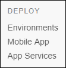
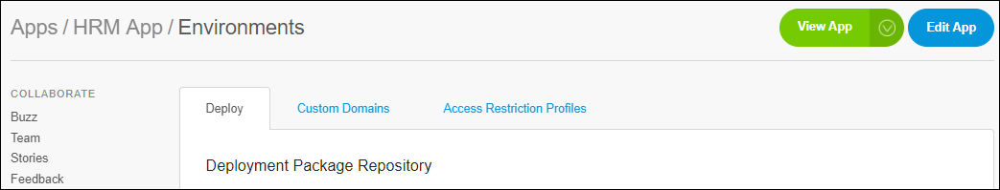

## 1 Introduction

The **Deploy** category allows you to deploy your app to several platforms.

   

## 2 Environments

The **Environments** page is divided into the following tabs:

* **Deploy** tab
    * Deployment Package Repository
    * Environments
    * Activities
* **Custom Domain** tab
    * Certificates
    * Linked Custom Domains
* **Access Restriction Profiles**
    * IP range filters
    * Client certificate verification
    

       
​    
For more details, see [Environments](environments).    
​    
### 2.1 Environment details

If you click **Details** of a specific environments, you will be able to manage your environment in several tabs of the **Environment details** page.

   

For more details, see [Environment details](environments-details).       

## 3 Mobile App

On this page, you can manage and publish your app in mobile app stores.

Mendix supports Android and iOS.

For more details, see [Mobile App](mobileapp).  

## 4 App Services

The **App Services** page lets you publish your app service, application, or widget to the Mendix App Store.

For more details, see [App Services](app-services).  

## 5 Related Content

* [How to Configure Custom Domains](/developerportal/howto/custom-domains)
* [How to Deploy to the Mendix Cloud](/developerportal/howto/deploying-to-the-cloud)
* [Mendix Cloud Status](/developerportal/deploy/mendix-cloud-status)
* [Mendix Cloud V4 - FAQ](/deployment/mendixcloud/mxcloudv4)
* [How to View the Mendix Cloud Version and Region](/developerportal/howto/cloud-version-region)
* [Two-Factor Authentication](two-factor-authentication)
