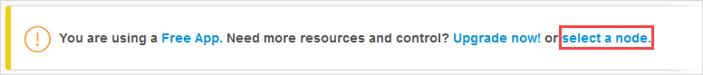

## 1 Introduction

To run Mendix apps in production on the Mendix Cloud, they must be linked to a licensed node. Without a licensed node you can still deploy your app and test it, however it will only run for a couple of hours before shutting down, and is restricted in the number of users it can have.

This page explains how you can link your app to a licensed cloud node. It covers:

* Free Apps
* Moving an existing app

## 2 Overview

When you deploy an app to the cloud, whether it is a free app or a licensed app, it will consist of a number of parts:

* Mendix Runtime – essentially one or more instances of your app running in a container
* Routing layer
* Network
* Database
* File storage service

This is the Mendix **environment**.

In a **node** in the Mendix Cloud, you may have one, or more, of these *environments*. More information about *nodes* can be found here: [Nodes](/developerportal/company-app-roles/nodes).

For a **Free App**, your app has a single *Sandbox* environment which allows you to test your app. However, this comes with restrictions on how long it will run and the number of users it will support. You cannot scale the app, and the operational capabilities are limited.

In a **licensed node** you have everything you need to stage and deploy your app. You can have several different *environments* to support development: test, acceptance, and production, for example. You can scale these environments by providing more memory or multiple instances, and you can configure and monitor them using the tools in the *Developer Portal*.

This document describes how you can link apps to a licensed node.

{}
These instructions will not move databases, file storage, or any other environment configurations to another node. Only the deployment package of a Mendix **model** – the app as built in the Modeler – is moved.
{}

## 3 Prerequisites

### 3.1 Obtaining a Licensed Node

To license an app, you need to have a licensed cloud node available:

* if your contract allows for more licensed nodes, please reach out to Mendix Support (see https://support.mendix.com for contact details) so they can create the node for you

* if your contract does not allow for more licensed nodes, please contact your Customer Success Manager (CSM)

### 3.2 Authorization

You need to be the [Technical Contact](/developerportal/company-app-roles/technical-contact) of the node, otherwise you will not have the rights to link an app to the node.

You need to have enabled two-factor authentication. See [Two-Factor Authentication](two-factor-authentication).

## 4 Linking Your App to a Licensed Node

You have deployed an app: either as a free app, or to a licensed node. You now want to link it to a licensed node, or to a different licensed node.

For the specific case of swapping two apps between licensed nodes, see the guidance in section 5 [Exchange Linked Apps Between Nodes](#exchange-apps).

### 4.1 Backing Up{#backing-up}

When you remove an app from its environment you may want to take the data (database and file store) with it. It is a good idea, in any case, to take backups before performing major activities.

The documentation on downloading a backup is here: [Download a Backup](/developerportal/operate/how-to-download-a-backup). 

{}
When you unlink your *Free App* from its Sandbox environment, the environment will be permanently deleted. This means that you will not be able to recover any data once the app is unlinked.

If you are unlinking from a *licensed node*, the node is NOT deleted and data is retained in the node.
{}

### 4.2 Unlinking From Current Environment

Before you can link an app to a new environment, you need to unlink it from its current environment. All apps will be created as a *Free App* by default the first time they are deployed. In most cases, therefore, you will have to unlink them.

### 4.2.1 Unlinking a Free App

1.  Go to the **[Developer Portal](http://home.mendix.com)**.

2.  Select the app which you want to unlink.

3.  Go to **Environments** in the left navigation panel.

    If the environments tab shows the following message, then your app is not currently linked to a node and you can go straight to section 4.3 [Connect Your App to a Licensed Node](#connect-app).

    
   
4.  Click **Unlink your app**.

    

5.  Click **Yes, delete all data and unlink this app** to confirm.

    

    {}Your Data will be deleted.{}

6.  Validate with your [Two-Factor Authentication](two-factor-authentication).

Your app has now been unlinked from the Sandbox environment.

### 4.2.1 Unlinking a Licensed App

It is not possible to unlink an app from a licensed node. The only way to do this is to connect another app to the licensed node; this will unlink the existing app automatically.

An example of how this behavior can be used is given in section 5 [Exchange Linked Apps Between Nodes](#exchange-apps).

### 4.3 Connecting Your App to a Licensed Node{#connect-app}

There are two methods to connect your project to a licensed cloud node.

{}
If there is already an app linked to the target node, it will be **unlinked automatically**.
{}
 
{}
Apart from the app, the rest of the environment(s) in the target node will remain the same. This includes:

* the *container* and its configuration (including memory, instances, and environment variables)
* Routing layer
* Network
* Database (both structure and content)
* File storage service (including all content)
{}

#### 4.3.1 Connecting Your App: Method 1

1.  Go to the [Developer Portal](http://home.mendix.com).

2.  Select the *app* you want to link to the *node*.

3.  Go to **Environments** in the left navigation panel.

4.  Click **Select a node**.

    

5.  Click on **Use this node**.

    

6.  If there is already an app linked to this node, you will be asked to confirm that you want to replace it.

    

6.  Validate with your [Two-Factor Authentication](two-factor-authentication).

Your app is now connected to this node.

### 4.3.2 Connecting Your App: Method 2

{}
This method will only work if there is currently no app linked to the node.
{}

1.  Go to the [Developer Portal](http://home.mendix.com).

2.  Click **Apps** in the top navigation panel.

3.  Click **My Apps** and select **Nodes**.

    

4. Select the node that to which you want to link an app **Select Node**.    

    

5.  Choose the app you want to connect by clicking **Connect to this app**.

    

The app is now connected to the licensed cloud node.

### 4.4 Restoring Backup

After you have linked your App to a licensed node it will be using the resources currently in that node. For example, the data in the existing database.

If you want to use the data which was originally in your app, you will need to restore the backup from your old node.

The documentation on restoring a backup is here: [Restore a Backup](/developerportal/operate/how-to-restore-a-backup).

## 5 Exchange Linked Apps Between Nodes{#exchange-apps}

If you want to swap the nodes of two apps which are already linked to nodes, you can do it by creating a new (third) app. By using the fact that linking an app to a node will remove an app which is already linked, you can use this app to unlink one app. You can then move this app to the other node, unlinking the app which is there. Finally, you can put this app into the first node.

For example, take the following case:

* **App A** is on **Node 1**

* **App B** is on **Node 2**

* you want to swap them so that **App A** is on **Node 2** and **App B** is on **Node 1** 

To link **App A** to **Node 2** and **App B** to **Node 1**, follow these steps:

1. Create a new empty app **App C** which is not connected to any environment.

2. Link **App C** to **Node 1** (see section 4.3 [Connecting Your App to a Licensed Node](#connect-app). This will unlink **App A**.

3. Now that **App A** is unlinked from **Node 1**, it can be linked to **Node 2**.

4. **App B** will now no longer have a node. You can now link **App B** to **Node 1**.

You have now swapped App A and App B between nodes.

## 6 Related Content

*   [Mendix Cloud](mendix-cloud-deploy)
