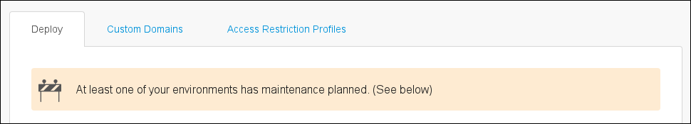
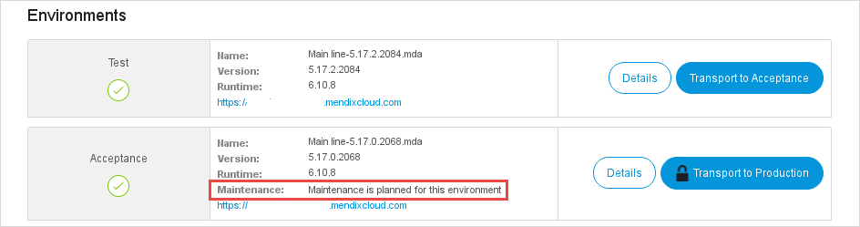
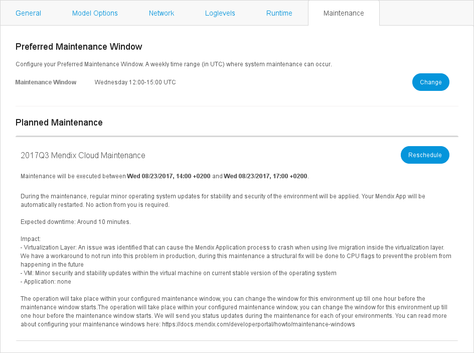
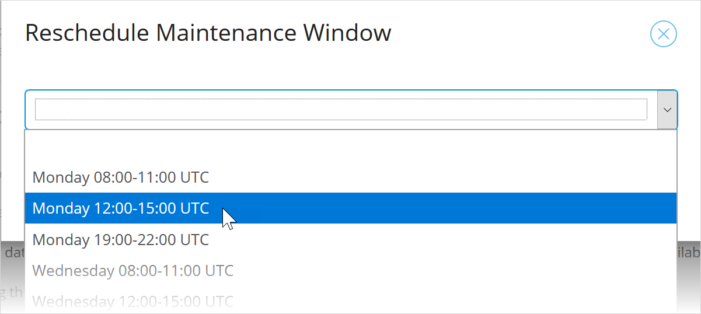

## 1 Introduction

In the Mendix Cloud Professional and Enterprise plans you can configure a weekly time range (*Maintenance Window*) when system maintenance can occur. Whenever Mendix has planned maintenance operations, these will be executed within your preferred time window. Naturally, we will always inform you upfront on any upcoming maintenance operations in accordance with your SLA.

### 1.1 Preferred Maintenance Window

The **Preferred Maintenance Window** is a standard time range in a week where you would prefer system maintenance to occur. This is always shown as **UTC** so don't forget to convert it to your local timezone.

This window will only be used when planned maintenance is being scheduled.

### 1.2 Planned Maintenance

**Planned Maintenance** is a maintenance operation that will be carried out within your configured maintenance window. This is shown in local time, together with an offset from UTC.

## 2 Prerequisites

To view maintenance windows, you need to have monitor or backup access to your Mendix app. To configure them, you need to have transport rights to it. For more information, see [Node Permissions](/developerportal/deploy/node-permissions).

## 3 Configuring Maintenance for Your Application

{}
Maintenance windows and planned maintenance are defined in UTC time format. When selecting a time period, remember to convert to UTC from your local time.
{}

### 3.1 Configuring the Maintenance Window for Your Application

Follow the instructions below to configure a maintenance window:

1. Go to the [Developer Portal](http://sprintr.home.mendix.com).

2. Go to the **Environments** page for your app.

    

3. Click **Details** for the environment you want to configure:

    

4. Go to the **Maintenance** tab:

    
    
5. Click **Change** to modify the preferred maintenance window of your environment. Transport rights for this environment are required.

6. Choose one of the maintenance windows suggested.

7. Click **Save** to confirm your new planned maintenance window.

{}
Changing your preferred maintenance window will not change the time of any planned maintenance which is already scheduled. You will need to reschedule planned maintenance separately.
{}

### 3.2 Rescheduling Planned Maintenance for Your Application

When a maintenance operation is planned, it will show up under **Planned Maintenance**. By default it will be planned in your preferred maintenance window.

{}
Planned maintenance windows are displayed in your local timezone, as indicated by the offset (for example `+02:00` in the image above).
{}

You can reschedule planned maintenance up  to one hour before the beginning of the planned maintenance window by doing the following:

1. Click **Reschedule** to override a planned maintenance window.

2. Choose one of the maintenance windows suggested. It does not have to be in your preferred maintenance window.

    {}When rescheduling, the maintenance window options are in **UTC**. When you save a new planned maintenance window, it will be shown in the local timezone.{}

    

3. Click **Save** to confirm your new planned maintenance window. 

## 4 Read More

* [App Roles](/developerportal/collaborate/app-roles)
* [Node Permissions](/developerportal/deploy/node-permissions) 
