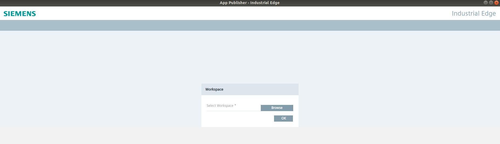
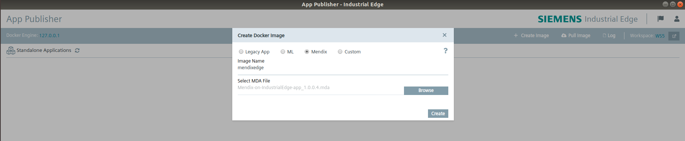
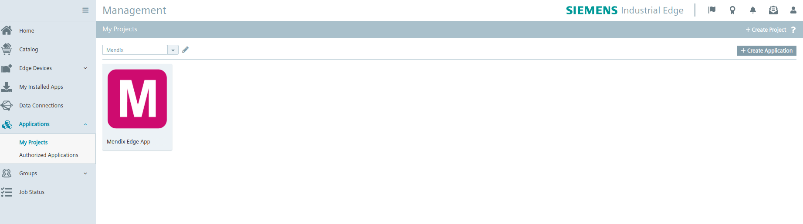
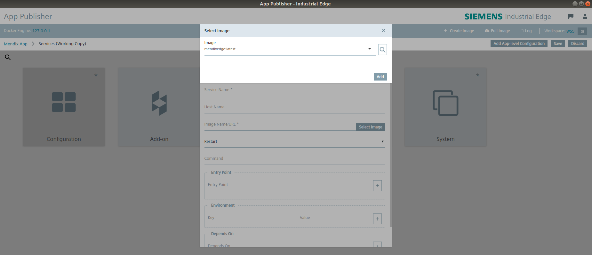

## 1 Introduction

This documentation is meant for Mendix developers who want to use their apps in the Industrial Edge environment.

[Industrial Edge](https://new.siemens.com/global/en/products/automation/topic-areas/industrial-edge/production-machines.html) is the SIEMENS platform to host applications from different vendors on a computing platform close to the shopfloor. By that, Industrial Edge enables extensions of automation, deployments of demanding streamprocessing and learning algorithms as well as hosting from integration code to site automation.

Industrial Edge empowers factory operators to create custom applications on the Mendix low-code platform that run locally as Edge Apps. Industrial Edge provides amongst others the [Industrial Edge App Publisher (IEAP)](https://support.industry.siemens.com/cs/us/en/view/109799477), a tool installed on a development PC to convert Mendix apps to Industrial Edge Apps. The Industrial Edge App Publisher is available for Windows and Linux operating systems.


## 2 Prerequisites

To convert your Mendix app to an Industrial Edge App, the following is required:

* A **deployment package (.mda)** of your Mendix app
* The Industrial Edge App Publisher UI/CLI installed on your developement PC

   Required Industrial Edge App Publisher version:
    * IEAP UI: minimum V1.2.8  
    * IEAP CLI: minimum V1.3.3
* [Docker](https://docs.docker.com/get-docker/) with [tcp Socket enabled](https://docs.docker.com/engine/reference/commandline/dockerd/) for Docker daemon
* An Industrial Edge Management (IEM) to deploy your app 

The following is also required if you want to test and deploy your converted Mendix app:

* An Industrial Edge Device (IED) to install the Mendix app onto it


## 3 Convert Mendix app to Edge App

To convert your Mendix app into an Industrial Edge App, follow the instructions described below.

### 3.1 Create a deployment package of your Mendix app

[Create deployment package(.mda)](https://docs.mendix.com/refguide/create-deployment-package-dialog) of your Mendix app.

### 3.2 Create Docker image of Mendix app  

For all the steps described below, refer to the [Industrial Edge App Publisher - Operation](https://support.industry.siemens.com/cs/us/en/view/109799477) manual.

#### 3.2.1 Industrial Edge App Publisher UI

* Select the workspace (an empty folder) which will be used by the Industrial Edge App Publisher to store the app related data.


* Connect to the Docker daemon.

* Connect to an Industrial Edge Management.

* Create a Docker image of your Mendix app: 
    * Click **Create Image** and select **Mendix**.
    * Enter the name of the Docker image you want to create.
    * Click **Browse** and select the **deployment package(.mda)** of your Mendix app.
    * Click **Create**.



#### 3.2.2 Industrial Edge App Publisher CLI

Create the Docker image of your Mendix app by entering the respective commands into the CLI.
  
* Connect to the Docker daemon:
```shell
 ie-app-publisher-linux de c -u http://127.0.0.1:2375
```
* Create a Docker image of your Mendix app:
```shell
ie-app-publisher-linux im c -n mendixedge:latest -f /root/mymednixapp.mda
```

Once the Docker image is built, the next step is to create the Mendix Edge App.


## 4 Create Mendix Edge App 

After you have created the Docker image of your Mendix app, you must create the corresponding Industrial Edge App and its version. To do so, follow the steps described below.

### 4.1 Create Mendix app on IEM side

* Log into your IEM.
* Create a project and the according Mendix app inside the project.

You find the procedure and additional information on how to create a project and an app inside of it in the **Applications > My Projects** section in the [Industrial Edge Management - Operation](https://support.industry.siemens.com/cs/us/en/view/109799510) manual.



Once you have created the Mendix app on IEM side, you must create a version of your Mendix app in the Industrial Edge App Publisher.

**_Note:_** 
You can skip this step if you just want to create a standalone app which does not require an IEM connection in the Industrial Edge App Publisher.

### 4.2 Create App Version

#### Industrial Edge Configuration File support

When running Mendix on Industrial Edge it is possible to add a configuration file for each Edge device with specific environment variable next to the default variable which are configured within the docker compose file. 

The container will query for a specific location, based on the environment variable: "IEM_CONFIG_PATH", for files with the extention ".env".  Such a file can contain 1 or more environment variable, which will be added to the environment variable of the container. This can be used to set Edge device specific Constants, Scheduled events or custom runtime settings. Check [here](https://github.com/mendix/cf-mendix-buildpack#configuring-constants) for the syntax to use. 

Below an example compose file including the "IEM_CONFIG_PATH""

#### 4.2.1 Industrial Edge App Publisher UI

* Click the converted Mendix Edge App.
* Click **Add New Version**.
* Enter all required Docker Compose configurations and information of for your Mendix app in the provided wizard. 
* In the wizard, select the Docker image which you have created in Step 3.2.

* Click **Save** and then **Review**.

    The docker-compose.yml file of your Mendix app will look like this for example:
 ```yaml
    version: '2.3'
        services:
            mendixapp:
                image: mendixedge:latest
                healthcheck:
                    test: ['CMD', 'curl', '-f', 'http://localhost']
                    interval: 15s
                    retries: 2
                    start_period: 10s
                    timeout: 3s
                environment:
                    ADMIN_PASSWORD: *******
                    DATABASE_ENDPOINT: 'jdbc:hsqldb:file:~/data/database/db:mem:mendix'
                    MXRUNTIME_DatabaseType: HSQLDB
                    MXRUNTIME_DatabaseJdbcUrl: 'jdbc:hsqldb:file:~/data/database/db:mem:mendix'
                    IEM_CONFIG_PATH: /cfg-data
                volumes:
                   - './publish/:/publish/'
                   - './cfg-data/:/cfg-data/'
                mem_limit: 1gb
                restart: unless-stopped
                ports:
                   - '60000:8080'
                links:
                    - db
            db:
                image: mysql:5.7
                environment:
                  - MYSQL_USER=mendix
                  - MYSQL_PASSWORD=mendix
                  - MYSQL_DATABASE=mendix
                  - MYSQL_ROOT_PASSWORD=root
                ports:
                  - 3306:3306
```

* Click **Validate & Create**.

    This will create the version metadata in your workspace which you have selected in Step 3.2
* To upload the created app version, click **Start Upload**. 

#### 4.2.2 Industrial Edge App Publisher CLI

Create the app version by entering the respective commands into the CLI.

* Create an empty folder, and run the following command inside that folder to initialize a workspace:
```shell
 ie-app-publisher-linux ws i
 ```
* Connect the Industrial Edge App Publisher to an Industrial Edge Management:
```shell
 ie-app-publisher-linux em li -u "https://int.portal.t.edge.siemens.cloud" -e user@siemens.com -p P@ssword123
 ```
* List the project including its apps and fetch the 'applicationId' which will be needed for creating an app version:
```shell
 ie-app-publisher-linux em pr l -k "projectId, name"
 ie-app-publisher-linux em pr la -p "758aa412254545465" -k "applicationId, title"
 ```
* Create a version of your Mendix app:
```shell
 ie-app-publisher-linux em app cuv -a '39853716a55048c9935e451a63eecc89' -v '0.0.1' -y './docker-compose.yml' -c 'change logs' -n -n {"mendixapp":[{"name":"mendix","protocol":"HTTPS","port":"8080","headers":"","rewriteTarget":"/"}]}  -s 'mendix' -t 'FromBoxReverseProxy' -u '8080' -r '' 
 ie-app-publisher-linux em app uuv -a '39853716a55048c9935e451a63eecc89' -v '0.0.1' 
 ```


## 5 Install your Mendix app on an Edge Device 

### 5.1 Prerequisites

You have added an Edge Device to your IEM.
You find the procedure and additional information on how to add an Edge Device to the IEM in the **Operations in the Management UI > Connecting an Edge Device** section in the [Industrial Edge Device - Operation](https://support.industry.siemens.com/cs/us/en/view/109799507) manual.

### 5.2 Procedure

* Log into your IEM.
* Navigate to **Applications > My Projects**.
* Click the tile of the Mendix app.
* To install an app version, click the install action icon of the corresponding version.
* Select the Edge Devices on which you want to install the Mendix app version.
* Click **Install**.

**_Note:_** 
For more information on how to install an app (version), refer to the [Industrial Edge Management - Operation](https://support.industry.siemens.com/cs/us/en/view/109799510) manual.


## 6 More info

See the below documents for more information on Industrial Edge operations:

* [Industrial Edge Device - Operation](https://support.industry.siemens.com/cs/us/en/view/109799507) 
* [Industrial Edge Management - Operation](https://support.industry.siemens.com/cs/us/en/view/109799510)
* [Industrial Edge App Publisher - Operation](https://support.industry.siemens.com/cs/us/en/view/109799477)
