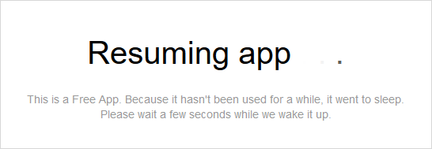
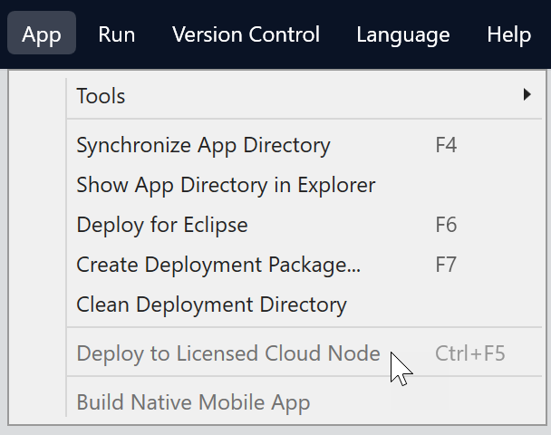
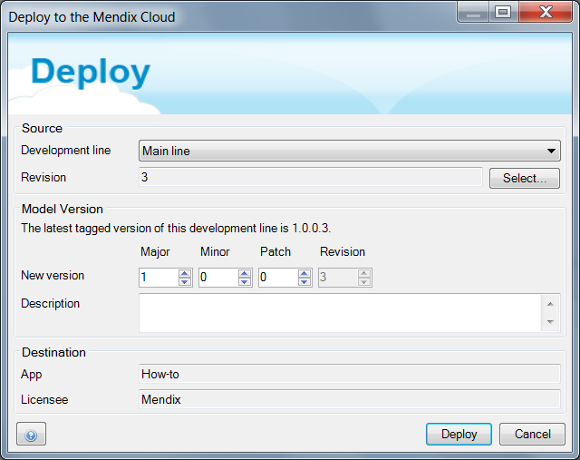
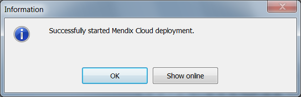
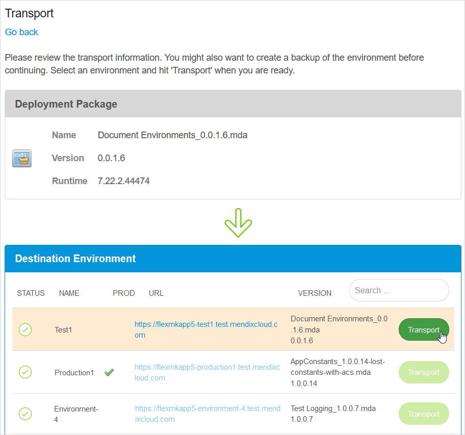
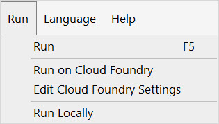
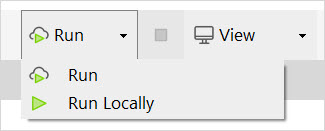

## 1 Introduction

The Mendix Cloud is a public cloud service for Mendix applications; this is the default deployment option for Mendix applications. You can deploy either a limited **Free App** or an app running on a licensed cloud node.

### 1.1 Free App{#free-app}

If you are new to the Mendix community and would like to deploy and share your own app, you can do so for free on our public cloud offering. The Free App environment allows any Mendix developer to create and share their applications with their users. Note that a Free App does not support complex or large applications.

A Free App has a number of limitations compared to a licensed app. The main limitations are summarized in the table below:

| Feature | Free App | Licensed App |
| --- | --- | --- |
| **Number of Users** | Unlimited users. | Depends on your pricing plan.¹ |
| **Sleep Mode** | Goes into Sleep Mode after an hour or so of inactivity and automatically resumes when a user accesses it. All your data is retained while the app is in Sleep Mode. | Does not have a Sleep Mode. |
| **Disk Storage** | 0.5Gb Database and 1Gb Files. | Depends on your pricing plan.¹ |
| **App CPU** | 0.5 Cores. | Depends on your pricing plan.¹ |
| **Scheduled Events** | Are not run. | Are run and can be configured from the Developer Portal. |
| **Environments** | Single environment in the Mendix Cloud. | A node in the cloud which has one or more environments, for example, production, acceptance, and test. |
| **Deployment** | Can only be deployed to the cloud from Mendix Studio or Studio Pro. | Can be deployed from the Studios, or from the Developer Portal. |
| **Custom Domains** | Not available. | Can be configured from the Developer Portal. |
| **Access Restriction Profiles** | Not available. | Can be configured from the Developer Portal. |
| **Client Certificates** | Not available. | Can be configured from the Developer Portal. |
| **Starting and stopping your app manually** | Not available. | Available in the Developer Portal. |
| **Constants** | Defined in Studio Pro | Configurable through environment variables in the Developer Portal. |
| **Runtime Settings** | Not available | Configurable through runtime and settings in the Developer Portal. |
| **Scalability** | Only one instance and a fixed amount (1Gb) of memory. | Configurable in the Developer Portal. |
| **Metrics, Alerts, and Log Levels** | Not available. | Available. |
| **Historic Archived Logs** | Not available, only live logs are available. | Available. |
| **Backups** | Performed daily, cannot be triggered manually. Stored up to two weeks. |Performed daily, can also be created manually. Kept for up to one year, depending on your plan. |

¹The Mendix pricing plans are listed in [Mendix Pricing Plans](#plans), below. More information on the capabilities of different license options is available on [Mendix Platform Pricing](http://www.mendix.com/pricing).

{}
Free Apps are part of our Free Edition.

If you are not currently a customer but would prefer to use a licensed cloud node you can find more information on our pricing page: [Mendix Platform Pricing](http://www.mendix.com/pricing).

If you are an existing customer, you should deploy into your licensed cloud node.
{}

As noted in the table above, a Free App will go to sleep after an hour or so of inactivity. If you access it while it is inactive, you will see the image below. If, after a couple of minutes, your app does not wake up, please contact our support team at [support.mendix.com](http://support.mendix.com).

You can upgrade a Free App to a licensed node with a *node* in the Mendix Cloud. Instructions for doing this are here: [Licensing Mendix Cloud Apps](licensing-apps).

### 1.2 Licensed App

A licensed app runs on a *node* which has a minimum of two environments: **production** and **acceptance**. A third environment, **test**, can be added, if required, or you can decide to use [Flexible Environments](#flexible-environments). Your licensed app is linked to a node and can be deployed to any of these environments.

By default, apps are deployed to the Mendix Cloud **v4**. Features which are covered in the default documentation are for **v4**. Some customers with special requirements may use Mendix Cloud **v3**, and will have to refer to the **v3** documentation where the features differ from **v4**.

### 1.3 Flexible Environments{#flexible-environments}

In some circumstances, you might find that the two or three standard environments you get with a licensed app are not sufficient. In this case you can request a Mendix Cloud v4 node with *Flexible Environments*. With Flexible Environments you can specify how many environments you want in your node and you can decide what they should be called.

## 2 Deploying an App to the Mendix Cloud

It has never been easier to deploy a Mendix application to the cloud. This how-to will explain the options a developer has to deploy applications to a connected cloud node.

**This how-to will teach you how to do the following:**

* Deploy a licensed app to the Mendix Cloud
* Deploy via Mendix Studio Pro
* Deploy the app to an environment
* Deploy a Free App to the Mendix Cloud

Before starting this how-to, make sure you have completed the prerequisites described below.

### 2.1 Prerequisites for a Licensed App

* Your app must be linked to a licensed cloud node
* You must have deployment permissions
* Your Google Authenticator must be enabled

### 2.2 Prerequisites for a Free App

* You must have created an app

## 3 Deploying a Licensed App to the Mendix Cloud

There are two methods for deploying your app to the Mendix Cloud. The first option is directly via Studio Pro, and the second is through the Developer Portal.

### 3.1 Deploying via the Studio Pro

1. Open [Studio Pro](http://appstore.home.mendix.com/link/modeler/).
2. Open the licensed app.
3. Click **Project** in the top menu bar and select **Deploy to licensed cloud node**:

    

4. Click **Deploy**:

    

5. The deployment is now in progress. To see the uploaded package, click **Show online**:

    

### 3.2 Creating a Package from Team Server in the Developer Portal

An app can also be deployed without using Studio Pro. To do this, follow these steps:

1. Go to the [Developer Portal](http://home.mendix.com).
2. Click **Apps** in the top navigation panel.
3. Select your app.
4. Go to **Environments**.
5. Click **Create package from team server**.
6. Select the preferred branch and revision and click **Next**.
7. Give the build a version number and click **Build this revision**.

The package will now be deployed to the cloud.

## 4 Deploy the App to an Environment

The previous steps explained how to deploy a deployment package to the Mendix Cloud, but the actual app is not running yet! To deploy a deployment package to a node environment, follow these steps:

1. Open the [Developer Portal](http://home.mendix.com).
2. Open your app.
3. Go to **Environments**.
4. In the **Deployment Package Repository**, choose the preferred deployment package and click **Deploy**.
5. Click the environment to which you want to deploy the package.
6. Click **Transport**.

    

7. If asked to do so, clean the environment.
8. Configure the constants (if necessary) by clicking **Constants** and **Edit constants value**. This can also be done in a later stage in the settings.
9. Configure the scheduled events (if necessary) by clicking **Scheduled Events**.
10. Click **Continue**.
11. Click **Start application**. If asked, click **Synchronize database**.

The app is now deployed and the administrative account can be configured.

## 5 Deploying a Free App to the Mendix Cloud

With a Free App, it's only possible to deploy your app to the Mendix cloud using Studio or Studio Pro. There are three methods to do that.

### 5.1 From Studio Pro – Method 1

Once you have created and worked on your App, you will want to share it with others in the Free App. You can deploy your Free App to an environment by clicking **Run > Run** at the top of Studio Pro. This will automatically deploy your app to a Free App environment.

### 5.2 From Studio Pro – Method 2

If you want to choose whether you want to run your app locally or in a Free App environment in the Mendix cloud, you can enable the Free App environment option by clicking **Run**:

### 5.3 From Studio

Click the **Publish** button in Studio. For more information see the [Publishing Your App](/studio/publishing-app#publishing-your-app) section of *Previewing & Publishing Your App*.

## 6 Status of Deployment

The Mendix status page ([https://status.mendix.com/](https://status.mendix.com/)) shows the current status of Mendix services. If you have issues with deployment, you can check the Mendix status page to see if deployment is operational (under **Mendix Services**) or if there are other Mendix issues which may be affecting your deployment.

## 7 Mendix Pricing Plans{#plans}

Mendix licenses are sold in a number of standard plans. The table below shows the current plans and those plans which are still being used but are not available to new customers (*legacy* plans).

| Plan | App RAM | App CPU | DB RAM | DB CPU | DB Storage | File Storage |
| --- | --- | --- | --- | --- | --- | --- |
| S20 | 2GB | 0.5-1 core | 2GB | 1 core | 10GB | 20GB |
| M20 | 4GB | 1-2 cores | 4GB | 1 core | 20GB | 40GB |
| L20 | 8GB | 2-4 cores | 8GB | 1 core | 40GB | 80GB |
| XL20 | 16GB | 4-8 cores | 16GB | 2 cores | 80GB | 160GB |
||||||||
| Strato *(legacy)* | 2GB | 0.5-1 core | 1GB | 0.5 core | 5GB | 20GB |
| Meso *(legacy)* | 2GB | 0.5-1 core | 8GB | 2 cores | 20GB | 20GB |
| Iono *(legacy)* | 8GB | 2-4 cores | 8GB | 2 cores | 20GB | 80GB |
| Magneto *(legacy)* | 16GB | 4-8 cores | 16GB | 4 cores | 80GB | 320GB |
| S *(legacy)* | 1GB | 0.5 core | 1GB | 0.5 core | 5GB | 5GB |
| M *(legacy)* | 2GB | 0.5-1 core | 2GB | 1 core | 10GB | 10GB |
| L *(legacy)* | 4GB | 1-2 cores | 4GB | 2 cores | 20GB | 20GB |
| XL *(legacy)* | 8GB | 2-4 cores | 8GB | 2 cores | 40GB | 40GB |
| XXL *(legacy)* | 16GB | 4-8 cores | 16 GB | 4 cores | 80GB | 80GB |

## 8 Read More

* [Custom Domains](custom-domains)
* [Licensing Mendix Cloud Apps](licensing-apps)
* [How to Manage Company & App Roles](/developerportal/company-app-roles/manage-roles)
* [Company & App Roles](/developerportal/company-app-roles/index)
