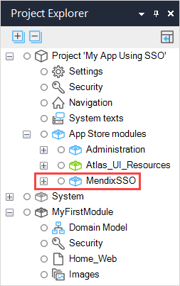
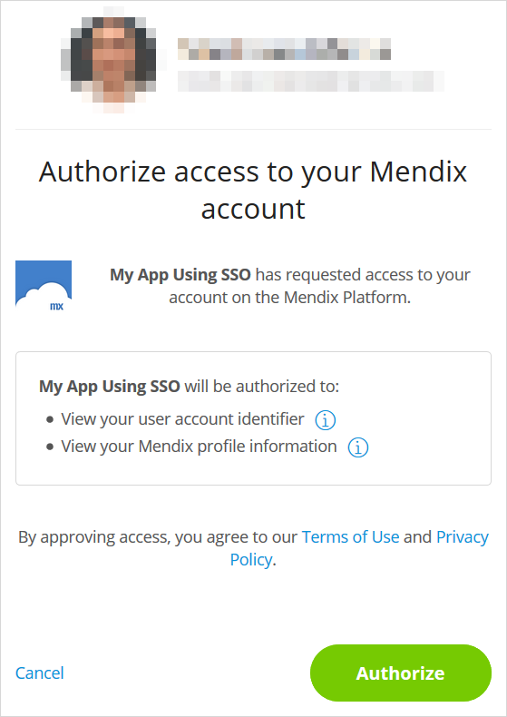
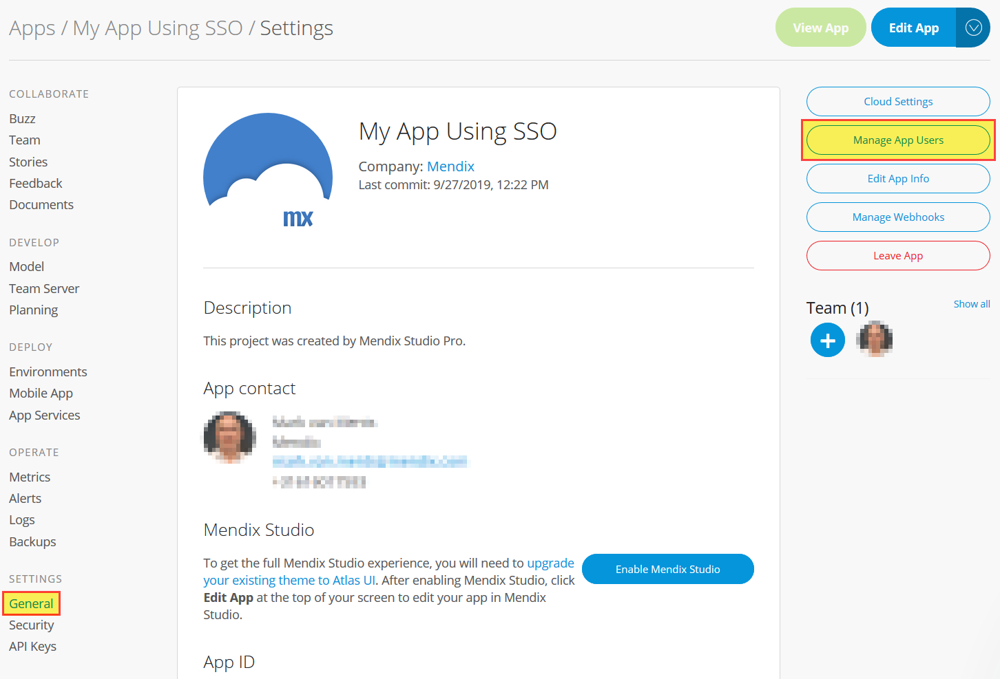
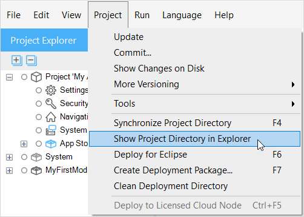
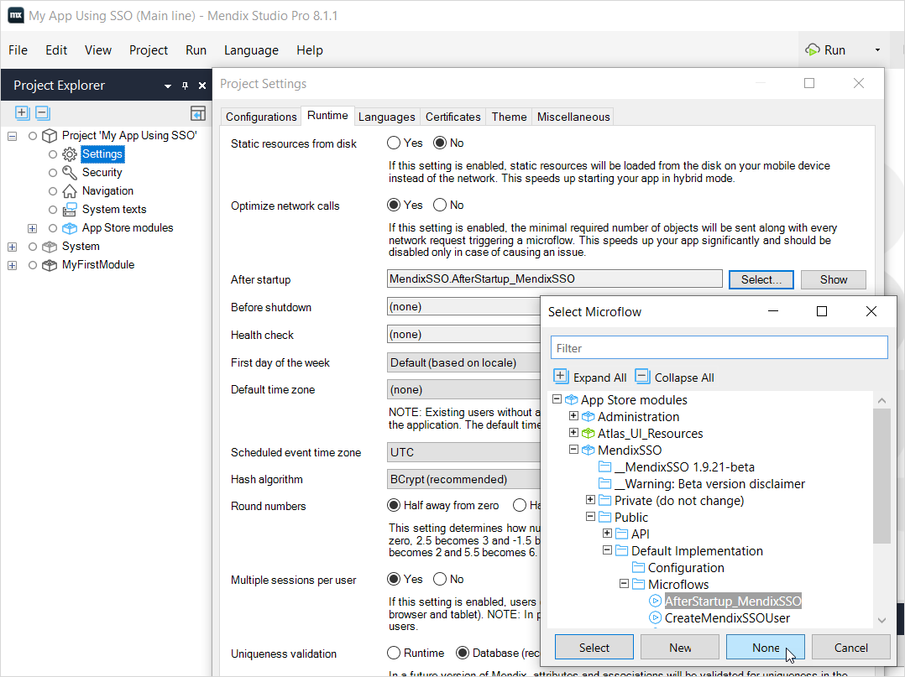
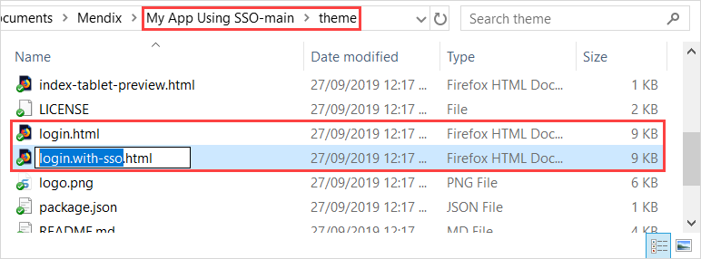

## 1 Introduction

{}[Still need to check which Starter Apps will be updated and how to tell what version of MendixSSO they have]{}

The [MendixSSO module](https://appstore.home.mendix.com/link/app/111349/Mendix/MendixSSO-(for-Mendix-7)) enables your app users to sign in with their Mendix account when your app is deployed to the Mendix Cloud.

Using Mendix accounts has the following benefits:

* you do not need a special authorization module to support resetting and changing passwords
* it is easy to create multiple applications which all use the same sign-on mechanism

We are in the process of adding the Mendix SSO module to the Mendix starter apps. Where it has been added, all you have to do is to set your security level to **Production** and your end-users will be able to sign in.

You can see if your app has the Mendix SSO module, and which version it has, by looking in the **App Store modules** section in the **Project Explorer** for your app project. The version number is recorded in the **Version** constant within the module.

If your app does not have the MendixSSO module, it is available from the Mendix App Store here: [Mendix SSO](https://appstore.home.mendix.com/link/app/111349/Mendix/MendixSSO-(for-Mendix-7)). Follow the instructions in [How To Use App Store Content](/developerportal/app-store/app-store-content) to import it into your app and then follow the instructions in [Setting Up Mendix Single Sign-On](#setting-up), below.

If you need a newer version of the Mendix SSO module (for example, to use a new feature), then it is also available from the App Store via the same link.

## 2 Using MendixSSO

{}
Mendix Single Sign-On is only activated when your app is deployed to the Mendix Cloud. When you run your app locally, or on another cloud, you will need to use local credentials.
{}

### 2.1 Signing On as an End-User

When you open an app as an end-user, and this is the first time visiting the app environment *or* you have not opened the app recently, you will see the Mendix SSO sign-on screen. You can still choose to sign-on with local user credentials, but to use your Mendix Account with Mendix SSO, click  the **Mendix Account** button.

Every app implementing MendixSSO needs some of your profile information (like your account identifier and your display name) to work. So for each environment (for example, myapp running in acceptance), the first time you sign in as an end-user using Mendix SSO the app will ask you to authorize access. This means that the app can access certain information held in your Mendix profile as specified on the authorization page.

Click **Authorize** to continue using Mendix SSO with this app. After authorizing the app you are automatically signed in to the app.

### 2.2 Assigning End-user Roles

Give end-users access to your app through the [Manage App Users](/developerportal/settings/general-settings#managing-app-users) page of the Developer Portal. You can get to this page in the Developer Portal from the **General** page of your app.

{}
Do not attempt to add or delete Mendix SSO users using administration functions within the app. If user access is not modified through the Developer Portal, then user access to your app will not be changed.
{}

## 3 Removing Mendix Single Sign-On

If you have an app which already has Mendix SSO activated, you can remove it using one of the methods below.

### 3.1 Deactivating Mendix Single Sign-On{#deactivating}

You can deactivate Mendix SSO in two simple steps. This will remove the end-user's ability to sign in with their Mendix account, but will leave the local user administration functions of the MendixSSO module intact.

To deactivate Mendix SSO, follow these two steps:

1. Rename the original login file (by default *login-without-sso.html*) in the **theme** folder of your project to *login.html*—this removes the single sign-on button from your sign in screen
    1. Open your project directory in File Explorer by selecting the menu item **Project** > **Show Project Directory in Explorer**.

        

    2. Go to the **theme** folder.
    3. Rename *login.html* to *login-with-sso.html*.
    4. Rename *login-without-sso.html* to *login.html*.

    

2. Remove the microflow **AfterStartup_MendixSSO** as the **After startup** microflow.
    1. Open **Project Settings** from the **Project Explorer**.
    2. Click the **Runtime** tab.
    3. Click **Select…** for the **After startup** microflow.
    4. Click **None**.
        
    5. Click **OK** to close the **Project Settings**.
    {}If there is a different **After startup** microflow, you should not remove it. Instead remove the AfterStartup_MendixSSO microflow which is an action in the existing microflow{}

Mendix SSO will be deactivated the next time you deploy your app. You can still use Mendix SSO for local end-user administration.

### 3.2 Removing Mendix Single Sign-On

You can completely remove Mendix Single Sign-On from your app if you want to use a different method for end-user administration. However, in most cases you can just leave the module in your app and deactivate it as described above.

To completely remove Mendix SSO. do the following:

1. Perform the two steps described above in [Deactivating Mendix Single Sign-On](#deactivating).

2. Remove any references to the MendixSSO module in the navigation profiles, accessed through the **Navigation** page of the **Project Explorer**.

3. Delete the **MendixSSO** module from **App Store modules**.

4. Review the **Errors** pane for any other references to **MendixSSO**—there will only be additional errors if Mendix SSO has been modified.

## 4 Setting Up Mendix Single Sign-On{#setting-up}

These instructions are for apps which did not originally have the MendixSSO module. For example, if you have an existing app which did not have the MendixSSO App Store module.

{}
You do not have to follow these steps for apps (for example, starter apps) which already have Mendix SSO, or if you are upgrading an existing MendixSSO module to a newer version.
{}

To enable Mendix SSO in your app, follow these steps:

1. Import the MendixSSO module from the [Mendix App Store](https://appstore.home.mendix.com/link/app/111349/Mendix/MendixSSO-(for-Mendix-7)).

2. Add the microflow **AfterStartup_MendixSSO** to the **After startup** microflow.
    1. Open **Project Settings** from the **Project Explorer**.
    2. Click the **Runtime** tab.
    3. Click **Select…** for the **After startup** microflow.
    4. Choose the microflow **App Store modules** > **MendixSSO** > **Public** > **Default Implementation** > **Microflows** > **AfterStartup_MendixSSO** (you can use the filter to find it quickly) and click **Select**.
        
    5. Click **OK** to close the **Project Settings**.
    {}If there is already an After startup microflow, you should not replace it, but rather add the AfterStartup_MendixSSO microflow as an action in the existing microflow{}

3. Add the pages **MyAccountViewEdit** and **UserOverview** to the app navigation.
    1. Open **Navigation** from the **Project Explorer**.
    2. Click **New item** to add a new navigation item.
    3. Enter the following values and click **OK**.
        * **Caption** – *My Account*
        * **Icon** – *Glyphicon 'user'* (click **Select…** and search for `user`)
        * **On click** – *Show a page* **App Store modules** > **MendixSSO** > **Public** > **Default Implementation** > **Pages** > **User** > **MyAccountViewEdit**
    4. Repeat the above to add another **New item** with the values.
        * **Caption** – *User Overview*
        * **Icon** – *Glyphicon 'lock'*
        * **On click** – *Show a page* **App Store modules** > **MendixSSO** > **Public** > **Default Implementation** > **Pages** > **Admin** > **UserOverview**

4. Turn on **Production** security level and configure **User roles** *User* and *Administrator* to have access to the appropriate **MendixSSO** module roles.
    1. Open **Project Security** from the **Project Explorer**.
    2. Set **Security level** to **Production**.
    3. Switch to the **User roles** tab.
    4. Select the **Administrator** user role and click **Edit**.
    5. Click **Edit** next to **Module roles**.
    6. Select the **Administrator** module role for **App Store modules** > **MendixSSO**.
        
    7. Click **OK** twice to return to **Project Security**.
    8. Repeat the steps above to add the MendixSSO.User module role to the **User** user role.

        The Project security settings now contains these two additional module roles:

        

5. Rename the file *login-with-sso.html* in the **theme** folder of your project to *login.html*—this adds the single sign-on button to your sign in screen
    1. Open your project directory in File Explorer by selecting the menu item **Project** > **Show Project Directory in Explorer**.
        
    2. Go to the **theme** folder.
    3. Rename *login.html* to  *login-without-sso.html*.
    4. Rename *login-with-sso.html* to *login.html*.
        

Your app is now configured to use Mendix Single Sign-on when it is deployed to the Cloud.

{}[Add section and link to modifying - see separate branch]{}

<!-- ## 5 Modifying Mendix Single Sign-On

The administrative functions provided in the MendixSSO module are sufficient for administering most apps. However, you can create your own administration suite by adapting it.

For more information see [Modifying Mendix SSO](modifying-mendix-sso).

This document also contains more information about token management, to help you to debug any issues and provide information to Mendix support if necessary. -->
