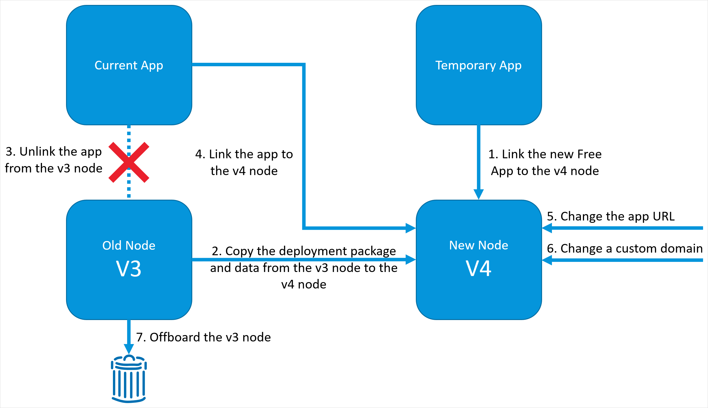

## 1 Introduction

This how-to explains how to migrate your app from a Mendix Cloud v3 node to a Mendix Cloud v4 node.

**It will teach you how to do the following:**

*   Migrate your licensed app from Mendix Cloud v3 to v4

## 2 Prerequisites

Before starting this how-to, make sure you have completed the following prerequisites:

* Have a [Mendix Cloud](mendix-cloud-deploy) v4 node available (to request a licensed v4 Cloud Node, contact your Customer Success Manager (CSM))
* Have the [Technical Contact](/developerportal/company-app-roles/technical-contact) role for both your existing v3 and available v4 Cloud Nodes
* Create two new temporary Free Apps without Free App environments – instructions for unlinking a Free App from its environment are here: [Licensing Mendix Cloud Apps](licensing-apps#unlink)

## 3 Migration considerations

You will need to take the following into account when planning to migrate to Mendix Cloud v4:

* Your app needs to be on a supported version of Mendix, that is **Mendix version 6.0 or above**
* If you are using Mendix 7, you might want to split long-running scheduled events into smaller chunks, using a queueing system like the Amazon SQS connector to spread the work out over multiple instances
* If you use a mail server from your app, you will need to use a third-party email provider – for more information, see [Sending Email](sending-email)
* If you use an FTP server in your app, you will need to use a third-party FTP provider 
* If you are currently using a VPN to secure your app, you will have to use one of the recommended methods discussed in [Securing Outgoing Connections from Your Application](securing-outgoing-connections-from-your-application) instead

To make the most of the features of Mendix Cloud v4, we recommend that your apps are built as [12-factor apps](https://12factor.net/).

### 3.1 Other Differences Between Mendix Cloud v3 & v4

There are a few other differences between the way you develop and deploy apps in Mendix Cloud v4 and Mendix Cloud v3:

* In Mendix Cloud v4, the debugger is always active, and does not have to be activated – the **Show Debugger Information** button shows the credentials to connect Mendix Studio Pro to the debugger
    {}You can only use the debugger if your app is scaled to a single instance.{}
* In Mendix Cloud v4, the number of permitted database connections is tied to the RAM of the database environment, rather than being static.
    * The limit is roughly 100 connections per GB of database RAM – the defaults are perfectly fine for most situations, but you can use the Mendix Runtime settings **ConnectionPoolingMaxActive** and **ConnectionPoolingMaxIdle** to tweak the number of database connections that the Mendix Runtime will set up for each runtime instance.
* In Mendix Cloud v4, there are some circumstances in which your app can run out of file connections
    * The default number of file connections is 50, but this can be increased and you may need to ensure that file connections are not being held open unnecessarily – see the [Other Considerations](mxcloudv4#other-considerations) section of *Mendix Cloud v4* for further advice
* In Mendix Cloud v4, there are some monitoring features which are available in v3 which are not currently available – in particular:
    * File storage usage is not visible
    * Application CPU alerts are not sent
    * Archived logs can only be downloaded, not viewed in the browser
    * The database status is not visible on the node details screen
* Mendix Cloud v4 only supports TLS 1.2 or above for incoming requests
    * If you have external clients connecting _to_ your application running in the Mendix Cloud, these clients have to support TLS 1.2 or above to be able to make a successful connection

## 4 Migrating the App

To migrate your app from a v3 node to a v4 node in the Mendix Cloud, follow the steps in the sections below.

### 4.1 Linking the New Free App to the v4 Node

First, link one of the new temporary apps to the cloud v4 node.

1.  In the [Developer Portal](http://home.mendix.com), go to **Apps** and select one of your temporary apps.

2.  Once you are in the app, go to the **Environments** tab in the left menu.

3.  Click **select a node**.

    

4.  Select the v4 node by clicking **Use this Node** and link it to your app.

For more information on how to do this, see [Licensing Mendix Cloud Apps](licensing-apps#licensed-node).

### 4.2 Copying the Deployment Package and Data from the v3 Node to the v4 Node

Before migrating, you need to deploy a copy of your app to the v4 node. You can then copy the data from the v3 node to the v4 node. After copying the data, you should test the app, and correct errors if needed. Repeat this until all the errors are solved.

The following steps explain how to do this.

#### 4.2.1 Downloading and Uploading the Deployment Package

Download the deployment package of your app hosted in Mendix cloud v3 and upload the deployment package to the app hosted in Mendix cloud v4.

To download a deployment package, follow these steps:

1. Go to **Environments** of the v3 app.

2. Click **Details** for a **Deployment Package**.

3. Click **Download Package**.

    

To upload the deployment package, follow these steps:

1. Go to **Environments** of the v4 App.

2. Below the **Deployment Package Repository**, click **Upload**.

    

3. Browse and select the downloaded deployment package from your device.

4. Deploy the uploaded package and ensure that it starts.

5. Stop the app so that you can upload the backup data.

#### 4.2.2 Backing Up

Transfer the backup data from the app on Mendix Cloud v3 to the app on Mendix Cloud v4 by following these steps:

1. Download a backup from your app hosted in Mendix Cloud v3 (for details, see [How to Download a Backup](/developerportal/operate/download-backup)).

    {}It is recommended that you download copies of *all* backups you want to keep. Once you have offboarded the old v3 environment, they will no longer be available.{}

2. Upload the downloaded backup to your app hosted in Mendix Cloud v4 (for details, see [How to Restore a Backup](/developerportal/operate/restore-backup)).

#### 4.2.3 Configuring the New App

Before starting your app in Mendix Cloud v4, make sure it has the same configuration as the v3 node. You can find the node settings on the [Environment Details](environments-details) page under **Model Options**, **Network**, **Runtime**, and **Maintenance**.

#### 4.2.4 Testing and Repeating

Now that the app on Mendix Cloud v4 contains your data and is configured, deploy the deployment package to an environment and start your app.

To learn how to do this, see [How to Deploy the App to an Environment](mendix-cloud-deploy#4-deploy-the-app-to-an-environment).

### 4.3 Unlink the App from the v3 Node

It is not possible to explicitly unlink an app from a licensed node. The only way to do this is to connect another app to the licensed node; this will unlink the existing app automatically. To do this, perform the following steps.

1. In the [Developer Portal](http://home.mendix.com), go to **Apps** and select the second blank app you created (not the one you have linked to the v4 node).

2.  Once you are in the app, go to the **Environments** tab in the left menu.

3.  Click **select a node**.

4.  Select the v3 node containing your app by clicking **Use this Node**, and link it to your app. Your app which is currently deployed to this node will be unlinked automatically and you can now link it to the v4 node.

A more detailed example of how this works given in the [Exchanging Linked Apps Between Nodes](licensing-apps#exchange-apps) section of *Licensing Mendix Cloud Apps*.

### 4.4 Linking the App to the v4 Node

Follow these steps to link the app you detached from the v3 node, above, to the v4 Node:

{}
Make sure you have downloaded the latest backup and deployment package before linking your app to the v4 node.
{}

1.  In the [Developer Portal](http://home.mendix.com), go to **Apps** and select the app that has been detached from the v3 node.

2.  Once you are in the app, go to the **Environments** tab in the left menu.

3.  Click **select a node**.

4.  Select the v4 node by clicking **Use this Node** and link it to your app. The currently linked (temporary) app will be unlinked automatically. The temporary app can be deleted.

For more information, see [Licensing Mendix Cloud Apps](licensing-apps).

### 4.5 Changing the App URL

To change the App URL (if you are not using a custom domain) you will need to contact [Mendix Support](https://support.mendix.com). You will need to provide the following information:

* **URL** for the new app, which is available from the *Environments* page for the new (v4) app
* **URL** for the old app, which is available from the *Environments* page for the old (v3) app
* **App ID** for the new app, which is available from the *General* page for the new (v4) app
* **App ID** for the old app, which is available from the *General* page for the old (v3) app

### 4.6 Changing a Custom Domain

If you have a custom domain set up, you will need to change this. Instructions for doing this are here: [Custom Domains](custom-domains).

### 4.7 Offboarding the v3 Node

Your app is now running in Mendix Cloud v4. If everything works correctly, submit a request to [Mendix Support](https://support.mendix.com) to offboard the v3 node. This means that your v3 node will no longer be available.

{}
After your node is offboarded, it will no longer be accessible. Ensure that you have downloaded any backups or other information that you need from the node before asking for it to be offboarded.
{}

## 5 Read More

*   [Certificates](certificates)
*   [Custom Domains](custom-domains)
*   [Mendix Cloud: Deploy](mendix-cloud-deploy)
*   [How to Download a Backup](/developerportal/operate/download-backup)
*   [Licensing Mendix Cloud Apps](licensing-apps)
*   [How to Restore a Backup](/developerportal/operate/restore-backup)
