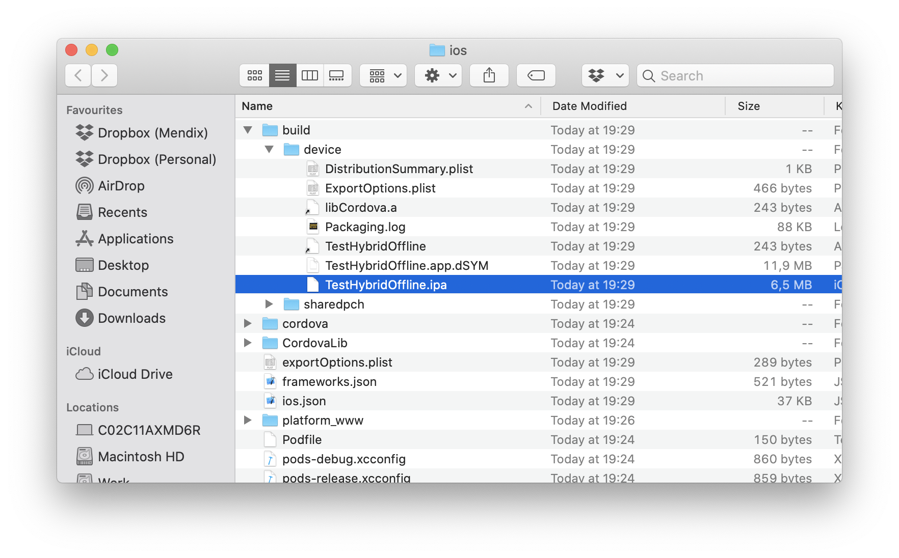
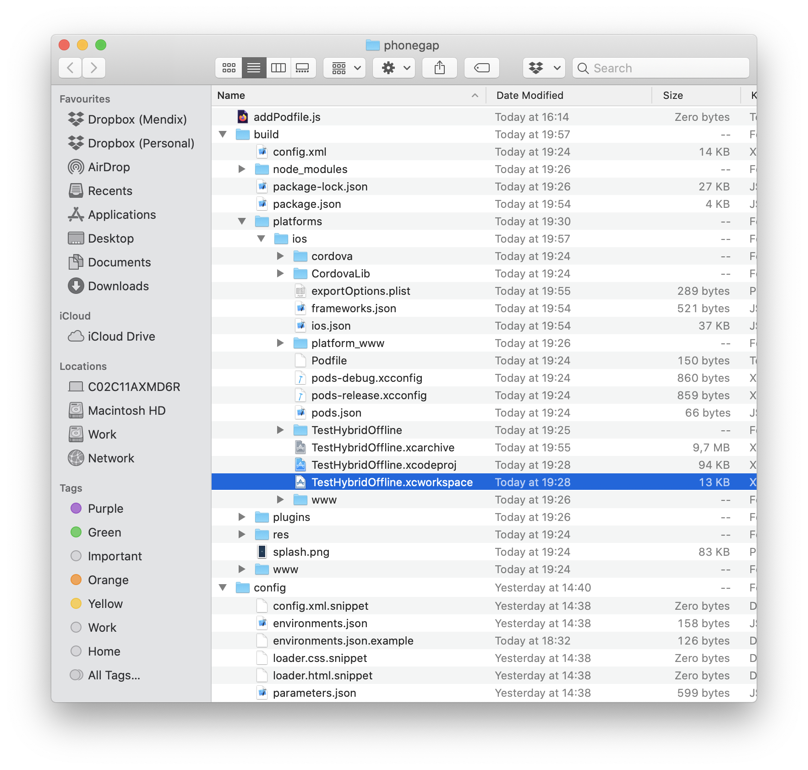
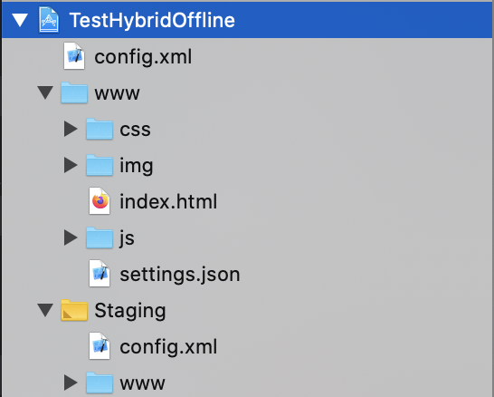
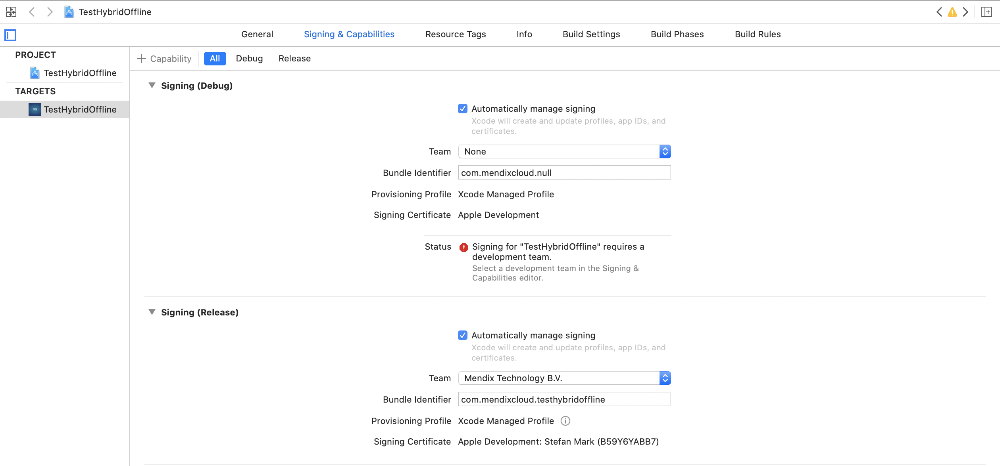
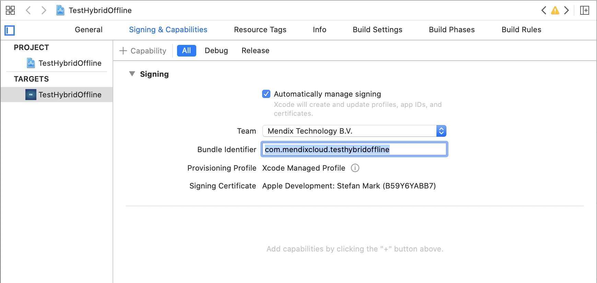
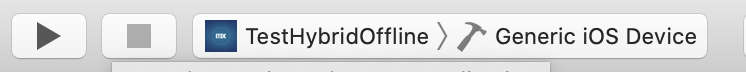
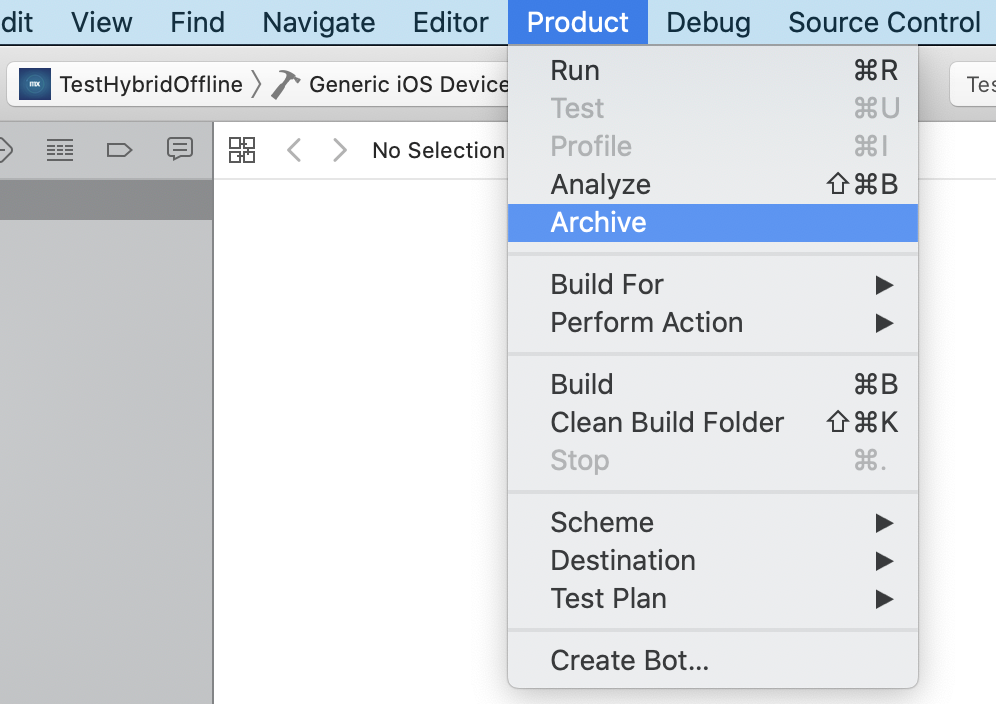
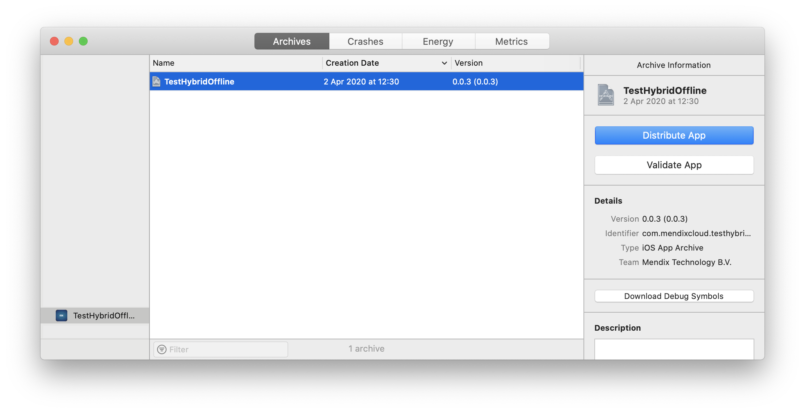
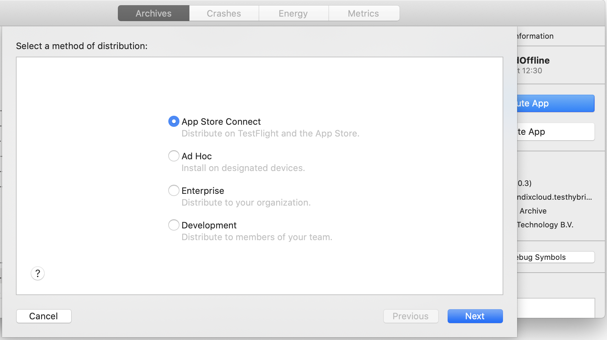

## 1 Introduction

The **Mobile App** page enables publishing your app in the Apple App Store (for iOS) and Google Play Store (for Android).

This page is divided into three tabs:

* **App Info**
* **iOS**
* **Android**

## 2 App Info

In this tab, you can find the following sections:

* **General settings**
* **Profile settings**
* **Permissions**
* **Custom Phonegap/Cordova configuration**

### 2.1 General Settings

In the **General settings** section, you must provide the following information:

* The **Name** of the app
* The unique **App Identifier** (for example, `com.example.CompanyExpenses`)
* A **Description** of the app
* Whether a 5 digit PIN is enabled or disabled via the **PIN required?** check box

### 2.2 Profile Settings

If you are targeting Mendix 7.2.0 or above, please specify the navigation profiles to use on phones and tablets.

Make sure the profile identifier corresponds with the one defined in Mendix Studio Pro.

* **Phone profile**
* **Tablet profile**
* **Enable offline capabilities?** (available offline apps)

For more information, see **Availability** in [Offline](/refguide/offline-first).

### 2.3 Permissions

By default, Mendix hybrid applications require a set of device permissions. When users install the app or open the app for the first time, they will be asked to grant these permissions. You can use the check boxes below to control which permissions are requested.

The permissions that can be enabled/disabled:

* **Calendar**
* **Camera**
* **Contacts**
* **Geolocation**
* **Microphone**
* **Photo Library**

{}
Some functionality might not be available when you disable these permissions (for example, your app will not be able to use the camera widget when you disable it).
{}

### 2.4 Custom Phonegap/Cordova Configuration

You can specify additional Phonegap/Cordova settings and plugins by adding an XML snippet below. This snippet will be inserted at the bottom of the configuration file.

For an overview of available elements and settings, refer to [Apache Cordova Phonegap Reference Config.xml](https://cordova.apache.org/docs/en/latest/config_ref/).

## 3 iOS & Android

In these tabs, you will see an overview of all the images that will be used in the app store. The images are divided into two categories:

* **Icons**
* **Splash screens**

The following image formats are supported: PNG, GIF, JPEG, and BMP. PNG is recommended, as it is compressed without loss of any information and supports transparency very well.

If you click **Edit**, you can replace the image by uploading a new file with the same dimensions as the original file.

If you do not upload any images, the default Mendix-branded images that are shown will continue to be used.

Take note of the required resolutions and file types for the image files, as the system will not allow you to upload images with different resolutions (because your app packages will not function properly).

## 4 Publish for Mobile App Stores {#publish}

On the right side of the screen, you can choose which operating system you want to publish (iOS or Android).

When you are ready to build, click **Publish for Mobile App Stores**.

This wizard will guide you through the process of creating app packages for the Apple App Store and Google Play Store. These packages can be built using Adobe's PhoneGap Build service. The resulting mobile apps can then access native functionality such as the geo location service and the camera.

You need an account for Adobe PhoneGap Build and for the app stores in which you want to publish your app.

There are two ways that the device can build the packages:

* **Build it in the cloud**
* **Do it yourself**

### 4.1 Building It in the Cloud

{}
Building hybrid apps in the cloud uses the PhoneGap Build service from Adobe. Unfortunately, Adobe no longer maintains this service. As a result, as of April 30th 2020, hybrid iOS apps built through the platform or using the PhoneGap Build service are not being accepted on Apple's App Store.

If you wish to build your hybrid iOS app, continue with either the [Doing It Yourself](#doing-it-yourself) section for remote building or [Building Your iOS App Locally](#building-ios-locally) for local building.
{}

After selecting the **Build in the cloud** option and choosing the correct environment, you are ready to start the PhoneGap build.

When you click **Start PhoneGap Build job**, Mendix will generate an Adobe PhoneGap Build package and send it to the PhoneGap Build service on your behalf. You might be required to authorize this request using an Adobe PhoneGap Build account.

As soon as the build job has completed, the platform-specific packages will be ready for download.

Please note that an Adobe PhoneGap Build account is required to continue. Create [an account](https://build.phonegap.com/plans) if you do not have one already.

### 4.2 Doing It Yourself {#doing-it-yourself}

After selecting the **Do it yourself** option and choosing the correct environment, click **Download a customizable package**. The package contains all your settings, icons, and splash screens. It allows you to easily make changes, create local builds, run on emulators, and upload to the PhoneGap Build service.

In the `/dist` folder, you'll find a pre-compiled Adobe PhoneGap Build package for your app. You can upload this package directly to the PhoneGap Build service to obtain platform-specific app packages. Those packages can then be published in the app stores.

You can freely customize the generated package to enable, for example, additional PhoneGap/Cordova plugins or add additional resources to your app. For more information, see [Customizing PhoneGap Build Packages](/howto/mobile/customizing-phonegap-build-packages).

For detailed instructions, see the [hybrid-app-template GitHub repository](https://github.com/mendix/hybrid-app-template).

For more context on building hybrid apps in the cloud, as well as other options for iOS apps, see [How to Build Hybrid Apps](/howto/mobile/build-hybrid-apps).

To generate the Android Google Play package, go to [Build.PhoneGap.com](https://build.phonegap.com/).

For iOS please follow the instrcutions below.

### 4.3 Building Your iOS App Locally {#building-ios-locally}

**Prerequisites:**

* A Mac OSX machine
* Install [NodeJS LTS](https://nodejs.org/en/download/) using the all-in-one installation option
* Download **Do it yourself** package from Cloud Portal and unzip it in a known location
* Register for an [Apple Developer Account](https://developer.apple.com/register/index.action)
* Install [XCode](https://apps.apple.com/us/app/xcode/id497799835?mt=12) and its command-line tools

#### 4.3.1 Prepare Your Project for Building

To prepare your project for building, follow these instructions:

1. Open a terminal window and change directory into the unzipped package folder, for example **cd /Downloads/phonegap** if it is in your Downloads folder.
1. Run `npm i && npm run package && npm run platform:ios`. This combination of commands does the following: 
    * Installs all required dependencies.
    * Packages the Cordova app for deployment.
    * Adds the iOS platform to Cordova.

#### 4.3.2 Building Your Prepared Project

There are two possible ways to build your apps: the Cordova CLI or XCode. The Cordova CLI is faster and allows Cordova to fully control the your project's configuration. XCode is more involved, but XCode's UI makes it easier to detect problems in the project. You can use whichever works best for your case.

##### 4.3.2.1 Building iOS Using the Corodova CLI

**Prerequsites:**

* Your Apple Developer team's id, which can be found [here](https://developer.apple.com/account/#/membership/)

This process is shorter than using XCode but might require more work to understand why a build fails. To build using the Cordova CLI, do the following:

1. Run `npm run build -- ios --release --device --codeSignIdentity="iPhone Developer" --developmentTeam="<your-teams-id>"`. This combination of commands does the following:
    * Starts a release build that will create binaries for a physical device
    * Uses the code sign identity "iPhone Developer" for signing
    * Looks up the provisioning files and certificates using the provided Apple Developer's team id
1.1 Optionally, if you wish to build for an emulator and do a debug build use the following command instead: `npm run build -- ios --debug --emulator`.
1. When the build succeeds the generated *IPA* file can be found in */build/platforms/ios/build*. That folder should have the following file structure(if you did a build for an emulator an *.app* file will be available):
   
    
    
1. The IPA generated can be now uploaded to Testflight for further testing. If you wish to do so, continue with the [Upload tools](https://help.apple.com/app-store-connect/#/dev82a6a9d79) section, on the App Store documenation.

##### 4.3.2.2 Building iOS using XCode

Using XCode can be easier than the Cordova CLI due to XCode's friendly visual interface. To build your app using XCode do the following: 

1.  Under **/build/platforms/ios/** open the `.xcworkspace` file by double-clicking it. Xcode should open with the project loaded:

    

1. Select the root element from the tree view in the left-side panel:
   
    

1. The screen should change to the following view. If it does not, select the item under **Targets** on the left panel not the item under **Project** and select the tab **Signing & Certificates**:

    

1. Both **Debug** and **Release** might have been configured for **Automatically manage signing**. Clear both check boxes to switch to manual signing. The screen should change to the following:

    

1. Enable **Automatically manage signing** again.
1. Select a **Team** using the drop-down menu. If you have not yet signed in with your credentials, XCode will prompt you to do so.
1. When configured correctly all errors should be gone.
1. Make sure you select the target to be your app's build target and designate **Generic iOS Device** as a device:

    

1. Select **Product** and then **Archive** from the menu bar:

    

1. After the process finishes successfully the **Organizer** view will come up. Your app should be selected and your latest **Archive** visible. You can always open the organizer yourself through XCode's **Window** menu:

    

1. You can now use the **Distribute App** button to distribute your app to the appstore or archive it for local distribution:

    

## 5 Example

**How to build a PhoneGap app in the cloud**

{}

## 6 Read More

* [Deploy and Manage](/developerportal/deploy)
* [Offline](/refguide/offline-first)
* [How to Publish a Mendix Hybrid Mobile App in App Stores](/howto/mobile/publishing-a-mendix-hybrid-mobile-app-in-mobile-app-stores)
* [Adobe PhoneGap Build](https://build.phonegap.com/)
* [Apache Cordova PhoneGap Reference Config.xml](https://cordova.apache.org/docs/en/latest/config_ref/)
