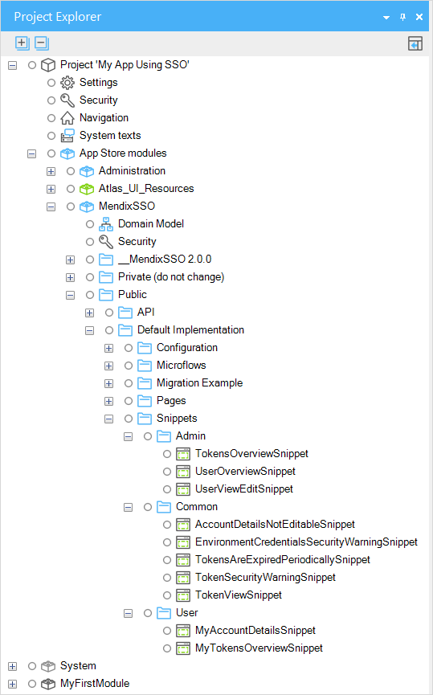
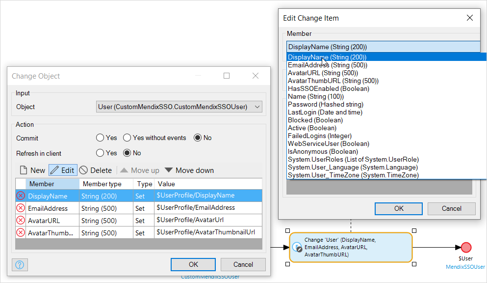
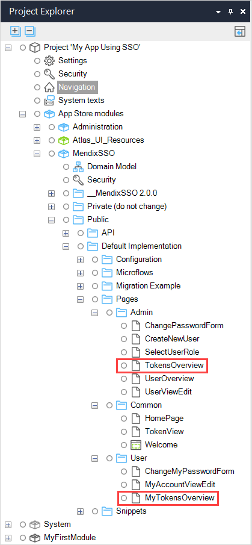
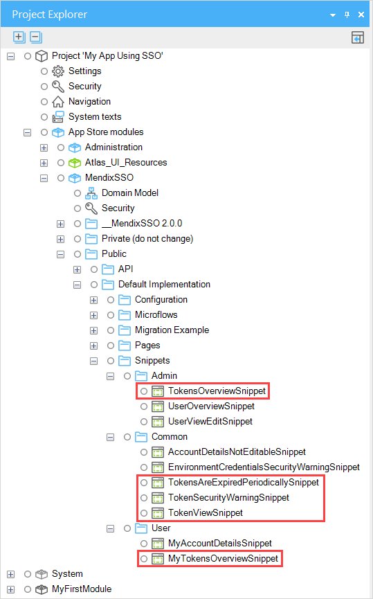

## 1 Introduction

The [MendixSSO module](https://appstore.home.mendix.com/link/app/111349/) comes with a default implementation of end-user administration. This is described in [Mendix Single Sign-on](mendix-sso).

The default administration module is sufficient for most apps. However, you can create your own administration module if you want to do things in a different way.

This document also contains some more technical information about the Mendix SSO implementation to help you with modifying the administration module and debugging any issues with Mendix SSO.

## 2 Customizing Mendix SSO

There are two ways you can modify the MendixSSO module. You can use snippets from the App Store module MendixSSO in your pages, or you can modify the MendixSSO module in any way you like to support your end-user administration requirements.

These two ways are described below.

### 2.1 Using Snippets

The default Mendix SSO implementation is based on snippets. You can use these snippets in your own pages to customize the administration of the end-users. If you look at how they are used in the default implementation, you can see how to use them in your own pages. The snippets are:

* In folder **Admin**
    * **TokensOverviewSnippet** – an overview of all the tokens issued to end-users of the app
    * **UserOverviewSnippet** – an overview of all the end-users who have used the app. This will not include end-users who have been given access through the developer portal but have not yet signed in
    * **UserViewEditSnippet** – a page where details of an end-user can be seen and, where the current end-user has access, edited
* In folder **Common**
    * **AccountDetailsNotEditableSnippet** – text explaining that details of SSO end-users come from Mendix and are not editable in the app
    * **EnvironmentCredentialsSecurityWarningSnippet** – text warning that sharing credentials is a security risk
    * **TokensAreExpiredPeriodicallySnippet** – text explaining that expired tokens are deleted automatically after a period of time
    * **TokenSecurityWarningSnippet** – text explaining that tokens give access to the app for SSO end-users, and that local end-users will not have tokens
    * **TokenViewSnippet** – displays details of a token
* In folder **User**
    * **MyAccountDetailsSnippet** – a page where details of an end-user can be seen—similar to **UserViewEditSnippet** but without the additional administration capabilities
    * **MyTokensOverviewSnippet** – an overview of all the tokens issued to the current end-user of the app

### 2.2 Modifying Mendix SSO

{}
We recommend that you do not modify the version of MendixSSO which is in the App Store modules section of your project. In future, you may wish to import a newer version of the module and this will overwrite any changes you make.
{}

The MendixSSO module is written so that you can make a complete copy of the module and use this as the basis of a new administration module.

#### 2.2.1 Copying the Mendix SSO Module{#copying}

To make a copy of the module, do the following:

1. Add a new module to your app project. In these examples it is called **CustomMendixSSO**.

2. Copy the **MendixSSOUser** entity from the **MendixSSO** module domain model, to the domain model of your new module. In these examples it is called **CustomMendixSSOUser**.

3. Open the **AccountPasswordData** entity in the **MendixSSO** module domain model and associate it with the **MendixSSOUser** entity in your new module.

    

4. Copy the entire **Public** folder from **MendixSSO** to your new module. You need to this using copy/paste in the **Project Explorer**.

5. Clear all the errors by doing the following:

    1. Create two new **Module roles**, **Administrator** and **User**.

    2. In the **Entity access** tab of security, select each of the **Module roles** and unselect and reselect the appropriate role.

        

    3. For each page, open the page and open and close the **Navigation** property to re-select the allowed roles. (You do not have to change any roles, they are already set correctly)

        
    
    4. For each microflow, open the microflow and open and close the **Allowed roles** property to re-select the allowed microflow roles.

#### 2.2.2 Configuring the Copied Mendix SSO Module

You need to tell the Mendix SSO Module to use your new entity, instead of the default one. To do this, make the following changes to the microflows in your new Mendix SSO Module:

1. Update the **AfterStartup_MendixSSO** microflow in the new, customized, MendixSSO module to use the **CreateMendixSSOUser** and **UpdateMendixSSOUser** microflows from the customized MendixSSO module.

    

2. Update the **Create** action in the **CreateMendixSSOUser** microflow in your new module to use your new Mendix SSO user entity, not the original one. You will also need to update all the members which are set during the create.

    

3. Change the **End event** of the microflow to return an object of the correct type.

4. Change the **Retrieve** action in the **UpdateMendixSSOUser** microflow in your new module to use your new Mendix SSO user entity.

5. Change the **Change object** action to set the correct members of the object.

    

6. Change the **End event** of the microflow to return an object of the correct type.

7. Set the **After startup** microflow in the **Runtime** tab of **Project > Settings** to be the **AfterStartup_MendixSSO** microflow in your new module.

#### 2.2.3 Using the Copied Mendix SSO Module

Mendix SSO will now use your new entity to administer the users. You can edit the domain model, the snippets, and the pages to customize your user administration completely, bearing in mind that data which comes from the Mendix ID used by end-users who are using SSO will overwrite any changes you make within your app.

{}[Are there other changes which need to be made - all the user-related microflows, for example, still point to the MendixSSO module and not the new module we have just created.]{}

## 3 Tokens

Mendix SSO works by providing end-users with tokens when they are authenticated. If end-users are having issues with Mendix SSO it can be useful to see the tokens, either for your own debugging or to provide information to Mendix Support.

The default Mendix SSO administration module has a number of pages set up to enable you to see tokens. Alternatively, you can use snippets from the default module to create your own token display and administration pages.

{}
Tokens contain personal information, as well as authentication information. They should not be exposed routinely, and should only be shared on a need-to-know basis (for example, if you need help resolving an issue with SSO).
{}

### 3.1 Displaying Tokens on Pages

Individual end-users can see their tokens on the MendixSSO.MyTokensOverview page of the default implementation. Administrators may want to see all active tokens – these can be seen on the MendixSSO.TokensOverview page.

If you want administrators or end-users to be able to see tokens, it is recommended that you add these to the navigation of the app. This avoids them being included in the main process flows of the app.

#### 3.1.1 TokensOverview Page

The TokensOverview page allows administrators to see all tokens which have been issued to end-users of the app.

The page can be used for troubleshooting – you can see the creation and expiry dates of the tokens and, by clicking **View**, you can view the values held in the tokens.

The **ID Token** is held in jwt format, so you can paste it into a [jwt decoder](https://jwt.io) to confirm what information it holds.

The page can also be used for administration. You can delete tokens which have expired, and you can also delete current tokens if they are causing unwanted issues.

Deleting tokens from the TokensOverview page will cause end-users to lose access to the app. However, they will be able to sign in again if they are still end-users of the app.

#### 3.1.2 MyTokensOverview Page

The MyTokensOverview page allows end-users to see their own access tokens.

The page can be used for troubleshooting – the end-user can see the creation and expiry dates of the tokens and, by clicking **View**, they can view the values held in the tokens. This can be useful for troubleshooting if the end-user is having difficulty getting proper access to the app.

### 3.2 Displaying Tokens using Snippets

The default tokens pages in the Mendix SSO module are created using snippets.

You can use these snippets to create your own token administration pages. Look at the pages in the default administration module for ideas on how they can be used.
