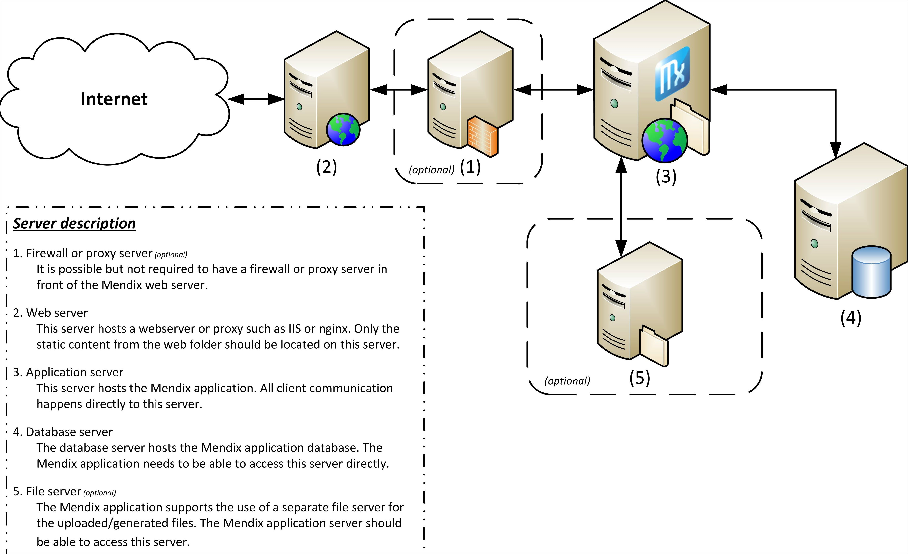

{}
 For the Simplified Chinese translation, click [中文译文](https://cdn.mendix.tencent-cloud.com/documentation/developerportal/on-premises-design.pdf).
{}

## 1 Introduction

When designing your server architecture, there are an infinite number of possibilities for how you can set up your environment. There is no right or wrong configuration, because it all depends on your security, availability, and performance requirements.

The options below are just a few examples of the most commonly used architecture setups. The Mendix cloud uses a (more complex) architecture based on hosting with a separate database server (for details, see [Hosting with a Separate Database Server (Option 2)](#Option2)) without a separate file server and with a proxy server to redirect traffic to the correct environment.

**This how-to will teach you how to do the following:**

* Select the best architecture option

## 2 Options

### 2.1 Minimal Server Architecture (Option 1)

This is the simplest solution with the fewest configuration and connection problems. This configuration is used in the Mendix cloud as well, except the cloud is Linux-based, with NGINX used instead of IIS and PostgreSQL used as the database server.

### 2.2 Hosting with a Separate Database Server (Option 2)

### 2.3 Separate Database Server and a Separate Web Server (Option 3)

This option is the most difficult to maintain, and every update has to be performed twice (once on your application server as normal, and after as an update in which you have to replicate all the static content to the web server as well). This means that you have to copy the contents of the web folder (including MxClientSystem) to the web server every time you do an update.

You should avoid using this option if possible.

### 2.4 Separate Mendix Web Server in a DMZ (Option 4)

## 3 Load Balancing Support and Configuration

The platform can handle a load balancer in front of the platform. The only additional requirement is that the load balancer uses sticky sessions. When a problem occurs on a single instance, the only thing an active user can lose is the data being working on. Everything that is only available in the memory of the failed instance will be gone, and all of the stored data will still be available for the user.

When updating the application, it is best to stop every instance. If the database structure has changed and a single instance updates the database structure, it can cause some strange behavior on all the running instances, since they are still expecting the old database structure.

## 4 Read More

* [How to Use a Security Checklist for Your On-Premises Installation](security-checklist-for-your-on-premises-installation)
* [How to Update a Mendix Application](updating-a-mendix-application)
* [How to Set Up a Microsoft SQL Server for Mendix on Windows](mendix-on-windows-microsoft-sql-server)
* [How to Set Up a New SQL Server Database](setting-up-a-new-sql-server-database)
* [How to Configure Mendix SQL Maintenance Plans](mendix-sql-maintenance-plans)
* [How to Restore a SQL Server Database](restoring-a-sql-server-database)
* [How to Set Up a SQL Server User](setting-up-a-sql-server-user)
* [How to Set Up the Database User](setting-up-the-database-user)
* [How to Troubleshoot SQL Server](troubleshooting-sql-server)
