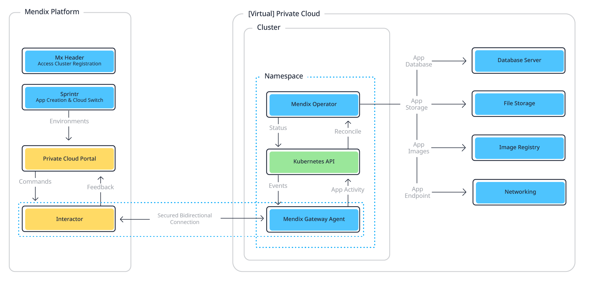
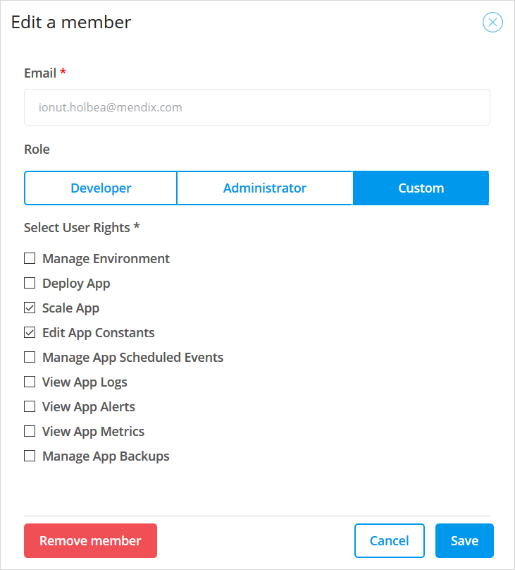

## 1 Introduction

To allow you to manage the deployment of your apps to Red Hat OpenShift and Kubernetes, you first need to create a cluster and add at least one namespace in the Mendix Developer Portal. This will provide you with the information you need to deploy the **Mendix Operator** and **Mendix Gateway Agent** in your OpenShift context and create a link to the **Environments** pages of your Mendix app through the **Interactor**.



This document explains how to set up the cluster in Mendix.

Once you have created your namespace, you can invite additional team members who can then create or view environments in which their apps are deployed, depending on the rights you give them. For more information on the relationship between Mendix environments, Kubernetes namespaces, and Kubernetes clusters, see [Containerized Mendix App Architecture](#containerized-architecture), below.

## 2 Prerequisites for Creating a Cluster

To create a cluster in your OpenShift context, you need the following:

* A Kubernetes platform or OpenShift version 3.11 or above
* An administration account for your platform
* **OpenShift CLI** installed (see [Getting started with the CLI](https://docs.openshift.com/container-platform/4.1/cli_reference/getting-started-cli.html) on the Red Hat OpenShift website for more information) if you are creating clusters on OpenShift
* **Kubectl** installed if you are deploying to another Kubernetes platform (see [Install and Set Up kubectl](https://kubernetes.io/docs/tasks/tools/install-kubectl/) on the Kubernetes webside for more information)
* **Bash** (Bourne-again shell) for your machine. If you are running on Windows, you can use something like [**Windows Subsystem for Linux (WSL)**](https://docs.microsoft.com/en-us/windows/wsl/faq) or the **Git Bash emulator** that comes with [git for windows](https://gitforwindows.org/).

## 3 Creating a Cluster & Namespace

### 3.1 Creating a Cluster

1. Click **Cloud Settings** on the **Settings** page of your Mendix app.
    
    

2. Click **Mendix for Private Cloud**.
    
    

3. Click **Set up Mendix for Private Cloud**.
    
    

4. Select **Cluster Manager** from the **Apps** menu in the Developer Portal.

    

5. Click **Register Cluster**. 

    

6. Enter the following information:
    
  1. **Name** – The name you want to give the cluster you are creating.
  
  2. **Type** – choose the correct type for your cluster.

  3. **Description** – an optional description of the cluster which will be displayed under the cluster name in the cluster manager.

7. Click **Create**.

    

### 3.2 Adding a Namespace

You now need to add a namespace to your cluster. Your cluster can contain several namespaces, see [Containerized Mendix App Architecture](#containerized-architecture), below for more information.

To add a namespace, do the following:

1. Click **Details**:

    
	
2. Click **Add Namespace**:
	
    

3. Enter the following details:
	* **Namespace** – this is the namespace in your platform; this must conform to the namespace naming conventions of the cluster: all lower-case with hyphens allowed within the name
	* **Installation type** – if you want to [create environments and deploy your app from the Mendix Developer Portal](private-cloud-deploy), choose **Connected**, but if you only want to [control your deployments through the Mendix Operator using the CLI](private-cloud-operator), choose **Standalone**

4. Click **Done** to create the namespace.


## 4. Installing and Configuring the Mendix Operator

Before you can use the Mendix Operator in your namespace you need to install it and configure the services your app will use. Mendix provides you with a **Configuration Tool** which guides you through the process.

### 4.1 Downloaded Configuration Tool{#downloaded-script}

If you are not already on the installation tab for your namespace, go to it by following these instructions:

1. Go to the Cluster Manager page by clicking **Cluster Manager** in the **Apps** menu.

    

2. Click **Details** next to the namespace you want to use.

    

3. Select the **Installation** tab.

Now you can download the Configuration Tool by doing the following:

1. Choose the **Operating System** for your local computer.

2. Click **Download Installation Script** and make sure that it is stored somewhere on your path.

    

### 4.2 Signing in to OpenShift {#openshift-signin}

You will need to have administrator rights to your private cloud platform. This means you will have to log in before you run the Configuration Tool.

These instructions are for the OpenShift platform; a similar process will be required for other platforms.

You can do this as follows:

1. Sign in to the OpenShift Console.

2. Click **Copy Login Command** in the user drop-down.
    
    

3. Choose your IdP (Identity Provider).
    
    

4. Click **Display Token**.

5. Copy the command under **Log in with this token**.
    
    

6. Paste the command into Bash and press Enter.

### 4.3 Running the Configuration Tool{#running-the-tool}

Once you are signed in to your cluster you can run the Configuration Tool.

1. Copy the **Installation Command** by clicking **Copy to clipboard**.

    

2. Paste the command into your Bash console and  press <kbd>Enter</kbd>

	You will see the configuration options on the screen and will be guided through filling in the information needed.

    

If, instead of using the Configuration Tool, you want to run the scripts in your Kubernetes cluster, see the instructions in [Using Installation and Configuration Scripts](private-cloud-config-script).

#### 4.3.1 Base Installation

If the Mendix Operator and the Mendix Gateway Agent have not been installed in your cluster, you will need to install them.

1. Click **Base Installation**.

	You will see the screen below.

	

2. Select the required **Cluster Mode** – *connected* or *standalone.

    For more information, see [Connected and Standalone Clusters](private-cloud#connected-standalone) in the *Private Cloud* documentation.

3. Select the required **Cluster Type** – *openshift* or *kubernetes*.

4. Click **Run Installer** to install the Mendix Operator and Mendix Gateway Agent in your cluster.

	{}The installation is successful if the **Installer output** ends with **Installation Successful**.{}

5. Click **Save Installer** if you want to save these settings to be used later.

6. Click **Exit Installer** to finish.

The Mendix operator and Mendix Gateway Agent are now installed on your platform.

#### 4.3.2 Configure Namespace

You can now configure the resources required for your namespace.

The first time you configure the namespace, you should select all the items under **Select items to configure** except **Proxy** and **Custom TLS**. Only select **Proxy** if you want to configure a proxy for your namespace. Select **Custom TLS** only if you want to configure custom CAs for your namespace.

The options do the following:

* **Database Plan** – will create a new database plan for your cluster — you must have at least one database plan in your namespace, but you can have more than one
* **Storage Plan** – will create a new storage plan for your cluster — you must have at least one storage plan in your namespace, but you can have more than one
* **Ingress** – will configure the ingress for your namespace — if there is already an ingress, this will replace it with new settings
* **Registry** – will configure a registry for your namespace — if there is already a registry, this will replace it with new settings
* **Proxy** – will configure a proxy for your namespace — if there is already a proxy, this will replace it with new settings
* **Custom TLS** – will configure custom CA trust for your namespace — if there is already a custom CA trust configuration, this will replace it with new settings

1. Select the options you need to configure – the first time you configure your namespace you must check *all the first four options*.  **Proxy** is optional.

2. Click **Configure Namespace**.

	You will be shown the **Installation wizard** landing page.

	

3. Use the allocated function keys (for example <kbd>F2</kbd> for the **Database Plan**) to navigate to the setup pages for each resource which you need to configure.

4. Each page will lead you through the information you need to supply.

	These are described in the following sections:

	* [Database Plan](#database-plan)
	* [Storage Plan](#storage-plan)
	* [Ingress](#ingress)
	* [Registry](#registry)
	* [Proxy](#proxy)
	* [Custom TLS](#custom-tls)

##### 4.3.2.1 Database Plan{#database-plan}

Give your plan a **Name** and choose the **Database Type**. See the information below for more help in setting up plans for the different types of database which are supported by Mendix for Private Cloud.

Once you have entered the details you can apply two validation checks by clicking the **Validate** and **Connection Validation** buttons:

* **Validate** – checks that you have provided all the required values and that they are in the correct format
* **Connection validation** –  checks whether the specified storage plan has been successfully created — this does not guarantee that the storage *instance* will be created successfully when the configuration is applied


The supported **Database Types** are described below:

**Postgres** will enable you to enter the values to configure a PostgreSQL database. You will need to provide all the information about your PostgreSQL database such as plan name, host, port, database, user, and password.

{}
If the plan name already exists, you will receive an error that it cannot be created. This is not a problem, you can continue to use the plan, and it will now have the new configuration.
{}

{}
To connect to an Azure PostgreSQL server, the Kubernetes cluster must be added to the list of allowed hosts in the firewall. For the database name, use `postgres`.
{}

{}
To connect to an Amazon RDS database, the VPC and firewall must be configured to allow connections to the database from the Kubernetes cluster.
{}

{}
Enabling the **Strict TLS** option will enable full TLS certificate validation and require encryption when connecting to the Postgres server. If the Postgres server has a self-signed certificate, you'll also need to configure [custom TLS](#custom-tls) so that the self-signed certificate is accepted.

Disabling **Strict TLS** will attempt to connect with TLS, but skip certificate validation. If TLS is not supported, it will fall back to an unencrypted connection.
{}

**Ephemeral** will enable you to quickly set up your environment and deploy your app, but any data you store in the database will be lost when you restart your environment.

**SQL Server** will enable you to enter the values to configure a Microsoft SQL Server database. You will need to provide all the information about your SQL Server database such as plan name, host, port, user, and password. 

{}
If the plan name already exists you will receive an error that it cannot be created. This is not a problem, you can continue to use the plan, and it will now have the new configuration.
{}

{}
To connect to an Azure PostgreSQL server, the Kubernetes cluster must be added to the list of allowed hosts in the firewall.
{}

{}
For Azure SQL databases, additional parameters are required to specify the database elastic pool name, tier, service objective and maximum size.
{}

{}
Enabling the **Strict TLS** option will enable full TLS certificate validation and require encryption when connecting to SQL Server. If the SQL Server has a self-signed certificate, you'll also need to configure [custom TLS](#custom-tls) so that the self-signed certificate is accepted.

Disabling **Strict TLS** will attempt to connect with TLS, but skip certificate validation. If encryption is not supported, it will fall back to an unencrypted connection.
{}

**Dedicated JDBC** will enable you to enter the [database configuration parameters](/refguide/custom-settings) for an existing database directly, as supported by the Mendix Runtime.

{}
A dedicated JDBC database cannot be used by more than one Mendix app.
{}

{}
Configuration parameters will not be validated and will be provided to the Mendix app as-is. If the arguments are not valid or there is an issue with permissions, the Mendix Runtime will fail to start the and deployment will appear to hang with **Replicas running** and **Runtime** showing a spinner.
{}

{}
If the plan name already exists you will receive an error that it cannot be created. This is not a problem, you can continue to use the plan, and it will now have the new configuration.
{}

{}
To use this plan, [upgrade](/developerportal/deploy/private-cloud-upgrade-guide) the Mendix Operator to version 1.1.0 or later.
{}

##### 4.3.2.2 Storage Plan{#storage-plan}

**Minio** will connect to a [MinIO](https://min.io/product/overview) S3-compatible object storage. You will need to provide all the information about your MinIO storage such as endpoint, access key, and secret key. The MinIO server needs to be a full-featured MinIO server, or a [MinIO Gateway](https://github.com/minio/minio/tree/master/docs/gateway) with configured etcd.

{}
To use TLS, specify the MinIO URL with an `https` schema, for example `https://minio.local:9000`. If MinIO has a self-signed certificate, you'll also need to configure [custom TLS](#custom-tls) so that the self-signed certificate is accepted.

If the MinIO URL is specified with an `http` schema, TLS will not be used.
{}

**S3 (create on-demand)** will connect to an AWS account to create S3 buckets and associated IAM accounts. Each app will receive a dedicated S3 bucket and an IAM account which only has access to that specific S3 bucket. You will need to provide all the information about your Amazon S3 storage such as plan name, region, access key, and secret key. The associated IAM account needs to have the following IAM policy (replace `<account_id>` with your AWS account number):

```json
{
    "Version": "2012-10-17",
    "Statement": [
        {
            "Sid": "bucketPermissions",
            "Effect": "Allow",
            "Action": [
                "s3:CreateBucket",
                "s3:DeleteBucket"
            ],
            "Resource": "arn:aws:s3:::mendix-*"
        },
        {
            "Sid": "iamPermissions",
            "Effect": "Allow",
            "Action": [
                "iam:DeleteAccessKey",
                "iam:PutUserPolicy",
                "iam:DeleteUserPolicy",
                "iam:DeleteUser",
                "iam:CreateUser",
                "iam:CreateAccessKey"
            ],
            "Resource": [
                "arn:aws:iam::<account_id>:user/mendix-*"
            ]
        }
    ]
}
```

{}
If the plan name already exists you will receive an error that it cannot be created. This is not a problem, you can continue to use the plan, and it will now have the new configuration.
{}

**S3 (existing bucket)** will connect to an existing S3 bucket with the provided IAM account access key and secret keys. All apps will use the same S3 bucket and an IAM account. You will need to provide all the information about your Amazon S3 storage such as plan name, endpoint, access key, and secret key. The associated IAM account needs to have the following IAM policy (replace `<bucket_name>` with the your S3 bucket name):

```json
{
  "Version": "2012-10-17",
  "Statement": [
    {
      "Effect": "Allow",
      "Action": [
        "s3:AbortMultipartUpload",
        "s3:DeleteObject",
        "s3:GetObject",
        "s3:ListMultipartUploadParts",
        "s3:PutObject"
      ],
      "Resource": [
        "arn:aws:s3:::<bucket_name>/*"
      ]
    }
  ]
}
```

{}
Configuration parameters will not be validated and will be provided to the Mendix app as-is. If the arguments are not valid or there is an issue with permissions, the Mendix Runtime will fail to start the and deployment will appear to hang with **Replicas running** and **Runtime** showing a spinner.
{}

{}

If you select *Yes* to the *Can this storage be used by multiple environments?* question, all environments using that Storage Plan will use the same Access and Secret keys and will have identical permissions. 
Each app will write into its own directory inside the bucket.

To avoid compromising security, answer *No* to the *Can this storage be used by multiple environments?* question. This way, only one app will be able to use this Storage Plan, and attaching another app to the same storage plan will not be possible.
{}

{}
If the plan name already exists you will receive an error that it cannot be created. This is not a problem, you can continue to use the plan, and it will now have the new configuration.
{}

{}
To use this plan, [upgrade](/developerportal/deploy/private-cloud-upgrade-guide) the Mendix Operator to version 1.1.0 or later.
{}

**Azure Blob storage Container (existing)** will connect to an existing Azure Blob storage Container with the provided storage account name and key. All apps will use the same Container bucket and account credentials. You will need to provide all the information about your Azure Blob storage such as plan name, account name, account key, and container name.

{}
Configuration parameters will not be validated and will be provided to the Mendix app as-is. If the arguments are not valid or there's an issue with permissions, the Mendix Runtime will fail to start the and deployment will appear to hang with **Replicas running** and **Runtime** showing a spinner.
{}

{}

If you select *Yes* to the *Can this storage be used by multiple environments?* question, all environments using that Storage Plan will be using the same account name and account keys keys and will have identical permissions.
All apps using will write into the root directory of same Azure Blob storage Container.

To avoid compromising security, answer *No* to the *Can this storage be used by multiple environments?* question. This way, only one app will be able to use this Storage Plan, and attaching another app to the same storage plan will not be possible.

{}

{}
If the plan name already exists you will receive an error that it cannot be created. This is not a problem, you can continue to use the plan, and it will now have the new configuration.
{}

{}
To use this plan, [upgrade](/developerportal/deploy/private-cloud-upgrade-guide) the Mendix Operator to version 1.1.0 or later.
{}

**Ephemeral** will enable you to quickly set up your environment and deploy your app, but any data objects you store will be lost when you restart your environment.

##### 4.3.2.3 Ingress{#ingress}

**OpenShift Route** will configure an OpenShift Route. This can only be used for OpenShift clusters.

**Ingress** will configure ingress according to the additional domain name you supply.

Both forms of ingress can have TLS enabled or disabled.

{}
When switching between Ingress and OpenShift Routes, you need to [restart the Mendix Operator](#restart-after-changing-network-cr) for the changes to be fully applied.
{}

##### 4.3.2.4 Registry{#registry}

Selecting a registry type and configuring its credentials will configure the destination registry used by Mendix for Private Cloud to build images.
Images are pulled from this registry by Kubernetes, bypassing the Mendix Operator.

You can choose one of the following registry types. OpenShift registries can only be used for clusters on the OpenShift platform. AWS ECR can only be used for AWS EKS clusters. For some of these registries you may need to supply additional information such as the pull URL, push URL, name, and secret.

* OpenShift 3 Registry
* OpenShift 4 Registry
* Amazon Elastic Container Registry (AWS ECR)
* Generic registry with authentication – this supports most registries, for example Azure Container Registry, quay.io, or Docker Hub
* Generic registry without authentication – this can be used for basic, self-hosted registries such as the ones included with Minikube and MicroK8s
* Existing docker-registry secret

**Additional Information**

For **OpenShift 3** and **OpenShift 4** registries, the default image pull credentials from the `default` ServiceAccount will be used. No additional configuration steps are required to enable image pulls in OpenShift.

For **Generic registry…** options, the configuration script will ask if the credentials should be added to `imagePullSecrets` in the `default` ServiceAccount. If you answer **Yes**, the configuration script will add image pull credentials to the `default` ServiceAccount - no additional image pull configuration is required. If you want to configure the image pull separately, choose **No**.

For **Amazon Elastic Container Registry**, you will need to configure registry authentication separately through [IAM roles](https://docs.aws.amazon.com/AmazonECR/latest/userguide/ECR_on_EKS.html).

When choosing the **Existing docker-registry secret**, you will need to add this secret to the `default` ServiceAccount manually, or provide registry authentication configuration in another way (depending on which registry authentication options the Kubernetes cluster vendor is offering).

#### 4.3.3 Proxy{#proxy}

Choose **Yes** if a proxy is required to access the public internet from the namespace; you will be asked for the proxy configuration details.

#### 4.3.4 Custom TLS{#custom-tls}

{}
To use this option, [upgrade](/developerportal/deploy/private-cloud-upgrade-guide) the Mendix Operator to version 1.7.0 or later.
{}

To use encryption and avoid [MITM attacks](https://en.wikipedia.org/wiki/Man-in-the-middle_attack), communication with all external services should be done over TLS.
By default, Mendix Operator trusts Certificate Authorities from the [Mozilla CA root bundle](https://wiki.mozilla.org/CA), as they are provided by default in the container image.

If Mendix for Private Cloud needs to communicate with external services, some of those services might have TLS certificates signed by a custom (private) CA.
In order for the Mendix Operator to trust such certificates, you need to add their root CAs to the Mendix Operator configuration.

1. In another terminal, prepare the Kubernetes secret containing the custom root CAs list:
   1. Create a `custom.crt` file, containing the public keys of all custom (private) CAs that Mendix for Private Cloud should trust:
       ```
       # Private CA 1
       -----BEGIN CERTIFICATE-----
       [...]
       -----END CERTIFICATE-----
       # Private CA 2
       -----BEGIN CERTIFICATE-----
       [...]
       -----END CERTIFICATE-----
       ```
       (concatenate all the public keys from custom CAs into one `custom.crt` file, separating them with line breaks and optional comments).
   2. Load into a file (replace `{namespace}` with the namespace where the Operator is installed):

        For OpenShift:
        ```shell
        oc -n {namespace} create secret generic mendix-custom-ca --from-file=custom.crt=custom.crt
        ```

        For Kubernetes:
        ```shell
        kubectl -n {namespace} create secret generic mendix-custom-ca --from-file=custom.crt=custom.crt
        ```

2. Paste the name of this `custom.crt` Secret into the **CA Certificates Secret Name** field (e.g. `mendix-custom-ca`):
   
   

These custom CAs will be trusted by:

* The Mendix Operator when communicating with the database and file storage
* The Mendix Operator when pushing app images to the container registry
* Mendix Apps when communicating with the database, file storage and external web services

{}
To prevent MITM attacks, enable **Strict TLS** for the database and use an HTTPS URL for Minio. This will ensure that all communication with data storage is done over TLS, and that certificates are properly validated.
{}

{}
Strict TLS mode should only be used with apps created in Mendix 8.15.2 (or later versions), earlier Mendix versions will fail to start when validating the TLS certificate.
{}

#### 4.3.5 Review and Apply

When you have configured all the resources, do the following:

1. Press <kbd>F7</kbd> to **Review and Apply**.

	

2. Click **Evaluate Configuration** to check the configuration.

	Resources which are correctly configured will have a status **Valid configuration**. If an resource is incorrectly configured, it will have a status **Invalid configuration: …** and an explanation of the issue.

	

3. Once you have evaluated the configuration, click **Write YAML** to save a copy of the configuration .yml files on your local machine.

	The **Installer output** panel will display the locations of the saved files.

	

4. Click **Apply Configuration** to apply the configuration to your namespace.

	

	Once the configuration has been applied you will see the message **Successfully applied all the configuration!**.

5. Click **Exit Installer** to return to the landing page.

### 4.4 Confirming Namespace Configuration

When the namespace is configured correctly, its status will become **Connected**. You may need to click the **Refresh** button if the screen does not update automatically.


## 5 Advanced Operator configuration

Some advanced configuration options of the Mendix Operator are not yet available in the reconfiguration script.
These options can be changed by editing the `OperatorConfiguration` custom resource directly in Kubernetes.

Look at [Supported Providers](private-cloud-supported-environments) to ensure that your planned configuration is supported by Mendix for Private Cloud.

To start editing the `OperatorConfiguration`, use the following commands (replace `{namespace}` with the namespace where the operator is installed):

For OpenShift:

```shell
oc -n {namespace} edit operatorconfiguration mendix-operator-configuration
```

For Kubernetes:

```shell
kubectl -n {namespace} edit operatorconfiguration mendix-operator-configuration
```

The OperatorConfiguration contains the following user-editable options:

When using **Ingress** for network endpoints:

```yaml
apiVersion: privatecloud.mendix.com/v1alpha1
kind: OperatorConfiguration
spec:
  # Endpoint (Network) configuration
  endpoint:
    # Endpoint type: ingress or openshiftRoute
    type: ingress
    # Ingress configuration: used only when type is set to ingress
    ingress:
      # Optional, can be omitted: annotations which should be applied to all Ingress Resources
      annotations:
        # default annotation: allow uploads of files up 500 MB in the NGINX Ingress Controller
        nginx.ingress.kubernetes.io/proxy-body-size: 500m
        # example: use the specified cert-manager ClusterIssuer to generate TLS certificates with Let's Encrypt
        cert-manager.io/cluster-issuer: staging-issuer
      # App URLs will be generated for subdomains of this domain, unless an app is using a custom appURL
      domain: mendix.example.com
      # Enable or disable TLS
      enableTLS: true
      # Optional: name of a kubernetes.io/tls secret containing the TLS certificate
      # This example is a template which lets cert-manager to generate a unique certificate for each app
      tlsSecretName: '{{.Name}}-tls'
```

When using **OpenShift Routes** for network endpoints:

```yaml
apiVersion: privatecloud.mendix.com/v1alpha1
kind: OperatorConfiguration
spec:
  # Endpoint (Network) configuration
  endpoint:
    # Endpoint type: ingress or openshiftRoute
    type: openshiftRoute
    # OpenShift Route configuration: used only when type is set to openshiftRoute
    openshiftRoute:
      # Optional, can be omitted: annotations which should be applied to all Ingress Resources
      annotations:
        # example: use HSTS headers
        haproxy.router.openshift.io/hsts_header: max-age=31536000;includeSubDomains;preload
      # Optional: App URLs will be generated for subdomains of this domain, unless an app is using a custom appURL
      domain: mendix.example.com
      # Enable or disable TLS
      enableTLS: true
      # Optional: name of a kubernetes.io/tls secret containing the TLS certificate
      # This example is the name of an existing secret, which should be a wildcard matching subdomains of the domain name
      tlsSecretName: 'mendixapps-tls'
```

{}
Adjusting options which are not listed here can cause the Mendix Operator to configure environments incorrectly. Making a backup before applying any changes is strongly recommended.
{}

You can change the following options:

* **type**: – select the Endpoint type, possible options are `ingress` and `openshiftRoute`; this parameter is also configured through the **Reconfiguration Script**
* **ingress**: - specify the Ingress configuration, required when **type** is set to `ingress`
* **openshiftRoute**: - specify the OpenShift Route configuration, required when **type** is set to `openshiftRoute`
* **annotations**: - optional, can be used to specify the Ingress or OpenShift Route annotations
* **domain**: - optional for `openshiftRoute`, required for `ingress`, used to generate the app domain in case no app URL is specified; if left empty when using OpenShift Routes, the default OpenShift `apps` domain will be used; this parameter is also configured through the **Reconfiguration Script**
* **enableTLS**: - allows you to enable or disable TLS for the Mendix App's Ingress or OpenShift Route
* **tlsSecretName**: - optional name of a `kubernetes.io/tls` secret containing the TLS certificate, can be a template: `{{.Name}}` will be replaced with the name of the `MendixApp` CR; if left empty, the default TLS certificate from the Ingress Controller or OpenShift Router will be used


{}
When switching between Ingress and OpenShift Routes, you need to [restart the Mendix Operator](#restart-after-changing-network-cr) for the changes to be fully applied.
{}

## 6 Cluster and Namespace Management

Once it is configured, you can manage your cluster and namespaces through the Developer Portal.

### 6.1 Cluster Overview {#overview}

Go to the Cluster Manager page by clicking **Cluster Manager** in the **Apps** menu.


From this page you can see a summary of your clusters with all their namespaces and an indication of the namespace status and how long it has been running (runtime).

#### 6.1.1 Managing the Cluster

Here you can perform the following actions on the entire cluster:

* Delete the cluster by clicking the delete icon
* Rename the cluster or edit its description by clicking the edit icon
* Invite another cluster manager

<a name="actvity-logs"></a>You can also see the activities logged for all you clusters by clicking **Activity** in the [cluster overview](#overview) page. This shows the following:

* When a cluster has been added
* When a cluster description is added
* When name of the cluster is changed
* When cluster description is changed


{}
When you add a cluster manager, the user will have most of the access which the original cluster manager had, such as the abilities to add a namespace, add a member, change the permissions of the cluster member, and delete another cluster manager. 

The only limitations are that:

* an added cluster manager will not be able to operate on or manage the environments created in the namespaces which are already in the cluster — they need to be added as a member of the namespace if they want to manage environments in the namespaces
* cluster managers who are added to the cluster cannot remove the cluster manager who created the cluster
{}

{}
When you delete a cluster, this removes the cluster from the Developer Portal. However, it will not remove the cluster from your platform. You will need to explicitly delete the cluster using the tools provided by your platform.
{}

### 6.2 Namespace Management

If you are a member of a namespace, you can also manage a namespace in the cluster.

Click the **Details** button for the namespace you want to manage.

On the namespace management page, there are a number of tabs which allow you to manage aspects of your namespace :

* Apps
* Members
* Operate
* Plans
* Installation

See the sections below for more information.

You can also delete your namespace from the cluster manager by clicking the delete icon in the top right.


If there are any environments associated with the namespace, you cannot delete the namespace until the environments associated with it are deleted.

When you delete a namespace, this removes the namespace from the cluster in the Developer Portal. However, it will not remove the namespace from your platform. You will need to explicitly delete the namespace using the tools provided by your platform.


You can also see an activity log containing the following information for all namespaces within the cluster:

* When a namespace has been added
* When a namespace has been deleted
* When a cluster manager has been added
* When a cluster manager invitation is removed
* When a cluster manager accepts the invitation
* When a cluster manager is removed from the cluster
* When a new database plan is added in a namespace
* When a database plan is deactivated
* When a new storage plan is added in a namespace
* When a storage plan is deactivated
* When Metrics/Alerts/Logs/Backups URLs are added in the namespace
* When Metrics/Alerts/Logs/Backups URLs are removed from the namespace
* When Metrics/Alerts/Logs/Backups URLs are changed in the namespace
* When a user is invited as a namespace member
* When a user invitation for namespace member is removed
* When a user accepts the invitation as a namespace member
* When a user is removed as a namespace member
* When user's permission is changed in the namespace


#### 6.2.1 Apps

The **Apps** tab of namespace details in the cluster manager page lists all the apps which are deployed to this namespace.


If you are a team member of the app, click **Details** to go to the *Environment Details* page for that app.

{}
You can only see the environment details of an app if you are a member of the app team with the appropriate authorization.
{}

#### 6.2.2 Members

By default, the cluster manager, who created the cluster in Mendix, and anyone added as a cluster manager has full administration rights to the cluster and its namespaces. These administration rights are:

* Add and delete namespaces
* Add, activate, or deactivate plans
* Invite and manage users

The following rights are available to the cluster creator, and members of a namespace with appropriate authorization:

* Set up operating URLs for the namespace
* View all environments in the namespace
* Manage own environments – user can create and manage an environment in any namespace in the cluster

The following actions require the appropriate access to the namespace **and** access to the app environment as a team member with appropriate authorization:

* Deploy App – user can deploy a new app to the environment or start and stop existing apps
* Scale App – user can change the number of replicas
* Edit App Constants
* Manage App Scheduled Events
* View App Logs
* View App Alerts
* View App Metrics
* Manage App Backups
* Manage Debugger
* Manage TLS configurations
* Manage Custom Runtime Settings
* Manage Log levels

The **Members** tab allows you to manage the list of members of the namespace and control what rights they have.

##### 6.2.2.1 Adding Members

You can invite additional members to the namespace, and configure their role depending on what they should be allowed to do.

1. The **Members** tab displays a list of current members (if any).

2. Click **Invite Member**.
    
    

3. Enter the **Email** of the person you want to invite.

4. Give them the rights they need. This can be:
    
  1. **Developer** – a standard set of rights needed by a developer, these are listed on the screen
  2. **Administrator** – a standard set of rights needed by an administrator, these are listed on the screen
  3. **Custom** – you can select a custom set of rights by checking the box next to each role you want to give to this person

5. Click **Send Invite** to send an invite to this person.
    
    

6. The user will receive an email and will be required to follow a link to confirm that they want to join this namespace. They will need to be logged in to Mendix when they follow the confirmation link.

##### 6.2.2.2 Editing & Removing Members

You can change the access rights for, or completely remove, existing members.

1. Click **Edit** next to the member you want to change.

2. Either:
    
  1. Make changes and click **Save**.
    
  2. Click **Remove member** to remove this member completely. You will be asked to confirm this action.
        
    

#### 6.2.3 Operate {#operate}

The **Operate** tab allows you to add a set of links which are used when users request a page from the Operate category for their app in the Developer Portal, as shown below.


The following pages can be configured:

* Metrics
* Alerts
* Logs
* Backups

The specification of these pages is optional.

Open the **Operate** tab, enter the URLs relevant to your namespace, and click **Save** for each one.


#### 6.2.4 Plans

The **Plans** tab shows you the database and storage plans which are currently configured for your namespace.


From this tab you can perform the following action:

##### 6.2.4.1 Adding a Plan

Click **Add** and you will be able to enter the name of an existing plan and add it to the plans linked to this namespace. You should only use this when adding plans using the namespace Reconfiguration Script fails to add them correctly.


##### 6.2.4.2 Deactivating a Plan

Click **Deactivate** next to the name of the plan you wish to deactivate. You cannot remove plans from within the cluster manager, but you can deactivate them to ensure that developers cannot create environments using the plan. Any environments currently using the plan will not be affected by this setting.

##### 6.2.4.3 Activating a Plan

Click **Activate** next to the name of the plan you wish to activate. The plan can then be used by developers when they create an environment to deploy their apps.

#### 6.2.5 Installation

The **Installation** tab shows you the Configuration Tool which you used to create the namespace, together with the parameters which are used to configure the agent.

You can use the Configuration Tool again to change the configuration of your namespace by pasting the command into a bash shell as described in [Running the Configuration Tool](#running-the-tool), above.

You can also download the Configuration Tool again, or retrieve the installation and reconfiguration scripts which are described in [Using Installation and Configuration Scripts](private-cloud-config-script) to retain in your own code repository, if you wish.

## 7 Current Limitations

### 7.1 Storage Provisioning

If the Operator fails to provision or deprovision storage (a database or file storage), it will not retry the operation. If there is a failed `*-database` or `*-file` pod, you'll need to do the following:

1. Check the failed pod logs for the error message.
2. Troubleshoot and fix the cause of this error.
3. Delete the failed pod to retry the process again.

### 7.2 Restart Required When Switching Between Ingress and OpenShift Route {#restart-after-changing-network-cr}

Starting with Mendix Operator version 1.5.0, the operator will monitor only one network resource type: Ingress or OpenShift route.

If you switch between Ingress and OpenShift Route, you will need to restart the Mendix Operator so that it can monitor the right network resource (replace `{namespace}` with the namespace where the Operator is installed). This can be done as follows:

For OpenShift:

```shell
oc -n {namespace} scale deployment mendix-operator --replicas=0
oc -n {namespace} scale deployment mendix-operator --replicas=1
```

For Kubernetes:

```shell
kubectl -n {namespace} scale deployment mendix-operator --replicas=0
kubectl -n {namespace} scale deployment mendix-operator --replicas=1
```

## 8 Troubleshooting

This section covers an issue which can arise where Mendix cannot recover automatically and manual intervention may be required.

### 8.1 Status Reporting

Under some circumstances changes in the status of the cluster, namespaces, and environments will not be updated automatically. To ensure you are seeing the current status, you may need to click the **Refresh** button on the screen (not the browser page refresh button).

## 9 Containerized Mendix App Architecture {#containerized-architecture}

Within your cluster you can run one, or several, Mendix apps. Each app runs in an environment, and each environment is in a namespace. You can see the relationship between the Mendix environments and the Kubernetes namespaces in the image below.


Because you can run several Mendix apps in the same namespace, each app must have a unique name. In addition, the app cannot have the same name as the Mendix tools used to deploy the app. See Deploy an app to Private Cloud for more information.
