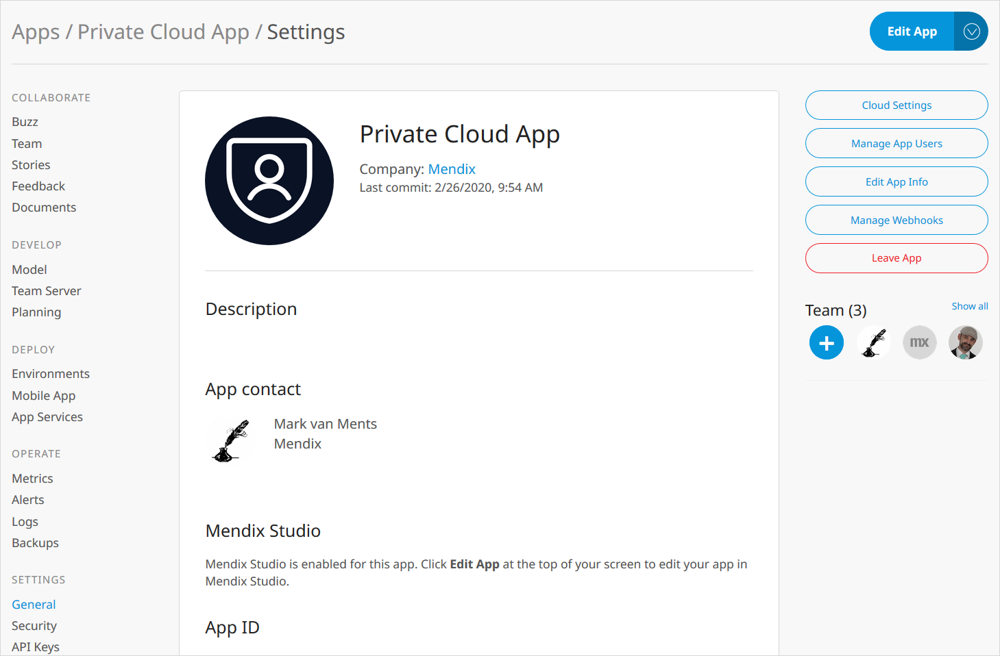
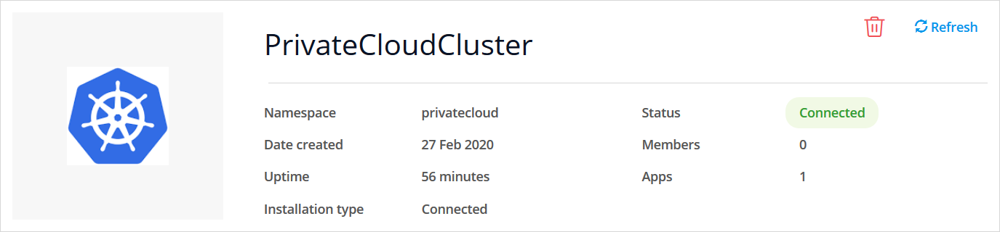
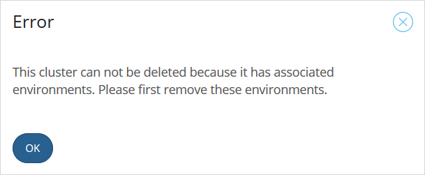

## 1 Introduction

To allow you to manage the deployment of your apps to Red Hat OpenShift and Kubernetes, you first need to create a cluster and add at least one namespace in the Mendix Developer Portal. This will provide you with the information you need to deploy the **Mendix Operator** and **Mendix Gateway Agent** in your OpenShift context and create a link to the **Environments** pages of your Mendix app through the **Interactor**.


This document explains how to set up the cluster in Mendix.

Once you have created your namespace, you can invite additional team members who can then create or view environments in which their apps are deployed, depending on the rights you give them. For more information on the relationship between Mendix environments, Kubernetes namespaces, and Kubernetes clusters, see [Containerized Mendix App Architecture](#containerized-architecture), below.

## 2 Prerequisites for Creating a Cluster

To create a cluster in your OpenShift context, you need the following:

* A Kubernetes platform or OpenShift version 3.11 or above
* An administration account for your platform
* **OpenShift CLI** installed (see [Getting started with the CLI](https://docs.openshift.com/container-platform/4.1/cli_reference/getting-started-cli.html) on the Red Hat OpenShift website for more information) if you are creating clusters on OpenShift
* **Kubectl** installed if you are deploying to another Kubernetes platform (see [Install and Set Up kubectl](https://kubernetes.io/docs/tasks/tools/install-kubectl/) on the Kubernetes webside for more information)
* **Bash** (Bourne-again shell) for your machine. If you are running on Windows, you can use something like [**Windows Subsystem for Linux (WSL)**](https://docs.microsoft.com/en-us/windows/wsl/faq) or the **Git Bash emulator** that comes with [git for windows](https://gitforwindows.org/).

## 3 Creating a Cluster & Namespace

### 3.1 Creating a Cluster

1. Click **Cloud Settings** on the **Settings** page of your Mendix app.
    
    

2. Click **Mendix for Private Cloud**.
    
    

3. Click **Set up Mendix for Private Cloud**.
    
    

4. Select **Cluster Manager** from the **Apps** menu in the Developer Portal.

    

5. Click **Register Cluster**. 

    

6. Enter the following information:
    
  1. **Name** – The name you want to give the cluster you are creating.
  
  2. **Type** – choose the correct type for your cluster.

  3. **Description** – an optional description of the cluster which will be displayed under the cluster name in the cluster manager.

7. Click **Create**.

    

### 3.2 Adding a Namespace

You now need to add a namespace to your cluster. Your cluster can contain several namespaces, see [Containerized Mendix App Architecture](#containerized-architecture), below for more information.

To add a namespace, do the following:

1. Click **Details**:

    
	
2. Click **Add Namespace**:
	
    

3. Enter the following details:
	* **Namespace** – this is the namespace in your platform; this must conform to the namespace naming conventions of the cluster: all lower-case with hyphens allowed within the name
	* **Installation type** – if you want to [create environments and deploy your app from the Mendix Developer Portal](private-cloud-deploy), choose **Connected**, but if you only want to [control your deployments through the Mendix Operator using the CLI](private-cloud-operator), choose **Standalone**

4. Click **Done** to create the namespace.


You will see the details of the namespace you are adding on a screen with two scripts.

The first script is the installation script which will install the Mendix operator and Mendix agent in your namespace. Once that is done, you can run the second script which allows you to configure your namespace.


### 3.3 Running the Installation Script

You will need to have administrator rights to your private cloud platform. This means you will have to log in before you run the installation script.

#### 3.3.1 Signing in to OpenShift {#openshift-signin}

These instructions are for the OpenShift platform; a similar process will be required for other platforms.

To run the installation script on OpenShift, you must sign in to OpenShift using the OpenShift CLI, before you run the scripts in Bash.

You can do this as follows:

1. Sign in to the OpenShift Console.

2. Click **Copy Login Command** in the user drop-down.
    
    

3. Choose your IdP (Identity Provider).
    
    

4. Click **Display Token**.

5. Copy the command under **Log in with this token**.
    
    

6. Paste the command into Bash and press Enter.

#### 3.3.2 Executing the Installation Script

To execute the installation script, do the following:

1. Copy the Installation Script which has been created for you by clicking **Copy to clipboard**.

    

2. Paste the script into your Bash console and press **Enter** to run the script.

The response to the script should look like the image below. You can see that the script has installed the following:

* mendix-agent
* mendix-operator

The installation is successful if the response ends with **Installation Successful**.


The Mendix operator and Mendix Gateway Agent are now installed on your platform. If you look at the project resources in the OpenShift console, you can see the mendix-operator resource.


You can always find the installation script again in the **Installation** tab for your namespace in the cluster manager.

### 3.4 Running the Reconfiguration Script {#reconfiguration-script}

Before you deploy an app to your namespace, you will need to configure a number of services, namely:

* database
* file storage
* proxy
* registry
* ingress (network)

Mendix provides you with a script which will configure these initially, and can be re-run any time that you want to change how these are configured.

1. Copy the **Reconfiguration Script** which has been created for you by clicking **Copy to clipboard**. 

    

2. Press **Enter** to start the script.

The script will ask you a series of questions. Type the number corresponding to your choice, or enter the value required.

#### 3.4.1 What Do You Want to Do?


Choose **1** if this is the initial configuration and you will be led through all the items which you need to configure.

Choose **2** if you have a configuration already but want to reconfigure part of it. If you choose this option, you will then be able to navigate directly to the thing you want to configure, namely one of the following:

* Database
* Storage
* Ingress
* Registry
* Proxy

When you reconfigure your namespace with databases or storage, you will add new services in addition to any services which are already set up. These plans are then added to the Developer Portal and can be used when creating environments for an app, unless you specifically deactivate them.

You can return to this initial question from any of the other questions by choosing the option **Go back to the start** where it is available.

{}
The configuration script does not currently validate input values. Configuration can be verified by deploying a sample app.
{}

#### 3.4.2 Pick a Database Type


**Postgres** will enable you to enter the values to configure a PostgreSQL database. You will need to provide all the information about your PostgreSQL database such as plan name, host, port, database, user, and password.

{}
If the plan name already exists, you will receive an error that it cannot be created. This is not a problem, you can continue to use the plan, and it will now have the new configuration.
{}

{}
To connect to an Azure PostgreSQL server, the `Enforce SSL connection` option has to be disabled and the Kubernetes cluster must be added to the list of allowed hosts in the firewall. For the database name, use `postgres`.
{}

{}
To connect to an Amazon RDS database, the VPC and firewall must be configured to allow connections to the database from the Kubernetes cluster.
{}

**Ephemeral** will enable you to quickly set up your environment and deploy your app, but any data you store in the database will be lost when you restart your environment.

**SQL Server** will enable you to enter the values to configure a Microsoft SQL Server database. You will need to provide all the information about your SQL Server database such as plan name, host, port, user, and password. 

{}
If the plan name already exists you will receive an error that it cannot be created. This is not a problem, you can continue to use the plan, and it will now have the new configuration.
{}

{}
To connect to an Azure PostgreSQL server, the Kubernetes cluster must be added to the list of allowed hosts in the firewall.
{}

{}
For Azure SQL databases, additional parameters are required to specify the database elastic pool name, tier, service objective and maximum size.
{}

**Dedicated JDBC** will enable you to enter the [database configuration parameters](/refguide/custom-settings) for an existing database directly, as supported by the Mendix Runtime.

{}
A dedicated JDBC database cannot be used by more than one Mendix app.
{}

{}
Configuration parameters will not be validated and will be provided to the Mendix app as-is. If the arguments are not valid or there is an issue with permissions, the Mendix Runtime will fail to start the and deployment will appear to hang with **Replicas running** and **Runtime** showing a spinner.
{}

{}
If the plan name already exists you will receive an error that it cannot be created. This is not a problem, you can continue to use the plan, and it will now have the new configuration.
{}

{}
To use this plan, [upgrade](/developerportal/deploy/private-cloud-upgrade-guide) the Mendix Operator to version 1.1.0 or later.
{}

#### 3.4.3 Pick a Storage Type


**Minio** will connect to a [MinIO](https://min.io/product/overview) S3-compatible object storage. You will need to provide all the information about your MinIO storage such as endpoint, access key, and secret key. The MinIO server needs to be a full-featured MinIO server and not a [MinIO Gateway](https://github.com/minio/minio/tree/master/docs/gateway).

**S3 (create on-demand)** will connect to an AWS account to create S3 buckets and associated IAM accounts. Each app will receive a dedicated S3 bucket and an IAM account which only has access to that specific S3 bucket. You will need to provide all the information about your Amazon S3 storage such as plan name, region, access key, and secret key. The associated IAM account needs to have the following IAM policy (replace `<account_id>` with your AWS account number):

```json
{
    "Version": "2012-10-17",
    "Statement": [
        {
            "Sid": "bucketPermissions",
            "Effect": "Allow",
            "Action": [
                "s3:CreateBucket",
                "s3:DeleteBucket"
            ],
            "Resource": "arn:aws:s3:::mendix-*"
        },
        {
            "Sid": "iamPermissions",
            "Effect": "Allow",
            "Action": [
                "iam:DeleteAccessKey",
                "iam:PutUserPolicy",
                "iam:DeleteUserPolicy",
                "iam:DeleteUser",
                "iam:CreateUser",
                "iam:CreateAccessKey"
            ],
            "Resource": [
                "arn:aws:iam::<account_id>:user/mendix-*"
            ]
        }
    ]
}
```

{}
If the plan name already exists you will receive an error that it cannot be created. This is not a problem, you can continue to use the plan, and it will now have the new configuration.
{}

**S3 (existing bucket)** will connect to an existing S3 bucket with the provided IAM account access key and secret keys. All apps will use the same S3 bucket and an IAM account. You will need to provide all the information about your Amazon S3 storage such as plan name, endpoint, access key, and secret key. The associated IAM account needs to have the following IAM policy (replace `<bucket_name>` with the your S3 bucket name):

```json
{
  "Version": "2012-10-17",
  "Statement": [
    {
      "Effect": "Allow",
      "Action": [
        "s3:AbortMultipartUpload",
        "s3:DeleteObject",
        "s3:GetObject",
        "s3:ListMultipartUploadParts",
        "s3:PutObject"
      ],
      "Resource": [
        "arn:aws:s3:::<bucket_name>/*"
      ]
    }
  ]
}
```

{}
Configuration parameters will not be validated and will be provided to the Mendix app as-is. If the arguments are not valid or there is an issue with permissions, the Mendix Runtime will fail to start the and deployment will appear to hang with **Replicas running** and **Runtime** showing a spinner.
{}

{}

If you select *Yes* to the *Can this storage be used by multiple environments?* question, all environments using that Storage Plan will use the same Access and Secret keys and will have identical permissions. 
Each app will write into its own directory inside the bucket.

To avoid compromising security, answer *No* to the *Can this storage be used by multiple environments?* question. This way, only one app will be able to use this Storage Plan, and attaching another app to the same storage plan will not be possible.
{}

{}
If the plan name already exists you will receive an error that it cannot be created. This is not a problem, you can continue to use the plan, and it will now have the new configuration.
{}

{}
To use this plan, [upgrade](/developerportal/deploy/private-cloud-upgrade-guide) the Mendix Operator to version 1.1.0 or later.
{}

**Azure Blob storage Container (existing)** will connect to an existing Azure Blob storage Container with the provided storage account name and key. All apps will use the same Container bucket and account credentials. You will need to provide all the information about your Azure Blob storage such as plan name, account name, account key, and container name.

{}
Configuration parameters will not be validated and will be provided to the Mendix app as-is. If the arguments are not valid or there's an issue with permissions, the Mendix Runtime will fail to start the and deployment will appear to hang with **Replicas running** and **Runtime** showing a spinner.
{}

{}

If you select *Yes* to the *Can this storage be used by multiple environments?* question, all environments using that Storage Plan will be using the same account name and account keys keys and will have identical permissions.
All apps using will write into the root directory of same Azure Blob storage Container.

To avoid compromising security, answer *No* to the *Can this storage be used by multiple environments?* question. This way, only one app will be able to use this Storage Plan, and attaching another app to the same storage plan will not be possible.

{}

{}
If the plan name already exists you will receive an error that it cannot be created. This is not a problem, you can continue to use the plan, and it will now have the new configuration.
{}

{}
To use this plan, [upgrade](/developerportal/deploy/private-cloud-upgrade-guide) the Mendix Operator to version 1.1.0 or later.
{}

**Ephemeral** will enable you to quickly set up your environment and deploy your app, but any data objects you store will be lost when you restart your environment.

#### 3.4.4 Pick an Ingress Type


**OpenShift Route** will set up an OpenShift Route. This can only be used for OpenShift clusters.

**Ingress** will configure ingress according to the additional domain name you supply.

Both forms of ingress can have TLS enabled or disabled.

#### 3.4.5 Pick a Registry Type


Selecting a registry type and configuring its credentials will configure the destination registry used by Mendix for Private Cloud to build images.
Images are pulled from this registry by Kubernetes, bypassing the Mendix Operator.

You can choose one of the following registry types. OpenShift registries can only be used for clusters on the OpenShift platform. AWS ECR can only be used for AWS EKS clusters. For some of these registries you may need to supply additional information such as the pull URL, push URL, name, and secret.

* OpenShift 3 Registry
* OpenShift 4 Registry
* Amazon Elastic Container Registry (AWS ECR)
* Generic registry with authentication – this supports most registries, for example Azure Container Registry, quay.io, or Docker Hub
* Generic registry without authentication – this can be used for basic, self-hosted registries such as the ones included with Minikube and MicroK8s
* Existing docker-registry secret

**Additional Information**

For **OpenShift 3** and **OpenShift 4** registries, the default image pull credentials from the `default` ServiceAccount will be used. No additional configuration steps are required to enable image pulls in OpenShift.

For **Generic registry…** options, the reconfiguration script will ask if the credentials should be added to `imagePullSecrets` in the `default` ServiceAccount. If you answer **Yes**, the reconfiguration script will add image pull credentials to the `default` ServiceAccount - no additional image pull configuration is required. If you want to configure the image pull separately, choose **No**.

For **Amazon Elastic Container Registry**, you will need to configure registry authentication separately through [IAM roles](https://docs.aws.amazon.com/AmazonECR/latest/userguide/ECR_on_EKS.html).

When choosing the **Existing docker-registry secret**, you will need to add this secret to the `default` ServiceAccount manually, or provide registry authentication configuration in another way (depending on which registry authentication options the Kubernetes cluster vendor is offering).

#### 3.4.6 Do You Want to Configure the Proxy?


Choose **Yes** if a proxy is required to access the public internet from the namespace; you will be asked for the proxy configuration details.

### 3.5 Confirming Namespace Configuration

When the namespace is configured correctly, its status will become **Connected**. You may need to click the **Refresh** button if the screen does not update automatically.



## 4 Cluster and Namespace Management

Once it is configured, you can manage your cluster and namespaces through the Developer Portal.

### 4.1 Cluster Overview {#overview}

Go to the Cluster Manager page by clicking **Cluster Manager** in the **Apps** menu.


From this page you can see a summary of your clusters with all their namespaces and an indication of the namespace status and how long it has been running (runtime).

#### 4.1.1 Managing the Cluster

Here you can perform the following actions on the entire cluster:

* Delete the cluster by clicking the delete icon
* Rename the cluster or edit its description by clicking the edit icon
* Invite another cluster manager

<a name="actvity-logs"></a>You can also see the activities logged for all you clusters by clicking **Activity** in the [cluster overview](#overview) page. This shows the following:

* When a cluster has been added
* When a cluster description is added
* When name of the cluster is changed
* When cluster description is changed


{}
When you add a cluster manager, the user will have most of the access which the original cluster manager had, such as the abilities to add a namespace, add a member, change the permissions of the cluster member, and delete another cluster manager. 

The only limitations are that:

* an added cluster manager will not be able to operate on or manage the environments created in the namespaces which are already in the cluster — they need to be added as a member of the namespace if they want to manage environments in the namespaces
* cluster managers who are added to the cluster cannot remove the cluster manager who created the cluster
{}

{}
When you delete a cluster, this removes the cluster from the Developer Portal. However, it will not remove the cluster from your platform. You will need to explicitly delete the cluster using the tools provided by your platform.
{}

### 4.2 Namespace Management

If you are a member of a namespace, you can also manage a namespace in the cluster.

Click the **Details** button for the namespace you want to manage.

On the namespace management page, there are a number of tabs which allow you to manage aspects of your namespace :

* Apps
* Members
* Operate
* Plans
* Installation

See the sections below for more information.

You can also delete your namespace from the cluster manager by clicking the delete icon in the top right.


If there are any environments associated with the namespace, you cannot delete the namespace until the environments associated with it are deleted.

When you delete a namespace, this removes the namespace from the cluster in the Developer Portal. However, it will not remove the namespace from your platform. You will need to explicitly delete the namespace using the tools provided by your platform.



You can also see an activity log containing the following information for all namespaces within the cluster:

* When a namespace has been added
* When a namespace has been deleted
* When a cluster manager has been added
* When a cluster manager invitation is removed
* When a cluster manager accepts the invitation
* When a cluster manager is removed from the cluster
* When a new database plan is added in a namespace
* When a database plan is deactivated
* When a new storage plan is added in a namespace
* When a storage plan is deactivated
* When Metrics/Alerts/Logs/Backups URLs are added in the namespace
* When Metrics/Alerts/Logs/Backups URLs are removed from the namespace
* When Metrics/Alerts/Logs/Backups URLs are changed in the namespace
* When a user is invited as a namespace member
* When a user invitation for namespace member is removed
* When a user accepts the invitation as a namespace member
* When a user is removed as a namespace member
* When user's permission is changed in the namespace


#### 4.2.1 Apps

The **Apps** tab of namespace details in the cluster manager page lists all the apps which are deployed to this namespace.


If you are a team member of the app, click **Details** to go to the *Environment Details* page for that app.

{}
You can only see the environment details of an app if you are a member of the app team with the appropriate authorization.
{}

#### 4.2.2 Members

By default, the cluster manager, who created the cluster in Mendix, and anyone added as a cluster manager has full administration rights to the cluster and its namespaces. These administration rights are:

* Add and delete namespaces
* Add, activate, or deactivate plans
* Invite and manage users

The following rights are available to the cluster creator, and members of a namespace with appropriate authorization:

* Set up operating URLs for the namespace
* View all environments in the namespace
* Manage own environments – user can create and manage an environment in any namespace in the cluster

The following actions require the appropriate access to the namespace **and** access to the app environment as a team member with appropriate authorization:
* Deploy App – user can deploy a new app to the environment or start and stop existing apps
* Scale App – user can change the number of replicas
* Edit App Constants
* Manage App Scheduled Events
* View App Logs
* View App Alerts
* View App Metrics
* Manage App Backups

The **Members** tab allows you to manage the list of members of the namespace and control what rights they have.

##### 4.2.2.1 Adding Members

You can invite additional members to the namespace, and configure their role depending on what they should be allowed to do.

1. The **Members** tab displays a list of current members (if any).

2. Click **Invite Member**.
    
    

3. Enter the **Email** of the person you want to invite.

4. Give them the rights they need. This can be:
    
  1. **Developer** – a standard set of rights needed by a developer, these are listed on the screen
  2. **Administrator** – a standard set of rights needed by an administrator, these are listed on the screen
  3. **Custom** – you can select a custom set of rights by checking the box next to each role you want to give to this person

5. Click **Send Invite** to send an invite to this person.
    
    

6. The user will receive an email and will be required to follow a link to confirm that they want to join this namespace. They will need to be logged in to Mendix when they follow the confirmation link.

##### 4.2.2.2 Editing & Removing Members

You can change the access rights for, or completely remove, existing members.

1. Click **Edit** next to the member you want to change.

2. Either:
    
  1. Make changes and click **Save**.
    
  2. Click **Remove member** to remove this member completely. You will be asked to confirm this action.
        
    

#### 4.2.3 Operate {#operate}

The **Operate** tab allows you to add a set of links which are used when users request a page from the Operate category for their app in the Developer Portal, as shown below.


The following pages can be configured:

* Metrics
* Alerts
* Logs
* Backups

The specification of these pages is optional.

Open the **Operate** tab, enter the URLs relevant to your namespace, and click **Save** for each one.


#### 4.2.4 Plans

The **Plans** tab shows you the database and storage plans which are currently configured for your namespace.


From this tab you can perform the following action:

##### 4.2.4.1 Adding a Plan

Click **Add** and you will be able to enter the name of an existing plan and add it to the plans linked to this namespace. You should only use this when adding plans using the namespace Reconfiguration Script fails to add them correctly.


##### 4.2.4.2 Deactivating a Plan

Click **Deactivate** next to the name of the plan you wish to deactivate. You cannot remove plans from within the cluster manager, but you can deactivate them to ensure that developers cannot create environments using the plan. Any environments currently using the plan will not be affected by this setting.

##### 4.2.4.3 Activating a Plan

Click **Activate** next to the name of the plan you wish to activate. The plan can then be used by developers when they create an environment to deploy their apps.

#### 4.2.5 Installation

The **Installation** tab shows you the installation script and configuration script which you used to create the namespace, together with the parameters which are used to configure the agent.

You can use the **Reconfiguration Script** to change the configuration of your namespace by pasting it into a bash shell as described in [Running the Reconfiguration Script](#reconfiguration-script), above.

You can also copy the installation and reconfiguration scripts to retain in your own code repository, if you wish.

## 5 Current Limitations

### 5.1 Storage Provisioning

If the Operator fails to provision or deprovision storage (a database or file storage), it will not retry the operation. If there is a failed `*-database` or `*-file` pod, you'll need to do the following:

1. Check the failed pod logs for the error message.
2. Troubleshoot and fix the cause of this error.
3. Delete the failed pod to retry the process again.

## 6 Troubleshooting

This section covers an issue which can arise where Mendix cannot recover automatically and manual intervention may be required.

### 6.1 Status Reporting

Under some circumstances changes in the status of the cluster, namespaces, and environments will not be updated automatically. To ensure you are seeing the current status, you may need to click the **Refresh** button on the screen (not the browser page refresh button).

## 7 Containerized Mendix App Architecture {#containerized-architecture}

Within your cluster you can run one, or several, Mendix apps. Each app runs in an environment, and each environment is in a namespace. You can see the relationship between the Mendix environments and the Kubernetes namespaces in the image below.


Because you can run several Mendix apps in the same namespace, each app must have a unique name. In addition, the app cannot have the same name as the Mendix tools used to deploy the app. See Deploy an app to Private Cloud for more information.
