## 1 Introduction

Usually you will install the Mendix Operator and Mendix Gateway Agent in your Kubernetes or OpenShift namespace using the Configuration Tool. However, there might be a reason you need to perform the installation or configuration on your cluster.

Mendix provides you with two scripts that you can use instead of the Configuration Tool and this document explains how to use them.

## 2 Obtaining the Scripts

View the details of the namespace you want to use for installation and configuration by doing the following:

1. Go to the Cluster Manager page by clicking **Cluster Manager** in the **Apps** menu.

    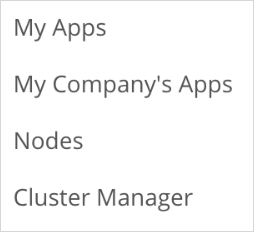

2. Click **Details** next to the namespace you want to use.

    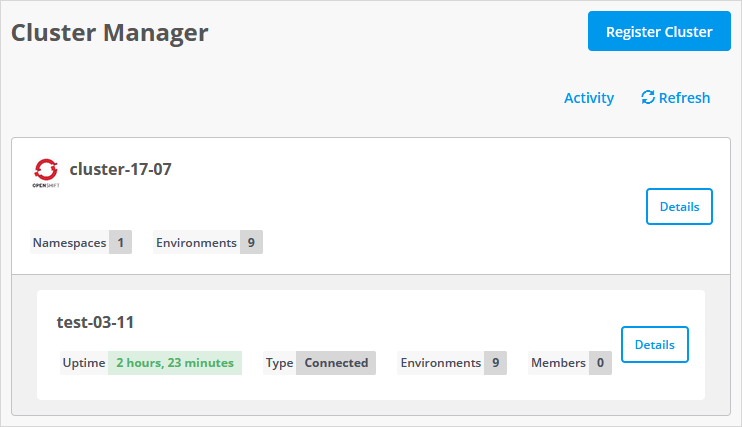

3. Select the **Installation** tab.

4. Click **Use Old Installation Script**.

    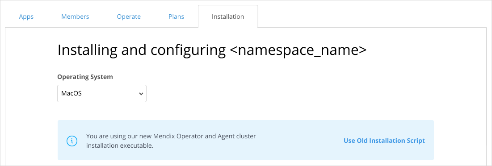

You will see two scripts which you can run on your cluster to install and configure the Mendix Operator.

The first script is the installation script which will install the Mendix operator and Mendix agent in your namespace. See [Running the Installation Script](#installation-script), below for details.

Once that is done, you can run the second script which allows you to configure your namespace. See [Running the Configuration Script](#configuration-script), below for details.

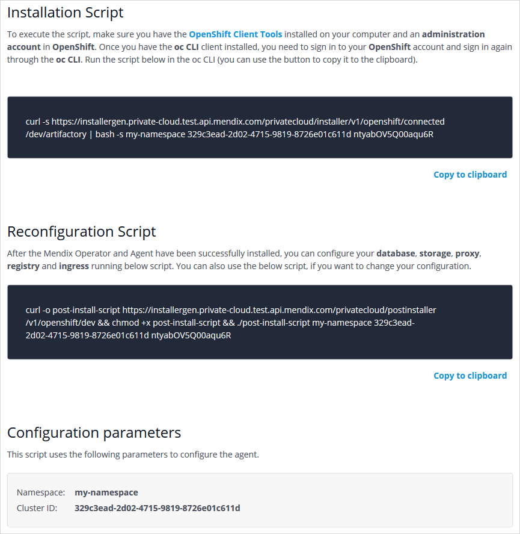

## 3 Running the Installation Script{#installation-script}

### 3.1 Signing in to OpenShift {#openshift-signin}

You will need to have administrator rights to your private cloud platform. This means you will have to log in before you run the installation script.

These instructions are for the OpenShift platform; a similar process will be required for other platforms.

To run the installation script on OpenShift, you must sign in to OpenShift using the OpenShift CLI, before you run the scripts in Bash.

You can do this as follows:

1. Sign in to the OpenShift Console.

2. Click **Copy Login Command** in the user drop-down.
    
    

3. Choose your IdP (Identity Provider).
    
    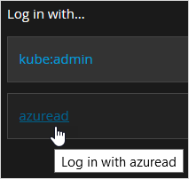

4. Click **Display Token**.

5. Copy the command under **Log in with this token**.
    
    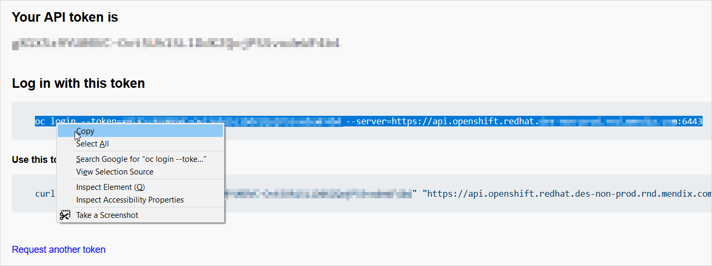

6. Paste the command into Bash and press Enter.

### 3.2 Executing the Installation Script

To execute the installation script, do the following:

1. Copy the Installation Script which has been created for you by clicking **Copy to clipboard**.

    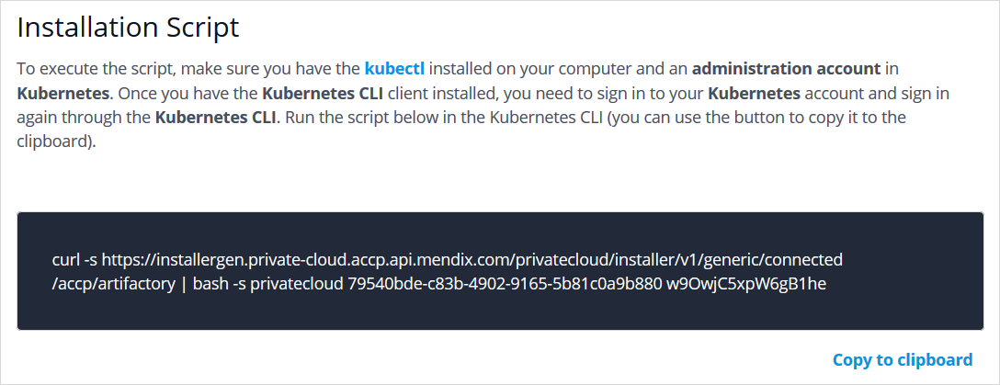

2. Paste the script into your Bash console and press **Enter** to run the script.

The response to the script should look like the image below. You can see that the script has installed the following:

* mendix-agent
* mendix-operator

The installation is successful if the response ends with **Installation Successful**.

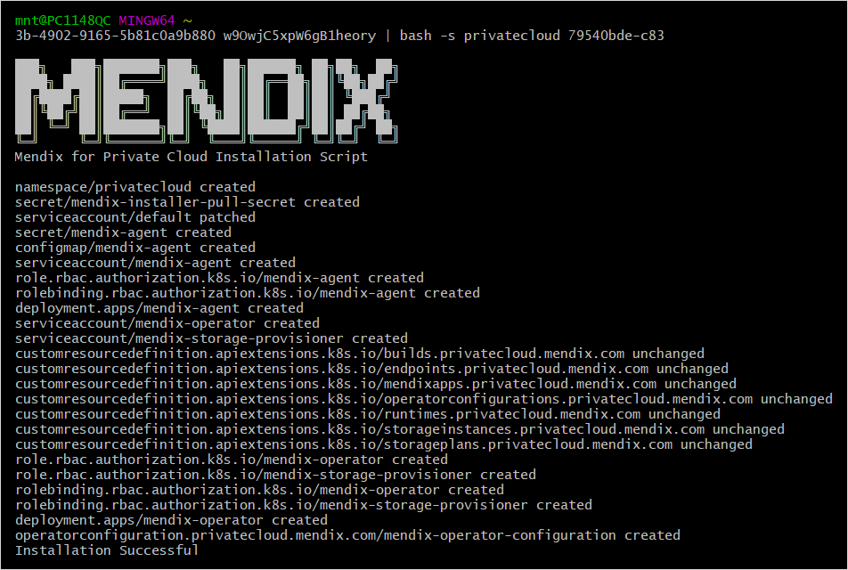

The Mendix operator and Mendix Gateway Agent are now installed on your platform. If you look at the project resources in the OpenShift console, you can see the mendix-operator resource.

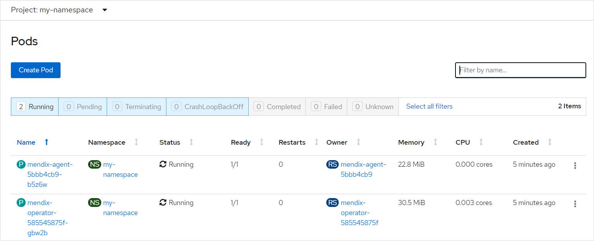

You can always find the installation script again in the **Installation** tab for your namespace in the cluster manager.

## 4 Running the Configuration Script {#configuration-script}

Before you deploy an app to your namespace, you will need to configure a number of resources, namely:

* database
* file storage
* proxy
* registry
* ingress (network)

Mendix provides you with a script which will configure these initially, and this can be re-run any time that you want to change how these are configured.

Before you start, you will need to be signed in with administration rights to the namespace.

1. Copy the **Configuration Script** which has been created for you by clicking **Copy to clipboard**. 

    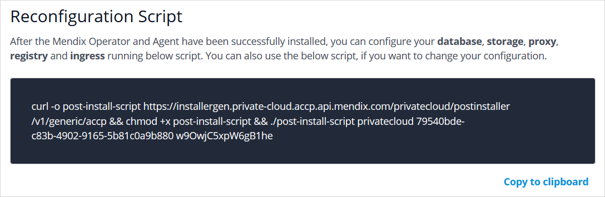

2. Press **Enter** to start the script.

{}

If you update the configuration and your namespace already has existing Mendix environments, restart the Mendix Operator to fully apply the configuration changes (replace `{namespace}` with the namespace where the Operator is installed):

For OpenShift:

```shell
oc -n {namespace} scale deployment mendix-operator --replicas=0
oc -n {namespace} scale deployment mendix-operator --replicas=1
```

For Kubernetes:

```shell
kubectl -n {namespace} scale deployment mendix-operator --replicas=0
kubectl -n {namespace} scale deployment mendix-operator --replicas=1
```

{}

### 4.1 What Do You Want to Do?


Choose **1** if this is the initial configuration and you will be led through all the items which you need to configure.

Choose **2** if you have a configuration already but want to reconfigure part of it. If you choose this option, you will then be able to navigate directly to the thing you want to configure, namely one of the following:

* Database
* Storage
* Ingress
* Registry
* Proxy

When you reconfigure your namespace with databases or storage, you will add new services in addition to any services which are already configured. These plans are then added to the Developer Portal and can be used when creating environments for an app, unless you specifically deactivate them.

You can return to this initial question from any of the other questions by choosing the option **Go back to the start** where it is available.

{}
The configuration script does not currently validate input values. Configuration can be verified by deploying a sample app.
{}

### 4.2 Pick a Database Type{#database-plan}

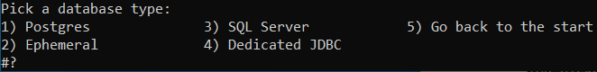

**Postgres** will enable you to enter the values to configure a PostgreSQL database. You will need to provide all the information about your PostgreSQL database such as plan name, host, port, database, user, and password.

{}
If the plan name already exists, you will receive an error that it cannot be created. This is not a problem, you can continue to use the plan, and it will now have the new configuration.
{}

{}
To connect to an Azure PostgreSQL server, the `Enforce SSL connection` option has to be disabled and the Kubernetes cluster must be added to the list of allowed hosts in the firewall. For the database name, use `postgres`.
{}

{}
To connect to an Amazon RDS database, the VPC and firewall must be configured to allow connections to the database from the Kubernetes cluster.
{}

**Ephemeral** will enable you to quickly set up your environment and deploy your app, but any data you store in the database will be lost when you restart your environment.

**SQL Server** will enable you to enter the values to configure a Microsoft SQL Server database. You will need to provide all the information about your SQL Server database such as plan name, host, port, user, and password. 

{}
If the plan name already exists you will receive an error that it cannot be created. This is not a problem, you can continue to use the plan, and it will now have the new configuration.
{}

{}
To connect to an Azure PostgreSQL server, the Kubernetes cluster must be added to the list of allowed hosts in the firewall.
{}

{}
For Azure SQL databases, additional parameters are required to specify the database elastic pool name, tier, service objective and maximum size.
{}

**Dedicated JDBC** will enable you to enter the [database configuration parameters](/refguide/custom-settings) for an existing database directly, as supported by the Mendix Runtime.

{}
A dedicated JDBC database cannot be used by more than one Mendix app.
{}

{}
Configuration parameters will not be validated and will be provided to the Mendix app as-is. If the arguments are not valid or there is an issue with permissions, the Mendix Runtime will fail to start the and deployment will appear to hang with **Replicas running** and **Runtime** showing a spinner.
{}

{}
If the plan name already exists you will receive an error that it cannot be created. This is not a problem, you can continue to use the plan, and it will now have the new configuration.
{}

{}
To use this plan, [upgrade](/developerportal/deploy/private-cloud-upgrade-guide) the Mendix Operator to version 1.1.0 or later.
{}

### 4.3 Pick a Storage Type{#storage-plan}

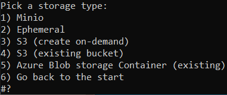

**Minio** will connect to a [MinIO](https://min.io/product/overview) S3-compatible object storage. You will need to provide all the information about your MinIO storage such as endpoint, access key, and secret key. The MinIO server needs to be a full-featured MinIO server and not a [MinIO Gateway](https://github.com/minio/minio/tree/master/docs/gateway).

**S3 (create on-demand)** will connect to an AWS account to create S3 buckets and associated IAM accounts. Each app will receive a dedicated S3 bucket and an IAM account which only has access to that specific S3 bucket. You will need to provide all the information about your Amazon S3 storage such as plan name, region, access key, and secret key. The associated IAM account needs to have the following IAM policy (replace `<account_id>` with your AWS account number):

```json
{
    "Version": "2012-10-17",
    "Statement": [
        {
            "Sid": "bucketPermissions",
            "Effect": "Allow",
            "Action": [
                "s3:CreateBucket",
                "s3:DeleteBucket"
            ],
            "Resource": "arn:aws:s3:::mendix-*"
        },
        {
            "Sid": "iamPermissions",
            "Effect": "Allow",
            "Action": [
                "iam:DeleteAccessKey",
                "iam:PutUserPolicy",
                "iam:DeleteUserPolicy",
                "iam:DeleteUser",
                "iam:CreateUser",
                "iam:CreateAccessKey"
            ],
            "Resource": [
                "arn:aws:iam::<account_id>:user/mendix-*"
            ]
        }
    ]
}
```

{}
If the plan name already exists you will receive an error that it cannot be created. This is not a problem, you can continue to use the plan, and it will now have the new configuration.
{}

**S3 (existing bucket)** will connect to an existing S3 bucket with the provided IAM account access key and secret keys. All apps will use the same S3 bucket and an IAM account. You will need to provide all the information about your Amazon S3 storage such as plan name, endpoint, access key, and secret key. The associated IAM account needs to have the following IAM policy (replace `<bucket_name>` with the your S3 bucket name):

```json
{
  "Version": "2012-10-17",
  "Statement": [
    {
      "Effect": "Allow",
      "Action": [
        "s3:AbortMultipartUpload",
        "s3:DeleteObject",
        "s3:GetObject",
        "s3:ListMultipartUploadParts",
        "s3:PutObject"
      ],
      "Resource": [
        "arn:aws:s3:::<bucket_name>/*"
      ]
    }
  ]
}
```

{}
Configuration parameters will not be validated and will be provided to the Mendix app as-is. If the arguments are not valid or there is an issue with permissions, the Mendix Runtime will fail to start the and deployment will appear to hang with **Replicas running** and **Runtime** showing a spinner.
{}

{}

If you select *Yes* to the *Can this storage be used by multiple environments?* question, all environments using that Storage Plan will use the same Access and Secret keys and will have identical permissions. 
Each app will write into its own directory inside the bucket.

To avoid compromising security, answer *No* to the *Can this storage be used by multiple environments?* question. This way, only one app will be able to use this Storage Plan, and attaching another app to the same storage plan will not be possible.
{}

{}
If the plan name already exists you will receive an error that it cannot be created. This is not a problem, you can continue to use the plan, and it will now have the new configuration.
{}

{}
To use this plan, [upgrade](/developerportal/deploy/private-cloud-upgrade-guide) the Mendix Operator to version 1.1.0 or later.
{}

**Azure Blob storage Container (existing)** will connect to an existing Azure Blob storage Container with the provided storage account name and key. All apps will use the same Container bucket and account credentials. You will need to provide all the information about your Azure Blob storage such as plan name, account name, account key, and container name.

{}
Configuration parameters will not be validated and will be provided to the Mendix app as-is. If the arguments are not valid or there's an issue with permissions, the Mendix Runtime will fail to start the and deployment will appear to hang with **Replicas running** and **Runtime** showing a spinner.
{}

{}

If you select *Yes* to the *Can this storage be used by multiple environments?* question, all environments using that Storage Plan will be using the same account name and account keys keys and will have identical permissions.
All apps using will write into the root directory of same Azure Blob storage Container.

To avoid compromising security, answer *No* to the *Can this storage be used by multiple environments?* question. This way, only one app will be able to use this Storage Plan, and attaching another app to the same storage plan will not be possible.

{}

{}
If the plan name already exists you will receive an error that it cannot be created. This is not a problem, you can continue to use the plan, and it will now have the new configuration.
{}

{}
To use this plan, [upgrade](/developerportal/deploy/private-cloud-upgrade-guide) the Mendix Operator to version 1.1.0 or later.
{}

**Ephemeral** will enable you to quickly set up your environment and deploy your app, but any data objects you store will be lost when you restart your environment.

### 4.4 Pick an Ingress Type{#ingress}

**OpenShift Route** will configure an OpenShift Route. This can only be used for OpenShift clusters.

**Ingress** will configure ingress according to the additional domain name you supply.

Both forms of ingress can have TLS enabled or disabled.

{}
When switching between Ingress and OpenShift Routes, you need to [restart the Mendix Operator](private-cloud-cluster#restart-after-changing-network-cr) for the changes to be fully applied.
{}

### 4.5 Pick a Registry Type{#registry}

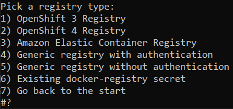

Selecting a registry type and configuring its credentials will configure the destination registry used by Mendix for Private Cloud to build images.
Images are pulled from this registry by Kubernetes, bypassing the Mendix Operator.

You can choose one of the following registry types. OpenShift registries can only be used for clusters on the OpenShift platform. AWS ECR can only be used for AWS EKS clusters. For some of these registries you may need to supply additional information such as the pull URL, push URL, name, and secret.

* OpenShift 3 Registry
* OpenShift 4 Registry
* Amazon Elastic Container Registry (AWS ECR)
* Generic registry with authentication – this supports most registries, for example Azure Container Registry, quay.io, or Docker Hub
* Generic registry without authentication – this can be used for basic, self-hosted registries such as the ones included with Minikube and MicroK8s
* Existing docker-registry secret

**Additional Information**

For **OpenShift 3** and **OpenShift 4** registries, the default image pull credentials from the `default` ServiceAccount will be used. No additional configuration steps are required to enable image pulls in OpenShift.

For **Generic registry…** options, the configuration script will ask if the credentials should be added to `imagePullSecrets` in the `default` ServiceAccount. If you answer **Yes**, the configuration script will add image pull credentials to the `default` ServiceAccount - no additional image pull configuration is required. If you want to configure the image pull separately, choose **No**.

For **Amazon Elastic Container Registry**, you will need to configure registry authentication separately through [IAM roles](https://docs.aws.amazon.com/AmazonECR/latest/userguide/ECR_on_EKS.html).

When choosing the **Existing docker-registry secret**, you will need to add this secret to the `default` ServiceAccount manually, or provide registry authentication configuration in another way (depending on which registry authentication options the Kubernetes cluster vendor is offering).

### 4.6 Do You Want to Configure the Proxy?{#proxy}

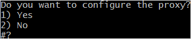

Choose **Yes** if a proxy is required to access the public internet from the namespace; you will be asked for the proxy configuration details.

