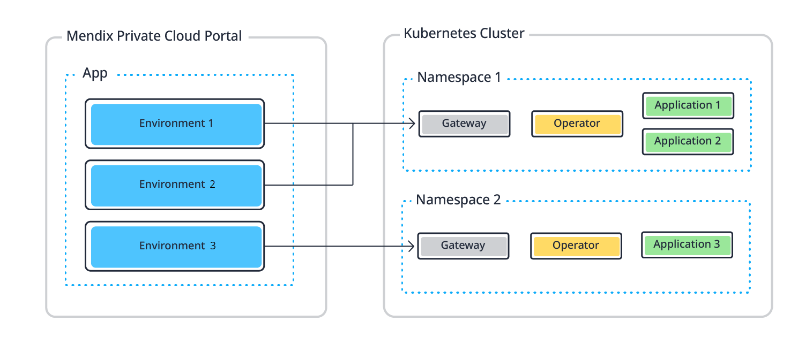
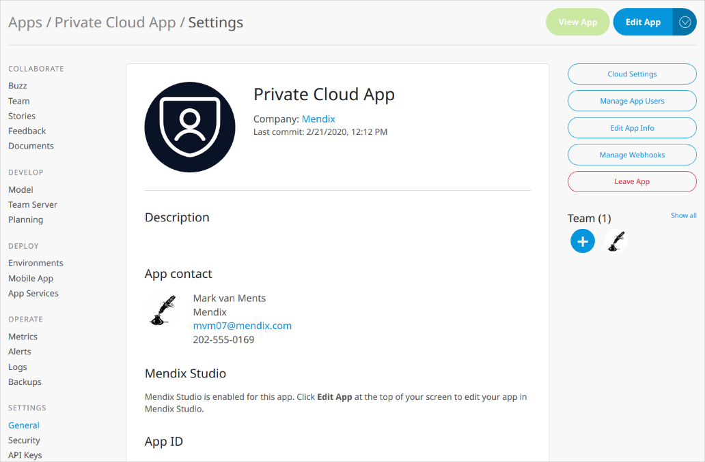
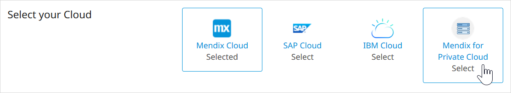
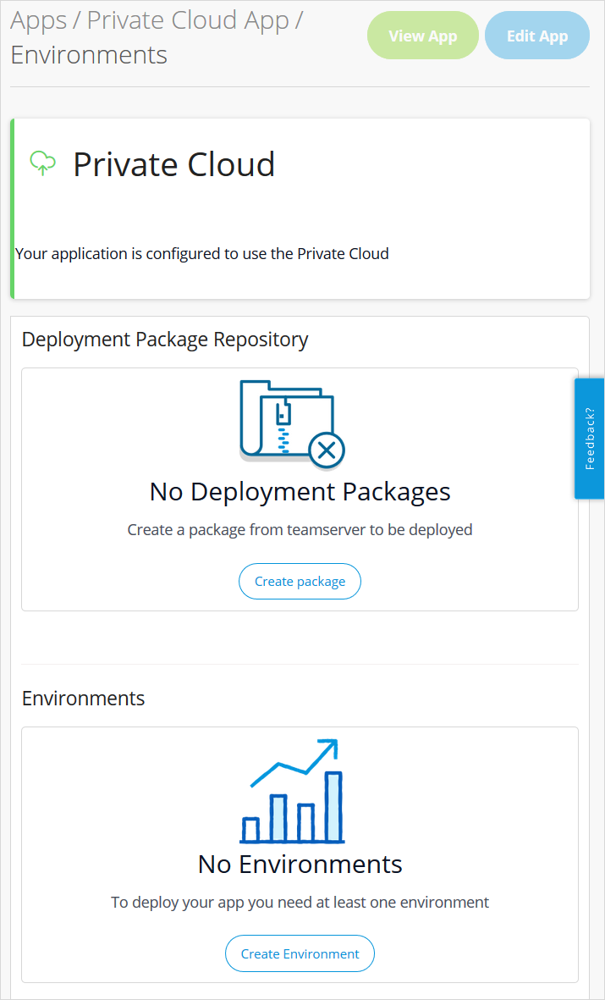
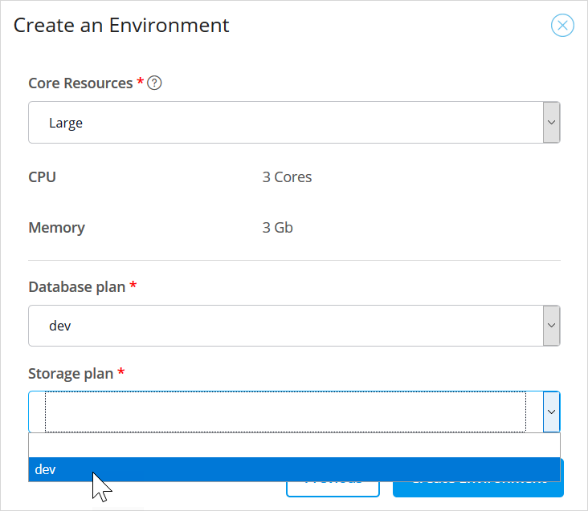
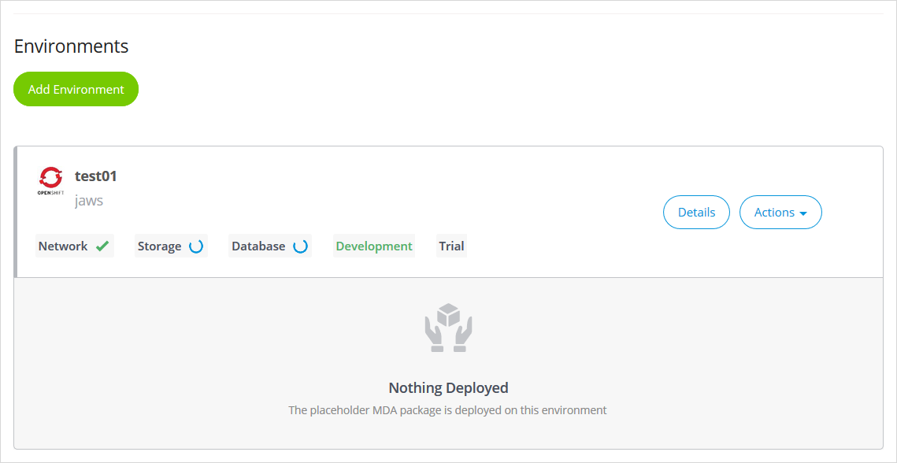
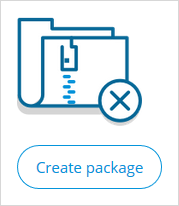
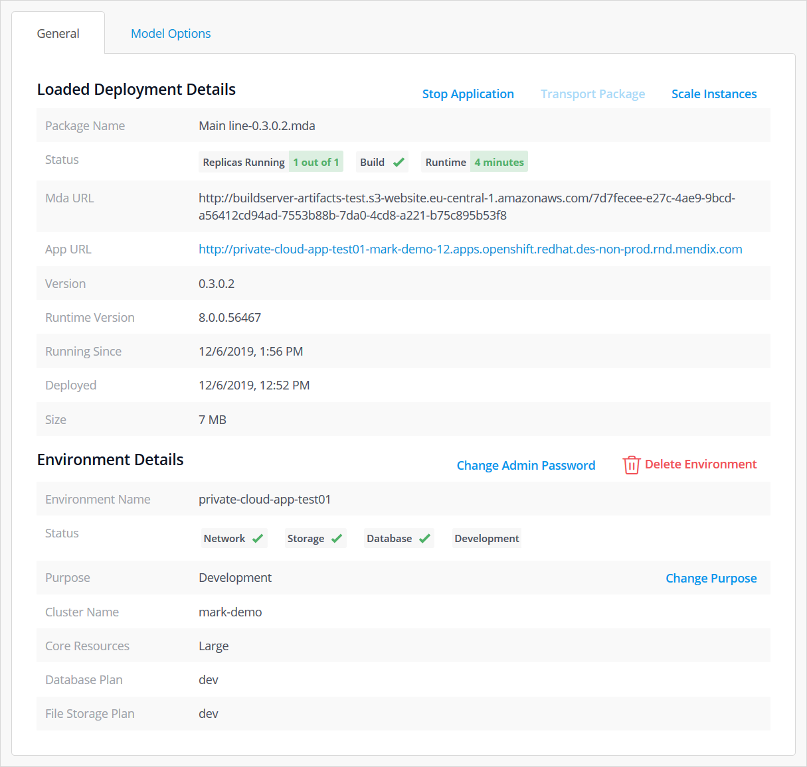
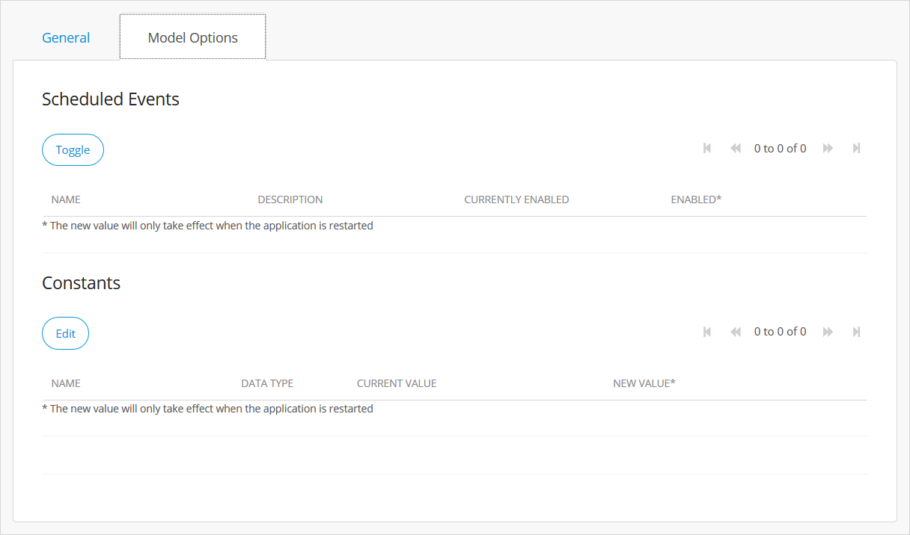

## 1 Introduction

To deploy apps to your private cloud cluster (for example to Red Hat OpenShift or AWS-EKS), the cluster needs to be registered in the Mendix Developer Portal. This creates a link between the Mendix Developer Portal and the cluster. See [Creating a Private Cloud Cluster](private-cloud-cluster) for instructions on how to do this.

Once the cluster has been registered, and a namespace created, team members with *Deploy App* rights can create environments and deploy an app.

This document explains how to use the Mendix Developer Portal to deploy the app.

Alternatively, you can provide the CRs through the console or command line for a namespace in a standalone cluster. This is described in [Using Command Line to Deploy a Mendix App to a Private Cloud Cluster](private-cloud-operator).

Within your namespace you can run one, or several, Mendix apps. You can see the relationship between the Mendix environments and the Kubernetes namespaces in the image below.



Because you can run several Mendix apps in the same namespace, each environment will have an **Environment UUID** added when the app is deployed to ensure that it is unique in the project. You should not use the same name as the Mendix tools used to deploy the app. See the section [Reserved Names for Mendix Apps](#reserved-names), below.

##  2 Prerequisites for Deploying an App

To deploy an app to your private cloud platform, you need the following:

* A Mendix account with **Deploy App** rights to an existing Cluster – see [Registering a Private Cloud Cluster](private-cloud-cluster) for more information on setting up clusters and namespaces and adding members
* Mendix Studio Pro version 7.23.3 (build 48173) or above
* A Mendix app created with the version of Studio Pro you are using.

## 3 Deploying an App for the First Time

### 3.1 Selecting Mendix for Private Cloud

When you first create your app, it will be set to deploy to the Mendix Cloud. You need to change the target to be private cloud.

1. Open the **General** page for your app in the Developer Portal.
    
      

2. Click **Cloud Settings**.

3. Click **Mendix for Private Cloud**.
    
    

4. Click **Set up Mendix for Private Cloud**.
    
    

5. Your app is now configured for private cloud.

### 3.2 Creating an Environment{#create-environment}
When deploying your app for the first time, there will be no environments and no deployment packages available. The **Environments** page for your app in the Developer Portal will show you the current status.



First you need to create an environment:

1. Click **Create Environment**.

2. A **UUID** will be generated for you. This will be used when creating your environment to ensure that all the environment names in your namespace are unique.

    {}You can change the UUID if you wish, but do not reuse one which has already been used in this namespace, even if the environment it was used for has been deleted.{}

3. Enter **Environment Name**, the name for the environment. The environment name can only contain lowercase letters, numbers and dashes and must start and end with an alphanumeric character. You can have several environments for your app, for example test, acceptance, and production.

4. Use the drop-down **Select Namespace** to select an existing namespace. You will see all namespaces of which you are a member.

5. Select the **Purpose**.
    
  1. For development of the app, for example acceptance testing, choose **Development**.
  2. For production deployment, select **Production**. If you select production, then you will be asked for the **Subscription Secret** which ensures that your app runs as a licensed app. See [Free Apps](mendix-cloud-deploy#free-app) in *Mendix Cloud* for the differences between free/test apps and licensed apps.

    {}Your app can only be deployed to a production environment if security is set on. You will not receive an error if security is set off, but the deployment will appear to hang with a spinner being displayed.{}

6. Click **Next**.
    
    

7. Select **Core Resources**.

    For core resources, there are two sets of values. The **Request** value is the amount of core resources which are initially requested. The **Limit** value is the maximum amount of resource that the environment can use.

    There are three pre-defined sets of resources, **Small**, **Medium**, and **Large**. Choosing these will set the **CPU** and **Memory** values automatically.

    | **Name** | **CPU cores**: Limit | **Memory (Gb)**: Limit | **CPU cores**: Request | **Memory (Gb)**: Request |
    | --- | --- | --- | --- | --- |
    | Small | 1 | 0.5 | 0.1 | 0.5 |
    | Medium | 2 | 2 | 1 | 1 |
    | Large | 4 | 4 | 2 | 2 |
    | Custom | own choice | own choice | own choice | own choice |

    Alternatively, you can choose **Custom**, and enter your own requirements for **CPU** and **Memory**. Ensure that these values are the same or greater than the values for a *Small* enviroment, otherwise you may run into problems running your app.

8. Select a **Database plan** from the list of plans set up in the namespace.

9. Select a **Storage plan** from the list of plans set up in the namespace.
    
    

10. Click **Create Environment**.

11. You will see your new environment listed. An *in-progress* icon will be shows next to the resource plans until they have been provisioned.

    

You will not be able to deploy to this environment until it has been fully prepared. This means that all the resource plans have been confirmed and that the placeholder app has been successfully deployed. See [Deploying the Deployment Package](#deploy-package), below, for instructions on how to check that the environment has been created successfully.

### 3.3 Creating a Deployment Package {#create-deployment-package}

Before you can deploy your app, you will need to create a deployment package. Ensure that you have committed the version of the app you want to deploy before continuing.

1. On the **Environments** page for your app in the Developer Portal, click **Create Package**.
    
    

2. Select the branch which contains the commit for which you want to create a deployment package and click **Next**.
    
    

3. Select the revision/commit for which you want to create a deployment package and click **Next**.
    
    

4. Enter a **New version** and **Tag description** according to your own deployment procedure.

5. Select an environment in **Environment for Autodeploy** if you want to deploy and start your package immediately. You need to make sure that the environment is ready using the techniques described in [Deploying the Deployment Package](#deploy-package), below, where you can also see how to deploy a deployment package manually.

6. Click **Build this revision.**
    
    

7. Confirm the information message and you will be returned to the **Environments** page.

{}
Alternatively, you can upload an existing MDA by clicking **Upload Package**.
{}

### 3.4 Deploying the Deployment Package{#deploy-package}

You can also deploy an existing deployment package to an environment without having to create a new one. This also allows you to specify constant values and control scheduled events before the app is started.

{}
Currently, deployment packages are only valid for two weeks. Older deployment packages will still be visible, but if you try to deploy a package that was created more than two weeks ago, the deployment will fail and return a 403 error. The solution is to [recreate the deployment package](#create-deployment-package).
{}

After creating an environment and deployment package (see [Creating an Environment](#create-environment) and [Creating a Deployment Package](#create-deployment-package), above) you will now have a deployment package and an environment. Check that there is a green tick next to the deployment package and the resources of the environment. If any of these have failed, try to create the environment or the deployment package again, and contact your cluster manager. If neither of these solves the problem. contact Mendix support for help.


You also need to check that the **PlaceholderMDA**, an initial app which is deployed by default to your environment, has successfully built and is running.


If everything has been created successfully, and the PlaceholderMDA has been built and is running, you can deploy the deployment package of your app by doing the following:

1. Click **Deploy** next to the deployment package you wish to deploy.

2. Confirm the **Target** environment (you can select a different one here if one is available).

3. Confirm that the **Status** is *Ready*.

4. Click **Transport**.
    
    

5. Change any constants in the **Constants** tab: select the constant you want to edit and then click **Edit**.

6. Toggle any scheduled events in the **Scheduled Events** tab: select the scheduled event you want to enable or disable and click **Toggle**.

7. Click **Continue** to continue to the Start Application confirmation page.
    
    

8. Click Apply Changes to deploy the application to the selected environment. The app will start automatically once the deployment is successful.

You can find a description of what this deployment means within the Kubernetes cluster in [How the Operator Deploys Your App](#how-operator-deploys), below.

You will be taken to the Environment Details page for the selected environment. You can find information about managing your environment from this page in [Managing Your Environments from the Environment Details Page](#environment-details), below.

## 4 Environments Page

The **Environments** page of the Developer Portal contains three sections:

* Deployment Package Repository
* Environments
* Activity

### 4.1 Deployment Package Repository

This lists the deployment packages which have been created for this app project.


There are five buttons:

* Refresh
* Create Package
* Upload Package
* Details
* Deploy

These are described in more detail below.

#### 4.1.1 Refresh

Sometimes the page will not be automatically refreshed with the latest information. Click this button to update the information on the page.

{}
Using the browser refresh button will take you away from this environments page, so use this button instead.
{}

#### 4.1.2 Create Package

This creates a new package as described in [Creating a Deployment Package](#create-deployment-package), above.

#### 4.1.3 Upload Package

This allows you to upload an MDA package you have already created. The uploaded package is added to the list of packages for the app and can be deployed in the same way as a package created using **Create Package**.

#### 4.1.4 Details

This displays details of the deployment package.


The information shows here is labeled to help you. The indicators in the environment description are described in the next section, [Environments](#environments), below.

There are three additional actions you can take while looking at the deployment package details:

* **Expand to view build output** – shows the output from the Mendix build
* **Download Package** – allows you to download the deployment package and save it locally
* **Delete Package** – deletes the deployment package – you will be asked to confirm this action

#### 4.1.5 Deploy

This deploys the package to an existing environment as described in [Deploying the Deployment Package](#deploy-package), above.

### 4.2 Environments {#environments}

This section shows all the environments created for this app project.


For each environment, you can see a summary of the status of the resources and details of the package which is running in the environment (if there is one).

You can perform the following actions:

* **Add Environment**
* View **Details**
* Perform **Actions**

These are described in more detail, below.

In addition, there are several indicators describing the status of the environment.

#### 4.2.1 Environment Status Indicators{#environment-status}

##### 4.2.1.1 Network

The **Network** indicator has the following values:

* Tick – the network is operational
* Cross – the network is not operational
* Spinner – the network is being provisioned

##### 4.2.1.2 Storage

The **Storage** indicator has the following values:

* Tick – storage is provisioned
* Cross – storage is not provisioned
* Spinner – storage is being provisioned

##### 4.2.1.3 Database

The **Database** indicator has the following values:

* Tick – the database is provisioned
* Cross – the database is not provisioned
* Spinner – the database is being provisioned

##### 4.2.1.4 Development

The word **Development** indicates that this environment is set up for development.

The word changes to **Production** if the environment is set up for production.

See [Creating an Environment](#create-environment), above, for more information.

##### 4.2.1.5 Trial

The word **Trial** indicates that the Operator managing that environment is unlicensed.

When the Operator is running in trial mode, it will stop managing an environment thirty days after the environment was created and the word changes to **Expired**. In this case you will be unable to stop or start your app, or deploy an app to this environment. The only action you can take is to delete the environment. 

The word **Licensed** shows that the Operator managing that environment is licensed.

{}
The Operator license is independent from a Mendix Runtime license. The Operator license allows you to manage Mendix apps in your cluster, while the Mendix Runtime license (configured through a [Subscription Secret](#change-subscription-secret)) removes trial restrictions from a Mendix App itself.

You can get an Operator license from [Mendix Support](https://support.mendix.com), together with instructions on how to configure it.
{}

#### 4.2.2 Add Environment

This adds a new environment as described in [Creating an Environment](#create-environment), above.

#### 4.2.3 Details

This opens the **Environment Details** page which is described in more detail in [Managing Your Environments from the Environment Details Page](#environment-details), below.

#### 4.2.4 Actions

This button contains a list of actions which you can perform quickly on the environment. Most of these actions will be disabled if the app is currently starting or stopping. These actions are:

* **Start Application** (only shown if app is stopped) – allows you to start a stopped application
* **Transport Package** – allows you to deploy the deployment package in the current environment to another environment within the app project, or to redeploy it in the current environment
* **Environment Logs** – takes you to the log page defined by the cluster manager when they registered the namespace
* **Model Options** – allows you to change the running of scheduled events and the values of constants for your app by taking you to the **Model Options** tab of the **Environment Details** page
* **Stop Application** (only shown if at least one replica is running) — stops the application by reducing the number of replicas to zero
**Delete Environment** – this deletes the environment (see [Current Limitations](#limitations), below, for additional details about what is deleted) — you will be asked to confirm this action

### 4.3 Activity

This section shows all the activities, such as creating environments and deploying apps, which have taken place in this environment. You can sort the activities in either descending or ascending date and time order.


## 5 Managing Your Environments from the Environment Details Page{#environment-details}

Each environment you create has an **Environment Details** page which allows you to monitor and manage your environments. You can reach this by clicking the **Details** button next to the environment you want to manage.

If you have any outstanding changes to your environment the page will display a warning message. If you click **Apply Changes**, the environment will be stopped and restarted.


The environment details page consists of seven tabs:

* General
* Model Options
* Network
* Runtime
* Log Levels
* TLS
* Debugger

These tabs are described below.

### 5.1 General Tab

The general tab shows information about your running app.



Most of the information is self-explanatory, but the status information gives you a quick summary of the status of the environment and the app deployed there.

#### 5.1.1 Loaded Deployment Details > Status

This status shows you the following information – how many replicas are running, whether there was a successful build, and how long since the app was last started.

#### 5.1.2 Environment Details > Status

This shows you the status of the environment and is the same as the status shown on the Environments page and described in [Environment Status Indicators](#environment-status), above.

#### 5.1.3 Action Buttons

There are also buttons which allow you to perform various actions on your app and environment. These are described in the sections below.

##### 5.1.3.1 Stop/Start Application

If the app is not currently running (**Replicas Running** is set to *None*) you will see **Start** Application. Clicking this will immediately trigger the app to begin running by increasing the number of replicas.

If the app is currently running, clicking **Stop Application** immediately stops the application by reducing the number of replicas to zero.

##### 5.1.3.2 Transport Package

Allows you to deploy the deployment package in the current environment to another environment within the app project, or to redeploy it in the current environment. See [Deploying the Deployment Package](#deploy-package), above, for more information.

##### 5.1.3.3 Scale Application

This allows you to scale your app by increasing the number of replicas.


To apply the new value, click **Restart the App and Scale**. Because you restart your app, it will be unavailable for a short time.

##### 5.1.3.4 Clear Admin Password

This allows you to clear the password for the local admin user in your app to disable the user without having to clear it in Studio Pro and redeploy the app.

##### 5.1.3.5 Change Admin Password

This allows you to change the password for the local admin user in your app without having to change it in Studio Pro and redeploy the app.

##### 5.1.3.6 Delete Environment

This deletes the environment — you will be asked to confirm this action.

If the cluster is standalone, or the Mendix Gateway Agent is not connected for some other reason, you can still delete the environment information in the Developer Portal. However, the actual environment will not be deleted and you will have to do this manually.

If the environment cannot be deleted, you will receive a warning, but can go ahead and remove it from the Developer Portal.


##### 5.1.3.7 Change Purpose

This enables you to change the purpose of your app environment. You can label an environment as one used for development of the app, for example acceptance testing. In this case choose **Development** and the app will be deployed as a free app.

For production deployment, select **Production**. If you select production, then you will be asked for the Subscription Secret which ensures that your app runs as a licensed app. See <https://docs.mendix.com/developerportal/deploy/mendix-cloud-deploy#free-app> for the differences between free/test apps and licensed apps.

{}
Your app can only be deployed to a production environment if security is set on. You will not receive an error if security is set off, but the deployment will appear to hang with a spinner being displayed.
{}

##### 5.1.3.8 Change Subscription Secret{#change-subscription-secret}

If you select Production as the **purpose** of the app environment, then you will need to use a Subscription Secret which ensures that your app runs as a licensed app. If you need to enter or change the subscription secret, then you can do that here.

Subscription secrets are obtained from [Mendix support](https://support.mendix.com/).

###  5.2 Model Options Tab

The **Model Options** tab allows you to change the configuration of scheduled events and constants in your app.



To toggle any scheduled events, select the scheduled event you want to enable or disable and click **Toggle**.

To change any constants, select the constant you want to edit and then click **Edit**.

### 5.3 Network Tab

On the Network tab, you add client certificates (in the PKCS12 format) or certificate authorities (in the PEM format) for outgoing connections. These will be used when your application initiates SSL/TLS connections.


### 5.4 Runtime Tab

On the Runtime tab, you can change various runtime settings for your app environment. For more details of these, see the [Runtime Tab](environments-details#runtime-tab) section of *Environment Details*.


{}
When you use some settings on the Runtime tab for Mendix for Private Cloud they may work differently from how they work in the Mendix Cloud.
{}

### 5.5 Log Levels Tab

On the Log Levels tab, you can change the log levels which are used for the log nodes in your app. For more details of these, see the [Log Levels Tab](environments-details#log-levels) section of *Environment Details*.


### 5.6 TLS

If you are using Mendix Operator version 1.5.0 or above, you can configure TLS for your environment from the Developer Portal.

In the TLS pane, you can choose whether to **Apply Default Configuration** or a **Custom TLS Configuration**. If you apply the default configuration, then the configuration made when you ran the configuration script for the namespace will be used.

{}
If you are using a version of Mendix Operator before 1.5.0, the settings in this tab will have no effect and the default configuration will be applied.
{}


If you choose a custom TLS configuration, you will need to enter the following information:

* Enable TLS – is TLS enabled for this environment?

    

* Use existing TLS secret or add new tls private key and certificate?

    

* Existing Secret Name – if you choose an existing TLS secret then you will be asked to enter its name

* TLS Private Key File and TLS Certificate File – if you choose to add a new key you will need to upload these two files

    

Click **Save** to confirm your new configuration.

You will receive a warning that you have made some changes. Click **Apply Changes** to restart the app and apply the changes.

### 5.7 Debugger

On the Debugger tab you can set up and view the credentials you need to debug your app when it is running in your private cloud. For more information see [How To Debug Microflows Remotely](/howto/monitoring-troubleshooting/debug-microflows-remotely#private-cloud).

## 6 Current Limitations{#limitations}

### 6.1 Reserved Names for Mendix Apps{#reserved-names}

All names beginning **mendix-** are reserved for use by the Mendix Operator.

All names beginning **openshift-** are reserved for use by OpenShift if you are deploying to an OpenShift cluster.

### 6.2 Deleting Your App

Delete all environments before you delete an app. If you delete an app which has existing private cloud environments, you will not be able to reach the environments through the Developer Portal.

### 6.3 Deleting the Cluster

If the cluster is running in standalone mode, you need to delete all `MendixApp` CRs.

To confirm that environments and their associated storage have been successfully deleted, run:

For OpenShift:
```bash
oc get mendixapp -n {namespace}
oc get storageinstance -n {namespace}
```

For Kubernetes:
```bash
kubectl get mendixapp -n {namespace}
kubectl get storageinstance -n {namespace}
```

Both commands should return an empty list.

### 6.3.1 Deleting StorageInstance CRs

If the Operator fails to deprovision an app's database or file storage, the `*-database` or `*-file` Pod will fail with an Error state:


To force removal of a StorageInstance `{name}`, run:

For OpenShift:
```bash
oc patch -n {namespace} storageinstance {name} --type json -p='[{"op": "remove", "path": "/metadata/finalizers"}]'
```

For Kubernetes:
```bash
kubectl patch -n {namespace} storageinstance {name} --type json -p='[{"op": "remove", "path": "/metadata/finalizers"}]'
```

This will also delete the failed Pod.

After manually removing the StorageInstance, you'll need to manually clean up any resources associated with it, such as the database, S3 bucket or associated AWS IAM account.

### 6.4 App Security and Production

If you attempt to deploy an app with security not set to production into a production environment you will not get an error, however the deployment will appear to hang with **Replicas running** and **Runtime** showing a spinner.

### 6.5 ApplicationRootUrl Needs to be Set Manually

In some cases, your Mendix app will need to know its own URL - for example when using SSO or sending emails.

For this to work properly, you need to set the [ApplicationRootUrl](/refguide/custom-settings#2-general-settings) **Custom Runtime Setting** in the **Runtime** tab to the app's URL.

To add this setting:

1. Copy the **App URL** value from the **General** tab.
2. Switch to the **Runtime** tab.
3. Add a **Custom Runtime Setting**: use `ApplicationRootUrl` as the **Setting** name and the URL you copied from **App URL** as the **New value**.

{}
If you change **App URL** in the **General** tab, you should update the `ApplicationRootUrl` value as well.
{}

## 7 Troubleshooting

This section covers an issue which can arise where Mendix cannot recover automatically and manual intervention may be required.

### 7.1 Status Reporting

Under some circumstances changes in the status of the environment and its apps will not be updated automatically. To ensure you are seeing the current status, you may need to click the **Refresh** button on the screen (not the browser page refresh button).

## 8 How the Operator Deploys Your App {#how-operator-deploys}

The Mendix Operator is another app within your private cloud namespace. It is triggered when you provide a CR file. The process looks like this:


The Mendix Operator CR is processed by the Mendix Operator into four steps:

1. The Build CR is created – this creates a Docker image from the app deployment package, pushes it into the Image Registry, and provides the correct information to the Runtime CR

2. The StorageInstance CR is created for the database – this causes the Operator to provision database database, according to the plan selected, and pass information about the database to the Runtime CR

3. The StorageInstance CR is created for the file storage – this causes the Operator to provision an file storage bucket for the app and pass information about the storage to the Runtime CR

4. The OpenShift Route CR is created – this sets up a route to the app.

The Runtime CR is now complete, and the Runtime Controller uses the CR to pull the Docker image from the Image Registry and deploy it to an App Container in the OpenShift namespace.
