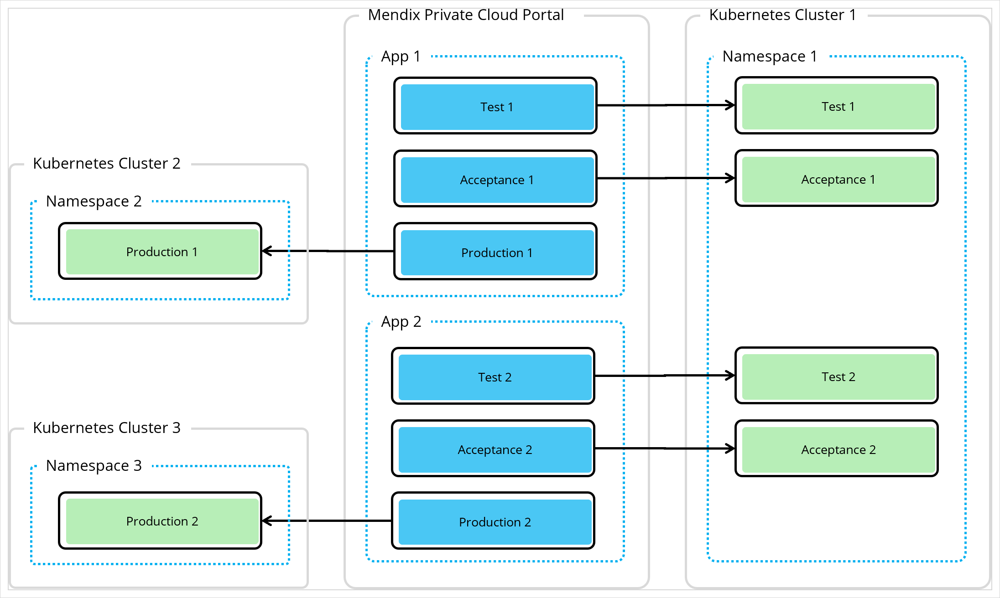
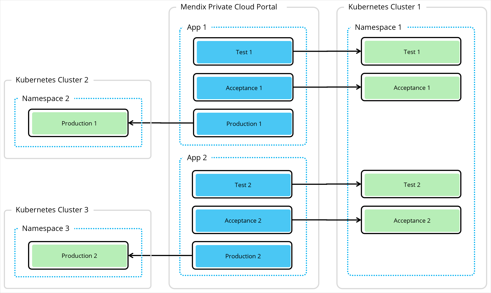

## 1 Introduction

With Mendix for Private Cloud, you have more control over where the environments you need for your Mendix app are created. You can decide whether a cluster contains one namespace or several, whether a namespace contains one environment or several, and whether those environments are all for the same app, or for several.

This document discusses the recommended ways of configuring environments for Private Cloud clusters and the licensing requirements.

## 2 Licensing Overview

You need a copy of the Mendix Operator and (optionally) the Mendix Gateway Agent for each Namespace you create in your Private Cloud to create environments for Mendix apps.

You will require a license to use the Mendix Operator within your company for anything other than limited evaluation purposes. This is in addition to any licenses you have for your Mendix app.

## 3 Production Environments

It is recommended that production environments should always be in their own namespace. This has the following benefits:

* it is safer if there is an issue with a namespace or cluster in the cloud
* it allows separate monitoring of the namespace
* it allows separate configuration of security for the cloud administrator

There may circumstances when you prefer a separate cluster for each production environment, not just a separate namespace.

## 4 Non-production Environments

There are two possible ways to set up your non-production (for example test and acceptance) environments

### 4.1 Minimal

In the minimal configuration, all non-production environments are put into a single namespaces. This has the benefit of simplicity. As these are not production environments it is expected that they will not have a large volume of data or users, and that the test data does not require any special security.

This approach is not recommended if you are performing stress tests on your app as it will be affected by other apps running in the same namespace.

### 4.2 Fine-grained

A more fine-grained approach separates out non-production environments into different namespaces, or even namespaces in different clusters.

There are multiple ways you can do this, depending on your requirements. Examples are:

* Separate namespaces for test and acceptance environments
* Separate namespaces for other non-production environments, for example load tests
* Separate namespaces for each app
* Separate namespaces for each business function

The advantages of this approach are:

* You can set security for each namespace, so you can have separate security for different business functions, or for your test and acceptance namespaces
* You have better monitoring of the platform resources used by each environment

The disadvantage is:

* Every additional namespace and cluster will have to be managed individually
