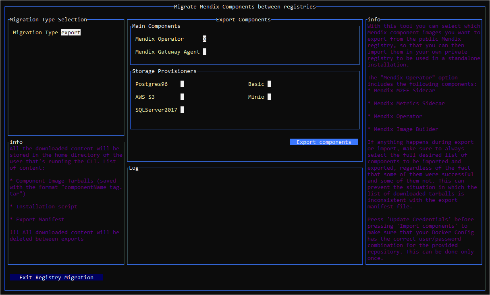

## 1 Introduction

When you have an OpenShift or Kubernetes cluster which is firewalled, you will need to host Mendix components in your own custom registry.

This document explains how to export the components from the Mendix registry and import them into your own registry. It also explains how to tell the Mendix Configuration Tool to use your own registry when configuring the namespace.

## 2 Prerequisites for Migrating to Your Registry

To export components from the Mendix registry, you will need access to the internet.
You will also need all the other prerequisites for creating a Mendix for Private Cloud cluster, as documented in the [Prerequisites for Creating a Cluster](private-cloud-cluster#prerequisites) section of *Creating a Private Cloud Cluster*.

## 3 Saving the Installer Shell Script{#saving-script}

Follow the instructions in [Creating a Private Cloud Cluster](private-cloud-cluster) using the configuration tool as far as doing the [Base Installation](private-cloud-cluster#base-installation).

Follow the instructions for doing the base installation, including the instructions for saving the installer settings: "Click **Save Installer**". This step will save the *mx_installer* shell script on your local machine in the subfolder `.mx_config_cli` of your user home directory (for example `C:\Users\<User id>\.mx_config_cli` in Windows or `/home/<User id>/.mx_config_cli` for Mac and U*ix).

You will need to patch this installer later on to use your own registry.

## 4 Export Mendix Components{#export}

To export the Mendix components you want to migrate to your own registry, you need to run the Mendix Configuration Tool in registry migration mode.

Follow these steps to export the Mendix components and store them on your local machine:

1. Start the Configuration Tool using the command `mx-config-cli registry-migration` to initiate registry migration mode.

2. Select **Migration Type** to be *Export*.

3. Select the **Main Components** and **Storage Provisioners** you want to export.

    

4. Click **Export components**.

    The components you selected will be extracted from the Mendix repository and saved on your local machine. This will be in the folder `C:\Users\<User id>\.mx_config_cli\registry-migration` on Windows or `home/<User id>/.mx_config_cli/registry-migration` for Mac and U*ix. This can take some time. Wait for the message *The images for the selected components were exported successfully in tarballs*.

## 5 Import Mendix Components Into Custom Registry

Once you have the Mendix components saved on your local machine, you can import them into your custom registry.

Perform the following steps.

1. If you are not continuing from the previous section, ensure that the Configuration Tool is started in registry migration mode. Use the command `mx-config-cli registry-migration` if it is not already running.

2. Select **Migration Type** to be *Import*.

3. Enter the following **Repository Details**:

    * Registry User – the username used for authorized access to the registry
    * Registry Password – the password used for authorizing the registry user
    * Registry URL
    * Repository – the name you have given to your repository

4. Click **Update Credentials**. 

5. Select the **Main Components** and **Storage Provisioners** you want to import into your own registry.

    {}You can only choose components which you exported in the previous section, [Export Mendix Components](#export).{}

    

6. Click **Import components**.

    The components you selected will be uploaded from the folder on your local machine where they were saved, and imported into the selected registry. This will be from the folder `C:\Users\<User id>\.mx_config_cli\registry-migration` on Windows or `home/<User id>/.mx_config_cli/registry-migration` for Mac and U*ix.

## 6 Configure Installation Script to use Custom Registry

Now that you have all the required components in your custom registry, you need to patch the configuration script you downloaded in [Saving the Installer Shell Script](#saving-script) to use your custom registry.

Perform the following steps.

1. If you are not continuing from the previous section, ensure that the Configuration Tool is started in registry migration mode. Use the command `mx-config-cli registry-migration` if it is not already running.

2. Select **Migration Type** to be *Import*.

3. Click **Patch installation script**.

    This will replace the standard registry location (`private-cloud.registry.mendix.com`) in the *mx_installer* shell script with the new registry details for the components you have imported. This is stored on your local machine in the subfolder `.mx_config_cli` of your user home directory (for example `C:\Users\<User id>\.mx_config_cli` in Windows or `/home/<User id>/.mx_config_cli` for Mac and U*ix).

## 7 Create and Configure Mendix for Private Cloud Cluster and Namespace

You can now create a new Mendix for Private Cloud cluster and namespace. To tell the Configuration Tool that you want to use your own registry, you will use the configuration tool with the argument `--offline`.

Follow the instructions in [Creating a Private Cloud Cluster](private-cloud-cluster) using the configuration tool as far as [Running the Configuration Tool](private-cloud-cluster#running-the-tool).

In the section [Running the Configuration Tool](private-cloud-cluster#running-the-tool), add the flag `--offline` to the command line that you paste into Bash, before your press <kbd>Enter</kbd>.  

### 7.1 Base Installation

With the `--offline` flag set, follow the instructions in the [Base Installation](private-cloud-cluster#base-installation) section of *Creating a Private Cloud Cluster*.

### 7.2 Configure Namespace

With the `--offline` flag set, follow the instructions in the [Configure Namespace](private-cloud-cluster#configure-namespace) section of *Creating a Private Cloud Cluster*.

When you get to the stage [Review and Apply](private-cloud-cluster#review-apply), the YAML file which you create will contain the location of your custom registry instead of the default Mendix registry. The patched YAML file is stored in the subfolder `.mx_config_cli/<project name/<folder name>/kube` of your user home directory (for example `C:\Users\<User id>\.mx_config_cli\<project name\<folder name>\kube` in Windows or `/home/<User id>/.mx_config_cli/<project name/<folder name>/kube` for Mac and U*ix). The **Installer output** panel will confirm the location of the saved file when you click **Write YAML**.

Click **Apply Configuration** to apply the configuration to your namespace, as normal.
