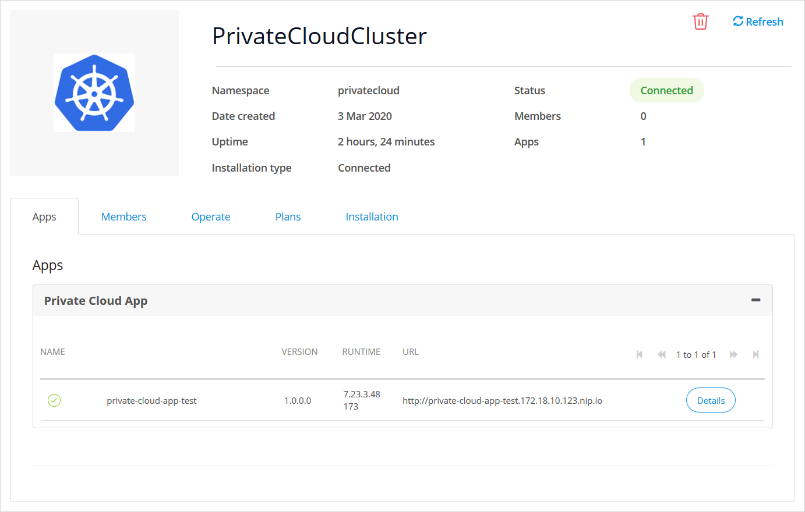

## 1 Introduction

{}To monitor Mendix for Private Cloud environments, install Mendix Operator v2.1.0 or a later version.{}

Mendix for Private Cloud provides a [Prometheus](https://prometheus.io/) API that can be scraped by a local Prometheus server.
This API can also be used by other monitoring solutions that support scraping the Prometheus API.

The metrics API can only be accessed inside the Kubernetes cluster, and metrics are never sent to the Mendix Private Cloud Portal.
To collect, store, and display metrics, you will need to install a local monitoring solution.

Mendix for Private Cloud writes all logs to the standard output (`stdout` and `stderr`).
Any Kubernetes log processing solution should be able to read and collect those logs.
This document shows an example how to use [Grafana Loki](https://grafana.com/docs/loki/next/) and [Promtail](https://grafana.com/docs/loki/latest/clients/promtail/) to collect those logs.

This document will help you quickly set up a solution for monitoring Mendix for Private Cloud environments.
You can customize this solution to match the requirements of your team or organization.

### 1.1 Metrics generation modes{#metrics-generation-modes}

Mendix Operator v2.4.0 and above offers several modes for collecting and generating metrics.

| Mode                      | Native           | Compatibility          |
| ------------------------- | ---------------- | ---------------------- |
| Mendix Operator version   | v2.4.0 and above | v2.1.0 and above       |
| Supported Mendix versions | 9.7 and above    | 7.23 and above         |
| Metrics activities        | Yes              | No                     |
| Microflow execution times | Yes              | No                     |
| Custom metrics            | Yes              | No                     |
| Rigid format              | No               | Yes                    |
| Metrics generated by      | Mendix Runtime   | `m2ee-metrics` sidecar |

Mendix 9.7 can generate [Prometheus metrics](/refguide/metrics) directly in the Runtime, which allows to generate custom or [app-specific metrics](/refguide/metrics-activities).
Switch a Mendix for Private Cloud environment into `native` mode to will collect Prometheus metrics directly from the Mendix Runtime.
Depending on the specific Mendix Runtime version used, there might be small differences between the metrics names and labels.

Mendix versions below 9.6 cannot generate Prometheus metrics, and can only provide a fixed set of metrics through the [admin port JSON API](/refguide/monitoring-mendix-runtime).
When switched into `compatibility` mode, Mendix for Private Cloud will add an additional `m2ee-metrics` sidecar to the environment's pods,
and this sidecar will act as an adapter - listening to Prometheus scrape requests, collecting metrics from the Mendix Runtime admin port
and converting those metrics into the Prometheus format.
The metrics names and labels generated by the `m2ee-metrics` sidecar are rigid and will not change between Mendix versions.

For backwards compatibility reasons, `native` and `compatibility` metrics use different labels and metrics names.
Each mode requires a separate dashboard.

## 2 Installing Monitoring Tools{#install-grafana-loki}

If you already have installed Prometheus, Loki, and Grafana in your cluster, you can skip this section and go directly to [enable metrics scraping](#enable-metrics-scraping).

This section contains a quick start guide on how to install Grafana and its dependencies in a cluster by using the [Loki Helm chart](https://grafana.com/docs/loki/latest/installation/helm/).
In addition, this section explains how to install and configure a logging solution based on [Loki](https://grafana.com/docs/loki/next/).

{}These instructions have been simplified to make the installation process as easy as possible.

Before installing Prometheus, Loki, and Grafana in a production environment, consult with your cluster administrator and IT security teams
to ensure that this logging/monitoring solution is compliant with your organization's security policies.{}

### 2.1 Prerequisites

Before installing Grafana, make sure you have [installed Helm](https://grafana.com/docs/loki/latest/installation/helm/) and can access your Kubernetes cluster.

Download the latest version of the Grafana Helm chart using the following commands:
```
helm repo add grafana https://grafana.github.io/helm-charts
helm repo update
```

### 2.2 Installation in Kubernetes{#install-in-k8s}

This section documents how to install Grafana and Prometheus into a Kubernetes cluster.
For installation in OpenShift, use the [Installation in OpenShift](#install-in-openshift) instructions.

#### 2.2.1 Preparations

Create a new namespace (replace `{namespace}` with the namespace name, for example `grafana`):

```shell
kubectl create namespace {namespace}
```

Use the following command to create a secret containing the Grafana admin password: replace `{namespace}` with the namespace name (for example `grafana`); `{username}` with the admin username (for example `admin`); and `{password}` with the admin password:

```shell
kubectl --namespace {namespace} create secret generic grafana-admin --from-literal=admin-user={username} --from-literal=admin-password={password}
```

This username and password can be used later to log into Grafana.

#### 2.2.2 Install the Grafana Loki Stack

Run the following commands in a Bash console, (replace `{namespace}` with the namespace name, for example `grafana`):

```shell
NAMESPACE={namespace}
helm upgrade --install loki grafana/loki-stack --version='^2.5.1' --namespace=${NAMESPACE} --set grafana.enabled=true,grafana.persistence.enabled=true,grafana.persistence.size=1Gi,grafana.initChownData.enabled=false,grafana.admin.existingSecret=grafana-admin \
--set prometheus.enabled=true,prometheus.server.persistentVolume.enabled=true,prometheus.server.persistentVolume.size=50Gi,prometheus.server.retention=7d \
--set loki.persistence.enabled=true,loki.persistence.size=10Gi,loki.config.chunk_store_config.max_look_back_period=168h,loki.config.table_manager.retention_deletes_enabled=true,loki.config.table_manager.retention_period=168h \
--set promtail.enabled=true,promtail.securityContext.privileged=true \
--set prometheus.nodeExporter.enabled=false,prometheus.alertmanager.enabled=false,prometheus.pushgateway.enabled=false
```

This Helm chart will install and configure Grafana, Prometheus, Loki, and their dependencies.

You might need to adjust some parameters to match the scale and requirements of your environment:

* **grafana.persistence.size** – specifies the volume size used by Grafana to store its configuration;
* **prometheus.server.persistentVolume.size** – specifies the volume size used by Prometheus to store metrics;
* **prometheus.server.retention** – specifies how long metrics are kept by Prometheus before they will be discarded;
* **loki.persistence.size** – specifies the volume size used by Loki to store logs;
* **loki.config.chunk_store_config.max_look_back_period** – specifies the maximum retention period for storing chunks (compressed log entries);
* **loki.config.table_manager.retention_period** – specifies the maximum retention period for storing logs in indexed tables;
* **promtail.enabled** – specifies whether the Promtail component should be installed (required for collecting Mendix app environment logs).

For more details see the [Loki installation guide](https://grafana.com/docs/loki/next/installation/helm/).

If your Kubernetes cluster requires a StorageClass to be specified, add the following arguments to the `helm upgrade` command (replace `{class}` with a storage class name, e.g. `gp2`):

```shell
--set grafana.persistence.storageClassName={class},loki.persistence.storageClassName={class},prometheus.server.persistentVolume.storageClass={class}
```

#### 2.2.3 Expose the Grafana Web UI

Create an Ingress object to access Grafana from your web browser: replace `{namespace}` with the namespace name (for example `grafana`); `{domain}` with the domain name (for example `grafana.mendix.example.com`:

```shell
kubectl --namespace={namespace} create ingress loki-grafana \
--rule="{domain}/*=loki-grafana:80,tls" \
--default-backend="loki-grafana:80"
```

{}The Ingress object configuration depends on how the Ingress Controller is set up in your cluster.

You might need to adjust additional Ingress parameters, for example specify the ingress class, annotations, or TLS configuration.{}


{}The domain name needs to be configured so that it resolves to the Ingress Controller's IP address.

You can use the same wildcard domain name as other Mendix apps - for example, if you're using _mendix.example.com_ as the Mendix for Private Cloud domain name,
you can use `grafana.mendix.example.com` as the domain name for Grafana.{}

### 2.3 Installation in OpenShift{#install-in-openshift}

This section documents how to install Grafana and Prometheus into an OpenShift 4 cluster. These instructions have not been validated with OpenShift 3.
For all other cluster types, use [Installation in Kubernetes](#install-in-k8s) instructions.

Prometheus and Grafana which are included with OpenShift can only be used to [monitor the OpenShift cluster itself](https://docs.openshift.com/container-platform/4.7/monitoring/accessing-third-party-uis.html) and cannot be used to display Mendix app metrics.

To monitor Mendix app environments, you will need to install a separate copy of Grafana and Prometheus.

#### 2.3.1 Preparations

Use the following command to create a new project: replace `{project}` with the project name (for example `grafana`):

```shell
oc create project {project}
```

Use the following command to create a secret containing the Grafana admin password: replace `{project}` with the project name (for example `grafana`); `{username}` with the admin username (for example `admin`); and `{password}` with the admin password:

```shell
oc --namespace {project} create secret generic grafana-admin --from-literal=admin-user={username} --from-literal=admin-password={password}
```

This username and password can be used later to log into Grafana.

By default, OpenShift [restricts UIDs and group IDs](https://docs.openshift.com/container-platform/4.7/authentication/managing-security-context-constraints.html#security-context-constraints-pre-allocated-values_configuring-internal-oauth) that can be used by containers in a project.

To get a valid UID range, run the following command to get the project annotations: (replace `{project}` with the project name, for example `grafana`):

```shell
oc describe project {project}
```

and note the value of the `openshift.io/sa.scc.uid-range` annotation.
This annotation specifies the starting UID and range of UIDs allowed to be used in the project, for example, `openshift.io/sa.scc.uid-range=1001280000/10000` means that the project accepts UIDs from 1001280000 to 1001289999.

Choose a UID from the allowed range, for example 1001280000.

#### 2.3.2 Install the Grafana Loki Stack

Run the following commands in a Bash console: replace `{uid}` with the UID chosen in the previous step (for example 1001280000); and `{project}` with the project name (for example `grafana`):

```shell
PROJECT={project}
GRAFANA_UID={uid}
helm upgrade --install loki grafana/loki-stack --version='^2.5.1' --namespace=${PROJECT} --set grafana.enabled=true,grafana.persistence.enabled=true,grafana.persistence.size=1Gi,grafana.initChownData.enabled=false,grafana.admin.existingSecret=grafana-admin \
--set prometheus.enabled=true,prometheus.server.persistentVolume.enabled=true,prometheus.server.persistentVolume.size=50Gi,prometheus.server.retention=7d \
--set loki.persistence.enabled=true,loki.persistence.size=10Gi,loki.config.chunk_store_config.max_look_back_period=168h,loki.config.table_manager.retention_deletes_enabled=true,loki.config.table_manager.retention_period=168h \
--set promtail.enabled=true,promtail.securityContext.privileged=true \
--set prometheus.nodeExporter.enabled=false,prometheus.alertmanager.enabled=false,prometheus.pushgateway.enabled=false \
--set grafana.securityContext.runAsUser=${GRAFANA_UID},grafana.securityContext.runAsGroup=0,grafana.securityContext.fsGroup=${GRAFANA_UID} \
--set prometheus.server.securityContext.runAsUser=${GRAFANA_UID},prometheus.server.securityContext.runAsGroup=0,prometheus.server.securityContext.fsGroup=${GRAFANA_UID} \
--set prometheus.kube-state-metrics.securityContext.runAsUser=${GRAFANA_UID},prometheus.kube-state-metrics.securityContext.runAsGroup=0,prometheus.kube-state-metrics.securityContext.fsGroup=${GRAFANA_UID} \
--set loki.securityContext.runAsUser=${GRAFANA_UID},loki.securityContext.runAsGroup=0,loki.securityContext.fsGroup=${GRAFANA_UID}
```

This Helm chart will install and configure Grafana, Prometheus, Loki, and their dependencies.

You might need to adjust some parameters to match the scale and requirements of your environment:

* **grafana.persistence.size** – specifies the volume size used by Grafana to store its configuration;
* **prometheus.server.persistentVolume.size** – specifies the volume size used by Prometheus to store metrics;
* **prometheus.server.retention** – specifies how long metrics are kept by Prometheus before they will be discarded;
* **loki.persistence.size** – specifies the volume size used by Loki to store logs;
* **loki.config.chunk_store_config.max_look_back_period** – specifies the maximum retention period for storing chunks (compressed log entries);
* **loki.config.table_manager.retention_period** – specifies the maximum retention period for storing logs in indexed tables;
* **promtail.enabled** – specifies if the Promtail component should be installed (required for collecting Mendix app environment logs).

For more details see the [Loki installation guide](https://grafana.com/docs/loki/next/installation/helm/).

#### 2.3.3 Add Permissions to Collect Container Logs

To read logs from Pods (including logs from Mendix app environments), the Loki stack uses [Promtail](https://grafana.com/docs/loki/next/clients/promtail/).

Promtail runs a pod on every Kubernetes node, and this pod reads local container logs from the host system.
Promtail pods require elevated permissions to read those logs.

{}Promtail can be replaced with other similar components, for example Fluentd, Fluent Bit, Filebeat, or Azure Container Insights.

All of these use the same mechanism for reading logs, and replacing Promtail with an alternative will still require logs to be collected using a privileged container.{}

To allow the Promtail to read the container logs in OpenShift, run the following command: replace `{project}` with the project name (for example `grafana`):

```shell
PROJECT={project}
cat <<EOF | oc apply -f -
apiVersion: security.openshift.io/v1
kind: SecurityContextConstraints
metadata:
  name: loki-promtail
allowHostDirVolumePlugin: true
allowHostIPC: false
allowHostNetwork: false
allowHostPID: false
allowHostPorts: false
allowPrivilegeEscalation: true
allowPrivilegedContainer: true
allowedCapabilities: null
defaultAddCapabilities: null
fsGroup:
  type: RunAsAny
groups: []
priority: null
readOnlyRootFilesystem: true
requiredDropCapabilities: 
- ALL
runAsUser:
  type: RunAsAny
seLinuxContext:
  type: RunAsAny
supplementalGroups:
  type: RunAsAny
users:
- system:serviceaccount:${PROJECT}:loki-promtail
volumes:
- 'configMap'
- 'secret'
- 'hostPath'
EOF
```

#### 2.3.4 Expose the Grafana Web UI

Use the following command to create an OpenShift Route object to access Grafana from your web browser: replace `{project}` with the project name (for example `grafana`):

```shell
oc --namespace {project} create route edge loki-grafana --service=loki-grafana --insecure-policy=Redirect
```

To get the Grafana web UI URL (domain), run the following command: replace `{project}` with the project name (for example `grafana`):

```shell
oc --namespace {project} get route loki-grafana -o jsonpath="{.status.ingress[*].host}"
```

## 3 Enable Metrics Scraping{#enable-metrics-scraping}

To collect Mendix app environment metrics for a specific environment, Prometheus needs to discover and scrape pods with the following annotations:

* `privatecloud.mendix.com/component`: `mendix-app`
* `privatecloud.mendix.com/app`: _Environment internal name_

Each Mendix app pod listens on port `8900` and provides a `/metrics` path that can be called by Prometheus to get metrics from a specific app Pod.

Prometheus supports [multiple ways](https://prometheus.io/docs/prometheus/latest/configuration/configuration/#scrape_config) to set up metrics scraping. 
The easiest way is to use pod annotations.
It is possible to specify annotations for all Mendix app environments in the namespace, or set annotations only for specific environments.

### 3.1 Enable Scraping for Entire Namespace

To enable scraping annotations for all environments in a namespace, add the following `runtimeDeploymentPodAnnotations` in the [Mendix App Deployment settings](private-cloud-cluster#advanced-deployment-settings):

```yaml
apiVersion: privatecloud.mendix.com/v1alpha1
kind: OperatorConfiguration
spec:
  # Existing configuration
  # ...
  runtimeDeploymentPodAnnotations:
    # Existing annotations
    # ...
    # Add these new annotations:
    prometheus.io/path: /metrics
    prometheus.io/port: '8900'
    prometheus.io/scrape: 'true'
```

Then restart the Mendix Operator.

### 3.2 Enable Scraping for a Specific Environment

If you would like to enable Prometheus scraping only for a specific environment, you can add the Prometheus scraping annotations just for that environment.

#### 3.2.1 Enable Scraping in Connected Mode

1. Go to the Cluster Manager page by clicking **Cluster Manager** in the top menu of the **Clouds** page of the Developer Portal.

    

2. Click **Details** next to the namespace where your environment is deployed.

    
    
3. Click **Configure** next to the environment name where Prometheus scraping should be enabled.

    

4. Click **Quick setup** within  **Pod annotations**:

    

5. Check the **Prometheus Metrics** checkbox and click  **Close**:

    

6. Click **Apply Changes**:

    

<!-- Be careful - this documentation reuses some screenshots from other pages like private-cloud-cluster.md -->

#### 3.2.2 Enable Scraping in Standalone Mode

{}Do not use this approach in Connected mode - any annotations you set this way will be overridden by annotations set in the Private Cloud section of the Developer Portal.{}

Open an environment's `MendixApp` CR [for editing](private-cloud-operator#edit-cr) and add the following pod annotations:

```yaml
apiVersion: privatecloud.mendix.com/v1alpha1
kind: MendixApp
metadata:
  name: example-mendixapp
spec:
  # Existing configuration
  # ...
  runtimeDeploymentPodAnnotations:
    # Existing annotations
    # ...
    # Add these new annotations:
    prometheus.io/path: /metrics
    prometheus.io/port: '8900'
    prometheus.io/scrape: 'true'
```

Save and apply the changes.

## 4 Setting up a Grafana Dashboard

Mendix for Private Cloud offers a reference dashboard that looks similar to [Mendix Cloud V4 metrics](/developerportal/operate/trends-v4).

In addition, this dashboard will display Mendix app and Runtime logs.

{}Depending on how Prometheus is [configured](https://prometheus.io/docs/prometheus/latest/configuration/configuration/)
and which addons are installed, some labels or metrics might be missing or have a different name.
The reference dashboards are compatible with Prometheus installed [as described](#install-grafana-loki) in this document.{}

{}
Mendix for Private Cloud uses a `m2ee-metrics` sidecar that collects metrics from the [admin port](/refguide/monitoring-mendix-runtime) and translates them into a format supported by Prometheus.
This approach works with all Mendix versions, starting from Mendix 7.23.

Mendix 9.6 introduces native [Prometheus metrics](/refguide/metrics).
The Mendix Runtime Prometheus metrics are not yet supported by Mendix for Private Cloud.
The reference dashboard provided in this document will not be compatible with the native Mendix 9.6 metrics.
{}

### 4.1 Import the Dashboard{#import-dashboard}

To install the reference dashboard, download the dashboard JSON to a local file.
There are two dashboards available at the moment - if necessary, both can be installed at the same time:

* [compatibility mode dashboard](https://cdn.mendix.com/mendix-for-private-cloud/grafana-dashboard/mendix_app_dashboard_compatibility-1.1.0.json) for metrics generated in compatibility mode
* [native dashboard](https://cdn.mendix.com/mendix-for-private-cloud/grafana-dashboard/mendix_app_dashboard_native-1.0.0.json) for metrics generated in native mode

[Import](https://grafana.com/docs/grafana/latest/dashboards/export-import/#import-dashboard) the downloaded JSON into Grafana:

1. Open Grafana in a web browser using the domain name, admin username and password from [Section 2](#install-grafana-loki).
2. Click **Create**, then **Import**:

    
3. Then click **Upload JSON file** and select the dashboard JSON you downloaded earlier.

    
4. Select **Prometheus** from the _Prometheus data source_ dropdown, and **Loki** from the _Loki data source_ dropdown.
   If necessary, rename the dashboard and change its uid.
   Press **Import** to import the dashboard into Grafana.

    

### 4.2 Using the Dashboard

Click **Dashboards**, then **Manage** and click _Mendix app dashboard (native)_ or _Mendix app dashboard (compatibility mode)_ to open the dashboard:


Select the **Namespace**, **Environment internal name** and **Pod name** from the dropdowns to see the metrics and logs for a specific Pod:


{}If the dropdowns are empty, this means that no metrics are available for that date range.
Select another date range in the top right corner, or check if Prometheus is set up correctly.{}

Metrics are displayed per pod and not aggregated on a namespace or environment level.
Every time an app is restarted or scaled up, this will add new pods or replace existing pods with new ones.
You will need to select the currently running pod from the dropdown to monitor its metrics and logs.

{}This dashboard is provided for reference and can be used as an example.
You can use it to build a custom dashboard with details that are relevant for your organization, such as aggregating metrics per namespace/project or displaying additional metrics from another source.{}

### 4.3 Configuring Metrics Links

To provide Mendix app developers with quick access to the dashboard, you can set the **Metrics** and **Logs** links in the namespace configuration.

The Developer Portal supports placeholder (template) variables in **Metrics** and **Logs** links:

* `{namespace}` will be replaced with the environment namespace;
* `{environment_name}` will be replaced with the environment internal name.

<!-- TODO: update these instructions if necessary -->

For example, if you have imported the reference dashboard JSON with default parameters, set **Metrics** and **Logs** links to the following:

```
https://grafana.mendix.example.com/d/4csBnmWnk/mendix-app-dashboard?var-namespace={namespace}&var-environment_id={environment_name}
```

(replace `grafana.mendix.example.com` with the Grafana domain name used in your cluster).

When a Mendix app developer clicks a **Metrics** or **Logs** link in the Developer Portal, the `{namespace}` and `{environment_name}` placeholders
will be replaced with that environment's namespace and name, and the Mendix app developer will just need to select a **Pod name** in the Grafana dashboard dropdown.

To set the **Metrics** and **Logs** links:

1. Go to the Cluster Manager page by clicking **Cluster Manager** in the top menu of the **Clouds** page of the Developer Portal.

    

2. Click **Details** next to the namespace where your environment is deployed.

    

3. Open the **Operate** tab, enter dashboard URL for the **Metrics** and **Logs** links, and click **Save** for each one.

    

<!-- Be careful - this documentation reuses some screenshots from other pages like private-cloud-cluster.md -->

## 5 Generating metrics

{}It's possible to configure metrics in Mendix Operator v2.4.0 or a later version.
Older Mendix Operator generate metrics in [compatibility mode](#metrics-generation-modes) and don't have any options to configure metrics.{}

It's possible to specify a default metrics configuration for the namespace in [Advanced Operator Configuration](private-cloud-cluster#customize-runtime-metrics).
For each attribute, an environment can provide a custom value; this value will be used instead of the namespace default value.

Here's an example metrics configuration; this block can be added to the `OperatorConfiguration` CR (default configuration for the namespace) or `MendixApp` CR (customized configuration for a specific environment):

```yaml
spec:
…
  # Metrics configuration
  runtimeMetricsConfiguration:
    mode: native
    duration: "PT1M"
    mxAgentConfig: |-
      {
        "requestHandlers": [
          {
            "name": "*"
          }
        ],
        "microflows": [
          {
            "name": "*"
          }
        ],
        "activities": [
          {
            "name": "*"
          }
        ]
      }
    mxAgentInstrumentationConfig: |-
      {
        …
      }
  # …
```

{}When Mendix Operator v2.4.0 is installed into a new namespace, it will use `native` metrics by default.
However when Mendix Operator v2.3.\* or an older version is upgraded to v2.4.0 (or a newer version), the upgrade process will set the default metrics mode to `compatibility`. 
This way, upgrading an older Mendix Operator will not change the way it generates metrics.{}

### 5.1 Compatibility metrics mode

To enable `compatibility` metrics mode, set the `mode` attribute to `compatibility`.
In this mode, all other `runtimeMetricsConfiguration` attributes are ignored.

#### 5.1.1 Enable compability metrics in Connected Mode

1. Go to the Cluster Manager page by clicking **Cluster Manager** in the top menu of the **Clouds** page of the Developer Portal.

    

2. Click **Details** next to the namespace where your environment is deployed.

    
    
3. Click **Configure** next to the environment name where the compatibility mode should be used.

    

4. Click the **Runtime** tab.
    
    
  
5. Check the **Enable configuration** checkbox.

    

6. Click **Edit** next to **Mode**.

    

7. Set **Mode** to **compatibility** and press **Save and Apply**.

    


#### 5.1.2 Enable compability metrics in Standalone Mode

{}Do not use this approach in Connected mode - any configuration you set this way will be overridden by configuration set in the Private Cloud section of the Developer Portal.{}

Open an environment's `MendixApp` CR [for editing](private-cloud-operator#edit-cr) and set the `mode` attribute to `compatibility`:

```yaml
apiVersion: privatecloud.mendix.com/v1alpha1
kind: MendixApp
metadata:
  name: example-mendixapp
spec:
  # Existing configuration
  # ...
  # Metrics configuration
  runtimeMetricsConfiguration:
    # Set mode to compatibility
    mode: compatibility
```

Save and apply the changes.

### 5.2 No metrics mode

To completely disable metrics collection, delete the `runtimeMetricsConfiguration` block from the `OperatorConfiguration` CR, and update the environment to use the default metrics configuration.

#### 5.2.1 No metrics in Connected Mode

1. Go to the Cluster Manager page by clicking **Cluster Manager** in the top menu of the **Clouds** page of the Developer Portal.

    

2. Click **Details** next to the namespace where your environment is deployed.

    
    
3. Click **Configure** next to the environment name where metrics should be disabled.

    

4. Click the **Runtime** tab.
    
    
  
5. Check the **Enable configuration** checkbox.

    

6. Click **Edit** next to **Mode**.

    

7. Set **Mode** to **default** and press **Save and Apply**.

    


#### 5.2.2 No metrics in Standalone Mode

{}Do not use this approach in Connected mode - any configuration you set this way will be overridden by configuration set in the Private Cloud section of the Developer Portal.{}

Open an environment's `MendixApp` CR [for editing](private-cloud-operator#edit-cr) and delete the `runtimeMetricsConfiguration` block:

```yaml
apiVersion: privatecloud.mendix.com/v1alpha1
kind: MendixApp
metadata:
  name: example-mendixapp
spec:
  # Existing configuration
  # ...
  # Delete this runtimeMetricsConfiguration block
  runtimeMetricsConfiguration:
    ...
```

Save and apply the changes.

### 5.3 Native metrics mode

To enable `native` metrics mode, set the `mode` attribute to `compatibility`.

If your Prometheus has a custom scrape interval (default is 1 minute), you should specify it in `duration` - to use a correct time window for max and average metrics.
The `duration` field should be specified in ISO 8601 Duration format (e.g. 'PT1M').
If `duration` is empty (not specified), the default value of 1 minute will be used.

Native metrics are generated by the Mendix Runtime's [Micrometer](/refguide/metrics) component.

The [Metrics.Registries](/refguide/metrics#registries-configuration) configuration key will be generated automatically by the Mendix Operator.
If a environment has a manually assigned `Metrics.Registries` value, it will be used instead of the automatically generated key.

It's also possible to add extra tags (Prometheus labels) by specifying then in the [Metrics.ApplicationTags](/refguide/metrics#application-tags) custom setting.

#### 5.3.1 Enable compability metrics in Connected Mode

1. Go to the Cluster Manager page by clicking **Cluster Manager** in the top menu of the **Clouds** page of the Developer Portal.

    

2. Click **Details** next to the namespace where your environment is deployed.

    
    
3. Click **Configure** next to the environment name where the native metrics mode should be used.

    

4. Click the **Runtime** tab.
    
    
  
5. Check the **Enable configuration** checkbox.

    

6. Click **Edit** next to **Mode**.

    

7. Set **Mode** to **native** and press **Save**.

    

8. Set custom values for **Duration**, **MxAgent Config** and **MxAgent Instrumentation Config**.

   These parameters are optional and can be left empty.
   For more information about **MxAgent** see [Configuring the Java instrumentation agent](#configuring-mxagent).

9. Click **Apply Changes**

    

#### 5.3.2 Enable native metrics in Standalone Mode

{}Do not use this approach in Connected mode - any configuration you set this way will be overridden by configuration set in the Private Cloud section of the Developer Portal.{}

Open an environment's `MendixApp` CR [for editing](private-cloud-operator#edit-cr) and set the `mode` attribute to `native`:

```yaml
apiVersion: privatecloud.mendix.com/v1alpha1
kind: MendixApp
metadata:
  name: example-mendixapp
spec:
  # Existing configuration
  # ...
  # Metrics configuration
  runtimeMetricsConfiguration:
    # Set mode to native
    mode: native
    # Optional: set the scrape duration
    duration: "PT1M"
    # Optional: set the agent config
    mxAgentConfig: |-
      {
        …
      }
    # Optional: set the agent instrumentation config
    mxAgentInstrumentationConfig: |-
      {
        …
      }
  # …
```

If your Prometheus setup is using a custom scrape interval, specify the internal in the `duration` attribute in ISO 8601 Duration format (e.g. 'PT1M').

If you would like to collect additional metrics, specify a non-empty configuration for `mxAgentConfig`, see [Configuring the Java instrumentation agent](#configuring-mxagent) for more details.

Save and apply the changes.

#### 5.3.3 Configuring the Java instrumentation agent{#configuring-mxagent}

By specifying a value for `mxAgentConfig`, you can enable the Mendix [Java instrumentation agent](https://github.com/mendix/mx-agent) and collect additional metrics, such as execution times of microflows, OData/SOAP/REST endpoints and client activity.

{}
MxAgent is a [Java instrumentation agent](https://docs.oracle.com/javase/8/docs/api/java/lang/instrument/Instrumentation.html) and is unrelated to the Mendix for Private Cloud Gateway Agent.
{}

<!-- BEGIN snippet This should be kept in sync with Section 3.3.1 Format of Metrics Agent Configuration in /developerportal/operate/datadog-metrics,
but replace 'Datadog' with 'Prometheus' and update relative links -->

You can specify which request handlers, microflows, and activities are reported to Prometheus using a JSON configuration with the following format (note that this is the syntax and not an example of this custom setting):

```json
{
  "requestHandlers": [
    {
      "name": "*" | "<requesthandler>"
    }
  ],
  "microflows": [
    {
      "name": "*" | "<microflow>"
    }
  ],
  "activities": [
    {
      "name": "*" | "<activity>"
    }
  ]
}
```

| Value | What Is Sent | Note |
| --- | --- | --- |
| `"name": "*"` | All | Default |
| `"name": "<requesthandler>"` | All request handler calls of this type | click **Request Handlers<sup><small>1</small></sup>** below to see the list of options |
| `"name": "<microflow>"` | Each time this microflow is run | The format is `<module>.<microflow>`<br />For example, `TrainingManagement.ACT_CancelScheduledCourse` |
| `"name": "<activity>"` | All activities of this type | click **Activities<sup><small>2</small></sup>** below to see the list of options |

{}
Microflow names are case-sensitive. If the case is not exactly matched, metrics will not be properly submitted.
{}

**<details><summary><sup><small>[1 ]</small></sup> Request Handlers (click to see list)</summary>**

The following Mendix *request handler* calls will be passed to Prometheus:

| Request Handler | Call Type | Namespace |
| --- | --- | --- |
| `WebserviceRequestHandler` | SOAP requests | `mx.soap.time` |
| `ServiceRequestHandler` | OData requests | `mx.odata.time` |
| `RestRequestHandler` | REST requests | `mx.rest.time` |
| `ProcessorRequestHandler` | REST, ODATA, SOAP **doc** requests | `mx.client.time` |
| `ClientRequestHandler` | `/xas` requests (general queries for data in data grids, sending changes to the server, and triggering the execution of microflows) | `mx.client.time` |
| `FileRequestHandler` | File upload/download requests | `mx.client.time` |
| `PageUrlRequestHandler` | `/p` requests | `mx.client.time` |

You can find help in analyzing some of these values in [Trends in Mendix Cloud v4](/developerportal/operate/trends-v4).
</details>

**<details><summary><sup><small>[2]</small></sup> Activities (click to see list)</summary>**

The following Mendix *activities* can be passed to Prometheus:

* `CastObject`
* `ChangeObject`
* `CommitObject`
* `CreateObject`
* `DeleteObject`
* `RetrieveObject`
* `RollbackObject`
* `AggregateList`
* `ChangeList`
* `ListOperation`
* `JavaAction`
* `Microflow`
* `CallRestService`
* `CallWebService`
* `ImportWithMapping`
* `ExportWithMapping`
</details>

**Example**

The following example will send logs for:

* All request handlers
* The microflow `After_Startup` in the module `Administration`
* The `CreateObject` and `DeleteObject` activities

```json
{
  "requestHandlers": [
    {
      "name": "*"
    }
  ],
  "microflows": [
    {
      "name": "Administration.After_Startup"
    }
  ],
  "activities": [
    {
      "name": "CreateObject"
    },
    {
      "name": "DeleteObject"
    }
  ]
}
```
<!-- END snippet -->

{}The format for `mxAgentConfig` is identical to the Datadog `METRICS_AGENT_CONFIG` [custom environment variable](/developerportal/operate/datadog-metrics#3-3-1-format-of-metrics-agent-configuration) in Mendix Cloud V4.{}

Advanced instrumentation configuration can be specified through `mxAgentInstrumentationConfig`. This attribute is not required, in this case the default instrumentation configuration will be used.
